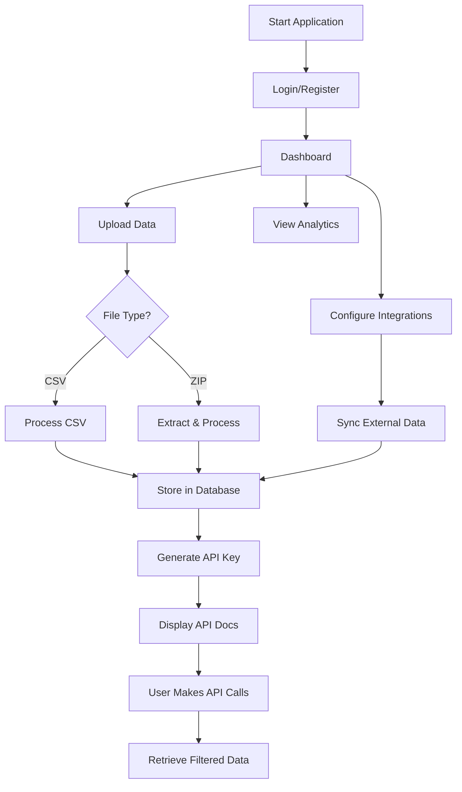

# 🚀 Resolve Onboarding - Local Application User Journey

## Overview
This document outlines the complete user journey for the Resolve Onboarding local application, including all features for CSV/ZIP file upload, data processing, and API access.

---

## 📋 Table of Contents
1. [Initial Setup](#initial-setup)
2. [User Registration & Login](#user-registration--login)
3. [Dashboard Navigation](#dashboard-navigation)
4. [File Upload Process](#file-upload-process)
5. [API Key Generation](#api-key-generation)
6. [Data Access via API](#data-access-via-api)
7. [Integration Setup](#integration-setup)
8. [Analytics & Reporting](#analytics--reporting)

---

## 🎯 User Personas

### Primary User: IT Administrator (John)
- **Role**: Super Admin at Resolve
- **Goal**: Upload historical ticket data and integrate with existing systems
- **Technical Level**: High
- **Needs**: Bulk data upload, API access, system integration

### Secondary User: Data Analyst (Sarah)
- **Role**: Business Analyst
- **Goal**: Access ticket data for reporting
- **Technical Level**: Medium
- **Needs**: Easy data export, API documentation, filtering options

---

## 🛤️ User Journey Map

### 1. Initial Setup

#### Starting the Application
```bash
# Clone the repository
git clone https://github.com/resolve-io/resolve-onboarding.git
cd resolve-onboarding

# Install dependencies
npm install

# Start the backend server
npm start
# Server runs on http://localhost:3001
```

#### First-Time Access
1. Open browser and navigate to `http://localhost:3001`
2. System displays the main landing page with Resolve branding
3. User sees options for Login or Sign Up

---

### 2. User Registration & Login

#### New User Registration
1. **Click "Get Started" or "Sign Up"**
   - User is presented with registration form
   - Required fields:
     - Email address
     - Password (with requirements shown)
     - Company name
     - First & Last name

2. **Submit Registration**
   - System validates input
   - Creates user account
   - Automatically logs user in
   - Redirects to dashboard

#### Existing User Login
1. **Navigate to Login**
   - Enter credentials:
     - Email: `john@resolve.io`
     - Password: `!Password1`
   
2. **Authentication**
   - System validates credentials
   - Creates session token
   - Stores in sessionStorage
   - Redirects to dashboard

---

### 3. Dashboard Navigation

#### Main Dashboard View
Upon successful login, user sees:

```
┌─────────────────────────────────────────┐
│  Welcome, John!                        │
│                                         │
│  Quick Actions:                        │
│  [📁 Upload Data] [🔑 API Keys]        │
│  [📊 Analytics]   [⚙️ Settings]        │
│                                         │
│  Recent Activity:                      │
│  • 234 tickets imported (2 hours ago)  │
│  • API key generated (Yesterday)       │
│  • Integration connected (3 days ago)  │
└─────────────────────────────────────────┘
```

#### Navigation Options
- **Upload Data**: File upload interface
- **API Access**: API key management
- **Analytics**: Ticket statistics and trends
- **Integrations**: Connect external systems
- **Settings**: Account and system configuration

---

### 4. File Upload Process

#### Accessing Upload Interface
1. **Navigate to Upload Section**
   - Click "Upload Data" from dashboard
   - Or navigate to `/test-file-upload.html`

2. **Upload Interface Display**
   ```
   ┌──────────────────────────────────────┐
   │     📁 Drag & Drop Files Here        │
   │                                       │
   │     Or click to browse               │
   │                                       │
   │   Supported: CSV, ZIP (Max 50MB)     │
   └──────────────────────────────────────┘
   ```

#### Single CSV Upload
1. **Select CSV File**
   - Click "Browse Files" or drag-drop
   - System validates file format
   - Shows file details (name, size)

2. **Upload Process**
   - Progress bar shows upload status
   - System processes CSV data
   - Maps fields automatically:
     - ticket_id → Ticket ID
     - title → Title
     - status → Status
     - priority → Priority
     - category → Category

3. **Confirmation**
   - Success message displays
   - Shows number of records imported
   - File appears in uploaded files list

#### ZIP Archive Upload
1. **Select ZIP File**
   - Contains multiple CSV files
   - System extracts all CSV files

2. **Batch Processing**
   - Each CSV processed individually
   - Combined progress tracking
   - Summary of all files processed

3. **Results**
   - List of processed files
   - Total records imported
   - Any errors or warnings

#### Sample CSV Format
```csv
ticket_id,title,description,status,priority,category,created_at,resolved_at,cost_saved
TKT-001,Password Reset,User forgot password,resolved,high,Password Reset,2024-01-15,2024-01-15,25.00
TKT-002,Software Install,Need Slack,resolved,medium,Software,2024-01-16,2024-01-16,50.00
```

---

### 5. API Key Generation

#### First-Time API Access
1. **After File Upload**
   - System automatically offers API key generation
   - "Generate API Key" button appears

2. **Key Generation**
   - Click "Generate API Key"
   - System creates unique key: `rslv_xxxxxxxxxxxxx`
   - Key displayed with copy button

3. **Key Display**
   ```
   ┌─────────────────────────────────────────┐
   │  Your API Key:                         │
   │  rslv_a3f2d5e8b9c1d4e6f7a8b9c0d1e2f3g4 │
   │                                         │
   │  [Copy to Clipboard]                   │
   │                                         │
   │  ⚠️ Store this key securely            │
   └─────────────────────────────────────────┘
   ```

#### API Documentation Display
System shows example usage:
```bash
GET /api/tickets/data
Headers: {
  "X-API-Key": "rslv_your_api_key",
  "Content-Type": "application/json"
}
```

---

### 6. Data Access via API

#### Making API Requests

##### Basic Request
```bash
curl -X GET "http://localhost:3001/api/tickets/data" \
  -H "X-API-Key: rslv_a3f2d5e8b9c1d4e6f7a8b9c0d1e2f3g4" \
  -H "Content-Type: application/json"
```

##### Filtered Request
```bash
# Get open tickets from last 30 days
curl -X GET "http://localhost:3001/api/tickets/data?status=open&start_date=2024-01-01" \
  -H "X-API-Key: rslv_a3f2d5e8b9c1d4e6f7a8b9c0d1e2f3g4"
```

##### Paginated Request
```bash
# Get page 2 with 50 results per page
curl -X GET "http://localhost:3001/api/tickets/data?page=2&limit=50" \
  -H "X-API-Key: rslv_a3f2d5e8b9c1d4e6f7a8b9c0d1e2f3g4"
```

#### Response Format
```json
{
  "success": true,
  "data": [
    {
      "ticket_id": "TKT-001",
      "title": "Password Reset",
      "status": "resolved",
      "priority": "high",
      "category": "Password Reset",
      "created_at": "2024-01-15T10:00:00Z",
      "resolved_at": "2024-01-15T10:15:00Z",
      "cost_saved": 25.00
    }
  ],
  "pagination": {
    "page": 1,
    "limit": 100,
    "total": 234,
    "totalPages": 3
  }
}
```

---

### 7. Integration Setup

#### Available Integrations
1. **Jira Integration**
   - Navigate to Integrations page
   - Enter Jira URL and API credentials
   - Test connection
   - Enable auto-sync

2. **ServiceNow Integration**
   - Similar process to Jira
   - Map fields between systems
   - Configure sync frequency

3. **Slack Notifications**
   - Connect Slack workspace
   - Configure notification channels
   - Set alert preferences

---

### 8. Analytics & Reporting

#### Dashboard Analytics
```
┌────────────────────────────────────────────┐
│  📊 Ticket Analytics                      │
│                                            │
│  Total Tickets: 1,234                     │
│  Automated: 87.5%                         │
│  Avg Resolution: 23 mins                  │
│  Cost Saved: $45,234                      │
│                                            │
│  [View Detailed Report]                   │
└────────────────────────────────────────────┘
```

#### Available Metrics
- Total tickets by status
- Automation rate trends
- Category distribution
- Resolution time analysis
- Cost savings calculations

---

## 🔄 Complete User Flow Diagram



---

## 🎯 Key User Actions & System Responses

### Quick Reference Table

| User Action | System Response | Next Steps |
|------------|-----------------|------------|
| Upload CSV | Parse & store data | Generate API key |
| Upload ZIP | Extract & process CSVs | Show summary |
| Generate API Key | Create unique key | Display documentation |
| Make API Request | Validate & return data | Log request |
| View Analytics | Calculate & display stats | Export options |
| Setup Integration | Test & connect | Schedule sync |

---

## 🚦 Success Metrics

### User Success Indicators
- ✅ File uploaded successfully
- ✅ API key generated
- ✅ First API call successful
- ✅ Data retrieved with filters
- ✅ Integration connected

### System Performance
- Upload processing: < 5 seconds for 1000 records
- API response time: < 200ms
- Rate limit: 1000 requests per key
- Maximum file size: 50MB
- Concurrent uploads: Supported

---

## 🛠️ Troubleshooting Guide

### Common Issues & Solutions

#### Upload Fails
**Problem**: "Invalid file format"
**Solution**: Ensure file is CSV or ZIP containing CSVs

#### API Key Not Working
**Problem**: "Invalid API key"
**Solution**: Check key is copied correctly, including "rslv_" prefix

#### No Data Returned
**Problem**: Empty API response
**Solution**: Verify data was uploaded for your user account

#### Rate Limit Exceeded
**Problem**: "429 Too Many Requests"
**Solution**: Wait before making more requests or contact admin

---

## 📱 Multi-Device Support

### Desktop Experience
- Full feature set available
- Drag-and-drop enabled
- Keyboard shortcuts supported

### Tablet Experience
- Touch-optimized interface
- File selection via browse
- Responsive layout

### Mobile Experience
- Simplified interface
- File upload via camera/files
- API key copy functionality

---

## 🔐 Security Considerations

### Data Protection
- API keys are hashed in database
- User data isolation enforced
- Session tokens expire after 24 hours
- HTTPS recommended for production

### Access Control
- User can only access own data
- Super admin can view all users
- API requests logged for audit
- Rate limiting prevents abuse

---

## 📝 Next Steps for Users

### After Initial Setup
1. **Upload Historical Data**
   - Gather CSV exports from existing systems
   - Upload via web interface
   - Verify data imported correctly

2. **Integrate Systems**
   - Generate API key
   - Update external applications
   - Test API endpoints

3. **Monitor Usage**
   - Check analytics dashboard
   - Review API request logs
   - Optimize based on patterns

4. **Scale Operations**
   - Add team members
   - Configure automations
   - Expand integrations

---

## 📞 Support Resources

### Documentation
- API Reference: `/api-docs`
- User Guide: `/help`
- Video Tutorials: Coming soon

### Contact Support
- Email: support@resolve.io
- Slack: #resolve-support
- Office Hours: Mon-Fri 9-5 EST

---

## 🎉 Success Celebration

When user completes full journey:
```
┌─────────────────────────────────────────┐
│  🎉 Congratulations!                    │
│                                         │
│  You've successfully:                  │
│  ✅ Uploaded your data                 │
│  ✅ Generated API access               │
│  ✅ Connected integrations             │
│                                         │
│  Your automation journey begins now!   │
└─────────────────────────────────────────┘
```

---

*Last Updated: January 2024*
*Version: 1.0.0*