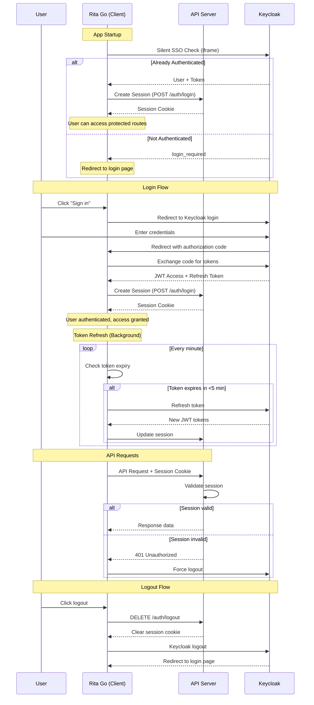
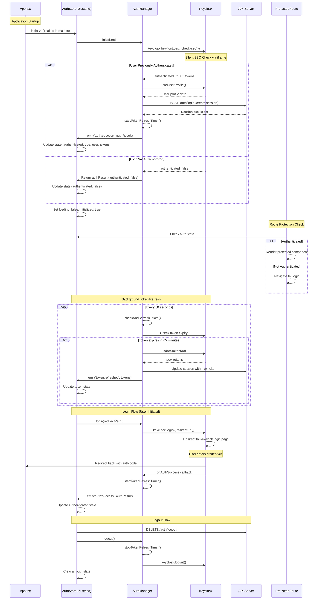
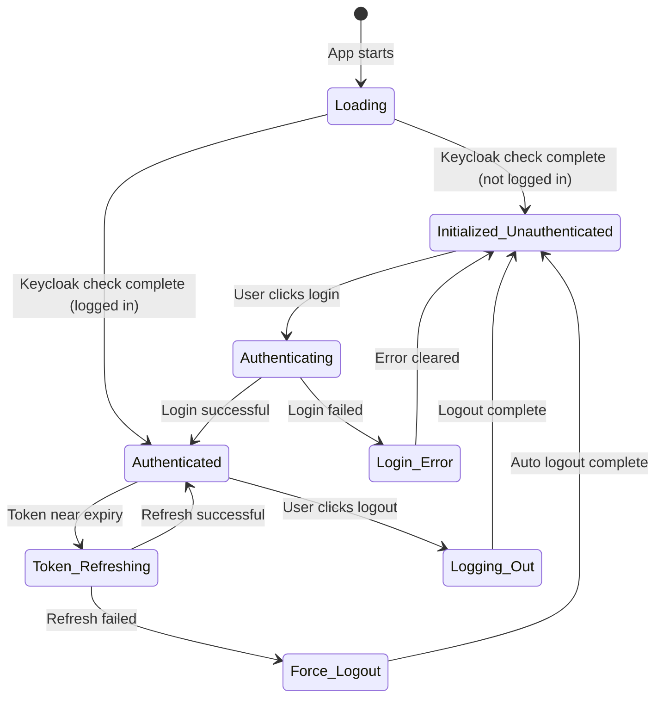
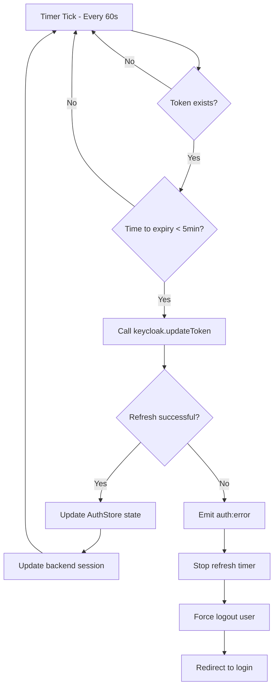
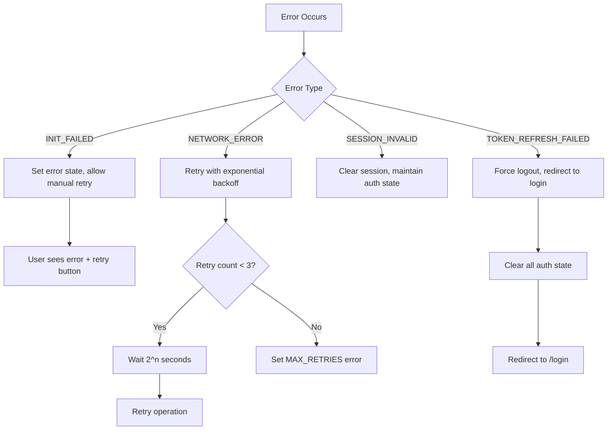
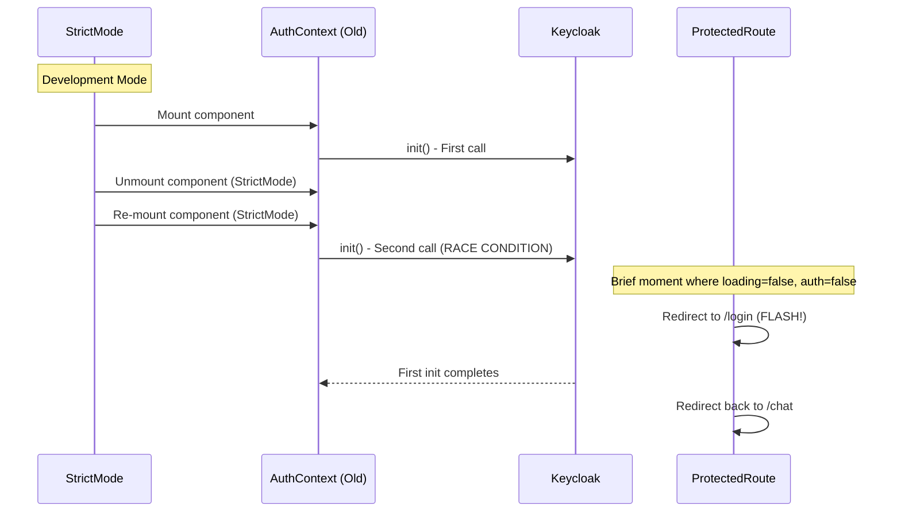
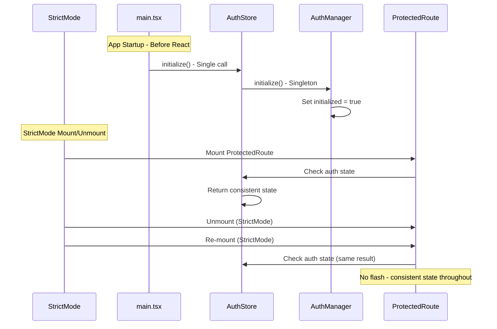

# Rita Authentication Flow Documentation

## Overview

This document explains the authentication architecture for the Rita project, which uses a Zustand-based global state management system with Keycloak for identity management and JWT tokens for API communication.

## Architecture Components

### Core Components
- **Rita Go (Client)**: React/TypeScript frontend with Zustand state management
- **API Server**: Node.js backend with session management
- **Keycloak**: Identity provider and authentication server

### Client-Side Architecture
- **AuthManager**: Singleton managing Keycloak instance and global token refresh
- **AuthStore (Zustand)**: Global state management with persistence
- **useAuth Hook**: Clean React interface for components

## High-Level Authentication Flow



## Detailed Client-Side Flow



## State Management Details

### AuthStore (Zustand) State
```typescript
interface AuthState {
  // Core authentication
  authenticated: boolean;
  loading: boolean;
  initialized: boolean;

  // User & tokens
  user: KeycloakProfile | null;
  token: string | null;
  refreshToken: string | null;
  tokenExpiry: number | null;

  // Session management
  sessionReady: boolean;
  loginRedirectPath: string | null;

  // Error handling
  error: AuthError | null;
  retryCount: number;
}
```

### Key State Transitions



## Token Refresh Strategy

### Global Timer Implementation
The `AuthManager` implements a React-independent token refresh mechanism:

```typescript
// Starts when user authenticates
private startTokenRefreshTimer(): void {
  this.refreshTimer = setInterval(async () => {
    await this.checkAndRefreshToken();
  }, 60000); // Check every minute
}

// Runs independently of React component lifecycle
private async checkAndRefreshToken(): Promise<void> {
  const timeToExpiry = tokenParsed.exp - Date.now() / 1000;

  if (timeToExpiry < 300) { // 5 minutes before expiry
    // Proactively refresh token
    const refreshed = await keycloak.updateToken(30);
    if (refreshed) {
      // Update store and backend session
      this.eventBus.emit('token:refreshed', newTokens);
      await this.createBackendSession();
    }
  }
}
```

### Refresh Flow Diagram



## Error Handling Strategy

### Error Types
```typescript
type AuthErrorCode =
  | 'INIT_FAILED'          // Keycloak initialization failed
  | 'LOGIN_FAILED'         // User login attempt failed
  | 'AUTH_FAILED'          // General authentication error
  | 'TOKEN_REFRESH_FAILED' // Token refresh failed
  | 'SESSION_INVALID'      // Backend session invalid
  | 'NETWORK_ERROR'        // Network connectivity issue
  | 'MAX_RETRIES'          // Exceeded retry attempts
```

### Error Recovery Flow



## Security Considerations

### Token Storage
- **Access tokens**: Stored in memory only (Zustand store)
- **Refresh tokens**: Stored in memory only (Zustand store)
- **Session cookies**: HTTP-only cookies set by backend
- **No localStorage**: Prevents XSS token theft

### Session Management
- **Dual authentication**: JWT tokens (stateless) + session cookies (stateful)
- **Backend validation**: API server validates session on each request
- **Auto logout**: Failed token refresh triggers automatic logout
- **Secure cookies**: Session cookies are HTTP-only and secure

### PKCE Flow
Keycloak initialization uses PKCE (Proof Key for Code Exchange):
```typescript
keycloak.init({
  onLoad: 'check-sso',
  pkceMethod: 'S256', // SHA256 code challenge
})
```

## React StrictMode Compatibility

### Problem Solved
The previous React Context implementation suffered from double initialization in StrictMode:



### Solution Implementation
The new Zustand approach initializes once at app startup:



## Component Integration

### useAuth Hook Usage
```typescript
function MyComponent() {
  const {
    authenticated,
    loading,
    user,
    login,
    logout
  } = useAuth();

  if (loading) return <Spinner />;
  if (!authenticated) return <LoginButton onClick={login} />;

  return <WelcomeUser user={user} onLogout={logout} />;
}
```

### Selective Subscriptions
```typescript
// Only re-render when auth status changes
const { authenticated, loading } = useAuthStatus();

// Only re-render when user data changes
const user = useAuthUser();

// Only re-render when errors occur
const { error, retry } = useAuthError();
```

## Development vs Production

### Development Environment
- **Silent SSO check**: May timeout if Keycloak server not running
- **Console logging**: Detailed auth flow logging enabled
- **StrictMode**: Double-rendering handled gracefully
- **Hot reloading**: Auth state persists across code changes

### Production Environment
- **Silent SSO check**: Should succeed if user previously authenticated
- **Minimal logging**: Only errors logged to console
- **Optimized builds**: No development overhead
- **Session persistence**: Auth state survives page refreshes

## Monitoring and Debugging

### Key Log Messages
```typescript
// Successful flows
"AuthManager: Keycloak initialization successful"
"AuthStore: Initialization completed successfully"
"AuthManager: Token refreshed successfully"

// Error conditions
"AuthManager: Token refresh failed"
"AuthStore: Initialization failed"
"AuthManager: Failed to create backend session"
```

### State Debugging
The Zustand store integrates with Redux DevTools for debugging:
- View auth state changes in real-time
- Time-travel debugging for auth flows
- Action history for troubleshooting

This architecture provides a robust, scalable, and maintainable authentication system that handles all edge cases while providing excellent developer experience.