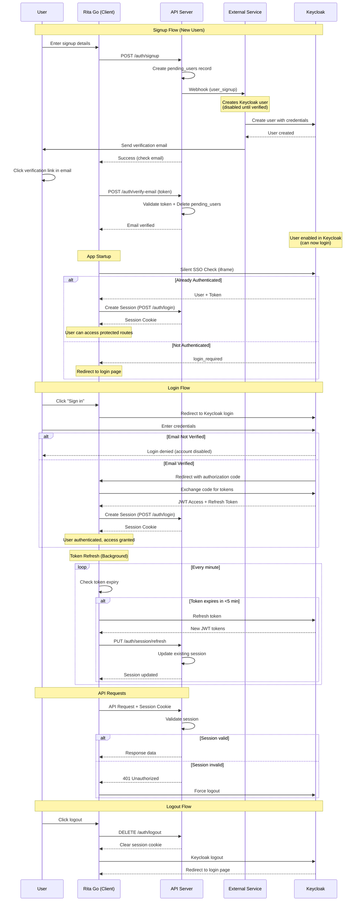
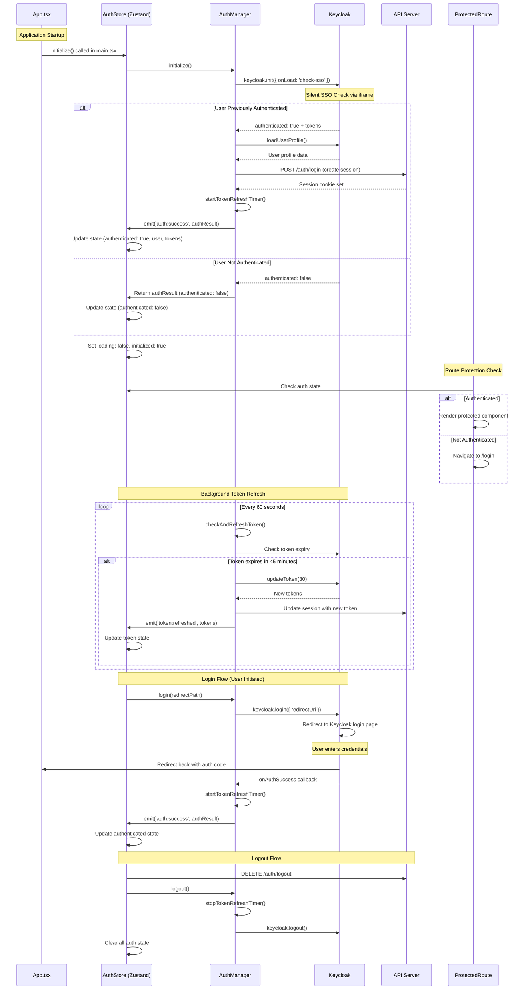
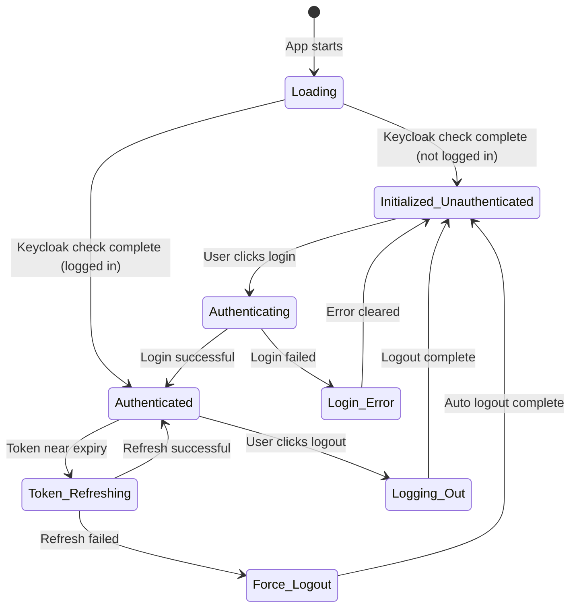
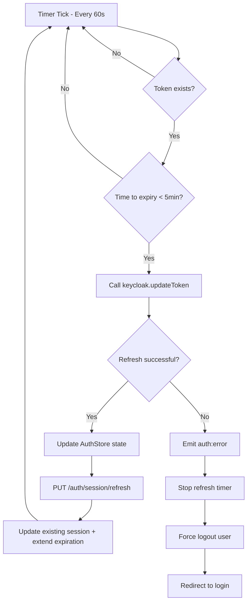
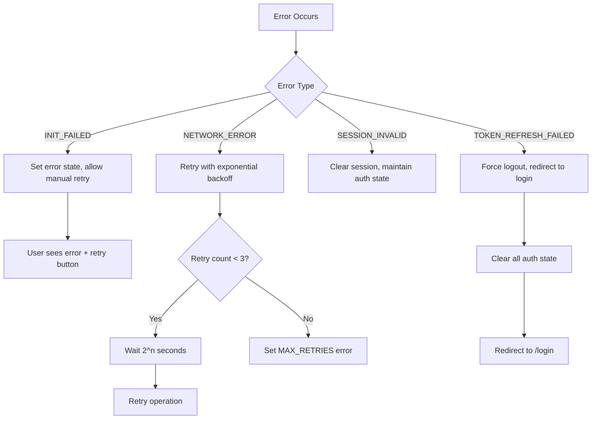
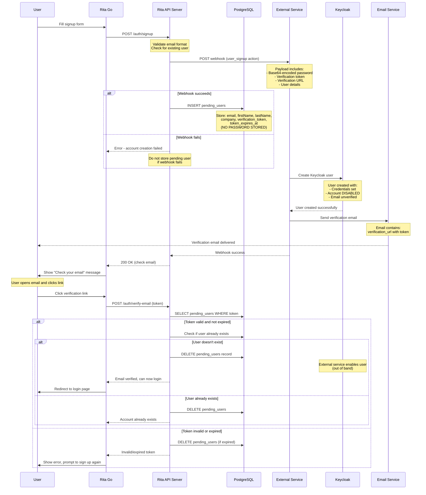
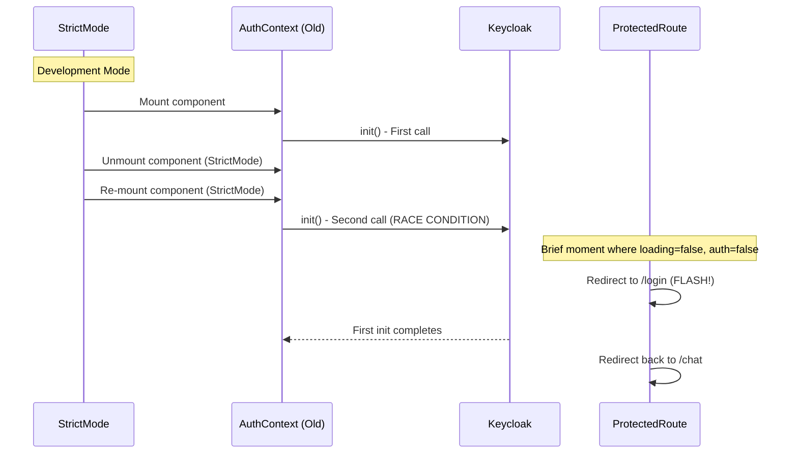
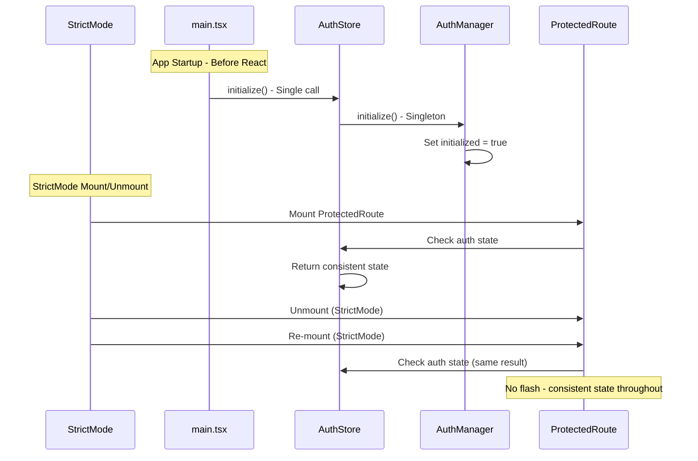

# Rita Authentication Flow Documentation

## Overview

This document explains the authentication architecture for the Rita project, which uses a Zustand-based global state management system with Keycloak for identity management and JWT tokens for API communication.

## Architecture Components

### Core Components
- **Rita Go (Client)**: React/TypeScript frontend with Zustand state management
- **API Server**: Node.js backend with session management
- **Keycloak**: Identity provider and authentication server

### Client-Side Architecture
- **AuthManager**: Singleton managing Keycloak instance and global token refresh (`packages/client/src/services/auth-manager.ts`)
- **AuthStore (Zustand)**: Global state management with persistence (`packages/client/src/stores/auth-store.ts`)
- **useAuth Hook**: Clean React interface for components (`packages/client/src/hooks/useAuth.ts`)
- **ProtectedRoute**: Route guard component (`packages/client/src/components/auth/ProtectedRoute.tsx`)

## High-Level Authentication Flow



## Detailed Client-Side Flow



## State Management Details

### AuthStore (Zustand) State
```typescript
interface AuthState {
  // Core authentication
  authenticated: boolean;
  loading: boolean;
  initialized: boolean;

  // User & tokens
  user: KeycloakProfile | null;
  token: string | null;
  refreshToken: string | null;
  tokenExpiry: number | null;

  // Session management
  sessionReady: boolean;
  loginRedirectPath: string | null;

  // Error handling
  error: AuthError | null;
  retryCount: number;
}
```

### Key State Transitions



## Token Refresh Strategy

### Global Timer Implementation
The `AuthManager` implements a React-independent token refresh mechanism:

```typescript
// Starts when user authenticates
private startTokenRefreshTimer(): void {
  this.refreshTimer = setInterval(async () => {
    await this.checkAndRefreshToken();
  }, 60000); // Check every minute
}

// Runs independently of React component lifecycle
private async checkAndRefreshToken(): Promise<void> {
  const timeToExpiry = tokenParsed.exp - Date.now() / 1000;

  if (timeToExpiry < 300) { // 5 minutes before expiry
    // Proactively refresh token
    const refreshed = await keycloak.updateToken(30);
    if (refreshed) {
      // Update store and backend session
      this.eventBus.emit('token:refreshed', newTokens);
      await this.createBackendSession();
    }
  }
}
```

### Refresh Flow Diagram



**Efficient Refresh**: Token refresh now uses `PUT /auth/session/refresh` to update the existing session in-place, rather than creating a new session. This:
- Maintains the same session ID throughout the user's session
- Extends the session expiration time (24 hours from refresh)
- Reduces database writes and session table growth
- Prevents session ID changes during active sessions

## Error Handling Strategy

### Error Types
```typescript
type AuthErrorCode =
  | 'INIT_FAILED'          // Keycloak initialization failed
  | 'LOGIN_FAILED'         // User login attempt failed
  | 'AUTH_FAILED'          // General authentication error
  | 'TOKEN_REFRESH_FAILED' // Token refresh failed
  | 'SESSION_INVALID'      // Backend session invalid
  | 'NETWORK_ERROR'        // Network connectivity issue
  | 'MAX_RETRIES'          // Exceeded retry attempts
```

### Error Recovery Flow



## Signup Flow with External Service

The signup process involves coordination between Rita API, an external webhook service, and Keycloak:



### Key Security Points

1. **Password Handling** (Zero Storage):
   - Passwords are **NEVER stored in the database**, not even temporarily
   - Password flow: Client → API (memory) → Webhook → External Service → Keycloak
   - Password is base64-encoded before webhook transmission (prevents logging)
   - **Requires HTTPS** for webhook communication
   - If webhook fails, signup fails - no orphaned passwords in database

2. **User State Management**:
   - Keycloak user created immediately but **disabled**
   - `pending_users` table tracks verification state (email, token, expiration only)
   - User cannot login until email verified
   - Webhook must succeed before storing any user data

3. **Token Expiration**:
   - Verification tokens expire after 24 hours
   - Expired tokens trigger cleanup of `pending_users` record
   - User must re-signup if token expires

4. **Race Condition Prevention**:
   - Signup checks for existing users before calling webhook
   - Verification checks for existing users before enabling
   - Duplicate signups replace old pending records
   - Webhook failure prevents database writes

## API Endpoints

The API server (`packages/api-server/src/routes/auth.ts`) provides the following authentication endpoints:

### POST /auth/signup
Creates a pending user and triggers webhook for email verification.
```typescript
// Request body
{
  firstName: string,
  lastName: string,
  email: string,
  company: string,
  password: string  // Sent to webhook only, NEVER stored in database
}

// Response (success)
{
  success: true,
  message: "Signup successful. Please check your email..."
}

// Response (webhook failure)
{
  error: "Failed to create account. Please try again."
}
```

**Security**: Password is base64-encoded before webhook transmission and **never stored in the database**. If webhook fails, signup fails and no user data is persisted.

### PUT /auth/session/refresh
Updates an existing session with a new Keycloak access token (efficient token refresh).
```typescript
// Request body
{ accessToken: string }

// Response (success)
{
  success: true,
  session: { id, expiresAt }
}

// Response (failure)
{
  error: "Session update failed. Please login again."
}
```

**Benefits**: More efficient than `POST /auth/login` during token refresh. Extends existing session expiration without creating new session records.

### POST /auth/login
Creates a session cookie from a Keycloak access token (browser-based flows).
```typescript
// Request body
{ accessToken: string }

// Response
{
  success: true,
  user: { id, email, organizationId },
  session: { id, expiresAt }
}
```

Sets `rita_session` HTTP-only cookie.

### DELETE /auth/logout
Destroys the current session.
```typescript
// Response
{ success: true, message: "Logged out successfully" }
```

Clears `rita_session` cookie.

### DELETE /auth/logout-all
Destroys all sessions for the authenticated user across all devices.
```typescript
// Response
{ success: true, deletedSessions: number }
```

### POST /auth/verify-email
Verifies signup token and marks user as ready for Keycloak signin.
```typescript
// Request body
{ token: string }

// Response
{
  success: true,
  message: "Email verified successfully...",
  email: string
}
```

### GET /auth/session
Checks if the current session cookie is valid and returns session info.
```typescript
// Response (authenticated)
{
  authenticated: true,
  user: { id, email, organizationId },
  session: { id, expiresAt, lastAccessedAt }
}

// Response (not authenticated)
{
  authenticated: false,
  error: "No session found" | "Invalid or expired session"
}
```

## Middleware Authentication

The authentication middleware (`packages/api-server/src/middleware/auth.ts`) supports two authentication methods:

### 1. JWT Bearer Token (Primary)
```typescript
Authorization: Bearer <keycloak-access-token>
```
- Validates token against Keycloak JWKS
- Performs **JIT (Just-In-Time) User Provisioning** if user doesn't exist
- Creates user profile and organization automatically on first API access

### 2. Session Cookie (Fallback)
```
Cookie: rita_session=<session-id>
```
- Used for SSE (Server-Sent Events) and browser flows
- Session validated and refreshed on each request

**JIT Provisioning Implementation** (`packages/api-server/src/services/sessionService.ts:52`):
```typescript
private async findOrCreateUser(tokenPayload: jose.JWTPayload) {
  // 1. Check if user exists by Keycloak ID
  // 2. If not, create new user profile + organization in single transaction
  // 3. Set user's active organization to newly created org
  // 4. Return user info for session creation
}
```

## Security Considerations

### Token Storage
- **Access tokens**: Stored in memory only (Zustand store)
- **Refresh tokens**: Stored in memory only (Zustand store)
- **Session cookies**: HTTP-only cookies set by backend
- **No localStorage**: Prevents XSS token theft

### Session Management
- **Dual authentication**: JWT tokens (stateless) + session cookies (stateful)
- **Backend validation**: API server validates session on each request via `GET /auth/session`
- **Auto logout**: Failed token refresh triggers automatic logout
- **Secure cookies**: Session cookies are HTTP-only, secure (production), and SameSite=Lax
- **Session cookie name**: `rita_session` (24-hour expiration)

### PKCE Flow
Keycloak initialization uses PKCE (Proof Key for Code Exchange):
```typescript
keycloak.init({
  onLoad: 'check-sso',
  pkceMethod: 'S256', // SHA256 code challenge
})
```

## React StrictMode Compatibility

### Problem Solved
The previous React Context implementation suffered from double initialization in StrictMode:



### Solution Implementation
The new Zustand approach initializes once at app startup:



## Component Integration

### useAuth Hook Usage
```typescript
function MyComponent() {
  const {
    authenticated,
    loading,
    user,
    login,
    logout
  } = useAuth();

  if (loading) return <Spinner />;
  if (!authenticated) return <LoginButton onClick={login} />;

  return <WelcomeUser user={user} onLogout={logout} />;
}
```

### Selective Subscriptions
```typescript
// Only re-render when auth status changes
const { authenticated, loading } = useAuthStatus();

// Only re-render when user data changes
const user = useAuthUser();

// Only re-render when errors occur
const { error, retry } = useAuthError();
```

## Development vs Production

### Development Environment
- **Silent SSO check**: May timeout if Keycloak server not running
- **Console logging**: Detailed auth flow logging enabled
- **StrictMode**: Double-rendering handled gracefully
- **Hot reloading**: Auth state persists across code changes

### Production Environment
- **Silent SSO check**: Should succeed if user previously authenticated
- **Minimal logging**: Only errors logged to console
- **Optimized builds**: No development overhead
- **Session persistence**: Auth state survives page refreshes

## Monitoring and Debugging

### Key Log Messages
```typescript
// Successful flows
"AuthManager: Keycloak initialization successful"
"AuthStore: Initialization completed successfully"
"AuthManager: Token refreshed successfully"

// Error conditions
"AuthManager: Token refresh failed"
"AuthStore: Initialization failed"
"AuthManager: Failed to create backend session"
```

### State Debugging
The Zustand store integrates with Redux DevTools for debugging:
- View auth state changes in real-time
- Time-travel debugging for auth flows
- Action history for troubleshooting

This architecture provides a robust, scalable, and maintainable authentication system that handles all edge cases while providing excellent developer experience.

---

## Known Issues and Proposed Improvements

### 1. Password Security - Zero Storage Architecture ✅ RESOLVED

**Implementation**: Passwords are **never stored in the database**, not even temporarily.

```typescript
// packages/api-server/src/routes/auth.ts:73
password: Buffer.from(password).toString('base64')  // Sent to webhook only
```

**Zero Storage Security Model**:
- ✅ Passwords **never touch the database** at any point
- ✅ Password flow: Client → API (in-memory only) → Webhook → Keycloak
- ✅ Base64 encoding prevents accidental logging of plaintext
- ✅ HTTPS enforced for all webhook communication
- ✅ Webhook authentication via Authorization header
- ✅ If webhook fails, signup fails - no orphaned data

**Flow**:
1. Client submits signup form with password
2. API validates and **immediately sends to webhook** (password in memory only)
3. If webhook succeeds → Store pending user (email, name, token - NO PASSWORD)
4. If webhook fails → Return error, store nothing
5. External service creates Keycloak user with password
6. Password never exists in Rita database

**Architecture Rationale**:
- **Zero trust**: Passwords should never be persisted outside identity systems
- **Fail-fast**: Webhook failure prevents any data persistence
- **Separation of concerns**: Rita handles flow, Keycloak handles passwords
- **Audit compliance**: No password storage = no password breach risk

---

### 2. Token Refresh Race Conditions

**Potential Issue**: If a user has multiple browser tabs open, each instance of AuthManager runs its own refresh timer. This could lead to:
- Multiple simultaneous token refresh requests
- Unnecessary backend session creations
- Wasted API calls

**Current Mitigation**: Keycloak's `updateToken()` is idempotent and handles concurrent calls gracefully.

**Proposed Improvement**:
- Implement cross-tab synchronization using `BroadcastChannel` API
- Only the "leader" tab performs token refresh
- Other tabs listen for `token:refreshed` events via BroadcastChannel
- Falls back to individual timers if BroadcastChannel not supported

```typescript
// Proposed implementation
class AuthManager {
  private broadcastChannel: BroadcastChannel | null = null;

  constructor() {
    if ('BroadcastChannel' in window) {
      this.broadcastChannel = new BroadcastChannel('auth-sync');
      this.broadcastChannel.onmessage = (event) => {
        if (event.data.type === 'token:refreshed') {
          // Update local tokens without backend call
          this.eventBus.emit('token:refreshed', event.data.tokens);
        }
      };
    }
  }

  private async checkAndRefreshToken(): Promise<void> {
    // ... existing logic ...
    if (refreshed) {
      // Broadcast to other tabs
      this.broadcastChannel?.postMessage({
        type: 'token:refreshed',
        tokens: { token, refreshToken, tokenExpiry }
      });
    }
  }
}
```

**Impact**: Medium priority - reduces load but not critical for functionality.

---

### 3. Silent SSO Configuration

**Current Setup**: Uses `check-sso` with a dedicated HTML file:

```typescript
// packages/client/src/services/auth-manager.ts:31-33
onLoad: 'check-sso',
silentCheckSsoRedirectUri: `${window.location.origin}/silent-check-sso.html`,
```

**Documentation Gap**: The `public/silent-check-sso.html` file is referenced but not documented in this flow document.

**Improvement**:
- Document the contents and purpose of `silent-check-sso.html`
- Explain why it's needed vs. using the main app URL
- Add troubleshooting guide for silent SSO timeout issues

---

### 4. Error Retry Strategy

**Current Implementation**: The AuthStore includes retry logic with exponential backoff (up to 3 attempts).

**Potential Issue**: The retry mechanism only applies to initialization failures, not to:
- Token refresh failures (which trigger immediate logout)
- Session creation failures (which are silently logged)
- Network errors during login

**Proposed Enhancement**:
- Add retry logic for transient network errors
- Distinguish between retryable errors (503, network timeout) and permanent errors (401, 403)
- Implement circuit breaker pattern for repeated failures
- Add user notification system for authentication issues

---

## Future Enhancements

### 1. **Refresh Token Rotation**
Implement Keycloak refresh token rotation for enhanced security. Each token refresh should invalidate the old refresh token and issue a new one.

### 2. **Multi-Factor Authentication (MFA)**
Add MFA support through Keycloak's built-in OTP functionality. Document the flow changes needed.

### 3. **Device Management**
- Allow users to view active sessions across devices
- Add "logout from this device" vs. "logout from all devices" distinction in UI
- Show session metadata (device type, location, last accessed)

### 4. **Session Activity Monitoring**
- Track user activity to extend session expiration on active use
- Implement "idle timeout" separate from absolute session timeout
- Add configurable session duration based on user role or security level

### 5. **OAuth Social Login Integration**
- Add Google, GitHub, Microsoft login options via Keycloak
- Document the identity provider federation setup
- Handle account linking for users with multiple login methods

### 6. **Audit Logging**
- Log all authentication events (login, logout, token refresh, failures)
- Implement SOC2-compliant audit trail for security reviews
- Add user-facing "security activity" dashboard

### 7. **Biometric Authentication**
- Integrate WebAuthn for passwordless authentication
- Support hardware security keys (YubiKey, etc.)
- Implement device fingerprinting for suspicious activity detection

---

## Testing Recommendations

To ensure this authentication flow works correctly, the following test scenarios should be covered:

### Unit Tests
- ✅ AuthManager token refresh logic
- ✅ SessionService JIT provisioning
- ✅ Session cookie generation and parsing
- ⚠️ AuthStore state transitions (needs expansion)

### Integration Tests
- ⚠️ Full login flow (Keycloak → JWT → Session cookie)
- ⚠️ Token refresh with backend session update
- ⚠️ Session validation across API requests
- ⚠️ Logout clearing both Keycloak and backend sessions

### E2E Tests (Missing)
- ❌ User signup → email verification → login → protected route access
- ❌ Token expiration handling in active session
- ❌ Multi-tab behavior (login in one tab, reflected in others)
- ❌ Session timeout and auto-logout
- ❌ Network failure recovery during authentication

### Security Tests (Missing)
- ❌ XSS protection (no token leakage to localStorage)
- ❌ CSRF protection on session endpoints
- ❌ Token expiration enforcement
- ❌ Session hijacking prevention
- ❌ Webhook payload security validation

---

**Legend**:
- ✅ Exists and working
- ⚠️ Partially implemented or needs improvement
- ❌ Missing or not yet implemented