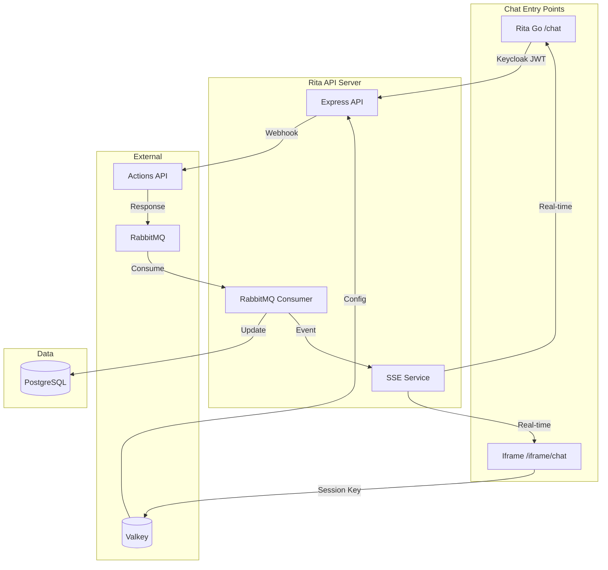
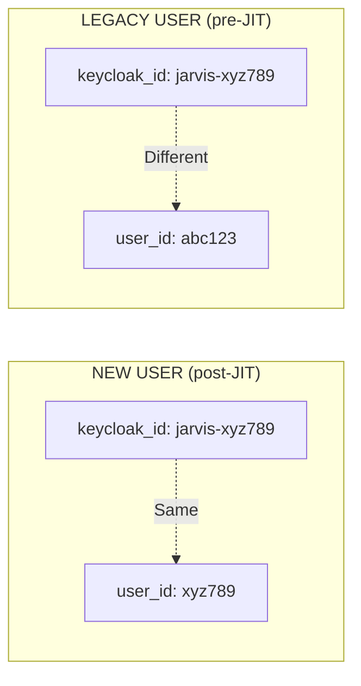
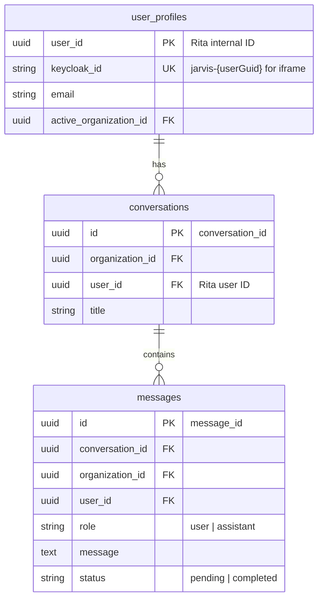
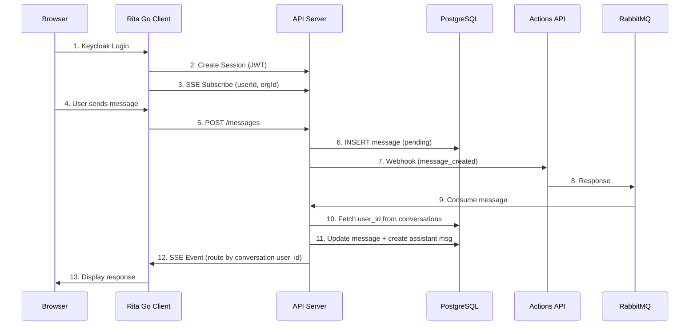
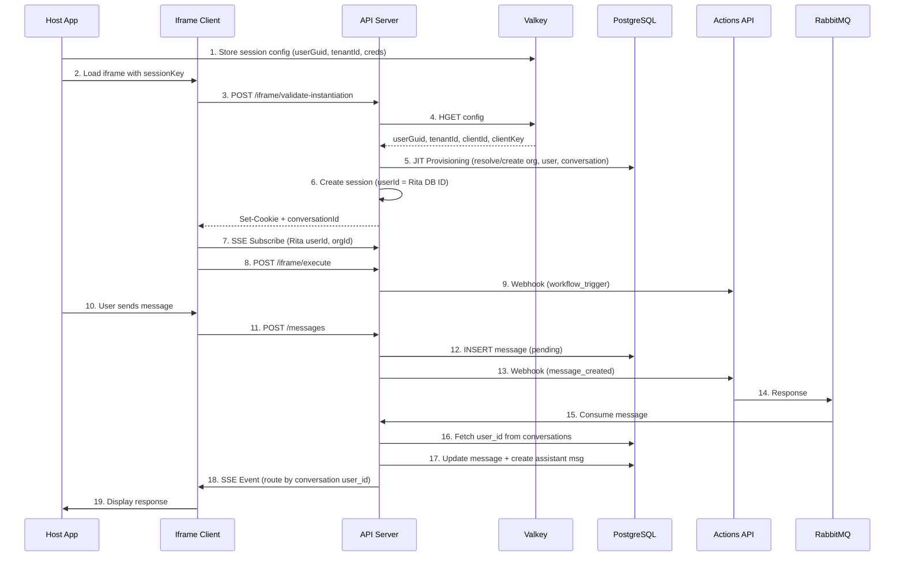
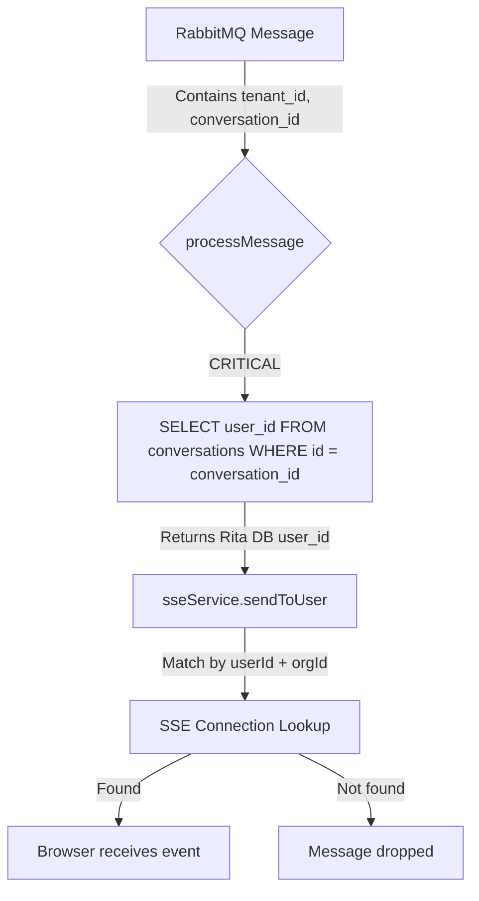
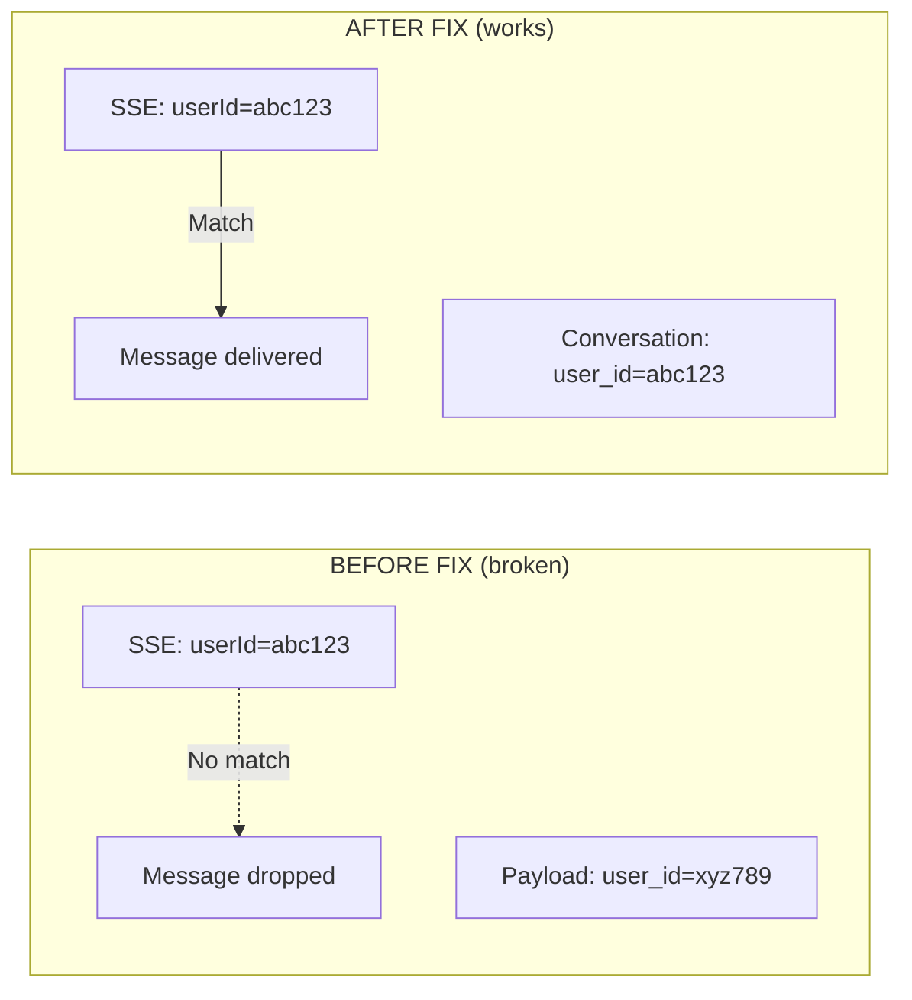

# Chat Message Flows Architecture

**Version**: 1.0
**Last Updated**: 2025-01-13
**Maintainer**: Engineering Team

---

## Table of Contents

1. [Overview](#overview)
2. [Identity Model](#identity-model)
3. [Database Schema](#database-schema)
4. [Rita Go Chat Flow](#rita-go-chat-flow)
5. [Iframe Chat Flow](#iframe-chat-flow)
6. [Webhook Field Reference](#webhook-field-reference)
7. [RabbitMQ Response Routing](#rabbitmq-response-routing)
8. [Platform Response Fields](#platform-response-fields)
9. [Summary](#summary)

---

## Overview

Rita has two chat entry points that converge at the webhook → RabbitMQ → SSE pipeline:

- **Rita Go** (`/chat`) - Main app with Keycloak authentication
- **Iframe Chat** (`/iframe/chat`) - Embeddable chat using Valkey session config

### High-Level Architecture



---

## Identity Model

### User ID Types

| ID Type | Source | Example | Used By |
|---------|--------|---------|---------|
| Rita User ID | `user_profiles.user_id` | `abc123-...` | DB, SSE routing |
| Keycloak ID | `user_profiles.keycloak_id` | `jarvis-xyz789-...` | Auth lookup |
| Valkey userGuid | Valkey session payload | `xyz789-...` | Webhook payload |

### Legacy vs New Users



---

## Database Schema



---

## Rita Go Chat Flow



### Webhook Payload (Rita Go)

```json
{
  "source": "rita-chat",
  "action": "message_created",
  "user_id": "abc123-...",
  "user_email": "user@example.com",
  "tenant_id": "org456-...",
  "conversation_id": "conv789-...",
  "message_id": "msg012-...",
  "customer_message": "Hello...",
  "timestamp": "2024-01-12T..."
}
```

---

## Iframe Chat Flow



### Valkey Session Payload

Key format: `rita:session:{sessionKey}`

```json
{
  // REQUIRED - core identity
  "tenant_id": "00F4F67D-...",
  "user_guid": "275fb79d-...",

  // OPTIONAL - conversation handling
  // omit or null = Rita creates new conversation and returns conversationId
  // provide existing UUID = Rita resumes that conversation
  "conversation_id": "b18c9d56-...",

  // REQUIRED for webhook execution (Actions API auth)
  "actionsApiBaseUrl": "https://actions-api-staging.resolve.io/",
  "clientId": "E14730FA-...",
  "clientKey": "secret-key",

  // Pass-through to Actions API (not used by Rita)
  "accessToken": "eyJhbG...",
  "refreshToken": "eyJhbG...",
  "tokenExpiry": 1767902104,
  "tabInstanceId": "b677747a-...",

  // OPTIONAL - org display name (defaults to "Jarvis Tenant {id}")
  "tenantName": "staging",

  // OPTIONAL - arbitrary metadata passed through to Actions API webhook
  "context": { "designer": "workflow" },

  // OPTIONAL - custom UI text for iframe chat
  // omit entire object or any field to use Rita defaults
  "ui_config": {
    "title_text": "Ask Workflow Designer",
    "welcome_text": "I can help you build workflow automations.",
    "placeholder_text": "Describe your workflow..."
  }
}
```

**Field Categories:**

| Category | Fields | Required |
|----------|--------|----------|
| Core identity | `tenant_id`, `user_guid` | Yes |
| Conversation | `conversation_id` | No (Rita creates if omitted) |
| Webhook auth | `actionsApiBaseUrl`, `clientId`, `clientKey` | For webhook execution |
| Pass-through | `accessToken`, `refreshToken`, `tokenExpiry`, `tabInstanceId` | No |
| Metadata | `tenantName`, `context` | No |
| UI config | `ui_config.*` | No |

### Iframe Webhook Payload

```json
{
  "source": "rita-chat-iframe",
  "action": "message_created",
  "userGuid": "275fb79d-...",
  "tenantId": "00F4F67D-...",
  "chatSessionId": "b974d74f-...",
  "user_id": "275fb79d-...",
  "tenant_id": "00F4F67D-...",
  "conversation_id": "b18c9d56-...",
  "message_id": "2b6a2b62-...",
  "customer_message": "Hello...",
  "document_ids": [],
  "transcript_ids": { "transcripts": [...] },
  "user_email": "iframe-275fb79d@iframe.internal",
  "timestamp": "2024-01-12T..."
}
```

---

## Webhook Field Reference

| Field | Description | Created When | Updated |
|-------|-------------|--------------|---------|
| `source` | Origin app. Always `rita-chat-iframe` for iframe. | Static | Never |
| `action` | Event type: `workflow_trigger` or `message_created`. | Per event | Never |
| `conversation_id` | UUID for chat thread. One conversation = multiple messages. | On `/validate-instantiation` | Never |
| `message_id` | UUID for each user message. New ID per message. | On POST `/messages` | Never |
| `customer_message` | The user's message text. | Per message | Never |
| `user_id` | Keycloak userGuid (for platform routing). | From Valkey | Never |
| `tenant_id` | Organization/tenant ID. | From Valkey | Never |
| `user_email` | **Synthetic**: `iframe-{guid-prefix}@iframe.internal`. Not real. | On JIT provisioning | Never |
| `document_ids` | File attachment IDs. **Empty for iframe**. | Per message | Never |
| `transcript_ids` | Conversation history for RAG context. Optional. | Per message | Never |

### Action Types

**Iframe chat actions:**

| Action | Triggered By | Description |
|--------|--------------|-------------|
| `workflow_trigger` | `/api/iframe/execute` | Sent on iframe load |
| `message_created` | `POST /messages` | User sent a chat message |

**Other actions (not iframe):**

| Action | Source | Description |
|--------|--------|-------------|
| `document_uploaded` | `rita-documents` | File uploaded |
| `document_deleted` | `rita-documents` | File removed |
| `password_reset_request` | `rita-auth` | Password reset requested |
| `password_reset_complete` | `rita-auth` | Password reset completed |

### FAQ

**Q: Is a webhook sent when the iframe loads?**
A: Yes, `workflow_trigger` is sent via `/api/iframe/execute` endpoint.

**Q: What is `conversation_id` and when is it created?**
A: UUID created by Rita when iframe calls `/api/iframe/validate-instantiation`. Represents a chat thread that holds multiple messages. Never updated after creation.

**Q: Is a new `message_id` created for every message?**
A: Yes, new UUID generated for each user message. Platform echoes it back so Rita knows which message to mark complete.

**Q: Is `user_email` a real email?**
A: No, it's synthetic for iframe users: `iframe-{guid-prefix}@iframe.internal`.

**Q: Are `document_ids` and `transcript_ids` relevant for iframe?**
A: `document_ids` is empty (uploads disabled). `transcript_ids` contains conversation history for RAG context.

---

## RabbitMQ Response Routing

### Required Routing Fields

For RabbitMQ to route responses back to the correct SSE channel, the webhook payload **must include**:

| Field | Purpose |
|-------|---------|
| `tenant_id` | Maps to `organization_id` for SSE channel lookup |
| `conversation_id` | Used to fetch the correct `user_id` from DB for SSE routing |
| `message_id` | Identifies which message to update |

Without `conversation_id`, Rita cannot determine which user's SSE connection to send the response to.

### SSE Routing Flow



### Why Fetch user_id from DB?



The payload's `user_id` may be Keycloak userGuid (for legacy users), which differs from Rita's internal user ID used in SSE subscriptions. The conversation table stores the correct Rita user ID.

---

## Platform Response Fields

The Actions API returns legacy chat parameters. Rita only uses a subset.

### RabbitMQ Response from Platform

```json
{
  "message_id": "2b6a2b62-...",
  "conversation_id": "b18c9d56-...",
  "tenant_id": "00F4F67D-...",
  "user_id": "275fb79d-...",
  "response": "Here is the answer...",
  "metadata": {
    "tableName": "",
    "columns": [{"key": "Name", "name": "Name", "type": "String"}],
    "data": [
      {"Name": "%chatSessionId%", "Value": "9b5d230e-..."},
      {"Name": "%conversationid%", "Value": "0ce47347-..."}
    ],
    "paging": {"pageSize": 2, "totalRecords": 2}
  }
}
```

### Fields Used vs Ignored

| Field | Used | Purpose |
|-------|------|---------|
| `message_id` | **Yes** | Update original message status |
| `conversation_id` | **Yes** | Lookup user_id for SSE routing |
| `tenant_id` | **Yes** | Maps to organization_id |
| `response` | **Yes** | Assistant message content |
| `metadata` | **Yes** | Stored with message (passed through) |
| `user_id` | **No** | Fetched from conversation table instead |
| `metadata.%conversationid%` | **No** | Platform's conversation ID (not Rita's) |
| `metadata.%chatSessionId%` | **No** | Platform's session ID |
| `metadata.paging` | **No** | Legacy pagination |

### Platform vs Rita IDs

```
PLATFORM IDs (legacy, ignored):
  %conversationid% = "0ce47347-..."  ← Platform's internal conversation
  %chatSessionId%  = "9b5d230e-..."  ← Platform's chat session

RITA IDs (used):
  conversation_id  = "b18c9d56-..."  ← Rita's conversation (echoed from webhook)
  message_id       = "2b6a2b62-..."  ← Rita's message ID
```

---

## Summary

### ID Flow by Chat Type

| Step | Rita Go | Iframe |
|------|---------|--------|
| Auth | Keycloak JWT | Valkey session |
| Session userId | Rita DB ID | Rita DB ID (JIT resolved) |
| SSE subscribes with | Rita DB ID | Rita DB ID |
| Webhook user_id | Rita DB ID | Keycloak userGuid |
| RabbitMQ user_id | Rita DB ID | Keycloak userGuid |
| SSE routes by | **Conversation table** | **Conversation table** |

The conversation table is the **source of truth** for SSE routing, ensuring consistent IDs regardless of webhook payload.
