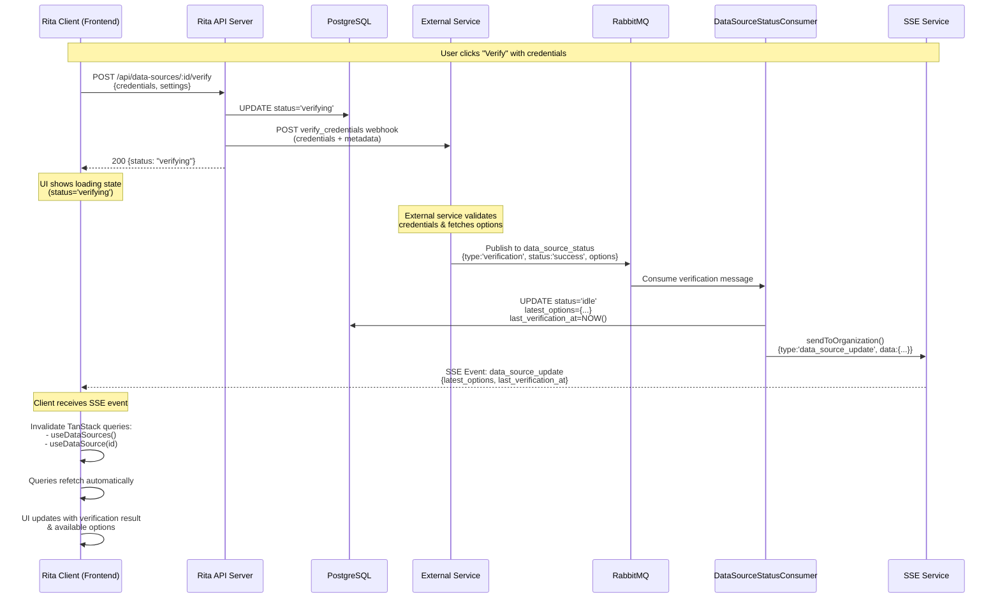
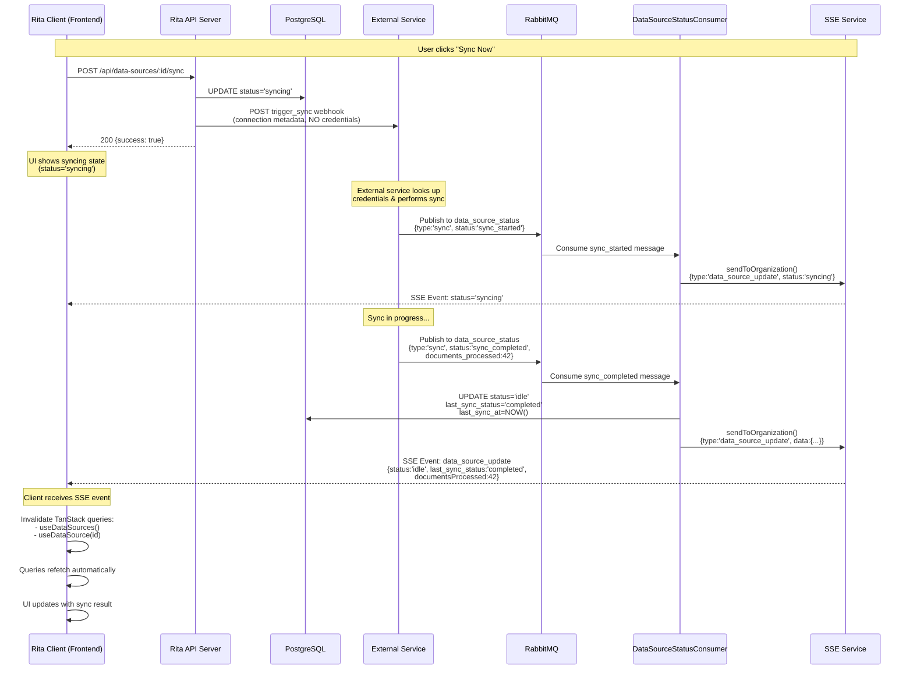
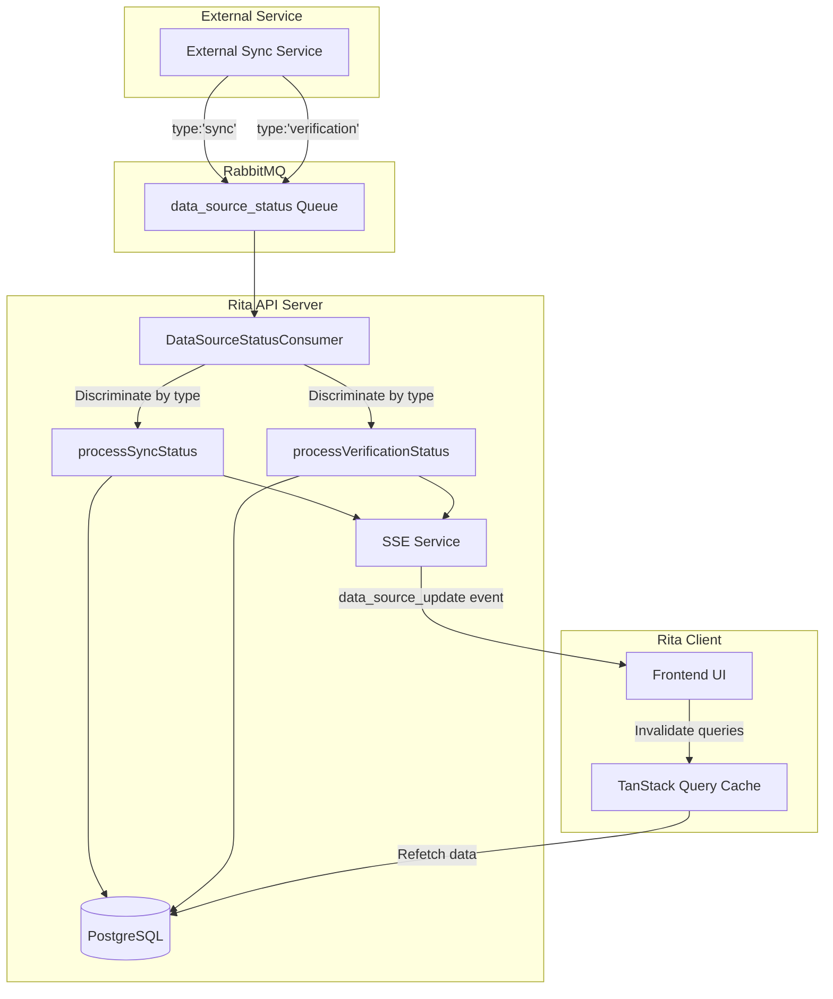

# Data Source Connections Architecture

## Overview

This document defines the database schema and architecture for connecting external data sources (Confluence, ServiceNow, SharePoint, Jira, etc.) to the Rita platform. Connections are **organization-scoped** to ensure proper multi-tenant isolation.

### Sync Architecture

**Rita does NOT perform syncing or store credentials**. Instead:

1. **Rita stores only connection metadata and configuration** in `data_source_connections` table (NO credentials)
2. **External service stores credentials** using composite key: (`tenant_id`, `connection_id`, `connection_type`)
3. **Rita triggers external sync service** by calling webhooks with connection metadata
4. **External service performs the sync** using its stored credentials
5. **External service publishes to RabbitMQ** when sync completes/fails
6. **Rita consumes RabbitMQ message** and updates connection status

This architecture keeps Rita lightweight, eliminates credential storage security concerns, and delegates both credential management and sync operations to the specialized external service.

## Database Schema

### Single Table: `data_source_connections`

Stores connection metadata, configuration, and sync status for external data sources at the organization level. **Credentials are NOT stored in Rita** - they are managed by the external service using a composite key (`tenant_id`, `connection_id`, `connection_type`).

**Lazy Initialization**: Records are only created when a user first configures a data source. The frontend displays all available data source types (Confluence, ServiceNow, SharePoint, WebSearch) statically, and the database only stores connections that have been configured.

```sql
-- Data source connections (Confluence, ServiceNow, SharePoint, etc.)
CREATE TABLE data_source_connections (
  id UUID PRIMARY KEY DEFAULT gen_random_uuid(),
  organization_id UUID NOT NULL REFERENCES organizations(id) ON DELETE CASCADE,

  -- Connection metadata
  type TEXT NOT NULL, -- 'confluence', 'servicenow', 'sharepoint', 'websearch'
  name TEXT NOT NULL,
  description TEXT,

  -- Configuration (no credentials stored in Rita)
  config JSONB DEFAULT '{}'::jsonb,

  -- Current status (what's happening NOW)
  status TEXT DEFAULT 'idle' NOT NULL, -- 'idle', 'verifying', 'syncing'

  -- Historical tracking (what happened LAST TIME)
  last_sync_status TEXT DEFAULT NULL, -- NULL, 'completed', 'failed'

  -- Latest verification options (JSONB with connection-type-specific structure)
  latest_options JSONB DEFAULT NULL, -- e.g., '{"spaces": "ENG,PROD,DOCS"}' for Confluence

  enabled BOOLEAN DEFAULT false,

  -- Verification tracking
  last_verification_at TIMESTAMP WITH TIME ZONE, -- When credentials were last verified
  last_verification_error TEXT, -- Error from last verification (NULL on success)

  -- Sync tracking
  last_sync_at TIMESTAMP WITH TIME ZONE,
  last_sync_error TEXT, -- Error from last sync (NULL on success)

  -- Audit fields
  created_by UUID NOT NULL, -- Always set when user configures connection
  updated_by UUID NOT NULL,
  created_at TIMESTAMP WITH TIME ZONE DEFAULT NOW(),
  updated_at TIMESTAMP WITH TIME ZONE DEFAULT NOW(),

  -- Soft delete support
  deleted_at TIMESTAMP WITH TIME ZONE,

  CONSTRAINT unique_type_per_org UNIQUE (organization_id, type)
);

-- Indexes for performance
CREATE INDEX idx_data_source_connections_org_id ON data_source_connections(organization_id);
CREATE INDEX idx_data_source_connections_type ON data_source_connections(type);
CREATE INDEX idx_data_source_connections_status ON data_source_connections(status);
CREATE INDEX idx_data_source_connections_enabled ON data_source_connections(enabled) WHERE enabled = true;
CREATE INDEX idx_data_source_connections_org_type ON data_source_connections(organization_id, type);

-- Update trigger
CREATE TRIGGER update_data_source_connections_updated_at
  BEFORE UPDATE ON data_source_connections
  FOR EACH ROW
  EXECUTE FUNCTION update_updated_at_column();
```

## Design Principles

### ✅ Multi-tenant Isolation
- Table references `organization_id` with CASCADE deletes
- Connections are owned by organizations, not individual users
- Compatible with existing Row-Level Security (RLS) policies

### ✅ Audit Trail
- `created_by` and `updated_by` track which users made changes
- `created_at` and `updated_at` track when changes occurred
- All sync status changes logged to `audit_logs` table

### ✅ Soft Deletes
- `deleted_at` timestamp for compliance and data recovery
- Allows "undelete" functionality
- Preserves referential integrity

### ✅ Flexible Configuration
- `config` JSONB stores provider-specific settings (spaces, tables, filters, etc.)
- NO credentials stored in Rita - external service handles all credential storage
- Extensible for any data source type

### ✅ Type Validation
- **Application-level validation** enforces allowed data source types
- Database schema remains generic and flexible
- Initial release supports: `confluence`, `servicenow`, `sharepoint`, `websearch`
- Easy to add new types without database migrations

### ✅ Security
- **Zero credential storage** - Rita never stores credentials in the database
- Credentials are passed to external service via HTTPS webhooks only
- External service stores credentials using composite key (`tenant_id`, `connection_id`, `connection_type`)
- Eliminates Rita's credential storage attack surface entirely

### ✅ Simple Status Tracking
- Single `status` field tracks current connection state
- `enabled` flag for pausing connections without deletion
- `last_sync_at` and `last_sync_error` provide minimal sync metadata

### ✅ Performance
- Strategic indexes on frequently queried fields (`org_id`, `type`, `status`)
- Partial index on `enabled` reduces index size
- Composite index on `organization_id` + `type` for fast lookups
- `UNIQUE` constraint prevents duplicate connections per organization

## Connection Types

Supported data source types are validated at the **application level** for flexibility:

**Initial Release (4 types)**:
- `confluence` - Atlassian Confluence
- `servicenow` - ServiceNow
- `sharepoint` - Microsoft SharePoint
- `websearch` - Web Search

**Application-Level Validation**:
```typescript
// packages/api-server/src/constants/dataSources.ts
export const ALLOWED_DATA_SOURCE_TYPES = [
  'confluence',
  'servicenow',
  'sharepoint',
  'websearch'
] as const;

export type DataSourceType = typeof ALLOWED_DATA_SOURCE_TYPES[number];

export function isValidDataSourceType(type: string): type is DataSourceType {
  return ALLOWED_DATA_SOURCE_TYPES.includes(type as DataSourceType);
}
```

**Validation in API Endpoints**:
```typescript
// PUT /api/data-sources/:type
async function upsertDataSource(req: Request, res: Response) {
  const { type } = req.params;

  // Validate type is allowed
  if (!isValidDataSourceType(type)) {
    return res.status(400).json({
      error: 'Invalid data source type',
      message: `Type '${type}' is not supported`,
      allowed_types: ALLOWED_DATA_SOURCE_TYPES
    });
  }

  // Proceed with UPSERT...
}
```

**Future Extensible Types** (not in initial release):

| Type | Description | Config Example |
|------|-------------|----------------|
| `jira` | Atlassian Jira | `{ "baseUrl": "...", "projectKeys": [...] }` |
| `gdrive` | Google Drive | `{ "folderId": "...", "recursive": true }` |
| `slack` | Slack | `{ "channelIds": [...], "includeThreads": true }` |
| `notion` | Notion | `{ "databaseIds": [...] }` |
| `zendesk` | Zendesk | `{ "subdomain": "...", "categories": [...] }` |

## Authentication Methods

**Note**: These credential formats are provided as examples for the **external service** to handle. Rita does NOT store these credentials - they are sent via HTTPS to the external service during verification/configuration and stored there using the composite key (`tenant_id`, `connection_id`, `connection_type`).

Different data sources use different authentication methods:

### API Token (Confluence, JIRA)
```json
{
  "api_token": "user_api_token_value",
  "email": "user@example.com",
  "url": "https://company.atlassian.net/wiki"
}
```

### API Key
```json
{
  "api_key": "api_key_value",
  "api_secret": "api_secret_value"
}
```

### Basic Auth
```json
{
  "username": "user@example.com",
  "password": "password_value"
}
```

### OAuth 2.0
```json
{
  "access_token": "oauth_access_token",
  "refresh_token": "oauth_refresh_token",
  "expires_at": "2025-10-15T12:00:00Z",
  "token_type": "Bearer"
}
```

### Service Account
```json
{
  "client_id": "...",
  "client_secret": "client_secret_value",
  "tenant_id": "..."
}
```

## Status Values

### Current Status (`status` field)

Represents what is happening **NOW** with the connection:

- **`idle`** - Connection is ready, not currently verifying or syncing
- **`verifying`** - External service is validating credentials and fetching available options
- **`syncing`** - External service is currently performing a sync operation

**Note**: If a connection doesn't exist in the database, it's "unconfigured" from the user's perspective. The frontend displays all 4 data source types statically, and only configured connections exist in the database.

### Historical Status (`last_sync_status` field)

Represents what happened during the **LAST SYNC**:

- **`NULL`** - Connection has never been synced
- **`completed`** - Last sync completed successfully
- **`failed`** - Last sync failed (check `last_sync_error` for details)

### Enabled Flag

- **`enabled = true`** - Connection is active and can sync
- **`enabled = false`** - Connection is paused/disabled by user or system

### Common Status Combinations

| status | enabled | last_sync_status | Meaning |
|--------|---------|------------------|---------|
| *(not in DB)* | *(N/A)* | *(N/A)* | Not configured yet (frontend displays option) |
| `idle` | `true` | `NULL` | Configured, never synced |
| `syncing` | `true` | `NULL` | First sync in progress |
| `idle` | `true` | `completed` | Configured, last sync succeeded |
| `idle` | `true` | `failed` | Configured, last sync failed |
| `syncing` | `true` | `completed` | Syncing again after previous success |
| `syncing` | `true` | `failed` | Retrying after previous failure |
| `idle` | `false` | `completed` | Disabled (was working) |
| `idle` | `false` | `failed` | Disabled (after failure) |

## On-Demand Seeding via API Endpoint

**Backend owns the list of default data source types** and creates placeholder records on-demand via a dedicated seeding endpoint.

**Database records are created when user first visits the data sources page:**
- Frontend calls `POST /api/data-sources/seed` to ensure default data sources exist
- Endpoint is **idempotent** - safe to call multiple times, only creates missing records
- Backend creates 4 default placeholder records: Confluence, ServiceNow, SharePoint, WebSearch
- Records created with `status='idle'`, `enabled=false` (unconfigured state)

**Lifecycle Flow**:
1. **Organization Created** → No database records created
2. **User Navigates to Data Sources Page** → Frontend calls `POST /api/data-sources/seed`
3. **Seed Endpoint** → Idempotently creates 4 default data source records if they don't exist
4. **Frontend Fetches** → `GET /api/data-sources` returns all data sources (now includes 4 defaults)
5. **User Clicks "Configure"** → Opens configuration modal for that data source
6. **User Enters Credentials** → Clicks "Verify" → Rita calls `data_source_verify` webhook
7. **External Service Responds** → Validates credentials, stores them using (`tenant_id`, `connection_id`, `connection_type`), returns available options
8. **User Selects Options** → Clicks "Save" → Rita updates database record:
   - Sets `config` with user's selections
   - Sets `status='idle'`, `enabled=true`, `last_sync_status=NULL`
9. **User Triggers Sync** → Set `status='syncing'`, call `data_source_sync_requested` webhook
10. **Sync Completes** → RabbitMQ message updates `status='idle'`, `last_sync_status='completed'` or `'failed'`

**Frontend Load Logic**:
```typescript
// When user navigates to data sources page
async function loadDataSources() {
  // 1. Ensure default data sources exist (idempotent - safe to call every time)
  await fetch('/api/data-sources/seed', {
    method: 'POST',
    headers: { 'Authorization': `Bearer ${token}` }
  });

  // 2. Fetch all data sources (guaranteed to have the 4 defaults now)
  const response = await fetch('/api/data-sources', {
    headers: { 'Authorization': `Bearer ${token}` }
  });

  const { data } = await response.json();

  // 3. Display all connections
  // - "Configure" button for enabled=false (not configured)
  // - "Edit" / "Sync" buttons for enabled=true (configured)
  setDataSources(data);
}
```

**Default Data Sources** (backend-defined):
```typescript
// packages/api-server/src/constants/dataSources.ts
export const DEFAULT_DATA_SOURCES = [
  {
    type: 'confluence',
    name: 'Confluence',
    description: 'Connect your Atlassian Confluence workspace'
  },
  {
    type: 'servicenow',
    name: 'ServiceNow',
    description: 'Connect your ServiceNow instance'
  },
  {
    type: 'sharepoint',
    name: 'SharePoint',
    description: 'Connect your Microsoft SharePoint'
  },
  {
    type: 'websearch',
    name: 'Web Search',
    description: 'Search the public web'
  }
] as const;
```

## Webhook Flow & RabbitMQ Integration

### Two-Step Configuration Flow

Rita uses a **two-step configuration process** for data source connections:

1. **Verify Credentials** → External service validates credentials and publishes verification result to RabbitMQ with available options
2. **Save & Sync** → User selects options, Rita saves configuration and triggers sync

This ensures credentials are valid before saving and allows users to select from available resources (spaces, tables, etc.).

**Important Change**: Verification now follows the same RabbitMQ pattern as sync operations. The webhook triggers verification, and the result is delivered asynchronously via RabbitMQ.

### Data Flow Diagrams

#### Verification Flow



#### Sync Flow



#### Unified Consumer Architecture



### Verifying Credentials

When a user enters credentials, Rita sends them to the external service for validation **without saving to the database**. The verification result is delivered asynchronously via RabbitMQ:

```typescript
// Rita API endpoint: POST /api/data-sources/:id/verify
import { DataSourceWebhookService } from '../services/DataSourceWebhookService.js';

async function verifyConnection(connectionId: string, userId: string, userEmail: string, credentials: any, settings: any) {
  const connection = await getConnection(connectionId);

  // Update status to 'verifying'
  await updateConnection(connectionId, {
    status: 'verifying'
  });

  const webhookService = new DataSourceWebhookService();

  // Send webhook - external service will respond via RabbitMQ
  const response = await webhookService.sendVerifyEvent({
    organization_id: connection.organization_id,
    userId,
    userEmail,
    connectionId: connection.id,
    connectionType: connection.type,
    settings: settings,
    credentials: credentials  // Sent as plaintext over HTTPS
  });

  if (!response.success) {
    // Update status back to 'idle' on webhook failure
    await updateConnection(connectionId, {
      status: 'idle',
      last_sync_error: response.error || 'Verification request failed'
    });
    throw new Error(response.error || 'Verification request failed');
  }

  // Return immediately - frontend will receive result via SSE when RabbitMQ message arrives
  return {
    status: 'verifying',
    message: 'Verification in progress'
  };
}
```

**Verify Webhook Payload**:
```json
{
  "source": "rita-chat",
  "action": "verify_credentials",
  "user_email": "user@example.com",
  "user_id": "uuid",
  "tenant_id": "uuid",
  "timestamp": "2025-10-01T10:00:00.000Z",
  "connection_id": "uuid",
  "connection_type": "confluence",
  "settings": {
    "url": "https://company.atlassian.net/wiki"
  },
  "credentials": {
    "api_token": "ATATT3xFfGF0...",
    "email": "user@company.com"
  }
}
```

**RabbitMQ Verification Result Message**:

**Queue Name**: `data_source.verification_status`

**Success Message** (for Confluence):
```json
{
  "connection_id": "uuid",
  "tenant_id": "uuid",
  "status": "success",
  "options": {
    "spaces": "ENG,PROD,DOCS"
  },
  "error": null
}
```

**Success Message** (for ServiceNow):
```json
{
  "connection_id": "uuid",
  "tenant_id": "uuid",
  "status": "success",
  "options": {
    "tables": "incident,kb_knowledge,sc_cat_item"
  },
  "error": null
}
```

**Success Message** (for SharePoint):
```json
{
  "connection_id": "uuid",
  "tenant_id": "uuid",
  "status": "success",
  "options": {
    "sites": "site1,site2,site3"
  },
  "error": null
}
```

**Note**: The `options` field is a **JSON object** with connection-type-specific keys. Each key contains a **comma-separated string** of available resources:
- **Confluence**: `{"spaces": "key1,key2,key3"}`
- **ServiceNow**: `{"tables": "table1,table2,table3"}`
- **SharePoint**: `{"sites": "site1,site2,site3"}`

This JSONB structure is stored directly in the `latest_options` column.

**Error Message**:
```json
{
  "connection_id": "uuid",
  "tenant_id": "uuid",
  "status": "failed",
  "options": null,
  "error": "Invalid API token or insufficient permissions"
}
```

### Triggering a Sync

After verification and user selection of options, Rita saves the configuration and triggers a sync:

```typescript
// Rita API endpoint: POST /api/data-sources/:id/sync
import { WebhookService } from '../services/WebhookService.js';

async function triggerSync(connectionId: string, userId: string, userEmail: string) {
  // 1. Fetch connection from database
  const connection = await getConnection(connectionId);

  // 2. Update connection status to 'syncing'
  await updateConnection(connectionId, {
    status: 'syncing',
    last_sync_at: new Date(),
  });

  // 3. Send webhook event using existing WebhookService
  const webhookService = new WebhookService();

  const response = await webhookService.sendGenericEvent({
    organization_id: connection.organization_id,
    userId,
    userEmail,
    source: 'rita-chat',
    action: 'data_source_sync_requested',
    additionalData: {
      connection_id: connection.id,
      connection_type: connection.type,
      config: connection.config,
      // NO credentials sent - external service looks them up by composite key
    }
  });

  if (!response.success) {
    // Webhook failed, update connection status
    await updateConnection(connectionId, {
      status: 'failed',
      last_sync_error: response.error || 'Failed to trigger sync',
    });
    throw new Error(response.error || 'Failed to trigger sync');
  }
}
```

**Webhook Payload Structure** (sent by WebhookService):

The `WebhookService` automatically maps `organization_id` → `tenant_id` in the payload:

```json
{
  "source": "rita-data-sources",
  "action": "data_source_sync_requested",
  "user_email": "user@example.com",
  "user_id": "uuid",
  "tenant_id": "uuid",
  "timestamp": "2025-10-01T10:00:00.000Z",
  "connection_id": "uuid",
  "connection_type": "confluence",
  "config": {
    "baseUrl": "https://company.atlassian.net",
    "spaceKeys": ["ENG", "PROD"]
  }
}
```

**Note**: Credentials are NOT included in sync requests - external service looks them up using the composite key (`tenant_id` + `connection_id` + `connection_type`).

**Note**: Pass `organization_id` to `sendGenericEvent()` - it will be automatically mapped to `tenant_id` in the webhook payload.

**Environment Variables**:
- Uses existing `AUTOMATION_WEBHOOK_URL` from WebhookService
- Uses existing `AUTOMATION_AUTH` for authentication
- Same retry logic and failure tracking as other webhook events

### RabbitMQ Message Format

The external sync service publishes a simple status update message to RabbitMQ:

**Queue Name**: `data_source.sync_status`

**Message Payload**:
```json
{
  "connection_id": "uuid",
  "tenant_id": "uuid",
  "status": "completed",
  "error": null
}
```

**Status Values**:
- `completed` - Sync finished successfully
- `failed` - Sync encountered an error

**Error Field**: Contains error message string if `status` is `failed`, otherwise `null`

**Note**: The RabbitMQ message uses `tenant_id` (external convention), which Rita maps to `organization_id` (internal convention).

### Rita RabbitMQ Consumer (Unified)

Rita uses a **unified consumer** for all data source status updates (sync and verification), separate from the existing chat message consumer.

**Implementation**: `packages/api-server/src/consumers/DataSourceStatusConsumer.ts`

**Queue Name**: `data_source_status` (single queue for all data source events)

**Why Unified Consumer?**
- Single Responsibility: One consumer manages all data source status updates
- Consistent event handling: Both sync and verification follow same patterns
- Easier monitoring: Single queue to observe
- More efficient: One connection, one consumer instance
- Message type discrimination via `type` field

**Message Types** (discriminated union via `type` field):

```typescript
// Sync status message
interface SyncStatusMessage {
  type: 'sync';  // Discriminator
  connection_id: string;
  tenant_id: string;
  status: 'sync_started' | 'sync_completed' | 'sync_failed';
  error_message?: string;
  documents_processed?: number;
  timestamp: string;
}

// Verification status message
interface VerificationStatusMessage {
  type: 'verification';  // Discriminator
  connection_id: string;
  tenant_id: string;
  status: 'success' | 'failed';
  options: Record<string, any> | null;  // e.g., {"spaces": "ENG,PROD,DOCS"}
  error: string | null;
}

// Union type
type DataSourceStatusMessage = SyncStatusMessage | VerificationStatusMessage;
```

**Consumer Implementation**:

```typescript
// packages/api-server/src/consumers/DataSourceStatusConsumer.ts
import type { Channel, ConsumeMessage } from 'amqplib';
import { DataSourceService } from '../services/DataSourceService.js';
import { getSSEService } from '../services/sse.js';
import { queueLogger, logError, PerformanceTimer } from '../config/logger.js';

export class DataSourceStatusConsumer {
  private readonly queueName = 'data_source_status';
  private dataSourceService: DataSourceService;

  constructor() {
    this.dataSourceService = new DataSourceService();
  }

  async startConsumer(channel: Channel): Promise<void> {
    queueLogger.info({ queueName: this.queueName }, 'Starting Data Source Status consumer...');

    await channel.assertQueue(this.queueName, { durable: true });

    await channel.consume(this.queueName, async (message: ConsumeMessage | null) => {
      if (!message) return;

      const timer = new PerformanceTimer(queueLogger, 'data-source-status-processing');
      try {
        const content = JSON.parse(message.content.toString());

        // Discriminate based on type field
        if (content.type === 'sync') {
          await this.processSyncStatus(content);
        } else if (content.type === 'verification') {
          await this.processVerificationStatus(content);
        } else {
          throw new Error(`Unknown message type: ${content.type}`);
        }

        channel.ack(message);
        timer.end({ success: true });
      } catch (error) {
        timer.end({ success: false });
        logError(queueLogger, error as Error, { operation: 'data-source-status-processing' });
        channel.nack(message, false, false); // Don't requeue
      }
    });

    queueLogger.info({ queueName: this.queueName }, 'Data Source Status consumer started');
  }

  private async processSyncStatus(payload: SyncStatusMessage) {
    // Handle sync_started, sync_completed, sync_failed
    // Update database, send SSE events
  }

  private async processVerificationStatus(payload: VerificationStatusMessage) {
    // Handle success, failed
    // Update database with options/error, send SSE events
  }
}
```

**Processing Logic**:

1. **For Sync Messages** (`type: 'sync'`):
   - `sync_started` → Set `status='syncing'`
   - `sync_completed` → Set `status='idle'`, `last_sync_status='completed'`, `last_sync_at=NOW()`, clear `last_sync_error`
   - `sync_failed` → Set `status='idle'`, `last_sync_status='failed'`, `last_sync_error=message`, `last_sync_at=NOW()`

2. **For Verification Messages** (`type: 'verification'`):
   - `success` → Set `status='idle'`, `latest_options={...}`, clear `last_verification_error`, `last_verification_at=NOW()`
   - `failed` → Set `status='idle'`, `last_verification_error=message`, `last_verification_at=NOW()`

**SSE Events**:

Both sync and verification send the same SSE event type for consistency:

```typescript
sseService.sendToOrganization(tenant_id, {
  type: 'data_source_update',
  data: {
    connectionId: string,
    status: 'idle' | 'syncing' | 'verifying',
    // Sync-specific fields (when type='sync')
    last_sync_status?: 'completed' | 'failed',
    last_sync_at?: string,
    last_sync_error?: string,
    documentsProcessed?: number,
    // Verification-specific fields (when type='verification')
    last_verification_at?: string,
    last_verification_error?: string,
    latest_options?: Record<string, any>,
    timestamp: string
  }
});
```

**Starting the Consumer**:

```typescript
// packages/api-server/src/services/rabbitmq.ts
import { DataSourceStatusConsumer } from '../consumers/DataSourceStatusConsumer.js';

export class RabbitMQService {
  private dataSourceStatusConsumer: DataSourceStatusConsumer;

  constructor() {
    this.dataSourceStatusConsumer = new DataSourceStatusConsumer();
  }

  async startConsumer() {
    // Start chat responses consumer
    await this.channel.consume(this.queueName, ...);

    // Start unified data source status consumer
    await this.dataSourceStatusConsumer.startConsumer(this.channel);
  }
}
```

**Key Features**:
- Single queue, single consumer for all data source events
- Type discrimination via `type` field
- Consistent SSE event format (`data_source_update`)
- Proper error handling and structured logging
- Audit logging for compliance

### Error Handling

If the external sync service webhook fails:

```typescript
async function triggerSync(connectionId: string) {
  try {
    const response = await fetch(process.env.EXTERNAL_SYNC_SERVICE_URL, {
      method: 'POST',
      headers: {
        'Content-Type': 'application/json',
        'Authorization': `Bearer ${process.env.SYNC_SERVICE_API_KEY}`
      },
      body: JSON.stringify(payload)
    });

    if (!response.ok) {
      throw new Error(`External service returned ${response.status}`);
    }

    await updateConnection(connectionId, { status: 'syncing', last_sync_at: new Date() });
  } catch (error) {
    // Update connection to failed state
    await updateConnection(connectionId, {
      status: 'failed',
      last_sync_error: error.message,
      last_sync_at: new Date(),
    });

    throw error;
  }
}
```

## API Endpoints

### POST /api/data-sources/seed

Idempotently create placeholder records for the 4 default data source types if they don't exist yet.

**Purpose**: Called by the frontend when user navigates to the data sources page to ensure default data sources exist.

**Idempotent**: Safe to call multiple times - only creates records that don't exist.

**Request Body**: Empty

**Backend Processing**:
```typescript
async function seedDefaultDataSources(req: Request, res: Response) {
  const { organization_id, userId } = req.user;

  const DEFAULT_DATA_SOURCES = [
    { type: 'confluence', name: 'Confluence', description: 'Connect your Atlassian Confluence workspace' },
    { type: 'servicenow', name: 'ServiceNow', description: 'Connect your ServiceNow instance' },
    { type: 'sharepoint', name: 'SharePoint', description: 'Connect your Microsoft SharePoint' },
    { type: 'websearch', name: 'Web Search', description: 'Search the public web' }
  ];

  const client = await pool.connect();

  try {
    await client.query('BEGIN');

    const created = [];
    const existing = [];

    for (const source of DEFAULT_DATA_SOURCES) {
      const result = await client.query(`
        INSERT INTO data_source_connections (
          organization_id, type, name, description,
          status, enabled, created_by, updated_by
        )
        VALUES ($1, $2, $3, $4, 'idle', false, $5, $5)
        ON CONFLICT (organization_id, type) DO NOTHING
        RETURNING id, type, name
      `, [organization_id, source.type, source.name, source.description, userId]);

      if (result.rows.length > 0) {
        created.push(result.rows[0]);
      } else {
        existing.push(source.type);
      }
    }

    await client.query('COMMIT');

    return res.json({
      success: true,
      created: created.length,
      existing: existing.length,
      message: `Created ${created.length} new data sources, ${existing.length} already existed`
    });
  } catch (error) {
    await client.query('ROLLBACK');
    throw error;
  } finally {
    client.release();
  }
}
```

**Response** (first time):
```json
{
  "success": true,
  "created": 4,
  "existing": 0,
  "message": "Created 4 new data sources, 0 already existed"
}
```

**Response** (subsequent calls):
```json
{
  "success": true,
  "created": 0,
  "existing": 4,
  "message": "Created 0 new data sources, 4 already existed"
}
```

---

### GET /api/data-sources

List all data source connections for the current user's organization.

**Query Parameters**:
- `status` (optional): Filter by status (`unconfigured`, `pending`, `syncing`, `completed`, `failed`)
- `type` (optional): Filter by type (`confluence`, `servicenow`, `sharepoint`, `websearch`)
- `enabled` (optional): Filter by enabled state (`true`, `false`)

**Response**:
```json
{
  "data": [
    {
      "id": "uuid",
      "name": "Confluence",
      "type": "confluence",
      "description": "Connect your Atlassian Confluence workspace",
      "status": "unconfigured",
      "enabled": false,
      "config": {},
      "last_sync_at": null,
      "last_sync_error": null,
      "created_at": "2025-10-01T10:00:00Z",
      "updated_at": "2025-10-01T10:00:00Z"
    },
    {
      "id": "uuid",
      "name": "ServiceNow",
      "type": "servicenow",
      "description": "Connect your ServiceNow instance",
      "status": "completed",
      "enabled": true,
      "config": {
        "instance": "company.service-now.com",
        "tables": ["incident", "kb_knowledge"]
      },
      "last_sync_at": "2025-10-01T12:00:00Z",
      "last_sync_error": null,
      "created_at": "2025-10-01T10:00:00Z",
      "updated_at": "2025-10-01T11:30:00Z"
    }
  ]
}
```

**Note**: Credentials are NEVER returned to the frontend.

---

### GET /api/data-sources/:id

Get a single data source connection by ID.

**Response**:
```json
{
  "data": {
    "id": "uuid",
    "name": "Confluence",
    "type": "confluence",
    "description": "Connect your Atlassian Confluence workspace",
    "status": "unconfigured",
    "enabled": false,
    "config": {},
    "last_sync_at": null,
    "last_sync_error": null,
    "created_at": "2025-10-01T10:00:00Z",
    "updated_at": "2025-10-01T10:00:00Z"
  }
}
```

---

### POST /api/data-sources/:id/verify

Verify credentials and retrieve available options from the external service **without saving to the database**.

**Request Body**:
```json
{
  "config": {
    "url": "https://company.atlassian.net/wiki"
  },
  "credentials": {
    "api_token": "ATATT3xFfGF0...",
    "email": "user@company.com"
  }
}
```

**Backend Processing**:
```typescript
// Send verification webhook to external service
const webhookService = new WebhookService();
const response = await webhookService.sendGenericEvent({
  organization_id: connection.organization_id,
  userId: req.user.id,
  userEmail: req.user.email,
  source: 'rita-chat',
  action: 'data_source_verify',
  additionalData: {
    connection_id: connection.id,
    connection_type: connection.type,
    credentials: requestBody.credentials,
    config: requestBody.config
  }
});

// Return available options to frontend
return response.data;
```

**Response** (Confluence example):
```json
{
  "valid": true,
  "message": "Credentials verified successfully",
  "available_options": {
    "spaces": [
      { "key": "ENG", "name": "Engineering", "type": "global" },
      { "key": "PROD", "name": "Product", "type": "global" },
      { "key": "DOCS", "name": "Documentation", "type": "global" }
    ]
  }
}
```

**Error Response**:
```json
{
  "valid": false,
  "message": "Invalid API token or insufficient permissions",
  "error_code": "INVALID_CREDENTIALS"
}
```

---

### PUT /api/data-sources/:id

Update/configure a data source connection (used to configure seeded connections).

**Important**: Credentials should be verified using `POST /api/data-sources/:id/verify` before calling this endpoint.

**Request Body**:
```json
{
  "name": "My Confluence",
  "description": "Engineering team workspace",
  "config": {
    "url": "https://company.atlassian.net/wiki",
    "spaceKeys": ["ENG", "PROD"]
  },
  "enabled": true
}
```

**Note**: Credentials are NOT included in this request - they were already stored by the external service during the verify step.

**Backend Processing**:
```typescript
// Only save config - credentials already stored by external service during verify
await db.query(`
  UPDATE data_source_connections
  SET
    name = $1,
    description = $2,
    config = $3,
    enabled = $4,
    status = CASE
      WHEN $4 = true AND status = 'unconfigured' THEN 'pending'
      ELSE status
    END,
    updated_by = $5,
    updated_at = NOW()
  WHERE id = $6 AND organization_id = $7
`, [name, description, config, enabled, userId, connectionId, organization_id]);
```

**Response**:
```json
{
  "data": {
    "id": "uuid",
    "name": "My Confluence",
    "type": "confluence",
    "description": "Engineering team workspace",
    "status": "pending",
    "enabled": true,
    "config": {
      "baseUrl": "https://company.atlassian.net",
      "spaceKeys": ["ENG", "PROD"]
    },
    "last_sync_at": null,
    "last_sync_error": null,
    "created_at": "2025-10-01T10:00:00Z",
    "updated_at": "2025-10-01T11:30:00Z"
  }
}
```

---

### PATCH /api/data-sources/:id

Partially update a data source connection (e.g., enable/disable, update config only).

**Request Body**:
```json
{
  "enabled": false
}
```

**Response**: Same as PUT endpoint

---

### POST /api/data-sources/:id/sync

Manually trigger a sync for a configured connection.

**Requirements**:
- Connection must have `enabled = true`
- Connection must have `status != 'syncing'`
- Connection must have credentials configured

**Request Body**: Empty or optional metadata
```json
{
  "force": false
}
```

**Backend Processing**:
```typescript
// Fetch connection
const connection = await getConnection(connectionId, organization_id);

// Validate
if (!connection.enabled) {
  throw new Error('Connection is disabled');
}
if (connection.status === 'syncing') {
  throw new Error('Sync already in progress');
}
if (connection.status === 'unconfigured') {
  throw new Error('Connection not configured');
}

// Update status
await updateConnection(connectionId, { status: 'syncing', last_sync_at: new Date() });

// Trigger webhook - NO credentials sent, external service looks them up
const webhookService = new WebhookService();
await webhookService.sendGenericEvent({
  organization_id: connection.organization_id,
  userId: req.user.id,
  userEmail: req.user.email,
  source: 'rita-chat',
  action: 'data_source_sync_requested',
  additionalData: {
    connection_id: connection.id,
    connection_type: connection.type,
    connection_name: connection.name,
    config: connection.config
    // NO credentials - external service looks them up by composite key
  }
});
```

**Response**:
```json
{
  "data": {
    "id": "uuid",
    "status": "syncing",
    "triggered_at": "2025-10-01T12:00:00Z"
  }
}
```

---

### DELETE /api/data-sources/:id

**NOT IMPLEMENTED IN INITIAL RELEASE**

Soft-delete a data source connection (sets `deleted_at`).

**Permissions**: Requires `admin` or `owner` role

**Note**: In the initial release, all connections are seeded (Confluence, ServiceNow, SharePoint, WebSearch) and **cannot be deleted**. This endpoint will return an error if attempted on seeded connections. Users should use `PATCH` to disable connections instead.

**Response**:
```json
{
  "data": {
    "id": "uuid",
    "deleted_at": "2025-10-01T12:00:00Z"
  }
}
```

---

### POST /api/data-sources

**NOT IMPLEMENTED IN INITIAL RELEASE**

Create a new custom data source connection (for non-seeded types). This endpoint is reserved for future use when custom connection types are supported.

Initially, only the four seeded connections are available:
- Confluence
- ServiceNow
- SharePoint
- WebSearch

Users must configure these seeded connections via the `PUT /api/data-sources/:id` endpoint.

---

## Example Frontend Flow

### 1. List all connections
```typescript
const response = await fetch('/api/data-sources', {
  headers: { 'Authorization': `Bearer ${token}` }
});
const { data } = await response.json();
// Display grid of connections with "Configure" button for unconfigured
```

### 2. User enters credentials and clicks "Verify"
```typescript
// User enters API token and email for Confluence
const verifyResponse = await fetch('/api/data-sources/confluence-id/verify', {
  method: 'POST',
  headers: {
    'Authorization': `Bearer ${token}`,
    'Content-Type': 'application/json'
  },
  body: JSON.stringify({
    config: {
      url: 'https://company.atlassian.net/wiki'
    },
    credentials: {
      api_token: userEnteredToken,
      email: 'user@company.com'
    }
  })
});

const verifyResult = await verifyResponse.json();
// verifyResult.available_options.spaces = [{ key: "ENG", name: "Engineering" }, ...]
```

### 3. Display available options and user selects
```typescript
// Show checkboxes for available Confluence spaces
// User selects ["ENG", "PROD"]

// Now save the configuration (NO credentials - already stored during verify)
const saveResponse = await fetch('/api/data-sources/confluence-id', {
  method: 'PUT',
  headers: {
    'Authorization': `Bearer ${token}`,
    'Content-Type': 'application/json'
  },
  body: JSON.stringify({
    name: 'My Confluence',
    description: 'Engineering and Product spaces',
    config: {
      url: 'https://company.atlassian.net/wiki',
      spaceKeys: ['ENG', 'PROD']  // User's selection
    },
    enabled: true
    // NO credentials - external service already has them from verify step
  })
});
// Connection now status='pending'
```

### 4. Trigger sync
```typescript
await fetch('/api/data-sources/confluence-id/sync', {
  method: 'POST',
  headers: { 'Authorization': `Bearer ${token}` }
});
// Connection now status='syncing'
// Frontend listens to SSE for status updates
```

### 5. Listen for sync completion (SSE)
```typescript
const eventSource = new EventSource('/api/sse');
eventSource.addEventListener('data_source_sync_status', (event) => {
  const { connectionId, status, error } = JSON.parse(event.data);
  // Update UI: status='completed' or 'failed'
});
```

## Migration Plan

### Phase 1: Create Tables
1. Create migration file `117_add_data_source_connections.sql`
2. Run migration in development
3. Verify indexes and constraints

### Phase 2: Drop Legacy Table
1. Verify `integrations` table is unused
2. Create migration `118_drop_legacy_integrations.sql`
3. Drop table: `DROP TABLE IF EXISTS integrations;`

### Phase 3: API Implementation
1. Create TypeScript types/interfaces
2. Implement CRUD operations
3. Implement webhook integration with external service
4. Implement RabbitMQ consumer for sync status

### Phase 4: Frontend Integration
1. Create connection management UI components
2. Implement connection testing
3. Add sync monitoring dashboard

## Security Considerations

### Credential Management

**Rita does NOT store credentials** - this is a fundamental security decision:

- **Zero credential storage** in Rita's database eliminates credential theft risk
- **External service responsibility** - The external sync service stores and manages all credentials
- **Credential transmission** - Credentials are only sent via HTTPS during:
  1. `POST /api/data-sources/:id/verify` - Verification and initial storage by external service
- **Composite key storage** - External service uses (`tenant_id`, `connection_id`, `connection_type`) to store/retrieve credentials
- **No credential retrieval** - Rita never retrieves credentials from external service

**Security Model**:
- **Rita**: Stores only connection metadata and `config` (spaces, tables, etc.)
- **In transit**: Credentials sent as plaintext over HTTPS to external service
- **External service**: Responsible for credential encryption, storage, and management
- **Syncs**: External service looks up credentials by composite key, Rita never handles them

**Best Practices**:
- Never log credential values in Rita
- Use audit logs to track configuration changes (not credential access)
- External service should implement proper credential encryption at rest
- External service should handle credential rotation and expiration
- Use HTTPS for all webhook communications

### Access Control

**Organization-level Permissions:**

All organization members can:
- **View** all data source connections for their organization
- **Configure** unconfigured seeded connections (add credentials/settings)
- **Update** connection configuration and credentials
- **Trigger syncs** on configured connections

Only organization **admins/owners** can:
- **Delete** connections (soft delete via `deleted_at`)
- **Disable** connections (set `enabled = false`)

**Implementation Guidelines:**
- Implement RLS policies on `data_source_connections` table to enforce organization isolation
- Use role-based checks in API endpoints for delete/disable operations
- Audit all configuration changes in `audit_logs` table
- Credentials are NEVER stored in Rita or returned to frontend

**Example Middleware:**
```typescript
function canConfigureConnection(user: User, organization: Organization): boolean {
  // Any org member can configure
  return user.organization_id === organization.id;
}

function canDeleteOrDisableConnection(user: User, organization: Organization): boolean {
  // Only admins/owners can delete or disable
  return user.organization_id === organization.id &&
         ['admin', 'owner'].includes(user.role);
}
```

**Future Enhancement:**
For granular control in later phases, consider adding:
- Connection-level permissions (owner, collaborator roles per connection)
- Dedicated `connection_manager` role
- Department/team-level connection scoping

## Example Queries

### Get all connections for an organization
```sql
SELECT
  id,
  name,
  type,
  status,
  enabled,
  last_sync_at,
  last_sync_error,
  created_at
FROM data_source_connections
WHERE organization_id = $1
  AND deleted_at IS NULL
ORDER BY created_at DESC;
```

### Get all active/enabled connections
```sql
SELECT * FROM data_source_connections
WHERE organization_id = $1
  AND enabled = true
  AND deleted_at IS NULL
ORDER BY name ASC;
```

### Get connections by type
```sql
SELECT * FROM data_source_connections
WHERE organization_id = $1
  AND type = $2
  AND deleted_at IS NULL;
```

### Get failed connections
```sql
SELECT
  id,
  name,
  type,
  last_sync_error,
  last_sync_at
FROM data_source_connections
WHERE organization_id = $1
  AND status = 'failed'
  AND deleted_at IS NULL
ORDER BY last_sync_at DESC;
```

### Check if connection exists
```sql
SELECT EXISTS (
  SELECT 1 FROM data_source_connections
  WHERE organization_id = $1
    AND type = $2
    AND name = $3
    AND deleted_at IS NULL
);
```

## Questions for Refinement

### ✅ Answered
- **Sync Strategy**: External service handles syncing, reports back via RabbitMQ ✓
- **Integrations table**: Legacy table is unused, can be dropped ✓
- **Credential Storage**: Rita does NOT store credentials - external service stores them using composite key ✓
- **RabbitMQ Queue Names**: Single queue `data_source.sync_status` for all status updates ✓
- **Document Tracking**: Not needed - Rita only tracks connection status, external service handles document storage ✓
- **External Sync Service Details**: Uses existing `AUTOMATION_WEBHOOK_URL` and `AUTOMATION_AUTH` from WebhookService ✓
- **Permissions**: Organization-level permissions (all members can view/configure, only admins/owners can delete/disable) ✓
- **Custom Connections**: Initially only seeded connections available (Confluence, ServiceNow, SharePoint, WebSearch) ✓
- **Scheduled Syncs**: Manual triggers only - external service has its own scheduler ✓
- **Initial Authentication**: API key/token authentication only for seeded connections ✓

## Next Steps

- [ ] Review and refine this architecture document
- [ ] Create migration files
- [ ] Define TypeScript interfaces
- [ ] Implement webhook integration with WebhookService
- [ ] Implement RabbitMQ consumer for sync status
- [ ] Design API endpoints
- [ ] Create frontend connection management UI