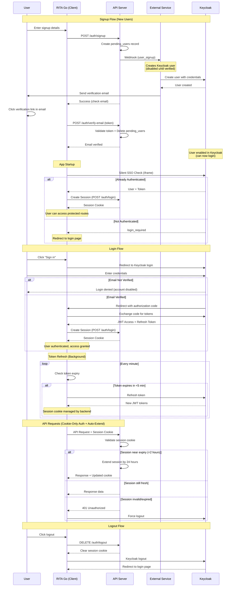
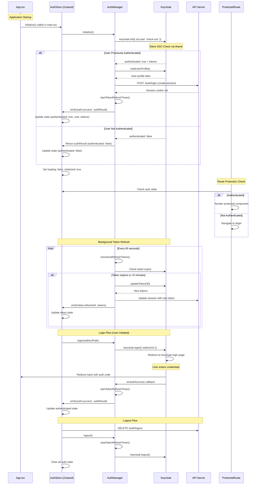
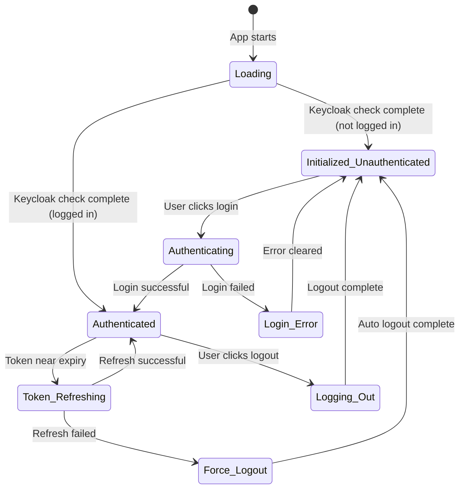
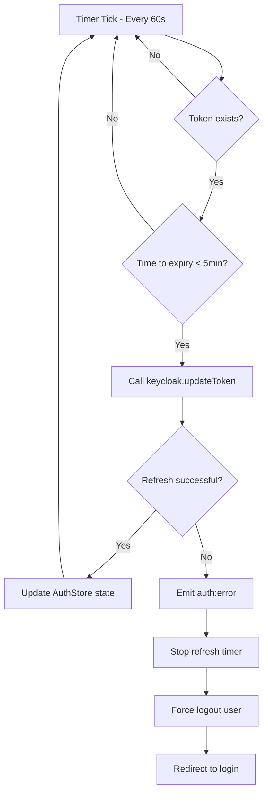
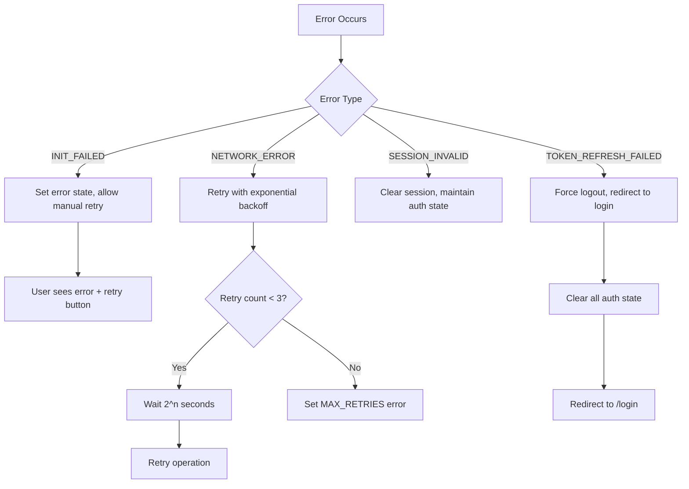
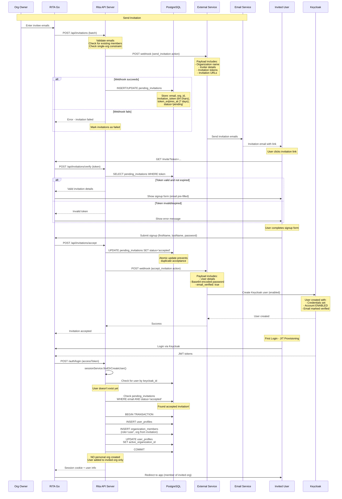
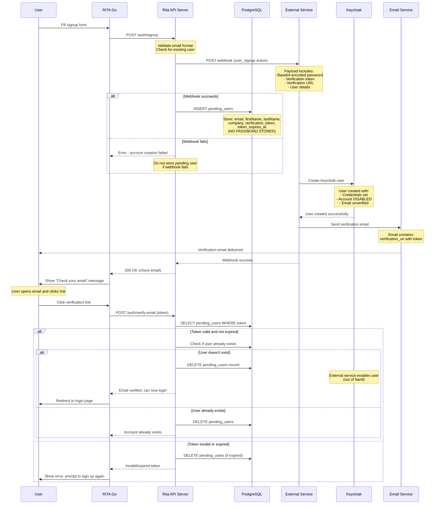
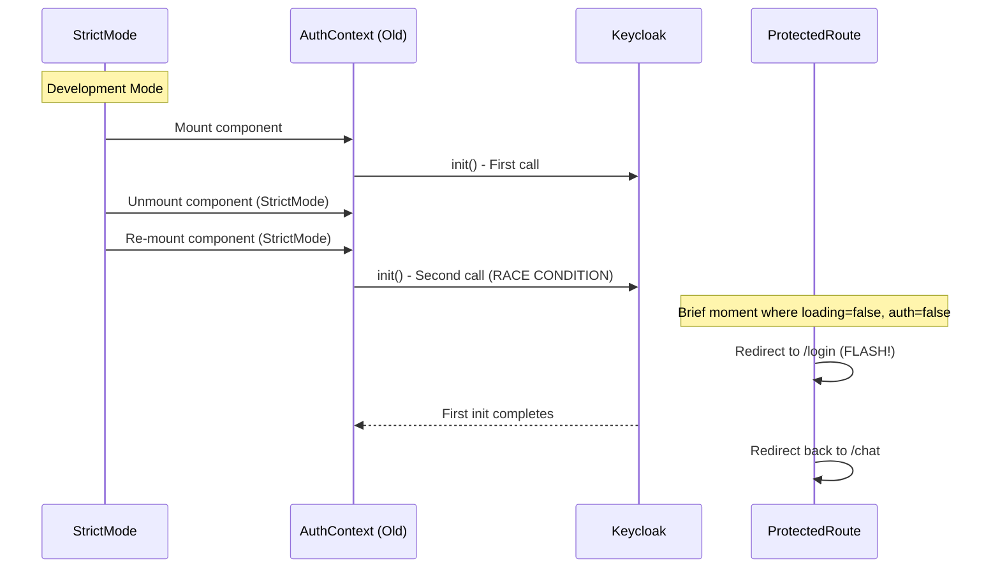
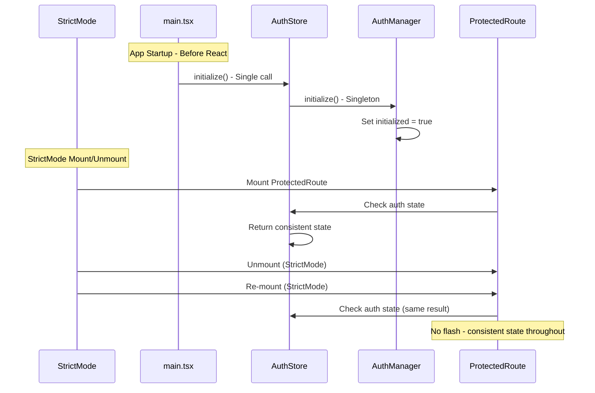

# Rita Authentication Flow Documentation

## Overview

This document explains the authentication architecture for the Rita project, which uses a Zustand-based global state management system with Keycloak for identity management and **cookie-only authentication** for API communication.

**Authentication Model**: Frontend manages Keycloak JWT tokens, backend uses HTTP-only session cookies exclusively. This ensures consistent authentication across all request types (fetch, EventSource/SSE, file downloads).

## Architecture Components

### Core Components
- **RITA Go (Client)**: React/TypeScript frontend with Zustand state management
- **API Server**: Node.js backend with session management
- **Keycloak**: Identity provider and authentication server

### Client-Side Architecture
- **AuthManager**: Singleton managing Keycloak instance and global token refresh (`packages/client/src/services/auth-manager.ts`)
- **AuthStore (Zustand)**: Global state management with persistence (`packages/client/src/stores/auth-store.ts`)
- **useAuth Hook**: Clean React interface for components (`packages/client/src/hooks/useAuth.ts`)
- **ProtectedRoute**: Route guard component (`packages/client/src/components/auth/ProtectedRoute.tsx`)

## High-Level Authentication Flow



## Detailed Client-Side Flow



## State Management Details

### AuthStore (Zustand) State
```typescript
interface AuthState {
  // Core authentication
  authenticated: boolean;
  loading: boolean;
  initialized: boolean;

  // User & tokens
  user: KeycloakProfile | null;
  token: string | null;
  refreshToken: string | null;
  tokenExpiry: number | null;

  // Session management
  sessionReady: boolean;
  loginRedirectPath: string | null;

  // Error handling
  error: AuthError | null;
  retryCount: number;
}
```

### Key State Transitions



## Token Refresh Strategy

### Global Timer Implementation
The `AuthManager` implements a React-independent token refresh mechanism:

```typescript
// Starts when user authenticates
private startTokenRefreshTimer(): void {
  this.refreshTimer = setInterval(async () => {
    await this.checkAndRefreshToken();
  }, 60000); // Check every minute
}

// Runs independently of React component lifecycle
private async checkAndRefreshToken(): Promise<void> {
  const timeToExpiry = tokenParsed.exp - Date.now() / 1000;

  if (timeToExpiry < 300) { // 5 minutes before expiry
    // Proactively refresh token
    const refreshed = await keycloak.updateToken(30);
    if (refreshed) {
      // Update store state
      this.eventBus.emit('token:refreshed', newTokens);
      // Backend auto-extends session cookie when near expiry
    }
  }
}
```

### Refresh Flow Diagram



**Cookie-Only Authentication with Auto-Extension**: All protected API endpoints use HTTP-only session cookies exclusively. The backend automatically extends session cookies when near expiry (< 2 hours remaining), creating a sliding session. This ensures:
- Consistent authentication across all request types (fetch, EventSource/SSE, file downloads)
- Active users never logged out (session extends with every API request)
- No frontend cookie management needed
- Better security (HttpOnly cookies can't be accessed by JavaScript)
- Simpler architecture (backend controls session lifecycle)

## Error Handling Strategy

### Error Types
```typescript
type AuthErrorCode =
  | 'INIT_FAILED'          // Keycloak initialization failed
  | 'LOGIN_FAILED'         // User login attempt failed
  | 'AUTH_FAILED'          // General authentication error
  | 'TOKEN_REFRESH_FAILED' // Token refresh failed
  | 'SESSION_INVALID'      // Backend session invalid
  | 'NETWORK_ERROR'        // Network connectivity issue
  | 'MAX_RETRIES'          // Exceeded retry attempts
```

### Error Recovery Flow



## User Invitation System

Rita supports inviting users to join existing organizations. The invitation system integrates with the authentication flow to ensure invited users are automatically added to the correct organization without creating a personal organization.

### Invitation Flow Overview



### Key Security and Business Logic

**Single Organization Constraint**:
- Users can only belong to ONE organization in Rita
- `sendInvitations()` checks if invitee already has an organization (INV012 error code)
- Prevents users from accepting multiple organization invitations
- Enforced at invitation send time AND during JIT provisioning

**Invitation Token Security**:
- 64-character hex tokens (32 random bytes) generated via `crypto.randomBytes()`
- 7-day expiration from creation
- Tokens invalidated after acceptance (status='accepted')
- Can resend to pending/expired invitations (generates new token)

**Email Verification via Invitation**:
- Invited users have `email_verified: true` sent to Keycloak
- No separate email verification step required
- Invitation link acts as email verification
- Keycloak account created in ENABLED state (unlike direct signups)

**JIT Provisioning Integration** (`sessionService.ts:77-120`):
- When invited user logs in for the first time, `findOrCreateUser()` is called
- Checks `pending_invitations` table for accepted invitations matching email
- If found: Creates user profile + adds to invited organization (NO personal org)
- If not found: Creates user profile + personal organization (normal signup flow)
- Single transaction ensures atomic provisioning

**Invitation Status Lifecycle**:
```
pending → accepted (user completes signup)
pending → expired (7 days pass)
pending → cancelled (org owner cancels)
pending → failed (webhook error)
accepted → (permanent, user provisioned)
```

**Error Codes**:
- `INV003`: Invitation already accepted
- `INV006`: User already a member of this organization
- `INV007`: Invalid email format
- `INV009`: Webhook failed to send invitation emails
- `INV012`: User already has an organization (single-org constraint)

### Invitation API Endpoints

#### POST /api/invitations
Send invitations to multiple users (batch processing).

**Authentication**: Requires valid session cookie + organization owner/admin role.

```typescript
// Request body
{
  emails: string[]  // Array of email addresses to invite
}

// Response (success)
{
  success: true,
  invitations: [
    { email: "user1@example.com", status: "sent" },
    { email: "user2@example.com", status: "skipped", reason: "Already a member", code: "INV006" }
  ],
  successCount: 1,
  failureCount: 1
}
```

**Validation**:
- Email format validation
- Check if already organization member
- Check if user already has an organization (single-org constraint)
- Check for existing pending/expired invitations (allows resend)
- Atomic token generation and webhook call

#### POST /api/invitations/verify
Verify invitation token and return invitation details.

**Authentication**: Public endpoint (no auth required).

```typescript
// Request body
{ token: string }

// Response (valid token)
{
  valid: true,
  invitation: {
    email: "invitee@example.com",
    organizationName: "Acme Corp",
    inviterName: "owner@acme.com",
    expiresAt: "2025-10-20T..."
  }
}

// Response (invalid/expired)
{
  valid: false,
  invitation: null,
  error: "Invitation has expired"
}
```

#### POST /api/invitations/accept
Accept invitation and create Keycloak account.

**Authentication**: Public endpoint (no auth required).

```typescript
// Request body
{
  token: string,
  firstName: string,
  lastName: string,
  password: string
}

// Response
{
  success: true,
  email: "invitee@example.com"
}
```

**Security**:
- Verifies token before processing
- Checks for duplicate users (email already registered)
- Atomic status update prevents duplicate acceptance
- Password base64-encoded before webhook transmission
- Password NEVER stored in Rita database
- Triggers `accept_invitation` webhook for Keycloak user creation

#### DELETE /api/invitations/:id
Cancel a pending invitation.

**Authentication**: Requires valid session cookie + organization owner/admin role.

```typescript
// Response
{ success: true }
```

**Behavior**: Can only cancel invitations in 'pending' status.

#### GET /api/invitations
List invitations for the authenticated user's organization.

**Authentication**: Requires valid session cookie.

**Query Parameters**:
- `status`: Filter by status (pending, accepted, expired, cancelled, failed)
- `limit`: Number of results (default: 50)
- `offset`: Pagination offset (default: 0)

```typescript
// Response
[
  {
    id: "uuid",
    organization_id: "uuid",
    invited_by_user_id: "uuid",
    email: "invitee@example.com",
    invitation_token: "...",
    token_expires_at: "2025-10-20T...",
    status: "pending",
    created_at: "2025-10-13T...",
    accepted_at: null,
    invited_by_name: "owner@acme.com"
  }
]
```

## Signup Flow with External Service

The signup process involves coordination between Rita API, an external webhook service, and Keycloak:



### Key Security Points

1. **Password Handling** (Zero Storage):
   - Passwords are **NEVER stored in the database**, not even temporarily
   - Password flow: Client → API (memory) → Webhook → External Service → Keycloak
   - Password is base64-encoded before webhook transmission (prevents logging)
   - **Requires HTTPS** for webhook communication
   - If webhook fails, signup fails - no orphaned passwords in database

2. **User State Management**:
   - Keycloak user created immediately but **disabled**
   - `pending_users` table tracks verification state (email, token, expiration only)
   - User cannot login until email verified
   - Webhook must succeed before storing any user data

3. **Token Expiration**:
   - Verification tokens expire after 24 hours
   - Expired tokens trigger cleanup of `pending_users` record
   - User must re-signup if token expires

4. **Race Condition Prevention**:
   - Signup checks for existing users before calling webhook
   - Verification checks for existing users before enabling
   - Duplicate signups replace old pending records
   - Webhook failure prevents database writes

5. **Additional Flows**:
   - **Resend Verification**: Generates new token, rate limited (5 min), triggers `resend_verification` webhook
   - **Forgot Password**: Delegates to external service via `password_reset_request` webhook (zero storage)

## API Endpoints

The API server (`packages/api-server/src/routes/auth.ts`) provides the following authentication endpoints:

### POST /auth/signup
Creates a pending user and triggers webhook for email verification.
```typescript
// Request body
{
  firstName: string,
  lastName: string,
  email: string,
  company: string,
  password: string  // Sent to webhook only, NEVER stored in database
}

// Response (success)
{
  success: true,
  message: "Signup successful. Please check your email..."
}

// Response (webhook failure)
{
  error: "Failed to create account. Please try again."
}
```

**Security**: Password is base64-encoded before webhook transmission and **never stored in the database**. If webhook fails, signup fails and no user data is persisted.

### POST /auth/resend-verification
Resends the email verification link with a new token.
```typescript
// Request body
{ email: string }

// Response (always success for security)
{
  success: true,
  message: "If a pending verification exists, a new email has been sent"
}

// Response (rate limited)
{
  error: "Please wait 5 minutes before requesting another verification email"
}
```

**Features**:
- Generates NEW verification token (invalidates old one)
- Extends expiration to 24 hours from resend
- Rate limited: 1 request per 5 minutes per email
- Doesn't reveal if email has pending verification (security)

**Webhook**: Triggers `resend_verification` action to external service.

### POST /auth/forgot-password
Initiates password reset flow via external service and Keycloak.
```typescript
// Request body
{ email: string }

// Response (always success for security)
{
  success: true,
  message: "If an account exists with this email, a password reset link will be sent"
}
```

**Security**:
- Doesn't reveal if user exists (prevents email enumeration)
- External service handles Keycloak password reset flow
- Rita doesn't store or manage password reset tokens
- Consistent with zero-storage password architecture

**Webhook**: Triggers `password_reset_request` action. External service:
1. Creates password reset token in Keycloak
2. Sends email with reset link to user
3. Handles password update when user submits new password

### POST /auth/login
Creates or updates a session cookie from a Keycloak access token.

**Used for**:
- Initial login after Keycloak authentication
- Token refresh (updates session cookie with new Keycloak token)
- Session recovery after idle period

```typescript
// Request body
{ accessToken: string }

// Response
{
  success: true,
  user: { id, email, organizationId },
  session: { id, expiresAt }
}
```

**Behavior**: Sets or updates `rita_session` HTTP-only cookie (24-hour expiration). If an existing valid session exists, it extends the expiration. Otherwise, creates a new session with JIT user provisioning from Keycloak token.

### DELETE /auth/logout
Destroys the current session.
```typescript
// Response
{ success: true, message: "Logged out successfully" }
```

Clears `rita_session` cookie.

### DELETE /auth/logout-all
Destroys all sessions for the authenticated user across all devices.
```typescript
// Response
{ success: true, deletedSessions: number }
```

### POST /auth/verify-email
Verifies signup token and marks user as ready for Keycloak signin.
```typescript
// Request body
{ token: string }

// Response
{
  success: true,
  message: "Email verified successfully...",
  email: string
}
```

### GET /auth/session
Checks if the current session cookie is valid and returns session info.
```typescript
// Response (authenticated)
{
  authenticated: true,
  user: { id, email, organizationId },
  session: { id, expiresAt, lastAccessedAt }
}

// Response (not authenticated)
{
  authenticated: false,
  error: "No session found" | "Invalid or expired session"
}
```

## Middleware Authentication

The authentication middleware (`packages/api-server/src/middleware/auth.ts`) uses **cookie-only authentication**:

### Session Cookie Authentication
```
Cookie: rita_session=<session-id>
```
- **All protected endpoints** require valid session cookie
- Session validated on each request
- Works consistently across all request types:
  - Regular fetch requests ✅
  - EventSource (SSE) connections ✅
  - File downloads ✅
  - WebSocket (future) ✅

**Session Creation with JIT Provisioning**:

When users authenticate via Keycloak, the frontend calls `POST /auth/login` with the Keycloak JWT token. The backend:
1. Validates Keycloak JWT token
2. Performs **JIT (Just-In-Time) User Provisioning** via `sessionService.findOrCreateUser()`
3. Creates user profile and organization automatically if they don't exist
4. Creates/updates session record in session store
5. Returns HTTP-only session cookie

**JIT Provisioning Implementation** (`packages/api-server/src/services/sessionService.ts:52`):
```typescript
public async findOrCreateUser(tokenPayload: jose.JWTPayload) {
  // 1. Check if user exists by Keycloak ID
  // 2. If not, check for accepted invitations FIRST
  // 3a. If invited: Create user + add to invited org(s) (NO personal org)
  // 3b. If NOT invited: Create user + personal org (normal flow)
  // 4. Set user's active organization
  // 5. Return user info for session creation
}
```

**Two Provisioning Paths**:

1. **Invited Users** (`sessionService.ts:99-120`):
   - Query `pending_invitations` for accepted invitations matching user email
   - Create user profile without personal organization
   - Add user as 'user' role member to invited organization(s)
   - Set first invited organization as active
   - **Key difference**: No personal organization created

2. **Direct Signups** (`sessionService.ts:122-139`):
   - No accepted invitations found
   - Create user profile + personal organization (named "{email}'s Organization")
   - Add user as 'owner' role member of personal organization
   - Set personal organization as active

## Security Considerations

### Token Storage
- **Keycloak JWT tokens**: Managed by frontend, stored in memory only (Zustand store)
- **Session cookies**: HTTP-only cookies set by backend
- **No localStorage**: Prevents XSS token theft

### Session Management
- **Cookie-only backend auth**: All API requests authenticated via HTTP-only session cookies
- **Frontend token management**: Keycloak JWT tokens handled by frontend, refreshed automatically every 5 minutes
- **Sliding sessions**: Backend auto-extends session when near expiry (< 2 hours remaining)
- **Session lifetime**: 24 hours from last activity (extends automatically while user is active)
- **Auto logout**: Failed Keycloak token refresh triggers automatic logout
- **Secure cookies**: Session cookies are HTTP-only, secure (production), and SameSite=Lax
- **Session cookie name**: `rita_session`

### PKCE Flow
Keycloak initialization uses PKCE (Proof Key for Code Exchange):
```typescript
keycloak.init({
  onLoad: 'check-sso',
  pkceMethod: 'S256', // SHA256 code challenge
})
```

## React StrictMode Compatibility

### Problem Solved
The previous React Context implementation suffered from double initialization in StrictMode:



### Solution Implementation
The new Zustand approach initializes once at app startup:



## Component Integration

### useAuth Hook Usage
```typescript
function MyComponent() {
  const {
    authenticated,
    loading,
    user,
    login,
    logout
  } = useAuth();

  if (loading) return <Spinner />;
  if (!authenticated) return <LoginButton onClick={login} />;

  return <WelcomeUser user={user} onLogout={logout} />;
}
```

### Selective Subscriptions
```typescript
// Only re-render when auth status changes
const { authenticated, loading } = useAuthStatus();

// Only re-render when user data changes
const user = useAuthUser();

// Only re-render when errors occur
const { error, retry } = useAuthError();
```

## Development vs Production

### Development Environment
- **Silent SSO check**: May timeout if Keycloak server not running
- **Console logging**: Detailed auth flow logging enabled
- **StrictMode**: Double-rendering handled gracefully
- **Hot reloading**: Auth state persists across code changes

### Production Environment
- **Silent SSO check**: Should succeed if user previously authenticated
- **Minimal logging**: Only errors logged to console
- **Optimized builds**: No development overhead
- **Session persistence**: Auth state survives page refreshes

## Monitoring and Debugging

### Key Log Messages
```typescript
// Successful flows
"AuthManager: Keycloak initialization successful"
"AuthStore: Initialization completed successfully"
"AuthManager: Token refreshed successfully"

// Error conditions
"AuthManager: Token refresh failed"
"AuthStore: Initialization failed"
"AuthManager: Failed to create backend session"
```

### State Debugging
The Zustand store integrates with Redux DevTools for debugging:
- View auth state changes in real-time
- Time-travel debugging for auth flows
- Action history for troubleshooting

This architecture provides a robust, scalable, and maintainable authentication system that handles all edge cases while providing excellent developer experience.

---

## Known Issues and Proposed Improvements

### 1. Password Security - Zero Storage Architecture ✅ RESOLVED

**Implementation**: Passwords are **never stored in the database**, not even temporarily.

```typescript
// packages/api-server/src/routes/auth.ts:73
password: Buffer.from(password).toString('base64')  // Sent to webhook only
```

**Zero Storage Security Model**:
- ✅ Passwords **never touch the database** at any point
- ✅ Password flow: Client → API (in-memory only) → Webhook → Keycloak
- ✅ Base64 encoding prevents accidental logging of plaintext
- ✅ HTTPS enforced for all webhook communication
- ✅ Webhook authentication via Authorization header
- ✅ If webhook fails, signup fails - no orphaned data

**Flow**:
1. Client submits signup form with password
2. API validates and **immediately sends to webhook** (password in memory only)
3. If webhook succeeds → Store pending user (email, name, token - NO PASSWORD)
4. If webhook fails → Return error, store nothing
5. External service creates Keycloak user with password
6. Password never exists in Rita database

**Architecture Rationale**:
- **Zero trust**: Passwords should never be persisted outside identity systems
- **Fail-fast**: Webhook failure prevents any data persistence
- **Separation of concerns**: Rita handles flow, Keycloak handles passwords
- **Audit compliance**: No password storage = no password breach risk

---

### 2. Token Refresh Race Conditions (LOW PRIORITY - DEFERRED)

**Potential Issue**: If a user has multiple browser tabs open, each instance of AuthManager runs its own refresh timer. This could lead to:
- Multiple simultaneous token refresh requests
- Unnecessary API calls (though session updates are efficient)
- Minor overhead with multiple tabs

**Current Mitigation**:
- Keycloak's `updateToken()` is idempotent and handles concurrent calls gracefully
- Session refresh endpoint (`PUT /auth/session/refresh`) is efficient and updates in-place
- Impact is minimal in practice

**Future Improvement (if needed):**
Implement cross-tab synchronization using `BroadcastChannel` API where only the "leader" tab performs token refresh and broadcasts the result to other tabs.

**Decision**: Deferred to future iteration. Current implementation is acceptable for production use.

---

### 3. Silent SSO Configuration ✅ DOCUMENTED

**Purpose**: Enables seamless re-authentication without redirecting users to Keycloak login page when they already have an active Keycloak session.

**Implementation**:

The authentication system uses Keycloak's "Silent Check SSO" feature via an iframe:

```typescript
// packages/client/src/services/auth-manager.ts:30-34
await this.keycloak.init({
  onLoad: 'check-sso',
  silentCheckSsoRedirectUri: `${window.location.origin}/silent-check-sso.html`,
  pkceMethod: 'S256',
});
```

**Silent SSO HTML File** (`packages/client/public/silent-check-sso.html`):

```html
<!DOCTYPE html>
<html>
<head>
    <title>Keycloak Silent Check SSO</title>
</head>
<body>
<script>
    parent.postMessage(location.href, location.origin);
</script>
</body>
</html>
```

**How It Works**:

1. **App Startup**: When the app loads, Keycloak creates a hidden iframe
2. **Iframe Loads**: The iframe navigates to Keycloak with `silent-check-sso.html` as the redirect URI
3. **Keycloak Check**: Keycloak checks if the user has an active session (via cookies)
4. **Redirect**: If authenticated, Keycloak redirects back to `silent-check-sso.html` with auth code
5. **PostMessage**: The iframe posts the redirect URL (containing auth code) to the parent window
6. **Token Exchange**: Parent window extracts the auth code and exchanges it for tokens
7. **Silent Success**: User is logged in without seeing Keycloak login page

**Why a Separate HTML File?**

- **Cross-origin isolation**: Prevents CORS issues when Keycloak redirects back
- **Minimal payload**: Fast loading in iframe (no app bundle)
- **Single purpose**: Only handles postMessage, no app logic
- **Security**: Isolated from main app state and logic

**Benefits**:

- ✅ Users stay logged in across browser sessions (if Keycloak session active)
- ✅ No visible redirect to Keycloak login page on app load
- ✅ Seamless experience for returning users
- ✅ Works in background without user interaction

**Troubleshooting**:

| Issue | Cause | Solution |
|-------|-------|----------|
| Silent SSO timeout | Keycloak server unreachable | Check `KEYCLOAK_URL` environment variable |
| Always shows login | No active Keycloak session | User needs to login once, then SSO works |
| CORS errors | Wrong redirect URI configured | Verify `silentCheckSsoRedirectUri` matches Keycloak client settings |
| Iframe blocked | Browser security settings | Check browser allows iframes from Keycloak domain |

**Configuration**:

Ensure Keycloak client has the correct redirect URI registered:
```
http://localhost:5173/silent-check-sso.html  (development)
https://your-domain.com/silent-check-sso.html  (production)
```

---

### 4. Error Retry Strategy

**Current Implementation**: The AuthStore includes retry logic with exponential backoff (up to 3 attempts).

**Potential Issue**: The retry mechanism only applies to initialization failures, not to:
- Token refresh failures (which trigger immediate logout)
- Session creation failures (which are silently logged)
- Network errors during login

**Proposed Enhancement**:
- Add retry logic for transient network errors
- Distinguish between retryable errors (503, network timeout) and permanent errors (401, 403)
- Implement circuit breaker pattern for repeated failures
- Add user notification system for authentication issues

---

## Future Enhancements

### 1. **Refresh Token Rotation**
Implement Keycloak refresh token rotation for enhanced security. Each token refresh should invalidate the old refresh token and issue a new one.

### 2. **Multi-Factor Authentication (MFA)**
Add MFA support through Keycloak's built-in OTP functionality. Document the flow changes needed.

### 3. **Device Management**
- Allow users to view active sessions across devices
- Add "logout from this device" vs. "logout from all devices" distinction in UI
- Show session metadata (device type, location, last accessed)

### 4. **Session Activity Monitoring**
- Track user activity to extend session expiration on active use
- Implement "idle timeout" separate from absolute session timeout
- Add configurable session duration based on user role or security level

### 5. **OAuth Social Login Integration**
- Add Google, GitHub, Microsoft login options via Keycloak
- Document the identity provider federation setup
- Handle account linking for users with multiple login methods

### 6. **Audit Logging**
- Log all authentication events (login, logout, token refresh, failures)
- Implement SOC2-compliant audit trail for security reviews
- Add user-facing "security activity" dashboard

### 7. **Biometric Authentication**
- Integrate WebAuthn for passwordless authentication
- Support hardware security keys (YubiKey, etc.)
- Implement device fingerprinting for suspicious activity detection

---

## Testing Recommendations

To ensure this authentication flow works correctly, the following test scenarios should be covered:

### Unit Tests
- ✅ AuthManager token refresh logic
- ✅ SessionService JIT provisioning (including invited user flow)
- ✅ Session cookie generation and parsing
- ✅ InvitationService business logic (24 comprehensive tests)
- ⚠️ AuthStore state transitions (needs expansion)

### Integration Tests
- ⚠️ Full login flow (Keycloak → JWT → Session cookie)
- ⚠️ Token refresh with backend session update
- ⚠️ Session validation across API requests
- ⚠️ Logout clearing both Keycloak and backend sessions

### E2E Tests (Missing)
- ❌ User signup → email verification → login → protected route access
- ❌ Invitation flow → accept invitation → first login → org membership verification
- ❌ Token expiration handling in active session
- ❌ Multi-tab behavior (login in one tab, reflected in others)
- ❌ Session timeout and auto-logout
- ❌ Network failure recovery during authentication
- ❌ Single-org constraint enforcement (cannot accept second invitation)

### Security Tests (Missing)
- ❌ XSS protection (no token leakage to localStorage)
- ❌ CSRF protection on session endpoints
- ❌ Token expiration enforcement
- ❌ Session hijacking prevention
- ❌ Webhook payload security validation

---

**Legend**:
- ✅ Exists and working
- ⚠️ Partially implemented or needs improvement
- ❌ Missing or not yet implemented