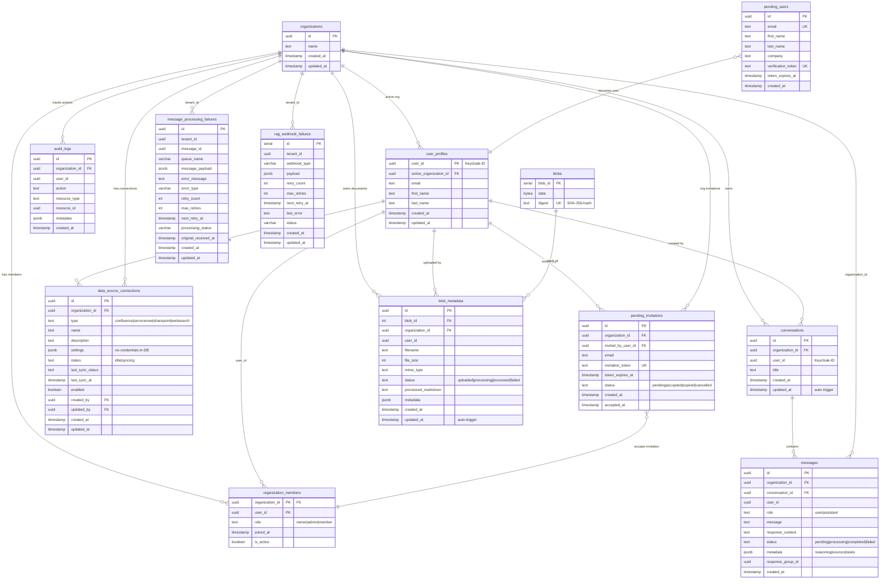

# Rita API Server - Database Tables Reference

**Last Updated:** 2025-10-29

This document tracks all database tables in the Rita API server, their usage status, and purpose.

## Table of Contents
- [Entity Relationship Diagram](#entity-relationship-diagram)
- [Active Tables (Used in Code)](#active-tables-used-in-code)
- [Legacy Tables (Dropped)](#legacy-tables-dropped)
- [Legacy RAG Tables (Replaced & Dropped)](#legacy-rag-tables-replaced--dropped)
- [Table Relationships](#table-relationships)
- [Cleanup Status](#cleanup-status)

---

## Entity Relationship Diagram



**Diagram Legend:**
- `PK` - Primary Key
- `FK` - Foreign Key
- `UK` - Unique Key
- `||--o{` - One to Many relationship
- `}o--||` - Many to One relationship (transforms)

**Key Architectural Patterns:**
1. **Multi-Tenancy**: All data isolated by `organization_id`
2. **Keycloak Integration**: `user_profiles.user_id` maps to Keycloak user IDs
3. **Content-Addressable Storage**: `blobs.digest` enables deduplication
4. **Row-Level Security**: Enforced at database level for isolation
5. **Auto-updating Timestamps**: Triggers update `updated_at` on modifications
6. **Hybrid Message Format**: Text content + rich JSONB metadata

---

## Active Tables (Used in Code)

These 13 tables are actively queried and managed by the API server (`packages/api-server/src`).

### 1. **organizations**
**Purpose:** Multi-tenant organization container
**Schema:** Migration `101_initial_schema.sql`
**Used In:**
- `routes/organizations.ts` (CRUD operations)
- `routes/files.ts` (document ownership)
- `routes/conversations.ts` (conversation ownership)
- `routes/members.ts` (member management)
- `routes/invitations.ts` (invitation system)
- `routes/dataSources.ts` (data source ownership)

**Columns:**
- `id` UUID PRIMARY KEY
- `name` TEXT NOT NULL
- `created_at` TIMESTAMP WITH TIME ZONE
- `updated_at` TIMESTAMP WITH TIME ZONE (added in migration 125)

**Operations:**
- `SELECT` - Get user's organizations, get current org details
- `INSERT` - Create new organization
- `UPDATE` - Update organization name

**Code References:**
- organizations.ts:21 - JOIN for listing user orgs
- organizations.ts:102 - INSERT new organization
- organizations.ts:212 - UPDATE organization name

---

### 2. **organization_members**
**Purpose:** User-to-organization membership with role assignment
**Schema:** Migration `101_initial_schema.sql`
**Used In:**
- `routes/organizations.ts` (membership checks)
- `routes/members.ts` (member CRUD)
- `routes/invitations.ts` (invitation acceptance)
- `middleware/auth.ts` (authorization)

**Columns:**
- `organization_id` UUID FK (organizations.id)
- `user_id` UUID (Keycloak user ID)
- `role` TEXT NOT NULL DEFAULT 'member' ('owner', 'admin', 'member')
- `joined_at` TIMESTAMP WITH TIME ZONE
- `is_active` BOOLEAN NOT NULL DEFAULT true (added in migration 126)
- PRIMARY KEY: (organization_id, user_id)

**Indexes:**
- `idx_organization_members_user_id` ON user_id
- `idx_organization_members_active` ON (organization_id, is_active)

**Operations:**
- `SELECT` - Check membership, list members, verify roles
- `INSERT` - Add member to organization
- `UPDATE` - Change role, activate/deactivate member
- `DELETE` - Remove member (soft delete via is_active recommended)

**Code References:**
- organizations.ts:22 - JOIN for role checking
- organizations.ts:109 - INSERT new member as owner
- members.ts - Member management operations

---

### 3. **user_profiles**
**Purpose:** Local user data cache and active organization tracking
**Schema:** Migration `101_initial_schema.sql`
**Used In:**
- `routes/organizations.ts` (active org switching)
- `routes/auth.ts` (user profile management)
- `routes/conversations.ts` (user email for messages)

**Columns:**
- `user_id` UUID PRIMARY KEY (Keycloak auth.users.id)
- `active_organization_id` UUID FK NULLABLE (organizations.id)
- `email` TEXT
- `first_name` TEXT (added in migration 123)
- `last_name` TEXT (added in migration 123)
- `created_at` TIMESTAMP WITH TIME ZONE
- `updated_at` TIMESTAMP WITH TIME ZONE (added in migration 124)

**Operations:**
- `SELECT` - Get user profile, get active organization
- `INSERT` - Create user profile on first login
- `UPDATE` - Switch active organization, update profile

**Code References:**
- organizations.ts:23 - JOIN for active org check
- organizations.ts:57 - UPDATE active_organization_id
- auth.ts - Profile management

---

### 4. **conversations**
**Purpose:** Conversation containers for organizing messages
**Schema:** Migration `106_add_conversations.sql`
**Used In:**
- `routes/conversations.ts` (CRUD, listing, message management)

**Columns:**
- `id` UUID PRIMARY KEY
- `organization_id` UUID NOT NULL FK (organizations.id)
- `user_id` UUID NOT NULL (Keycloak user ID)
- `title` TEXT NOT NULL
- `created_at` TIMESTAMP WITH TIME ZONE
- `updated_at` TIMESTAMP WITH TIME ZONE (auto-updated via trigger)

**Indexes:**
- `idx_conversations_organization_id` ON organization_id
- `idx_conversations_user_id` ON user_id

**Features:**
- Auto-updates `updated_at` via trigger `set_timestamp`
- Max 20 conversations per user (oldest auto-deleted on overflow)
- Row-level security for organization/user isolation

**Operations:**
- `SELECT` - List conversations, get conversation details
- `INSERT` - Create new conversation
- `UPDATE` - Update conversation title
- `DELETE` - Delete conversation (cascades to messages)

**Code References:**
- conversations.ts:55 - SELECT conversations list
- conversations.ts:95 - INSERT new conversation
- conversations.ts:125 - UPDATE conversation title
- conversations.ts:145 - DELETE conversation

---

### 5. **messages**
**Purpose:** Main message table for user/assistant communication
**Schema:** Migrations `101`, `103`, `104`, `109`, `116`
**Used In:**
- `routes/conversations.ts` (message CRUD, transcript building)
- `services/WebhookService.ts` (message events)

**Columns:**
- `id` UUID PRIMARY KEY
- `organization_id` UUID NOT NULL FK (organizations.id)
- `conversation_id` UUID FK NULLABLE (conversations.id) - added in 106
- `user_id` UUID NOT NULL
- `message` TEXT NOT NULL (renamed from original_content in 109)
- `role` VARCHAR(20) NOT NULL ('user' or 'assistant') - added in 109
- `response_content` TEXT NULLABLE (added in 103)
- `status` TEXT DEFAULT 'pending' ('pending', 'processing', 'completed', 'failed', 'sent')
- `error_message` TEXT NULLABLE
- `processed_at` TIMESTAMP WITH TIME ZONE
- `sent_at` TIMESTAMP WITH TIME ZONE (added in 104)
- `metadata` JSONB NULLABLE (hybrid support) - added in 116
- `response_group_id` UUID NULLABLE (groups related messages) - added in 116
- `created_at` TIMESTAMP WITH TIME ZONE

**Indexes:**
- `idx_messages_organization_id` ON organization_id
- `idx_messages_user_id` ON user_id
- `idx_messages_conversation_id` ON conversation_id
- `idx_messages_status` ON status
- `idx_messages_response_group` ON response_group_id WHERE response_group_id IS NOT NULL
- `idx_messages_metadata` USING GIN ON metadata WHERE metadata IS NOT NULL
- `idx_messages_created_at` (for pagination) - added in 120

**Features:**
- Hybrid message format: text in `message` + rich metadata (reasoning, sources, tasks) in `metadata` JSONB
- Response grouping via `response_group_id` for multi-part assistant responses
- Cursor-based pagination using `created_at` timestamp
- Transcript building for context (sent to external services)

**Operations:**
- `SELECT` - List messages, build transcript, get message details
- `INSERT` - Create user message, create assistant response
- `UPDATE` - Update message status, add response content
- `DELETE` - Delete message (cascades from conversation deletion)

**Code References:**
- conversations.ts:185 - INSERT user message
- conversations.ts:230 - SELECT messages with pagination
- conversations.ts:310 - Build transcript for external service

---

### 6. **blob_metadata**
**Purpose:** Document metadata and application context for blob storage
**Schema:** Migration `113_add_content_addressable_storage.sql`
**Used In:**
- `routes/files.ts` (upload, download, listing, processing, deletion)

**Columns:**
- `id` UUID PRIMARY KEY
- `blob_id` INTEGER NOT NULL FK (blobs.blob_id)
- `organization_id` UUID NOT NULL FK (organizations.id)
- `user_id` UUID NOT NULL
- `filename` TEXT NOT NULL
- `file_size` INTEGER NOT NULL
- `mime_type` TEXT NOT NULL
- `status` TEXT NOT NULL DEFAULT 'uploaded' ('uploaded', 'processing', 'processed', 'failed')
- `processed_markdown` TEXT NULLABLE (RAG pipeline output)
- `metadata` JSONB DEFAULT '{}' (flexible metadata: content, tags, descriptions)
- `created_at` TIMESTAMP WITH TIME ZONE
- `updated_at` TIMESTAMP WITH TIME ZONE (auto-updated via trigger)

**Indexes:**
- `idx_blob_metadata_blob_id` ON blob_id
- `idx_blob_metadata_organization_id` ON organization_id
- `idx_blob_metadata_user_id` ON user_id
- `idx_blob_metadata_status` ON status
- `idx_blob_metadata_created_at` ON created_at
- `idx_blob_metadata_filename` ON filename

**Features:**
- Auto-updates `updated_at` via trigger `update_blob_metadata_updated_at`
- Supports text content (stored in `metadata.content`) and binary files
- Processing pipeline tracking via `status` field
- Markdown output storage for RAG results in `processed_markdown`

**Operations:**
- `SELECT` - List documents, get document metadata, download check
- `INSERT` - Upload new document (creates metadata record)
- `UPDATE` - Update processing status, store processed content
- `DELETE` - Delete document metadata (checks for orphaned blobs)

**Code References:**
- files.ts:118 - INSERT blob_metadata on upload
- files.ts:249 - INSERT blob_metadata for text content
- files.ts:313 - SELECT metadata (for citations)
- files.ts:434 - SELECT documents list
- files.ts:699 - DELETE blob_metadata

---

### 7. **blobs**
**Purpose:** Content-addressable storage for deduplication of file content
**Schema:** Migration `113_add_content_addressable_storage.sql`
**Used In:**
- `routes/files.ts` (upload, download, deletion)

**Columns:**
- `blob_id` SERIAL PRIMARY KEY (auto-incrementing integer)
- `data` BYTEA NOT NULL (raw binary/text file content)
- `digest` TEXT UNIQUE NOT NULL (SHA-256 hash for content addressing)

**Indexes:**
- `idx_blobs_digest` ON digest (for fast lookup when checking for existing content)

**Features:**
- Content deduplication: same file content reuses same blob
- Efficient lookups via digest hash (SHA-256)
- Stores both binary files and text content
- Orphaned blobs cleaned up when last blob_metadata reference is deleted

**Operations:**
- `SELECT` - Check if blob exists (deduplication), download blob data
- `INSERT` - Store new blob content
- `DELETE` - Remove orphaned blobs (ref count = 0)

**Code References:**
- files.ts:98 - SELECT blob by digest (deduplication check)
- files.ts:108 - INSERT new blob
- files.ts:372 - SELECT blob data for download (JOIN with blob_metadata)
- files.ts:714 - DELETE orphaned blob

---

### 8. **audit_logs**
**Purpose:** SOC2 compliance audit trail for all sensitive actions
**Schema:** Migration `101_initial_schema.sql`
**Used In:**
- `routes/organizations.ts` (org switches, creation, updates)
- Future: document operations, member management

**Columns:**
- `id` UUID PRIMARY KEY
- `organization_id` UUID NOT NULL FK (organizations.id)
- `user_id` UUID NULLABLE
- `action` TEXT NOT NULL (e.g., 'switch_organization', 'create_organization', 'update_organization')
- `resource_type` TEXT NOT NULL ('organization', 'message', 'document', etc.)
- `resource_id` UUID NULLABLE
- `metadata` JSONB NULLABLE (additional context)
- `created_at` TIMESTAMP WITH TIME ZONE

**Indexes:**
- `idx_audit_logs_organization_id` ON organization_id
- `idx_audit_logs_created_at` ON created_at

**Operations:**
- `SELECT` - Query audit trail (future reporting/compliance)
- `INSERT` - Log sensitive actions

**Code References:**
- organizations.ts:63 - Log organization switch
- organizations.ts:115 - Log organization creation
- organizations.ts:224 - Log organization update

**Audit Actions Currently Logged:**
- `switch_organization` - User switches active org
- `create_organization` - New org created
- `update_organization` - Org name/settings updated

---

### 9. **pending_users**
**Purpose:** Temporary storage for users in signup flow before email verification
**Schema:** Migration `112_add_pending_users.sql`
**Used In:**
- `routes/auth.ts` (signup, email verification)

**Columns:**
- `id` UUID PRIMARY KEY
- `email` TEXT NOT NULL UNIQUE
- `first_name` TEXT NOT NULL
- `last_name` TEXT NOT NULL
- `company` TEXT NOT NULL
- `verification_token` TEXT NOT NULL UNIQUE
- `token_expires_at` TIMESTAMP WITH TIME ZONE
- `created_at` TIMESTAMP WITH TIME ZONE

**Indexes:**
- `idx_pending_users_email` ON email
- `idx_pending_users_verification_token` ON verification_token
- `idx_pending_users_token_expires_at` ON token_expires_at

**Note:** Password field was removed in migration `119_remove_password_from_pending_users.sql` (Keycloak handles auth)

**Operations:**
- `SELECT` - Verify token, check if email already pending
- `INSERT` - Create pending user during signup
- `DELETE` - Remove after verification success or expiration

**Code References:**
- auth.ts - Signup and verification flows

---

### 10. **pending_invitations**
**Purpose:** Organization invitation system for onboarding members
**Schema:** Migration `122_add_pending_invitations.sql`
**Used In:**
- `routes/invitations.ts` (send, accept, list, cancel invitations)

**Columns:**
- `id` UUID PRIMARY KEY
- `organization_id` UUID NOT NULL FK (organizations.id)
- `invited_by_user_id` UUID NOT NULL FK (user_profiles.user_id)
- `email` TEXT NOT NULL
- `invitation_token` TEXT NOT NULL UNIQUE
- `token_expires_at` TIMESTAMP WITH TIME ZONE
- `status` TEXT NOT NULL DEFAULT 'pending' ('pending', 'accepted', 'expired', 'cancelled', 'failed')
- `created_at` TIMESTAMP WITH TIME ZONE
- `accepted_at` TIMESTAMP WITH TIME ZONE

**Indexes:**
- `idx_pending_invitations_email` ON email
- `idx_pending_invitations_token` ON invitation_token
- `idx_pending_invitations_org_id` ON organization_id
- `idx_pending_invitations_status` ON status
- `idx_pending_invitations_token_expires_at` ON token_expires_at
- `idx_pending_invitations_unique_email_org` ON (email, organization_id) WHERE status = 'pending' (prevents duplicate pending invitations)

**Operations:**
- `SELECT` - List invitations, verify token, check existing invitations
- `INSERT` - Send invitation
- `UPDATE` - Accept, cancel, or expire invitation
- `DELETE` - Cleanup old invitations

**Code References:**
- invitations.ts - Full invitation lifecycle management

---

### 11. **data_source_connections**
**Purpose:** Configuration for external data sources (Confluence, ServiceNow, SharePoint, Web Search)
**Schema:** Migration `117_add_data_source_connections.sql`
**Used In:**
- `routes/dataSources.ts` (connection CRUD)
- `routes/dataSourceWebhooks.ts` (verify, sync operations)

**Columns:**
- `id` UUID PRIMARY KEY
- `organization_id` UUID NOT NULL FK (organizations.id)
- `type` TEXT NOT NULL ('confluence', 'servicenow', 'sharepoint', 'websearch')
- `name` TEXT NOT NULL
- `description` TEXT NULLABLE
- `settings` JSONB DEFAULT '{}' (type-specific settings, NO credentials stored in DB)
- `status` TEXT DEFAULT 'idle' ('idle' = ready, 'syncing' = in progress)
- `last_sync_status` TEXT NULLABLE (NULL, 'completed', 'failed')
- `last_sync_at` TIMESTAMP WITH TIME ZONE
- `enabled` BOOLEAN DEFAULT false
- `created_by` UUID NOT NULL FK (user_profiles.user_id)
- `updated_by` UUID NOT NULL FK (user_profiles.user_id)
- `created_at` TIMESTAMP WITH TIME ZONE
- `updated_at` TIMESTAMP WITH TIME ZONE
- UNIQUE (organization_id, type) - One connection per type per org

**Indexes:**
- `idx_data_source_connections_org` ON organization_id
- `idx_data_source_connections_type` ON type
- `idx_data_source_connections_enabled` ON enabled
- `idx_data_source_connections_status` ON status

**Security Note:** Credentials are NOT stored in database - they're sent to external service (Barista) during verification and sync operations.

**Operations:**
- `SELECT` - List connections, get connection details
- `INSERT` - Create new data source connection
- `UPDATE` - Update settings, enable/disable, update sync status
- `DELETE` - Remove data source connection

**Code References:**
- dataSources.ts - Connection management
- dataSourceWebhooks.ts - Verify and sync webhooks

---

### 12. **message_processing_failures**
**Purpose:** Track messages that failed processing from RabbitMQ queues
**Schema:** Migration `115_add_message_processing_failures.sql`
**Used In:**
- `services/DocumentProcessingConsumer.ts` (document processing errors)
- Future: Data source status consumers, error recovery

**Columns:**
- `id` UUID PRIMARY KEY
- `tenant_id` UUID NULLABLE
- `message_id` UUID NOT NULL (reference to failed message)
- `queue_name` VARCHAR(100) NOT NULL
- `message_payload` JSONB NOT NULL (original message content)
- `error_message` TEXT NOT NULL
- `error_type` VARCHAR(50) NULLABLE
- `retry_count` INTEGER DEFAULT 0
- `max_retries` INTEGER DEFAULT 3
- `next_retry_at` TIMESTAMP NULLABLE
- `processing_status` VARCHAR(20) DEFAULT 'failed' ('failed', 'retrying', 'dead_letter', 'resolved')
- `original_received_at` TIMESTAMP NOT NULL
- `created_at` TIMESTAMP DEFAULT CURRENT_TIMESTAMP
- `updated_at` TIMESTAMP DEFAULT CURRENT_TIMESTAMP

**Indexes:**
- `idx_message_failures_tenant` ON tenant_id
- `idx_message_failures_queue` ON queue_name
- `idx_message_failures_status` ON processing_status
- `idx_message_failures_retry` ON next_retry_at WHERE processing_status = 'retrying'
- `idx_message_failures_created` ON created_at DESC

**Operations:**
- `SELECT` - Query failed messages, monitoring, debugging
- `INSERT` - Log message processing failure
- `UPDATE` - Update retry status, mark as resolved
- `DELETE` - Cleanup old failures

**Code References:**
- DocumentProcessingConsumer.ts - Document processing error tracking

---

### 13. **rag_webhook_failures**
**Purpose:** Track webhook failures for retry logic
**Schema:** Migration `01-init.sql` (legacy RAG tables)
**Used In:**
- `services/WebhookService.ts:258` (document webhooks)
- `services/DataSourceWebhookService.ts:194` (data source webhooks)

**Columns:**
- `id` SERIAL PRIMARY KEY
- `tenant_id` UUID NOT NULL
- `webhook_type` VARCHAR(50) NOT NULL (webhook action type)
- `payload` JSONB NOT NULL (original webhook payload)
- `retry_count` INTEGER DEFAULT 0
- `max_retries` INTEGER DEFAULT 3
- `next_retry_at` TIMESTAMP
- `last_error` TEXT
- `status` VARCHAR(20) DEFAULT 'pending' ('pending', 'failed', 'dead_letter')
- `created_at` TIMESTAMP DEFAULT CURRENT_TIMESTAMP
- `updated_at` TIMESTAMP DEFAULT CURRENT_TIMESTAMP

**Indexes:**
- `idx_webhook_failures_status` ON (status, next_retry_at)

**Operations:**
- `SELECT` - Query failed webhooks, retry processing
- `INSERT` - Log webhook failure after max retries
- `UPDATE` - Update retry status
- `DELETE` - Cleanup old failures

**Code References:**
- WebhookService.ts:258 - Store webhook failure
- DataSourceWebhookService.ts:194 - Store data source webhook failure

---

## Legacy Tables (Dropped)

**Status:** These 11 tables have been **DROPPED** via migration `127_drop_legacy_tables.sql` (2025-10-17)

These tables were not queried in the TypeScript codebase and have been safely removed.

### Legacy Auth Tables (Replaced by Keycloak) - DROPPED ✓
- **users** - Old user management (replaced by Keycloak + user_profiles)
- **sessions** - Old session management (replaced by Keycloak JWT tokens)
- **password_reset_tokens** - Old password reset flow (Keycloak handles this)

### Legacy POC Tables - DROPPED ✓
- **integrations** - Old integration configurations
- **tickets** - Old ticket system
- **workflow_triggers** - Old automation triggers
- **admin_metrics** - Old admin metrics aggregation
- **system_config** - Old system configuration
- **tenant_invitations** - Old invitation system (replaced by pending_invitations)

### Legacy Debugging Tables - DROPPED ✓
- **webhook_traffic** - Old webhook debugging/capture table
- **vector_search_logs** - Old RAG search logging

### System Tables (Retained)
- **migration_history** - Database migration tracking (not queried by application, used by migration runner)

---

## Legacy RAG Tables (Replaced & Dropped)

**Status:** 5 legacy RAG tables have been **DROPPED** via migration `128_drop_external_rag_tables.sql` (2025-10-17)

These tables were from the old POC RAG architecture and have been replaced by the new Rita architecture.

### Legacy RAG Tables - DROPPED ✓

#### **rag_conversations** → **conversations** (migration 106)
**Old Schema:**
- `id` SERIAL, `conversation_id` UUID, `tenant_id` UUID, `user_email` VARCHAR, `status` VARCHAR, `context` JSONB

**New Schema (conversations):**
- `id` UUID PK, `organization_id` UUID FK, `user_id` UUID, `title` TEXT, `created_at`, `updated_at`

**Key Improvements:**
- ✓ Proper foreign key constraints to organizations
- ✓ Row-level security policies for isolation
- ✓ Auto-updating timestamps via trigger
- ✓ User-based (UUID) instead of email-based tracking

---

#### **rag_messages** → **messages** (migrations 101, 109, 116)
**Old Schema:**
- `id` SERIAL, `conversation_id` UUID, `tenant_id` UUID, `role` VARCHAR, `message` TEXT, `response_time_ms` INTEGER

**New Schema (messages):**
- `id` UUID PK, `organization_id` UUID FK, `conversation_id` UUID FK, `user_id` UUID, `role` VARCHAR
- `message` TEXT, `response_content` TEXT, `status` TEXT, `metadata` JSONB, `response_group_id` UUID
- Status tracking, error handling, hybrid message support

**Key Improvements:**
- ✓ Proper foreign key constraints (organization, conversation)
- ✓ Status workflow (pending → processing → completed/failed)
- ✓ Hybrid message support (text + rich metadata JSONB)
- ✓ Response grouping for multi-part assistant responses
- ✓ Cursor-based pagination with indexes
- ✓ Row-level security policies

---

#### **rag_documents** → **blob_metadata + blobs** (migration 113)
**Old Schema:**
- `id` SERIAL, `tenant_id` UUID, `document_id` UUID, `callback_id` VARCHAR, `content` TEXT, `metadata` JSONB

**New Schema (blob_metadata + blobs):**
- **blobs:** `blob_id` SERIAL PK, `data` BYTEA, `digest` TEXT (SHA-256 for deduplication)
- **blob_metadata:** `id` UUID PK, `blob_id` INTEGER FK, `organization_id` UUID FK, `user_id` UUID
  - `filename` TEXT, `file_size` INTEGER, `mime_type` TEXT, `status` TEXT, `metadata` JSONB

**Key Improvements:**
- ✓ Content-addressable storage (SHA-256 deduplication)
- ✓ Separation of content (blobs) from metadata (blob_metadata)
- ✓ Support for both binary files and text content
- ✓ Proper organization and user isolation
- ✓ Processing pipeline tracking via status field
- ✓ Auto-updating timestamps via trigger

---

### External Service Tables - DROPPED ✓
These tables were managed by external Barista service:
- **rag_vectors** - Vector embeddings/pgvector (no replacement in API server)
- **rag_tenant_tokens** - Callback tokens (no replacement in API server)

---

### Retained RAG Table
- **rag_webhook_failures** - RETAINED ✓ (actively used by API server for webhook retry logic)
  - Used in: `services/WebhookService.ts:258`, `services/DataSourceWebhookService.ts:194`

---

## Table Relationships

### Core Multi-Tenancy Chain
```
organizations (1)
  ↓
organization_members (M) ← user_profiles (1:1 with Keycloak users)
  ↓
conversations (M)
  ↓
messages (M)
```

### Document Storage Chain
```
organizations (1)
  ↓
blob_metadata (M) ← user_profiles (user_id)
  ↓
blobs (1) [content-addressable via SHA-256 digest]
```

### Invitation Flow
```
organizations (1) ← invited_by_user_id (user_profiles)
  ↓
pending_invitations (M)
  ↓
organization_members (M) [created on acceptance]
```

### External Data Sources
```
organizations (1)
  ↓
data_source_connections (M) ← created_by (user_profiles)
```

### Audit Trail
```
organizations (1)
  ↓
audit_logs (M) ← user_id (user_profiles)
```

---

## Cleanup Status

### Phase 1: COMPLETED ✓ (2025-10-17)
**Migration:** `127_drop_legacy_tables.sql`

All legacy tables have been successfully dropped:

1. **Legacy Auth Tables** - DROPPED ✓
   - ✓ `users`
   - ✓ `sessions`
   - ✓ `password_reset_tokens`

2. **Legacy POC Tables** - DROPPED ✓
   - ✓ `workflow_triggers`
   - ✓ `admin_metrics`
   - ✓ `tickets`
   - ✓ `integrations`
   - ✓ `system_config`
   - ✓ `tenant_invitations`

3. **Legacy Debugging Tables** - DROPPED ✓
   - ✓ `webhook_traffic`
   - ✓ `vector_search_logs`

**Total:** 11 legacy tables removed from database

### Phase 2: COMPLETED ✓ (2025-10-17)
**Migration:** `128_drop_external_rag_tables.sql`

External RAG service tables have been successfully dropped:

1. **External RAG Tables** - DROPPED ✓
   - ✓ `rag_conversations`
   - ✓ `rag_documents`
   - ✓ `rag_messages`
   - ✓ `rag_vectors`
   - ✓ `rag_tenant_tokens`

2. **Retained RAG Table** - KEPT ✓
   - ✓ `rag_webhook_failures` (actively used by API server)

**Total:** 5 external RAG tables removed from database

---

### Phase 3: COMPLETED ✓ (2025-10-29)
**Migration:** `135_drop_password_reset_tokens.sql`

Custom password reset table removed (replaced by Keycloak native flow):

- ✓ `password_reset_tokens` - Custom password reset tokens (migration 129)
  - **Reason**: Password reset now handled by Keycloak's native forgot password flow with Rita branding
  - **Replacement**: Keycloak realm configuration with `login-reset-password.ftl` template
  - **Documentation**: See `docs/keycloak-password-reset.md`

**Total:** 1 custom password reset table removed

---

### Summary

**Total Tables Dropped:** 17 (11 legacy + 5 external RAG + 1 custom password reset)
**Active Tables Remaining:** 13 (used by API server)
**Retained System Tables:** 2 (migration_history, rag_webhook_failures)

---

## Maintenance Notes

### Adding New Tables
1. Create migration file in `packages/api-server/src/database/migrations/`
2. Add table documentation to this file
3. Add code references with file paths and line numbers
4. Update relationships section if applicable

### Deprecating Tables
1. Mark table as "Legacy" in this document
2. Document replacement table/approach
3. Add migration plan to cleanup recommendations
4. Verify no code references before dropping

### Auditing Usage
Run this command to verify table usage in code:
```bash
cd packages/api-server/src
grep -r "FROM table_name\|INSERT INTO table_name\|UPDATE table_name\|DELETE FROM table_name" \
  --include="*.ts" routes/ services/
```

---

**Document Maintenance:** Update this document whenever:
- New tables are added
- Tables are dropped or deprecated
- Major schema changes occur
- New routes or services are added that use database tables