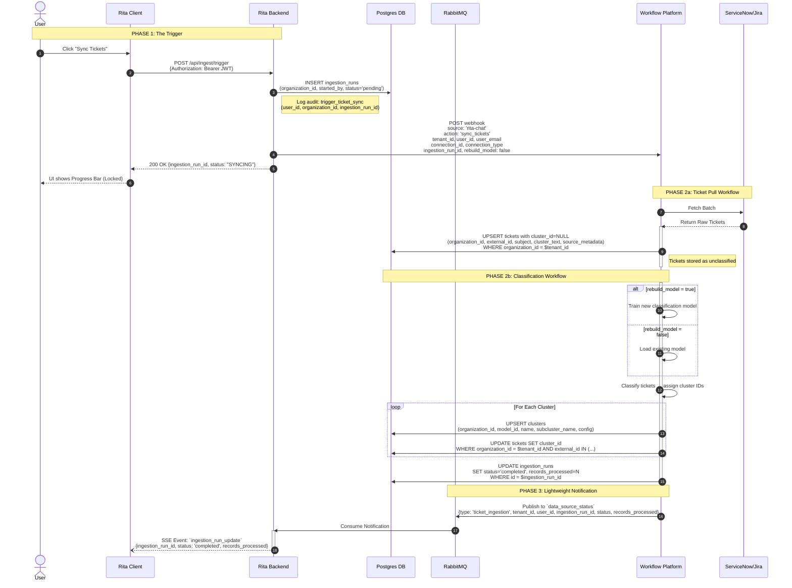
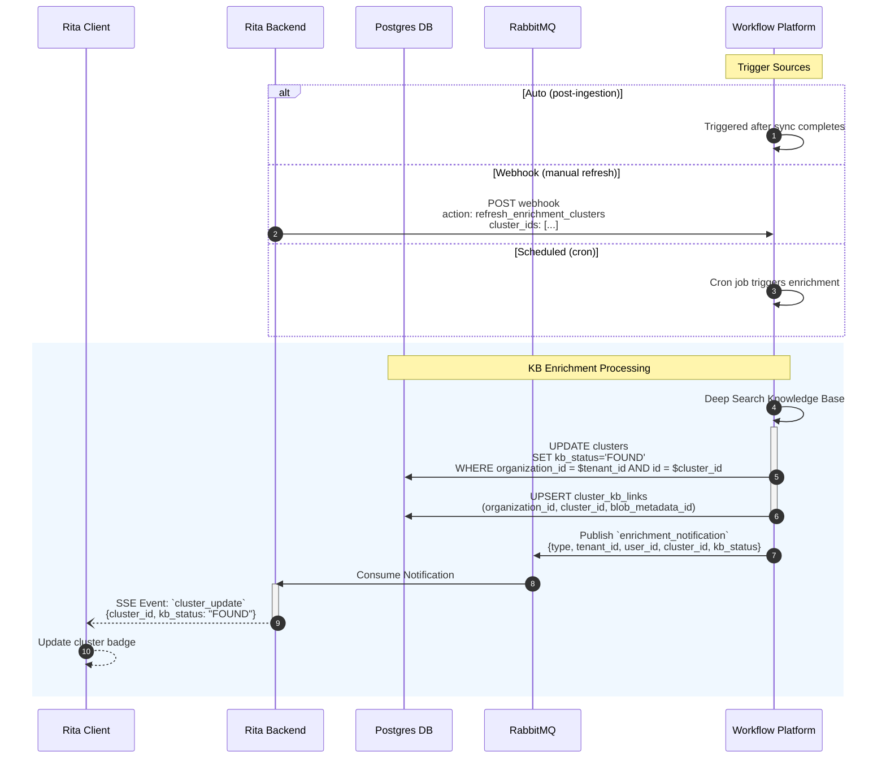
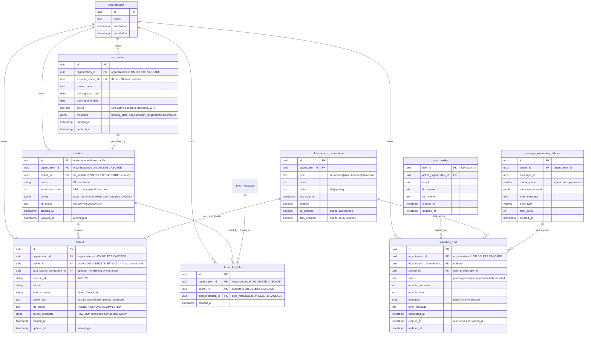

# Technical Design Document: RITA Autopilot & Cluster Dashboard

**Status:** Draft v1.18
**Date:** December 1, 2025
**Feature:** Continuous ITSM Ingestion, Live Dashboard, & Cluster Management

-----

## 1\. Executive Summary

This document outlines the architecture for the RITA Autopilot Dashboard. The system is designed to ingest high volumes of ITSM tickets, group them into AI-driven clusters, and present them in an interactive dashboard that allows IT Analysts to validate data and enable automation.

**Key Architectural Decisions:**

* **Workflow Platform Direct DB Access:** WF writes directly to PostgreSQL for autopilot tables (clusters, tickets, cluster_kb_links, ingestion_runs). Rita receives lightweight RabbitMQ notifications for SSE emission only.
* **Event-Driven Architecture:** Decouples the User Interface (Rita Client) from the heavy AI processing (Workflow Platform).
* **Command-Query Separation:** The App triggers actions, but the Workflow Platform acts as the "Source of Truth" for cluster definitions AND owns data writes.
* **Two-Speed UX:** "Core Data" (Tickets) loads immediately to unlock the UI, while "Enrichment" (Knowledge Base analysis) occurs asynchronously in the background.

### Implementation Prerequisites

Before implementing this feature, the following codebase changes are required:

1. **Add `jira` to `ALLOWED_DATA_SOURCE_TYPES`** in `packages/api-server/src/constants/dataSources.ts`
2. **Add `jira` to `DEFAULT_DATA_SOURCES`** array for org seeding
3. **Add system user constant** for auto-generated records (clusters created by Workflow Platform)

-----

## 2\. High-Level Architecture

### 2.1 The Flow

1.  **Command:** User triggers sync via **Rita Backend** (with `rebuild_model` flag).
2.  **Workflow 1 (Ticket Pull):** **WF** fetches tickets from ITSM → writes to DB with `cluster_id=NULL` (unclassified).
3.  **Workflow 2 (Classification):** **WF** classifies tickets using existing or new model (based on `rebuild_model` flag) → assigns `cluster_id`.
4.  **Write:** **WF** writes clusters, ticket assignments to PostgreSQL using `organization_id` filtering.
5.  **Notify:** **WF** publishes lightweight `ticket_ingestion` message to `data_source_status` queue.
6.  **SSE:** **Rita Backend** consumes notification → emits SSE event to client.
7.  **Query:** **Rita Client** reads from PostgreSQL and receives real-time updates via SSE.

### 2.2 Sequence Diagrams

#### 2.2.1 Sync Tickets Flow



#### 2.2.2 Enrichment Flow



### 2.3 ITSM Credential Setup

> **See:** [Credential Delegation Technical Design](../feat-credential-delegation/technical-design-credential-delegation.md) for the complete credential delegation flow, including magic link tokens, IT Admin verification, and security model.

**Summary:** RITA uses a secure delegation system to allow external IT admins to configure ITSM credentials without creating RITA accounts. Once credentials are verified, the `data_source_connections` table is updated and autopilot ticket sync becomes available.

### 2.4 Dual-Purpose Data Source Model

ServiceNow can serve two purposes:
- **Knowledge Base source** - sync KB articles (like Confluence)
- **ITSM source** - sync tickets for autopilot clustering

**Architecture Decision:** Same `data_source_connections` record per instance with capability flags:

```sql
ALTER TABLE data_source_connections
  ADD COLUMN kb_enabled BOOLEAN DEFAULT false,
  ADD COLUMN itsm_enabled BOOLEAN DEFAULT false;
```

**Connection examples:**
| Type | kb_enabled | itsm_enabled |
|------|------------|--------------|
| confluence | true | false |
| servicenow (KB only) | true | false |
| servicenow (ITSM only) | false | true |
| servicenow (both) | true | true |
| jira | false | true |

**Different Sync Tracking Mechanisms:**
| Aspect | KB Sync | ITSM Sync |
|--------|---------|-----------|
| Tracking table | `data_source_connections` | `ingestion_runs` |
| Status fields | `status`, `last_sync_status`, `last_sync_at` | `status`, `records_processed`, `records_failed` |
| Webhook action | `trigger_sync` | `sync_tickets` |
| History | Only last sync retained | Full run history |
| RabbitMQ queue | `data_source_status` | `data_source_status` (type: `ticket_ingestion`) |

**Table Selection via `latest_options`:**
After verification, Workflow Platform returns available options via RabbitMQ (same pattern as Confluence spaces):
```json
{
  "knowledge_base": [
    { "title": "Engineering", "sys_id": "kb_eng_001" },
    { "title": "IT Support", "sys_id": "kb_it_002" }
  ],
  "itsm_tables": ["incident", "problem", "change_request"]
}
```

UI shows MultiSelect for each section based on capability flags. KB selector displays titles, stores full objects with sys_id.

-----

## 3\. Data Architecture (PostgreSQL)

### 3.1 Entity Relationship Diagram (ERD)



-----

## 4\. Interface Contracts

### 4.1 Webhook Payloads

> **Credential Delegation Webhooks:** See [Credential Delegation Technical Design](../feat-credential-delegation/technical-design-credential-delegation.md) for `send_delegation_email` and `verify_credentials` webhook payloads.

#### Sync Tickets Webhook (Autopilot)

**Webhook:** Workflow Platform
**Action:** `sync_tickets`
**Purpose:** Trigger ITSM ticket sync for autopilot clustering

```json
{
  "source": "rita-chat",
  "action": "sync_tickets",
  "tenant_id": "org-uuid-123",
  "user_id": "user-uuid-456",
  "user_email": "analyst@company.com",
  "ingestion_run_id": "run-uuid-789",
  "connection_id": "conn-uuid-abc",
  "connection_type": "servicenow",
  "rebuild_model": false,
  "settings": {
    "instance_url": "https://company.service-now.com",
    "tables": ["incident", "kb_knowledge"],
    "filters": {
      "state": "open",
      "priority": ["1", "2", "3"]
    }
  },
  "timestamp": "2025-11-24T10:00:00Z"
}
```

**Connection Types:**
- `servicenow` - Tables: incident, problem, change_request, kb_knowledge
- `jira` - Projects from latest_options
- `confluence` - Spaces from latest_options (if KB-only sync)

**Comparison with Data Source Sync:**
- Same `source: "rita-chat"` and `connection_type` pattern
- Different `action: "sync_tickets"` (vs `"trigger_sync"` for data sources)
- Includes `ingestion_run_id` for autopilot tracking
- Workflow Platform uses `connection_type` to determine ITSM-specific behavior

**rebuild_model Flag:**
- `false` (default): Use existing trained classification model
- `true`: Retrain/create new classification model before assigning clusters

**Workflow Platform Processing (2-Workflow Architecture):**

*Workflow 1: Ticket Pull*
1. Looks up credentials using composite key: `(tenant_id, connection_id, connection_type)`
2. Fetches tickets from ITSM system
3. Writes tickets to DB with `cluster_id = NULL` (unclassified)
4. Triggers Workflow 2

*Workflow 2: Classification*
1. If `rebuild_model=true`: Train new classification model
2. If `rebuild_model=false`: Load existing model
3. Classify tickets → assign `cluster_id`
4. Write cluster assignments to DB
5. Publishes `ticket_ingestion` to `data_source_status` queue

**Response:** HTTP 200 (synchronous acknowledgment)
**Result:** Arrives asynchronously via RabbitMQ `data_source_status` queue (type: `ticket_ingestion`)

---

#### Refresh Enrichment Webhook (Autopilot)

**Webhook:** Workflow Platform
**Action:** `refresh_enrichment_clusters`
**Purpose:** Trigger KB enrichment refresh for specific clusters or all clusters

```json
{
  "source": "rita-chat",
  "action": "refresh_enrichment_clusters",
  "tenant_id": "org-uuid-123",
  "user_id": "user-uuid-456",
  "cluster_ids": ["cluster-uuid-1", "cluster-uuid-2"],
  "timestamp": "2025-12-01T10:00:00Z"
}
```

**cluster_ids:**
- Array of cluster UUIDs to refresh
- Empty array `[]` = refresh all clusters for tenant

**Trigger Sources:**
- Manual user action (UI button)
- Scheduled cron job
- Post-ingestion automatic trigger

**Response:** HTTP 200 (synchronous acknowledgment)
**Result:** Arrives asynchronously via RabbitMQ `enrichment_notification` queue

---

### 4.2 RabbitMQ Payloads

> **Architecture Note:** RabbitMQ messages are lightweight notifications for SSE emission. WF writes data directly to PostgreSQL, then publishes notification.

**Queue:** `data_source_status` (Phase 3b)
*Purpose: Lightweight notification after WF completes direct DB writes. Rita consumer emits SSE only.*

```json
{
  "type": "ticket_ingestion",
  "tenant_id": "org-uuid-123",
  "user_id": "user-uuid-456",
  "ingestion_run_id": "run-uuid-789",
  "status": "completed",
  "records_processed": 150,
  "records_failed": 2,
  "timestamp": "2025-11-26T10:00:00Z"
}
```

**Rita Consumer Action:** Emit SSE `ingestion_run_update` event to user.

---

**Queue:** `cluster_notification` (Phase 3b - optional per-cluster updates)
*Purpose: Notify when individual cluster created/updated. Rita consumer emits SSE only.*

```json
{
  "type": "cluster_created",
  "tenant_id": "org-uuid-123",
  "user_id": "user-uuid-456",
  "cluster_id": "cluster-uuid-555",
  "action": "created",
  "timestamp": "2025-11-26T10:00:00Z"
}
```

**Rita Consumer Action:** Emit SSE `cluster_update` event.

---

**Queue:** `enrichment_notification` (Phase 4)
*Purpose: Notify when KB enrichment completes. Rita consumer emits SSE only.*

```json
{
  "type": "enrichment_completed",
  "tenant_id": "org-uuid-123",
  "user_id": "user-uuid-456",
  "cluster_id": "cluster-uuid-555",
  "kb_status": "FOUND",
  "articles_count": 3,
  "timestamp": "2025-11-26T10:00:00Z"
}
```

**Rita Consumer Action:** Emit SSE `cluster_update` event with `kb_status`.

---

**Error Handling:**
- Consumer failures logged to `message_processing_failures` table
- `queue_name` = `data_source_status`, `cluster_notification`, or `enrichment_notification`
- Notifications are idempotent - re-processing just re-emits SSE
- Retry logic: max 3 attempts with exponential backoff

**Queue:** `data_source_status` (Credential Verification)

> **See:** [Credential Delegation Technical Design](../feat-credential-delegation/technical-design-credential-delegation.md) for `data_source_status` queue payloads and consumer processing logic.

*This queue is shared between credential verification (delegation flow) and direct data source verification (Confluence).*

### 4.2 Frontend API Endpoints

**Authentication & Authorization:**
- All endpoints require Keycloak JWT token in Authorization header
- User's `active_organization_id` from `user_profiles` determines organization context
- All queries filtered by `organization_id` via Row-Level Security (RLS)

#### Dashboard View

* **`GET /api/dashboard/stats?range=30d`**
    * Aggregates metrics from tickets/clusters for user's active organization
    * Returns: `{ total_tickets, automated_count, clusters_total, avg_automation_rate }`
    * Query: `WHERE organization_id = current_user.active_organization_id`

* **`GET /api/dashboard/clusters?range=30d&sort=volume`**
    * Returns cluster list for user's active organization with metrics
    * Supports sorting: `volume` (ticket count), `automation` (auto_respond rate), `recent` (created_at)
    * Query: `WHERE organization_id = current_user.active_organization_id AND created_at >= NOW() - range`

#### Cluster Detail View

* **`GET /api/clusters/:id/details`**
    * Returns cluster metadata for user's active organization
    * Response: `{ id, name, config, kb_status, trend_data[], created_by, updated_by }`
    * Query: `WHERE id = :id AND organization_id = current_user.active_organization_id`

* **`GET /api/clusters/:id/tickets`**
    * Returns paginated tickets for cluster in user's active organization
    * Supports tabs: `?tab=needs_response|completed|validation_pending`
    * Pagination: cursor-based using `created_at` field
    * Query: `WHERE cluster_id = :id AND organization_id = current_user.active_organization_id AND rita_status = :tab`

* **`GET /api/clusters/:id/knowledge`**
    * Returns linked knowledge articles for cluster
    * Query: `WHERE cluster_id = :id AND organization_id = current_user.active_organization_id AND status = 'active'`
    * Response includes: `{ id, title, url, created_by, created_at }`

#### Actions (Mutation Endpoints)

* **`PATCH /api/clusters/:id/config`**
    * Payload: `{ "auto_respond": true, "auto_populate": false }`
    * Authorization: Requires `admin` or `owner` role in organization
    * Action: Updates `clusters.config`, sets `updated_by = current_user.user_id`, `updated_at = NOW()`
    * Triggers: Webhook to Workflow Platform with config change
    * Audit: Logs to `audit_logs` table with action `enable_cluster_automation` or `update_cluster_config`

* **`POST /api/data-sources/:id/sync-tickets`**
    * Payload: `{ "time_range_days": 30 }` (optional settings for ITSM sync)
    * Authorization: Requires `admin` or `owner` role
    * Action: Creates `ingestion_runs` record with `started_by = current_user.user_id`, status = `pending`
    * Webhook Call: `DataSourceWebhookService.sendSyncTicketsEvent()`
        - source: `'rita-chat'` (same as data source sync)
        - action: `'sync_tickets'` (distinguishes autopilot from regular data source sync)
        - connection_type: Determined by data_source_connections.type (servicenow, jira)
        - Includes: tenant_id, user_id, user_email, connection_id, ingestion_run_id, settings
        - Credentials NOT sent (Workflow Platform looks them up using composite key)
        - Result arrives async via RabbitMQ `data_source_status` queue (type: `ticket_ingestion`)
        - Failures logged to `rag_webhook_failures` table
        - Retry: 3 attempts with exponential backoff
    * Updates: `data_source_connections.status = 'syncing'`
    * Audit: Logs to `audit_logs` with action `trigger_ticket_sync`
    * Returns: `202 { ingestion_run_id, status: "SYNCING" }`
    * Note: Follows same route pattern as `/api/data-sources/:id/sync` (KB sync)

#### Credential Delegation Endpoints

> **See:** [Credential Delegation Technical Design](../feat-credential-delegation/technical-design-credential-delegation.md) for all `/api/credential-delegations/*` endpoints.

-----

## 5\. Implementation Strategy

### 5.1 Backend Worker Logic (Node.js)

**Service:** Within `dataSourceWebhooks.ts` routes (follows existing pattern)

**Sync Tickets Logic (`POST /api/data-sources/:id/sync-tickets`):**
1. Validate user has admin/owner role
2. Get user's active_organization_id from JWT
3. Get data_source_connection by `:id` param
4. Validate connection has `itsm_enabled = true`
5. Create ingestion_run record:
   ```sql
   INSERT INTO ingestion_runs (
     organization_id, started_by, status, data_source_connection_id
   ) VALUES ($1, $2, 'pending', $3)
   RETURNING id;
   ```
5. Update data_source_connections status:
   ```sql
   UPDATE data_source_connections
   SET status = 'syncing', last_sync_at = NOW()
   WHERE id = $1;
   ```
6. Send webhook to Workflow Platform:
   ```typescript
   await webhookService.sendGenericEvent({
     organizationId: user.active_organization_id,
     userId: user.user_id,
     userEmail: user.email,
     source: 'rita-chat',
     action: 'sync_tickets',
     additionalData: {
       ingestion_run_id: run.id,
       connection_id: connection.id,
       connection_type: connection.type, // servicenow, jira, confluence
       settings: connection.latest_options || {}
     }
   });
   ```
7. Return 202 Accepted response immediately

---

**Consumer:** `DataSourceStatusConsumer.ts` (packages/api-server/src/consumers/)

Handles all data source status messages via discriminator pattern (`type` field):
- `sync` → KB sync status
- `verification` → credential verification
- `ticket_ingestion` → ITSM ticket sync (autopilot)

1.  **Message Processing:**
    * Consume from `data_source_status` queue
    * Discriminate by `type` field: `sync`, `verification`, `ticket_ingestion`
    * Extract `tenant_id`, `user_id`, and event details from payload

2.  **SSE Emission (ticket_ingestion):**
    * `ticket_ingestion` → `ingestion_run_update` SSE event
    * Emit to organization via `sseService.sendToOrganization(tenant_id, event)`

3.  **Error Handling:**
    * Consumer failures logged to `message_processing_failures` table
    * Notifications are idempotent - re-processing just re-emits SSE (safe)
    * ACK on success, NACK without requeue on repeated failures
    * Max 3 retry attempts

4.  **Example Implementation:**
    ```typescript
    // DataSourceStatusConsumer.ts - processTicketIngestionStatus()
    async processTicketIngestionStatus(message: IngestionStatusMessage): Promise<void> {
      const { tenant_id, ingestion_run_id, status, records_processed } = message;

      await this.sseService.sendToOrganization(tenant_id, {
        type: 'ingestion_run_update',
        data: {
          ingestion_run_id,
          status,
          records_processed,
          timestamp: new Date().toISOString()
        }
      });

      this.logger.info('SSE emitted for ticket ingestion', { ingestion_run_id, status });
    }
    ```

---

**Workflow Platform Responsibilities (Direct DB Access):**

WF now owns all autopilot data writes. Key patterns:

1.  **Multi-Tenancy (Direct org_id filter):**
    * Include `organization_id` in all WHERE/INSERT clauses
    * Do NOT use `SET LOCAL app.current_organization_id` (RLS optional for WF)
    * Example: `WHERE organization_id = $tenant_id`

2.  **Idempotency Pattern (WF implements):**
    * **Clusters:** `INSERT ... ON CONFLICT (organization_id, model_id, name, COALESCE(subcluster_name, '')) DO UPDATE SET kb_status = EXCLUDED.kb_status, config = EXCLUDED.config, updated_at = NOW()`
    * **Tickets:** `INSERT ... ON CONFLICT (organization_id, external_id) DO UPDATE SET cluster_id = EXCLUDED.cluster_id, external_status = EXCLUDED.external_status, updated_at = NOW()`
    * Conflict targets use unique constraints/indexes

3.  **Transaction Scope:**
    * Process entire batch in single Postgres transaction
    * COMMIT only after all clusters, tickets, and ingestion_runs updated
    * ROLLBACK on critical failures

4.  **Ingestion Run Tracking (WF updates):**
    ```sql
    UPDATE ingestion_runs
    SET status = 'completed', records_processed = $2, completed_at = NOW()
    WHERE id = $1 AND organization_id = $tenant_id;
    ```

5.  **After DB Commit - Publish Notification:**
    * Only publish to RabbitMQ AFTER transaction commits successfully
    * Notification contains minimal data for SSE (no full payloads)

**Consumer:** `DataSourceStatusConsumer.ts`

> **See:** [Credential Delegation Technical Design](../feat-credential-delegation/technical-design-credential-delegation.md) for `DataSourceStatusConsumer` verification processing logic.

*This consumer is reused for both Confluence verification AND delegated ITSM setup.*

### 5.2 Frontend State (React)

1.  **Optimistic UI:** When User clicks "Validate" on a ticket, update the UI immediately. Revert if the API call fails.
2.  **SSE Handling (RITA Owner - Authenticated):**

    **Event Naming Convention:** Follow existing pattern `{resource}_{action}` (e.g., `data_source_update`)

    | Event Type | Payload | Handler |
    |------------|---------|---------|
    | `ingestion_run_update` | `{ingestion_run_id, status, records_processed}` | Refetch dashboard on `status='completed'` |
    | `cluster_update` | `{cluster_id, kb_status, updated_fields[]}` | Update cluster in TanStack Query cache |
    | `ticket_update` | `{ticket_id, cluster_id, rita_status}` | Update ticket status |
    | `data_source_update` | `{connection_id, connection_type, status}` | Existing event - reused for credential verification |

    **Note:** Reuses existing `data_source_update` event type for credential verification (matches current Confluence pattern).

3.  **Status Polling (IT Admin - Public Page):**

    > **See:** [Credential Delegation Technical Design](../feat-credential-delegation/technical-design-credential-delegation.md) for IT Admin polling implementation.

### 5.3 Audit Integration

**Audit Logging Pattern:** All sensitive operations logged to `audit_logs` table for SOC2 Type II compliance

**Logged Actions:**

1. **`trigger_ticket_sync`** (POST /api/ingest/trigger)
   ```typescript
   await auditLog({
     organization_id: user.active_organization_id,
     user_id: user.user_id,
     action: 'trigger_ticket_sync',
     resource_type: 'ingestion_run',
     resource_id: ingestionRun.id,
     metadata: { data_source_connection_id, batch_id }
   });
   ```

2. **`enable_cluster_automation`** (PATCH /api/clusters/:id/config - when auto_respond enabled)
   ```typescript
   await auditLog({
     organization_id: cluster.organization_id,
     user_id: user.user_id,
     action: 'enable_cluster_automation',
     resource_type: 'cluster',
     resource_id: cluster.id,
     metadata: {
       config_before: cluster.config,
       config_after: newConfig,
       automation_enabled_fields: ['auto_respond', 'auto_populate']
     }
   });
   ```

3. **`update_cluster_config`** (PATCH /api/clusters/:id/config - other config changes)
   ```typescript
   await auditLog({
     organization_id: cluster.organization_id,
     user_id: user.user_id,
     action: 'update_cluster_config',
     resource_type: 'cluster',
     resource_id: cluster.id,
     metadata: { config_changes: diff(oldConfig, newConfig) }
   });
   ```

**Audit Query Endpoints:**
* `GET /api/audit/logs?resource_type=cluster&resource_id=:id` - View cluster change history
* `GET /api/audit/logs?action=enable_cluster_automation` - Track automation enablement across organization

### 5.4 Sync Two-Way Logic

* **Incoming (WF Direct Write):** ITSM → Workflow Platform → PostgreSQL (direct) → RabbitMQ notification → Rita Backend → SSE
  * Workflow Platform is source of truth for cluster definitions and ticket assignments
  * **WF writes directly to PostgreSQL** with `organization_id` in all queries
  * Rita Backend receives lightweight notification and emits SSE
  * No mutations sent back to Workflow Platform during ingestion

* **Outgoing (Commands):** Rita Backend → Webhook → Workflow Platform
  * User actions trigger configuration commands
  * Examples: Enable auto-respond, update validation target, link knowledge article
  * Workflow Platform executes commands, writes to DB, and publishes notification

## 6\. Security & Performance

### 6.1 Multi-Tenancy & Data Isolation

**Architecture Pattern:** All tables follow Rita's established multi-tenancy model documented in `docs/database-tables.md`

#### Data Isolation by Component

| Component | Isolation Method | Notes |
|-----------|-----------------|-------|
| Rita Backend | RLS via `SET LOCAL app.current_organization_id` | Standard pattern for API requests |
| Workflow Platform | Direct `organization_id` filter in queries | Requires superuser/table owner role (bypasses RLS) or dedicated role with BYPASSRLS privilege |
| Rita Consumers | SSE only | Notification consumers emit SSE events |

#### Row-Level Security (RLS) Policies

All autopilot tables have RLS policies enabled. Rita Backend uses these; Workflow Platform uses direct filtering:

```sql
-- Enable RLS on all autopilot tables
ALTER TABLE clusters ENABLE ROW LEVEL SECURITY;
ALTER TABLE tickets ENABLE ROW LEVEL SECURITY;
ALTER TABLE cluster_kb_links ENABLE ROW LEVEL SECURITY;
ALTER TABLE ingestion_runs ENABLE ROW LEVEL SECURITY;

-- Policy pattern for all tables
CREATE POLICY "users_access_own_organization_clusters" ON clusters
  FOR ALL
  USING (organization_id = current_setting('app.current_organization_id', true)::uuid);

CREATE POLICY "users_access_own_organization_tickets" ON tickets
  FOR ALL
  USING (organization_id = current_setting('app.current_organization_id', true)::uuid);

CREATE POLICY "users_access_own_organization_kb_links" ON cluster_kb_links
  FOR ALL
  USING (organization_id = current_setting('app.current_organization_id', true)::uuid);

CREATE POLICY "users_access_own_organization_ingestion_runs" ON ingestion_runs
  FOR ALL
  USING (organization_id = current_setting('app.current_organization_id', true)::uuid);
```

**RLS Activation:** Backend sets session variable on each request:
```typescript
// middleware/auth.ts
await db.query(
  'SET LOCAL app.current_organization_id = $1',
  [user.active_organization_id]
);
```

#### User Tracking Pattern

All mutable tables track user actions following Rita's audit pattern:

* **Creation:** `created_by` UUID → `user_profiles.user_id` (Keycloak user ID)
* **Modification:** `updated_by` UUID → `user_profiles.user_id` (updates on every change)
* **Timestamps:** `created_at`, `updated_at` (auto-updated via trigger `set_timestamp`)
* **Specific Actions:** `started_by` (domain-specific tracking)

**Auto-Update Trigger Pattern:**
```sql
-- Trigger function (shared across tables)
CREATE OR REPLACE FUNCTION update_updated_at_column()
RETURNS TRIGGER AS $$
BEGIN
  NEW.updated_at = NOW();
  RETURN NEW;
END;
$$ LANGUAGE plpgsql;

-- Apply to each mutable table
CREATE TRIGGER set_timestamp
BEFORE UPDATE ON clusters
FOR EACH ROW
EXECUTE FUNCTION update_updated_at_column();
```

#### Keycloak Integration

* **User Identification:** All `user_id` fields reference Keycloak's auth.users(id) UUID
* **JWT Validation:** API endpoints verify Keycloak JWT token in Authorization header
* **Organization Context:** User's `active_organization_id` from `user_profiles` table determines context
* **Role-Based Access:** Mutation endpoints check `organization_members.role` (owner/admin/member)

### 6.2 SOC2 Type II Compliance

#### Audit Trail Requirements

**Logged Actions (via `audit_logs` table):**
* `trigger_ticket_sync` - User initiates ITSM sync
* `enable_cluster_automation` - User enables auto-respond/auto-populate
* `update_cluster_config` - User modifies cluster settings
* `validate_ticket` - User approves/rejects validation sample (optional, high volume)

**Audit Log Retention:** Minimum 1 year for compliance

**Audit Log Fields:**
```typescript
interface AuditLog {
  id: uuid;
  organization_id: uuid;  // Multi-tenant isolation
  user_id: uuid;          // Who performed action
  action: string;         // Standardized action name
  resource_type: string;  // 'cluster', 'ticket', 'ingestion_run'
  resource_id: uuid;      // Which resource was affected
  metadata: jsonb;        // Context (config changes, validation results, etc.)
  created_at: timestamp;  // When action occurred
}
```

#### Security Controls

* **Authentication:** All endpoints require valid Keycloak JWT
* **Authorization:** Role-based checks for sensitive operations (admin/owner for automation, member for validation)
* **Data Isolation:** RLS enforces database-level tenant separation
* **Audit Logging:** Immutable audit trail for all configuration changes
* **Webhook Signing:** HMAC signatures validate Workflow Platform webhooks
* **Credential Security:** Data source credentials never stored in Rita database (sent to Workflow Platform per-request)

### 6.3 Performance Optimization

#### Database Indexing

> **Note:** Indexes marked with `-- FUTURE` are recommended optimizations not yet in migration 138. Add based on query patterns observed in production.

**clusters table:**
```sql
CREATE INDEX idx_clusters_organization_id ON clusters(organization_id);
CREATE INDEX idx_clusters_kb_status ON clusters(kb_status);
CREATE INDEX idx_clusters_created_at ON clusters(created_at DESC);
CREATE INDEX idx_clusters_config ON clusters USING GIN (config);  -- FUTURE
```

**tickets table:**
```sql
CREATE INDEX idx_tickets_organization_id ON tickets(organization_id);
CREATE INDEX idx_tickets_cluster_id ON tickets(cluster_id);
CREATE INDEX idx_tickets_rita_status ON tickets(rita_status);
CREATE INDEX idx_tickets_data_source ON tickets(data_source_connection_id);  -- FUTURE
CREATE INDEX idx_tickets_created_at ON tickets(created_at DESC);
CREATE INDEX idx_tickets_source_metadata ON tickets USING GIN (source_metadata);  -- FUTURE
```

**cluster_kb_links table:**
```sql
CREATE INDEX idx_cluster_kb_links_cluster_id ON cluster_kb_links(cluster_id);
CREATE INDEX idx_cluster_kb_links_blob_metadata_id ON cluster_kb_links(blob_metadata_id);
CREATE INDEX idx_cluster_kb_links_organization_id ON cluster_kb_links(organization_id);
```

**ingestion_runs table:**
```sql
CREATE INDEX idx_ingestion_runs_organization_id ON ingestion_runs(organization_id);
CREATE INDEX idx_ingestion_runs_data_source ON ingestion_runs(data_source_connection_id);  -- FUTURE
CREATE INDEX idx_ingestion_runs_status ON ingestion_runs(status);
CREATE INDEX idx_ingestion_runs_created_at ON ingestion_runs(created_at DESC);
```

#### Query Optimization Patterns

* **Cursor-Based Pagination:** Ticket lists use `created_at` cursor to avoid OFFSET performance penalties
* **Partial Indexes:** Consider `WHERE status = 'active'` on frequently filtered columns
* **JSONB GIN Indexes:** Enable fast queries on `config`, `source_metadata` JSONB fields

#### Real-Time Updates (SSE)

* **Debouncing:** SSE emitter debounces events (max 1 per second) during bulk imports
* **Event Types:**
  * `sync_completed` - Triggers grid refetch
  * `cluster_updated` - Updates single cluster in cache (TanStack Query)
* **Connection Management:** EventSource auto-reconnects on disconnect
* **Ephemeral Delivery:** Events fire-and-forget (future: persist critical events for replay)

#### Webhook Security

* **HMAC Signing:** All Rita Backend ↔ Workflow Platform webhooks signed with shared secret
* **Signature Verification:** Reject unsigned or invalid signatures
* **Replay Protection:** Include timestamp in signature, reject old requests (>5 min)
* **Rate Limiting:** Enforce webhook rate limits to prevent abuse

-----

## 7\. Database Migration Reference

### 7.1 Migration File

**Location:** `packages/api-server/src/database/migrations/138_add_autopilot_tables.sql`

### 7.2 Table Creation Scripts

#### ml_models Table

```sql
-- ML classification models (populated by WF from ML team endpoints)
CREATE TABLE ml_models (
    id UUID PRIMARY KEY DEFAULT gen_random_uuid(),
    organization_id UUID NOT NULL REFERENCES organizations(id) ON DELETE CASCADE,
    external_model_id TEXT NOT NULL,  -- ID from ML team system
    model_name TEXT NOT NULL,
    training_start_date DATE,
    training_end_date DATE,
    active BOOLEAN NOT NULL DEFAULT false,  -- One active per org (enforced by WF)
    metadata JSONB DEFAULT '{}'::jsonb,  -- Flexible field for future ML properties
    created_at TIMESTAMP WITH TIME ZONE DEFAULT NOW(),
    updated_at TIMESTAMP WITH TIME ZONE DEFAULT NOW(),
    UNIQUE (organization_id, external_model_id)
);

-- Indexes
CREATE INDEX idx_ml_models_organization_id ON ml_models(organization_id);
CREATE INDEX idx_ml_models_external_model_id ON ml_models(external_model_id);
CREATE INDEX idx_ml_models_active ON ml_models(organization_id, active) WHERE active = true;

-- Row-Level Security
ALTER TABLE ml_models ENABLE ROW LEVEL SECURITY;

CREATE POLICY "users_access_own_organization_ml_models" ON ml_models
    FOR ALL
    USING (organization_id = current_setting('app.current_organization_id', true)::uuid);

-- Auto-update trigger
CREATE TRIGGER set_ml_models_updated_at
BEFORE UPDATE ON ml_models
FOR EACH ROW
EXECUTE FUNCTION update_updated_at_column();

-- Comments
COMMENT ON TABLE ml_models IS 'ML classification models (populated by WF from ML team endpoints)';
COMMENT ON COLUMN ml_models.external_model_id IS 'Model ID from ML team system (used in API calls)';
COMMENT ON COLUMN ml_models.active IS 'Whether this is the active model for the org (one per org, enforced by WF)';
COMMENT ON COLUMN ml_models.metadata IS 'JSONB with training_state and other ML properties';
```

##### ml_models.metadata Schema

The `metadata` JSONB column stores ML-specific properties set by Workflow Platform:

```typescript
interface MlModelMetadata {
  /** Training state set by Workflow Platform during model training */
  training_state?: 'not_started' | 'in_progress' | 'failed' | 'complete';
  // Future: additional ML properties
}
```

**Training State Values:**
| Value | Description | Frontend Behavior |
|-------|-------------|-------------------|
| `not_started` | Model created but training hasn't begun | Show empty state |
| `in_progress` | Workflow Platform is training the model | Show skeleton UI + poll every 10s |
| `failed` | Training failed (check logs) | Show empty state |
| `complete` | Training finished, clusters available | Fetch and display clusters |

**API Endpoint:** `GET /api/ml-models/active` returns the active model with metadata for the organization.

#### clusters Table

```sql
-- Main autopilot clusters table (system-generated by Workflow Platform)
CREATE TABLE clusters (
    id UUID PRIMARY KEY DEFAULT gen_random_uuid(),  -- Internal auto-generated ID
    organization_id UUID NOT NULL REFERENCES organizations(id) ON DELETE CASCADE,
    model_id UUID NOT NULL REFERENCES ml_models(id) ON DELETE CASCADE,  -- ML model that generated this cluster (required)
    name TEXT NOT NULL,  -- Cluster name (can repeat across rows with different subclusters)
    subcluster_name TEXT,  -- Subcluster name (NULL = top-level cluster only)
    config JSONB DEFAULT '{}'::jsonb,
    kb_status TEXT DEFAULT 'PENDING' CHECK (kb_status IN ('PENDING', 'FOUND', 'GAP')),

    -- Timestamps
    created_at TIMESTAMP WITH TIME ZONE DEFAULT NOW(),
    updated_at TIMESTAMP WITH TIME ZONE DEFAULT NOW()
);

-- Indexes
CREATE INDEX idx_clusters_organization_id ON clusters(organization_id);
CREATE INDEX idx_clusters_model_id ON clusters(model_id);
CREATE INDEX idx_clusters_kb_status ON clusters(kb_status);
CREATE INDEX idx_clusters_created_at ON clusters(created_at DESC);

-- Natural key constraint for idempotent upserts (COALESCE handles NULL subcluster_name)
CREATE UNIQUE INDEX uq_clusters_org_model_name_subcluster
    ON clusters (organization_id, model_id, name, COALESCE(subcluster_name, ''));

-- Row-Level Security
ALTER TABLE clusters ENABLE ROW LEVEL SECURITY;

CREATE POLICY "users_access_own_organization_clusters" ON clusters
    FOR ALL
    USING (organization_id = current_setting('app.current_organization_id', true)::uuid);

-- Auto-update trigger
CREATE TRIGGER set_timestamp
BEFORE UPDATE ON clusters
FOR EACH ROW
EXECUTE FUNCTION update_updated_at_column();

-- Comments
COMMENT ON TABLE clusters IS 'AI-generated ticket clusters from Workflow Platform (system-generated)';
COMMENT ON COLUMN clusters.id IS 'Internal auto-generated UUID for internal references';
COMMENT ON COLUMN clusters.model_id IS 'ML model that generated this cluster (required)';
COMMENT ON COLUMN clusters.subcluster_name IS 'Subcluster name (NULL = top-level cluster only)';
COMMENT ON COLUMN clusters.config IS 'JSONB config: {auto_respond: boolean, auto_populate: boolean}';
COMMENT ON INDEX uq_clusters_org_model_name_subcluster IS 'Natural key for idempotent upsert by WF';
```

#### tickets Table

```sql
-- Tickets from ITSM (NULL cluster_id = unclassified)
CREATE TABLE tickets (
    id UUID PRIMARY KEY DEFAULT gen_random_uuid(),
    organization_id UUID NOT NULL REFERENCES organizations(id) ON DELETE CASCADE,
    cluster_id UUID REFERENCES clusters(id) ON DELETE SET NULL,  -- NULL = unclassified
    data_source_connection_id UUID REFERENCES data_source_connections(id) ON DELETE SET NULL,

    -- Ticket details
    external_id TEXT NOT NULL,
    subject TEXT NOT NULL,
    external_status TEXT NOT NULL,
    cluster_text TEXT,  -- Text for classification (set by ingestion workflow)
    rita_status TEXT DEFAULT 'NEEDS_RESPONSE' CHECK (rita_status IN ('NEEDS_RESPONSE', 'COMPLETED')),

    -- Source metadata
    source_metadata JSONB DEFAULT '{}'::jsonb,

    -- Timestamps
    created_at TIMESTAMP WITH TIME ZONE DEFAULT NOW(),
    updated_at TIMESTAMP WITH TIME ZONE DEFAULT NOW(),

    -- Constraints
    CONSTRAINT uq_tickets_external_id_org UNIQUE (organization_id, external_id)
);

-- Indexes
CREATE INDEX idx_tickets_organization_id ON tickets(organization_id);
CREATE INDEX idx_tickets_cluster_id ON tickets(cluster_id);
CREATE INDEX idx_tickets_rita_status ON tickets(rita_status);
CREATE INDEX idx_tickets_data_source ON tickets(data_source_connection_id);  -- FUTURE
CREATE INDEX idx_tickets_created_at ON tickets(created_at DESC);
CREATE INDEX idx_tickets_source_metadata ON tickets USING GIN (source_metadata);  -- FUTURE

-- Row-Level Security
ALTER TABLE tickets ENABLE ROW LEVEL SECURITY;

CREATE POLICY "users_access_own_organization_tickets" ON tickets
    FOR ALL
    USING (organization_id = current_setting('app.current_organization_id', true)::uuid);

-- Auto-update trigger
CREATE TRIGGER set_timestamp
BEFORE UPDATE ON tickets
FOR EACH ROW
EXECUTE FUNCTION update_updated_at_column();

-- Comments
COMMENT ON TABLE tickets IS 'ITSM tickets from Workflow Platform (NULL cluster_id = unclassified)';
COMMENT ON COLUMN tickets.cluster_id IS 'NULL until classification workflow assigns cluster';
COMMENT ON COLUMN tickets.cluster_text IS 'Text for classification (set by ingestion, used by classification workflow)';
COMMENT ON COLUMN tickets.external_id IS 'ITSM ticket ID (e.g., INC-123 from ServiceNow)';
COMMENT ON COLUMN tickets.rita_status IS 'Rita-specific status for workflow tracking';
COMMENT ON COLUMN tickets.data_source_connection_id IS 'Optional FK for filtering tickets by connection (NULL if from WP independent connections)';
COMMENT ON COLUMN tickets.source_metadata IS 'Raw ITSM properties from source system for debugging/display';
```

#### cluster_kb_links Table

```sql
-- Junction table linking clusters to KB articles in blob_metadata
CREATE TABLE cluster_kb_links (
    id UUID PRIMARY KEY DEFAULT gen_random_uuid(),
    organization_id UUID NOT NULL REFERENCES organizations(id) ON DELETE CASCADE,
    cluster_id UUID NOT NULL REFERENCES clusters(id) ON DELETE CASCADE,
    blob_metadata_id UUID NOT NULL REFERENCES blob_metadata(id) ON DELETE CASCADE,
    created_at TIMESTAMP WITH TIME ZONE DEFAULT NOW(),
    UNIQUE (cluster_id, blob_metadata_id)
);

-- Indexes
CREATE INDEX idx_cluster_kb_links_cluster_id ON cluster_kb_links(cluster_id);
CREATE INDEX idx_cluster_kb_links_blob_metadata_id ON cluster_kb_links(blob_metadata_id);
CREATE INDEX idx_cluster_kb_links_organization_id ON cluster_kb_links(organization_id);

-- Row-Level Security
ALTER TABLE cluster_kb_links ENABLE ROW LEVEL SECURITY;

CREATE POLICY "users_access_own_organization_kb_links" ON cluster_kb_links
    FOR ALL
    USING (organization_id = current_setting('app.current_organization_id', true)::uuid);

-- Comments
COMMENT ON TABLE cluster_kb_links IS 'Links clusters to KB articles in blob_metadata';
```

#### ingestion_runs Table

**Why This Table Exists (vs `data_source_connections.status`)**

| Aspect | `data_source_connections` | `ingestion_runs` |
|--------|---------------------------|------------------|
| **Purpose** | Connection config state | Individual sync operation |
| **Cardinality** | 1 per org+type | Many per connection |
| **Status values** | `idle`, `syncing` | `pending`, `running`, `completed`, `failed`, `cancelled` |
| **Tracks** | "Is something syncing now?" | "What happened in this specific sync?" |
| **History** | Only `last_sync_status` | Full record per sync |
| **Counters** | None | `records_processed`, `records_failed` |
| **Error detail** | None | `error_message` TEXT |

**Relationship:**
```
data_source_connections (1) ←──── (N) ingestion_runs
         ↓                              ↓
   "Jira is syncing"            "Sync #5: 150 tickets, completed"
                                "Sync #6: failed - timeout"
```

**Usage:**
- `data_source_connections.status` = UI spinner on connection card (denormalized for fast reads)
- `ingestion_runs` = audit trail + detailed metrics per sync attempt

**Lifecycle:**
```
User clicks "Sync" → INSERT (pending) → webhook sent → UPDATE (running) →
RabbitMQ consumed → UPDATE (completed/failed) → SSE event → UI unlocks
```

```sql
-- Track ticket ingestion/sync operations
CREATE TABLE ingestion_runs (
    id UUID PRIMARY KEY DEFAULT gen_random_uuid(),
    organization_id UUID NOT NULL REFERENCES organizations(id) ON DELETE CASCADE,
    data_source_connection_id UUID REFERENCES data_source_connections(id) ON DELETE SET NULL,
    started_by UUID NOT NULL REFERENCES user_profiles(user_id),

    -- Status tracking
    status TEXT DEFAULT 'pending' CHECK (status IN ('pending', 'running', 'completed', 'failed', 'cancelled')),
    records_processed INTEGER DEFAULT 0,
    records_failed INTEGER DEFAULT 0,

    -- Additional context
    metadata JSONB DEFAULT '{}'::jsonb,
    error_message TEXT,

    -- Timestamps (created_at doubles as started_at)
    completed_at TIMESTAMP WITH TIME ZONE,
    created_at TIMESTAMP WITH TIME ZONE DEFAULT NOW(),
    updated_at TIMESTAMP WITH TIME ZONE DEFAULT NOW()
);

-- Indexes
CREATE INDEX idx_ingestion_runs_organization ON ingestion_runs(organization_id);
CREATE INDEX idx_ingestion_runs_data_source ON ingestion_runs(data_source_connection_id);
CREATE INDEX idx_ingestion_runs_status ON ingestion_runs(status);
CREATE INDEX idx_ingestion_runs_created_at ON ingestion_runs(created_at DESC);
CREATE INDEX idx_ingestion_runs_started_by ON ingestion_runs(started_by);

-- Row-Level Security
ALTER TABLE ingestion_runs ENABLE ROW LEVEL SECURITY;

CREATE POLICY "users_access_own_organization_ingestion_runs" ON ingestion_runs
    FOR ALL
    USING (organization_id = current_setting('app.current_organization_id', true)::uuid);

-- Comments
COMMENT ON TABLE ingestion_runs IS 'Track ITSM ticket sync operations from Workflow Platform';
COMMENT ON COLUMN ingestion_runs.metadata IS 'JSONB: {batch_id, sync_params, workflow_run_id}';
COMMENT ON COLUMN ingestion_runs.records_processed IS 'Count of successfully processed tickets';
COMMENT ON COLUMN ingestion_runs.records_failed IS 'Count of failed ticket validations';
COMMENT ON COLUMN ingestion_runs.created_at IS 'Doubles as started_at timestamp';
```

#### credential_delegation_tokens Table

> **See:** [Credential Delegation Technical Design](../feat-credential-delegation/technical-design-credential-delegation.md) for the `credential_delegation_tokens` table schema.

### 7.3 Migration Checklist

**Pre-Migration:**
- [ ] Backup production database
- [ ] Test migration on staging environment
- [ ] Verify update_updated_at_column() function exists
- [ ] Verify organizations and user_profiles tables exist
- [ ] Verify data_source_connections table exists (for optional FK)

**Post-Migration:**
- [ ] Verify all tables created: `\dt clusters tickets cluster_kb_links ingestion_runs`
- [ ] Verify all indexes created: `\di idx_clusters_*` `\di idx_tickets_*`
- [ ] For credential_delegation_tokens: See [Credential Delegation Technical Design](../feat-credential-delegation/technical-design-credential-delegation.md)
- [ ] Verify RLS policies enabled: `SELECT tablename, rowsecurity FROM pg_tables WHERE schemaname = 'public'`
- [ ] Verify foreign key constraints: `\d+ clusters` `\d+ tickets`
- [ ] Test RLS isolation: Set `app.current_organization_id` and query tables
- [ ] Grant appropriate permissions to application database user

### 7.4 Rollback Plan

```sql
-- Rollback script (if needed - DESTRUCTIVE!)
DROP TABLE IF EXISTS ingestion_runs CASCADE;
DROP TABLE IF EXISTS cluster_kb_links CASCADE;
DROP TABLE IF EXISTS tickets CASCADE;
DROP TABLE IF EXISTS clusters CASCADE;
-- For credential_delegation_tokens rollback, see Credential Delegation doc
```

**⚠️ Warning:** Rollback will permanently delete all autopilot data. Only use in emergency situations.

### 7.5 Data Source Integration Notes

**Optional FK to data_source_connections:**
- `tickets.data_source_connection_id` is NULLABLE
- Set when ticket originates from Rita-managed ITSM connection
- NULL when ticket comes from Workflow Platform's independent ITSM connections
- Fallback: `tickets.source_metadata` JSONB always captures source details

**Future Enhancement:**
- Add `clusters.data_source_connection_id` FK if clusters should be scoped to specific ITSM instances
- Add `sync_schedule` JSONB to `data_source_connections` for automated periodic syncs

### 7.6 Not In Scope / To Be Defined

**Features not included in initial implementation:**
- **Cluster Archival:** Soft delete/archival mechanism for inactive clusters (future improvement)
- **Article Auto-Refresh:** Automatic broken link detection and article re-verification (future improvement)

**Values to be defined in product specification:**
- **Validation Target:** Default validation sample count per cluster (currently nullable field)
- **Knowledge Article Limits:** Max articles per cluster before truncation/ranking
- **Sync Frequency:** Default/max polling intervals for ITSM connections

**Recommended Next Steps:**
1. Define validation target based on user research/piloting
2. Establish data retention policies (audit logs)
3. Design cluster lifecycle management (active → archived states)
4. Plan knowledge article verification cron job strategy

-----

## Changelog

### v1.18 (December 3, 2025)
**Dual-Purpose Data Source Model**

- **Added:** Section 2.4 documenting kb_enabled/itsm_enabled capability columns
- **Added:** `kb_enabled`, `itsm_enabled` columns to data_source_connections ERD
- **Added:** Table selection via `latest_options` pattern (knowledge_base objects, itsm_tables)
- **Added:** Sync tracking mechanism comparison (KB vs ITSM)
- **Migration:** 144_add_capability_columns.sql

### v1.17 (December 3, 2025)
**Add ML Models Table**

- **Added:** `ml_models` table for ML team integration (per-organization)
- **Added:** `model_id` FK on clusters table
- **Fields:** external_model_id, model_name, training_start_date, training_end_date
- **Data Flow:** WF calls ML endpoints → writes to ml_models/clusters → notifies Rita
- **Migration:** 143_flatten_subcluster_model.sql (consolidated)

### v1.16 (December 2, 2025)
**Flatten Subcluster Model**

- **Replaced:** `parent_cluster_id` self-ref FK with `subcluster_name` TEXT field
- **Model:** Each row = cluster+subcluster combination (denormalized)
- **Simpler:** No self-joins needed, `name` can repeat across rows
- **Migration:** 143_flatten_subcluster_model.sql (consolidated with v1.17)

### v1.15 (December 2, 2025)
**Remove Undefined Validation/Automation Fields**

- **Removed:** tickets: is_validation_sample, validation_result, validated_by, validated_at
- **Removed:** clusters: validation_target, validation_current, automation_enabled_by, automation_enabled_at
- **Removed:** POST /api/tickets/:id/validate endpoint (deferred)
- **Reason:** Product spec pending - will re-add when requirements defined

### v1.14 (December 2, 2025)
**Replace knowledge_articles with Junction Table**

- **Replaced:** `knowledge_articles` table with `cluster_kb_links` junction table
- **Added:** `cluster_kb_links` links `blob_metadata` → `clusters` (reuses existing KB content)
- **Updated:** ERD, sequence diagrams, schema documentation
- **Updated:** Migration 139 to DROP knowledge_articles and CREATE cluster_kb_links

### v1.12 (December 1, 2025)
**Sequence Diagram Split**

- **Split:** Single sequence diagram into 2 diagrams by trigger type
- **Added:** 2.2.1 Sync Tickets Flow (Phase 1-3): trigger → ticket pull → classification → notification
- **Added:** 2.2.2 Enrichment Flow: shows 3 trigger sources (auto/webhook/cron) → KB search → notification
- **Removed:** UX UNLOCK critical block (client fetches data independently after SSE)

### v1.11 (December 1, 2025)
**Enrichment Trigger Options**

- **Added:** `refresh_enrichment_clusters` webhook action for manual/scheduled KB refresh
- **Added:** PHASE 4 now supports multiple triggers: auto (post-ingestion), webhook, cron
- **Added:** `cluster_ids` array parameter (empty = all clusters)

### v1.10 (December 1, 2025)
**Schema Updates (Migration 139)**

- **Changed:** `tickets.cluster_id` nullable + ON DELETE SET NULL (NULL = unclassified)
- **Added:** `parent_cluster_id` self-referencing FK to clusters (subclusters, 2 levels max)
- **Added:** `cluster_text` TEXT field to tickets (for classification workflow)
- **Removed:** `analytics_cluster_daily` table (deferred - calculation logic TBD)
- **Collapsed:** All schema updates into single migration 139_autopilot_schema_updates.sql

### v1.7 (December 1, 2025)
**2-Workflow Architecture**

- **Added:** `rebuild_model` flag to webhook payload (controls model retraining)
- **Changed:** WF split into 2 workflows: Ticket Pull → Classification
- **Updated:** Sequence diagram to show 2-workflow architecture (Phase 2a, 2b)

### v1.6 (November 26, 2025)
**Document-Migration Alignment & RLS Clarification**

- **Clarified:** WF requires superuser/table owner role (bypasses RLS) or BYPASSRLS privilege for direct DB writes
- **Fixed:** Trigger function name `trigger_set_timestamp()` → `update_updated_at_column()` (matches 01-init.sql)
- **Fixed:** Index name `idx_clusters_external_id` → `idx_clusters_external_cluster_id` (matches migration)
- **Fixed:** Policy name `users_access_own_organization_runs` → `users_access_own_organization_ingestion_runs`
- **Fixed:** Index names in ingestion_runs section to match migration (`organization_id`, `created_at`)
- **Marked:** 7 indexes as `-- FUTURE` (not yet in migration 138): GIN indexes, compound indexes, partial indexes

### v1.5 (November 26, 2025)
**Document Split: Credential Delegation Extracted**

- **Split:** Credential delegation moved to separate doc: `../feat-credential-delegation/technical-design-credential-delegation.md`
- **Removed:** Section 2.3 delegation flow (full sequence diagram)
- **Removed:** Credential delegation webhook payloads
- **Removed:** Credential delegation API endpoints
- **Removed:** `DataSourceStatusConsumer` verification logic details
- **Removed:** `credential_delegation_tokens` table schema
- **Added:** Cross-references to credential delegation doc throughout

### v1.4 (November 26, 2025)
**Architectural Change: Workflow Platform Direct DB Access**

- **Changed:** WF now writes directly to PostgreSQL for autopilot tables (clusters, tickets, cluster_kb_links, ingestion_runs)
- **Changed:** RabbitMQ messages are now lightweight notifications (no full data payloads)
- **Changed:** Rita consumers (`DataSourceStatusConsumer`) only emit SSE events
- **Changed:** WF uses direct `organization_id` filtering instead of RLS session variables
- **Deferred:** Audit logging for WF writes (to be addressed in later iteration)

### v1.3 (November 24, 2025)
- Added credential delegation flow for ITSM setup
- Added ingestion_runs table and sync tracking
- Added detailed RabbitMQ payload specifications

### v1.2
- Initial autopilot tables schema
- Cluster and ticket management flows