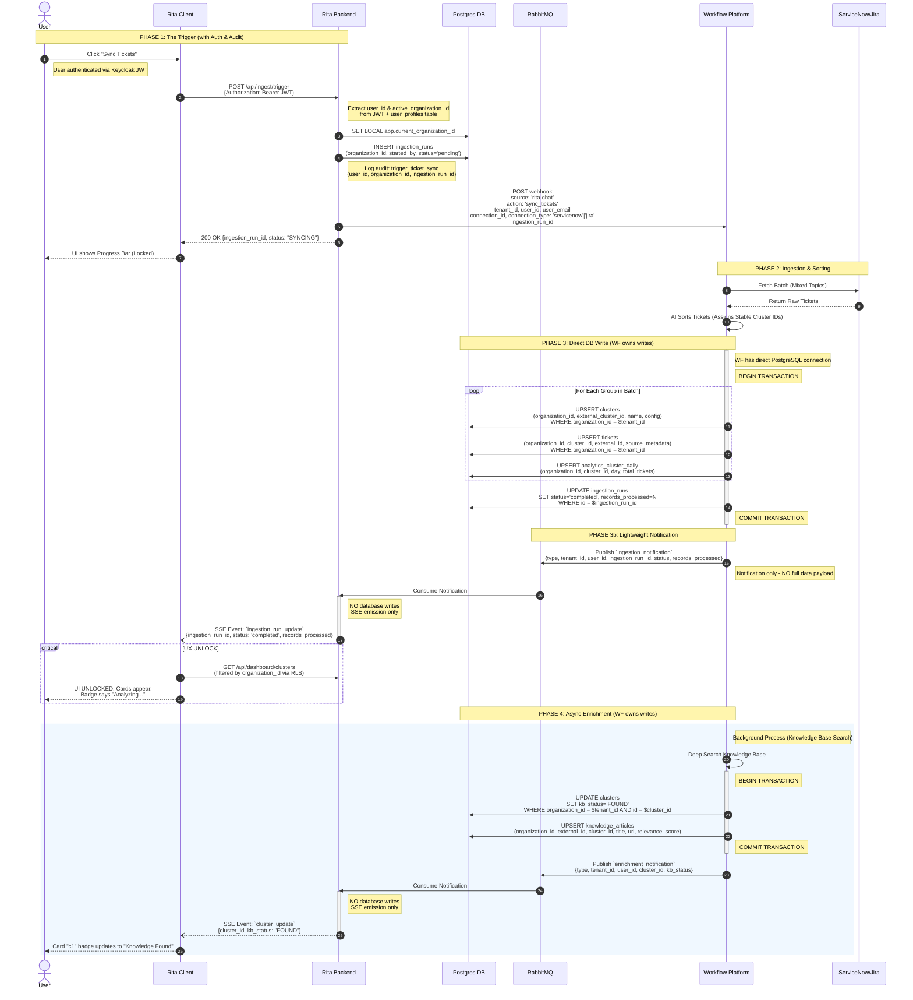
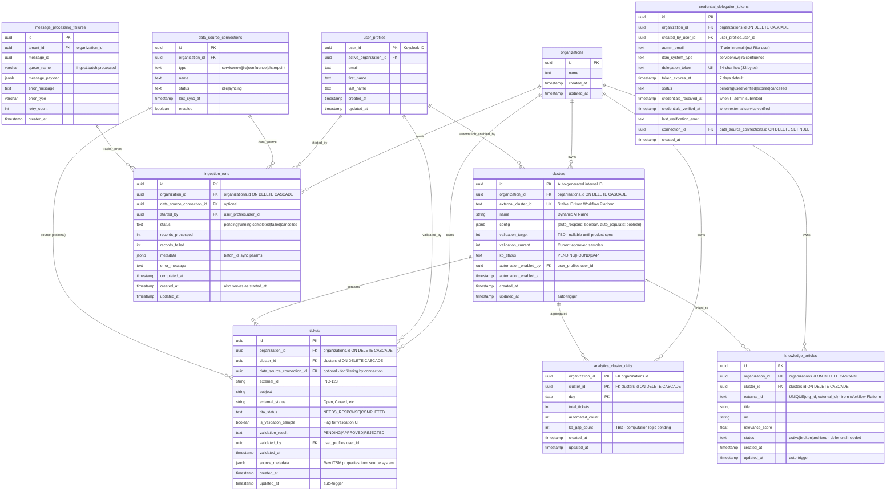

# Technical Design Document: RITA Autopilot & Cluster Dashboard

**Status:** Draft v1.5
**Date:** November 26, 2025
**Feature:** Continuous ITSM Ingestion, Live Dashboard, & Cluster Management

-----

## 1\. Executive Summary

This document outlines the architecture for the RITA Autopilot Dashboard. The system is designed to ingest high volumes of ITSM tickets, group them into AI-driven clusters, and present them in an interactive dashboard that allows IT Analysts to validate data and enable automation.

**Key Architectural Decisions:**

* **Workflow Platform Direct DB Access:** WF writes directly to PostgreSQL for autopilot tables (clusters, tickets, knowledge_articles, analytics_cluster_daily, ingestion_runs). Rita receives lightweight RabbitMQ notifications for SSE emission only - no DB writes in Rita consumers.
* **Event-Driven Architecture:** Decouples the User Interface (Rita Client) from the heavy AI processing (Workflow Platform).
* **Command-Query Separation:** The App triggers actions, but the Workflow Platform acts as the "Source of Truth" for cluster definitions AND owns data writes.
* **Two-Speed UX:** "Core Data" (Tickets) loads immediately to unlock the UI, while "Enrichment" (Knowledge Base analysis) occurs asynchronously in the background.
* **Pre-Aggregated Metrics:** Uses a "Daily Bucket" pattern to ensure dashboard charts render instantly regardless of date range selection.

### Implementation Prerequisites

Before implementing this feature, the following codebase changes are required:

1. **Add `jira` to `ALLOWED_DATA_SOURCE_TYPES`** in `packages/api-server/src/constants/dataSources.ts`
2. **Add `jira` to `DEFAULT_DATA_SOURCES`** array for org seeding
3. **Add system user constant** for auto-generated records (clusters created by Workflow Platform)

-----

## 2\. High-Level Architecture

### 2.1 The Flow

1.  **Command:** User triggers a sync via **Rita Backend**.
2.  **Process:** **Workflow Platform** fetches data from ITSM tools (ServiceNow/Jira), performs AI clustering, and assigns stable Cluster IDs.
3.  **Write:** **Workflow Platform** writes directly to PostgreSQL (clusters, tickets, analytics, ingestion_runs) using `organization_id` filtering.
4.  **Notify:** **Workflow Platform** publishes lightweight notification to RabbitMQ (no full data payload).
5.  **SSE:** **Rita Backend** consumes notification and emits SSE event to client (no DB writes).
6.  **Query:** **Rita Client** reads from optimized PostgreSQL tables and receives real-time updates via Server-Sent Events (SSE).

### 2.2 Sequence Diagram


```mermaid
sequenceDiagram
    autonumber
    actor User
    participant RC as Rita Client
    participant RB as Rita Backend
    participant DB as Postgres DB
    participant MQ as RabbitMQ
    participant WP as Workflow Platform
    participant ITSM as ServiceNow/Jira

    Note over User, RB: PHASE 1: The Trigger (with Auth & Audit)
    User->>RC: Click "Sync Tickets"
    Note right of User: User authenticated via Keycloak JWT
    RC->>RB: POST /api/ingest/trigger<br/>{Authorization: Bearer JWT}

    Note right of RB: Extract user_id & active_organization_id<br/>from JWT + user_profiles table
    RB->>DB: SET LOCAL app.current_organization_id
    RB->>DB: INSERT ingestion_runs<br/>(organization_id, started_by, status='pending')
    Note right of RB: Log audit: trigger_ticket_sync<br/>(user_id, organization_id, ingestion_run_id)

    RB->>WP: POST webhook<br/>source: 'rita-chat'<br/>action: 'sync_tickets'<br/>tenant_id, user_id, user_email<br/>connection_id, connection_type: 'servicenow'|'jira'<br/>ingestion_run_id
    RB-->>RC: 200 OK {ingestion_run_id, status: "SYNCING"}
    RC-->>User: UI shows Progress Bar (Locked)

    Note over WP, ITSM: PHASE 2: Ingestion & Sorting
    WP->>ITSM: Fetch Batch (Mixed Topics)
    ITSM-->>WP: Return Raw Tickets
    WP->>WP: AI Sorts Tickets (Assigns Stable Cluster IDs)

    Note over WP, DB: PHASE 3: Direct DB Write (WF owns writes)
    activate WP
    Note right of WP: WF has direct PostgreSQL connection
    Note right of WP: BEGIN TRANSACTION

    loop For Each Group in Batch
        WP->>DB: UPSERT clusters<br/>(organization_id, external_cluster_id, name, config)<br/>WHERE organization_id = $tenant_id
        WP->>DB: UPSERT tickets<br/>(organization_id, cluster_id, external_id, source_metadata)<br/>WHERE organization_id = $tenant_id
        WP->>DB: UPSERT analytics_cluster_daily<br/>(organization_id, cluster_id, day, total_tickets)
    end

    WP->>DB: UPDATE ingestion_runs<br/>SET status='completed', records_processed=N<br/>WHERE id = $ingestion_run_id
    Note right of WP: COMMIT TRANSACTION
    deactivate WP

    Note over WP, MQ: PHASE 3b: Lightweight Notification
    WP->>MQ: Publish `ingestion_notification`<br/>{type, tenant_id, user_id, ingestion_run_id, status, records_processed}
    Note right of WP: Notification only - NO full data payload

    MQ->>RB: Consume Notification
    activate RB
    Note right of RB: NO database writes<br/>SSE emission only
    RB--)RC: SSE Event: `ingestion_run_update`<br/>{ingestion_run_id, status: 'completed', records_processed}
    deactivate RB

    critical UX UNLOCK
    RC->>RB: GET /api/dashboard/clusters<br/>(filtered by organization_id via RLS)
    RC-->>User: UI UNLOCKED. Cards appear.<br/>Badge says "Analyzing..."
    end

    Note over WP, DB: PHASE 4: Async Enrichment (WF owns writes)
    rect rgb(240, 248, 255)
    Note right of WP: Background Process (Knowledge Base Search)
    WP->>WP: Deep Search Knowledge Base

    activate WP
    Note right of WP: BEGIN TRANSACTION
    WP->>DB: UPDATE clusters<br/>SET kb_status='FOUND'<br/>WHERE organization_id = $tenant_id AND id = $cluster_id
    WP->>DB: UPSERT knowledge_articles<br/>(organization_id, external_id, cluster_id, title, url, relevance_score)
    Note right of WP: COMMIT TRANSACTION
    deactivate WP

    WP->>MQ: Publish `enrichment_notification`<br/>{type, tenant_id, user_id, cluster_id, kb_status}

    MQ->>RB: Consume Notification
    activate RB
    Note right of RB: NO database writes<br/>SSE emission only
    RB--)RC: SSE Event: `cluster_update`<br/>{cluster_id, kb_status: "FOUND"}
    deactivate RB

    RC-->>User: Card "c1" badge updates to "Knowledge Found"
    end
```

### 2.3 ITSM Credential Setup

> **See:** [Credential Delegation Technical Design](../feat-credential-delegation/technical-design-credential-delegation.md) for the complete credential delegation flow, including magic link tokens, IT Admin verification, and security model.

**Summary:** RITA uses a secure delegation system to allow external IT admins to configure ITSM credentials without creating RITA accounts. Once credentials are verified, the `data_source_connections` table is updated and autopilot ticket sync becomes available.

-----

## 3\. Data Architecture (PostgreSQL)

### 3.1 Entity Relationship Diagram (ERD)


```mermaid
erDiagram
    %% Core Multi-Tenancy
    organizations ||--o{ clusters : "owns"
    organizations ||--o{ tickets : "owns"
    organizations ||--o{ analytics_cluster_daily : "owns"
    organizations ||--o{ knowledge_articles : "owns"
    organizations ||--o{ ingestion_runs : "owns"

    %% User Tracking
    user_profiles ||--o{ clusters : "automation_enabled_by"
    user_profiles ||--o{ tickets : "validated_by"
    user_profiles ||--o{ ingestion_runs : "started_by"

    %% Data Relationships
    clusters ||--o{ tickets : "contains"
    clusters ||--o{ analytics_cluster_daily : "aggregates"
    clusters ||--o{ knowledge_articles : "linked_to"

    %% Data Source Integration (optional)
    data_source_connections ||--o{ tickets : "source (optional)"
    data_source_connections ||--o{ ingestion_runs : "data_source"

    %% Error Tracking (existing table)
    message_processing_failures ||--o{ ingestion_runs : "tracks_errors"

    %% Credential Delegation (see separate doc)
    %% credential_delegation_tokens documented in ../feat-credential-delegation/

    organizations {
        uuid id PK
        text name
        timestamp created_at
        timestamp updated_at
    }

    user_profiles {
        uuid user_id PK "Keycloak-ID"
        uuid active_organization_id FK
        text email
        text first_name
        text last_name
        timestamp created_at
        timestamp updated_at
    }

    data_source_connections {
        uuid id PK
        uuid organization_id FK
        text type "servicenow|jira|confluence|sharepoint"
        text name
        text status "idle|syncing"
        timestamp last_sync_at
        boolean enabled
    }

    message_processing_failures {
        uuid id PK
        uuid tenant_id FK "organization_id"
        uuid message_id
        varchar queue_name "ingest.batch.processed"
        jsonb message_payload
        text error_message
        varchar error_type
        int retry_count
        timestamp created_at
    }

    clusters {
        uuid id PK "Auto-generated internal ID"
        uuid organization_id FK "organizations.id ON DELETE CASCADE"
        text external_cluster_id UK "Stable ID from Workflow Platform"
        string name "Dynamic AI Name"
        jsonb config "{auto_respond: boolean, auto_populate: boolean}"
        int validation_target "TBD - nullable until product spec"
        int validation_current "Current approved samples"
        text kb_status "PENDING|FOUND|GAP"
        uuid automation_enabled_by FK "user_profiles.user_id"
        timestamp automation_enabled_at
        timestamp created_at
        timestamp updated_at "auto-trigger"
    }

    tickets {
        uuid id PK
        uuid organization_id FK "organizations.id ON DELETE CASCADE"
        uuid cluster_id FK "clusters.id ON DELETE CASCADE"
        uuid data_source_connection_id FK "optional - for filtering by connection"
        string external_id "INC-123"
        string subject
        string external_status "Open, Closed, etc"
        text rita_status "NEEDS_RESPONSE|COMPLETED"
        boolean is_validation_sample "Flag for validation UI"
        text validation_result "PENDING|APPROVED|REJECTED"
        uuid validated_by FK "user_profiles.user_id"
        timestamp validated_at
        jsonb source_metadata "Raw ITSM properties from source system"
        timestamp created_at
        timestamp updated_at "auto-trigger"
    }

    analytics_cluster_daily {
        uuid organization_id PK "FK organizations.id"
        uuid cluster_id PK "FK clusters.id ON DELETE CASCADE"
        date day PK
        int total_tickets
        int automated_count
        int kb_gap_count "TBD - computation logic pending"
        timestamp created_at
        timestamp updated_at
    }

    knowledge_articles {
        uuid id PK
        uuid organization_id FK "organizations.id ON DELETE CASCADE"
        uuid cluster_id FK "clusters.id ON DELETE CASCADE"
        text external_id "UNIQUE(org_id, external_id) - from Workflow Platform"
        string title
        string url
        float relevance_score
        text status "active|broken|archived - defer until needed"
        timestamp created_at
        timestamp updated_at "auto-trigger"
    }

    ingestion_runs {
        uuid id PK
        uuid organization_id FK "organizations.id ON DELETE CASCADE"
        uuid data_source_connection_id FK "optional"
        uuid started_by FK "user_profiles.user_id"
        text status "pending|running|completed|failed|cancelled"
        int records_processed
        int records_failed
        jsonb metadata "batch_id, sync params"
        text error_message
        timestamp completed_at
        timestamp created_at "also serves as started_at"
        timestamp updated_at
    }

    credential_delegation_tokens {
        uuid id PK
        uuid organization_id FK "organizations.id ON DELETE CASCADE"
        uuid created_by_user_id FK "user_profiles.user_id"
        text admin_email "IT admin email (not Rita user)"
        text itsm_system_type "servicenow|jira|confluence"
        text delegation_token UK "64-char hex (32 bytes)"
        timestamp token_expires_at "7 days default"
        text status "pending|used|verified|expired|cancelled"
        timestamp credentials_received_at "when IT admin submitted"
        timestamp credentials_verified_at "when external service verified"
        text last_verification_error
        uuid connection_id FK "data_source_connections.id ON DELETE SET NULL"
        timestamp created_at
    }
```

-----

## 4\. Interface Contracts

### 4.1 Webhook Payloads

> **Credential Delegation Webhooks:** See [Credential Delegation Technical Design](../feat-credential-delegation/technical-design-credential-delegation.md) for `send_delegation_email` and `verify_credentials` webhook payloads.

#### Sync Tickets Webhook (Autopilot)

**Webhook:** Workflow Platform
**Action:** `sync_tickets`
**Purpose:** Trigger ITSM ticket sync for autopilot clustering

```json
{
  "source": "rita-chat",
  "action": "sync_tickets",
  "tenant_id": "org-uuid-123",
  "user_id": "user-uuid-456",
  "user_email": "analyst@company.com",
  "ingestion_run_id": "run-uuid-789",
  "connection_id": "conn-uuid-abc",
  "connection_type": "servicenow",
  "settings": {
    "instance_url": "https://company.service-now.com",
    "tables": ["incident", "kb_knowledge"],
    "filters": {
      "state": "open",
      "priority": ["1", "2", "3"]
    }
  },
  "timestamp": "2025-11-24T10:00:00Z"
}
```

**Connection Types:**
- `servicenow` - Tables: incident, problem, change_request, kb_knowledge
- `jira` - Projects from latest_options
- `confluence` - Spaces from latest_options (if KB-only sync)

**Comparison with Data Source Sync:**
- Same `source: "rita-chat"` and `connection_type` pattern
- Different `action: "sync_tickets"` (vs `"trigger_sync"` for data sources)
- Includes `ingestion_run_id` for autopilot tracking
- Workflow Platform uses `connection_type` to determine ITSM-specific behavior

**Workflow Platform Processing:**
1. Looks up credentials using composite key: `(tenant_id, connection_id, connection_type)`
2. Fetches tickets from ITSM system using stored credentials
3. AI clustering engine groups tickets by similarity
4. Publishes `ticket_batch_processed` message to RabbitMQ (see Section 4.2)

**Response:** HTTP 200 (synchronous acknowledgment)
**Result:** Arrives asynchronously via RabbitMQ `ticket_batch_processed` queue

---

### 4.2 RabbitMQ Payloads

> **Architecture Note:** With Workflow Platform Direct DB Access, RabbitMQ messages are now lightweight notifications for SSE emission only. WF writes data directly to PostgreSQL, then publishes notification. Rita consumers emit SSE events without any database writes.

**Queue:** `ingestion_notification` (Phase 3b)
*Purpose: Lightweight notification after WF completes direct DB writes. Rita consumer emits SSE only.*

```json
{
  "type": "ingestion_completed",
  "tenant_id": "org-uuid-123",
  "user_id": "user-uuid-456",
  "ingestion_run_id": "run-uuid-789",
  "status": "completed",
  "records_processed": 150,
  "records_failed": 2,
  "timestamp": "2025-11-26T10:00:00Z"
}
```

**Rita Consumer Action:** Emit SSE `ingestion_run_update` event to user. NO database writes.

---

**Queue:** `cluster_notification` (Phase 3b - optional per-cluster updates)
*Purpose: Notify when individual cluster created/updated. Rita consumer emits SSE only.*

```json
{
  "type": "cluster_created",
  "tenant_id": "org-uuid-123",
  "user_id": "user-uuid-456",
  "cluster_id": "cluster-uuid-555",
  "action": "created",
  "timestamp": "2025-11-26T10:00:00Z"
}
```

**Rita Consumer Action:** Emit SSE `cluster_update` event. NO database writes.

---

**Queue:** `enrichment_notification` (Phase 4)
*Purpose: Notify when KB enrichment completes. Rita consumer emits SSE only.*

```json
{
  "type": "enrichment_completed",
  "tenant_id": "org-uuid-123",
  "user_id": "user-uuid-456",
  "cluster_id": "cluster-uuid-555",
  "kb_status": "FOUND",
  "articles_count": 3,
  "timestamp": "2025-11-26T10:00:00Z"
}
```

**Rita Consumer Action:** Emit SSE `cluster_update` event with `kb_status`. NO database writes.

---

**Error Handling:**
- Consumer failures logged to `message_processing_failures` table
- `queue_name` = `ingestion_notification`, `cluster_notification`, `enrichment_notification`, or `data_source_status`
- Notifications are idempotent - re-processing just re-emits SSE
- Retry logic: max 3 attempts with exponential backoff

**Queue:** `data_source_status` (Credential Verification)

> **See:** [Credential Delegation Technical Design](../feat-credential-delegation/technical-design-credential-delegation.md) for `data_source_status` queue payloads and consumer processing logic.

*This queue is shared between credential verification (delegation flow) and direct data source verification (Confluence).*

### 4.2 Frontend API Endpoints

**Authentication & Authorization:**
- All endpoints require Keycloak JWT token in Authorization header
- User's `active_organization_id` from `user_profiles` determines organization context
- All queries filtered by `organization_id` via Row-Level Security (RLS)

#### Dashboard View

* **`GET /api/dashboard/stats?range=30d`**
    * Aggregates `analytics_cluster_daily` for user's active organization
    * Returns: `{ total_tickets, automated_count, kb_gap_count, clusters_total, avg_automation_rate }`
    * Query: `WHERE organization_id = current_user.active_organization_id`

* **`GET /api/dashboard/clusters?range=30d&sort=volume`**
    * Returns cluster list for user's active organization with metrics
    * Supports sorting: `volume` (ticket count), `automation` (auto_respond rate), `recent` (created_at)
    * Query: `WHERE organization_id = current_user.active_organization_id AND created_at >= NOW() - range`

#### Cluster Detail View

* **`GET /api/clusters/:id/details`**
    * Returns cluster metadata for user's active organization
    * Response: `{ id, name, config, validation_target, validation_current, kb_status, trend_data[], created_by, updated_by, automation_enabled_at, automation_enabled_by }`
    * Query: `WHERE id = :id AND organization_id = current_user.active_organization_id`

* **`GET /api/clusters/:id/tickets`**
    * Returns paginated tickets for cluster in user's active organization
    * Supports tabs: `?tab=needs_response|completed|validation_pending`
    * Pagination: cursor-based using `created_at` field
    * Query: `WHERE cluster_id = :id AND organization_id = current_user.active_organization_id AND rita_status = :tab`

* **`GET /api/clusters/:id/knowledge`**
    * Returns linked knowledge articles for cluster
    * Query: `WHERE cluster_id = :id AND organization_id = current_user.active_organization_id AND status = 'active'`
    * Response includes: `{ id, title, url, relevance_score, created_by, created_at }`

#### Actions (Mutation Endpoints)

* **`PATCH /api/clusters/:id/config`**
    * Payload: `{ "auto_respond": true, "auto_populate": false }`
    * Authorization: Requires `admin` or `owner` role in organization
    * Action: Updates `clusters.config`, sets `updated_by = current_user.user_id`, `updated_at = NOW()`
    * If enabling automation: Sets `automation_enabled_by = current_user.user_id`, `automation_enabled_at = NOW()`
    * Triggers: Webhook to Workflow Platform with config change
    * Audit: Logs to `audit_logs` table with action `enable_cluster_automation` or `update_cluster_config`

* **`POST /api/tickets/:id/validate`**
    * Payload: `{ "result": "APPROVED" | "REJECTED" }`
    * Authorization: Requires `member` role or higher
    * Action: Updates `tickets.validation_result`, `validated_by = current_user.user_id`, `validated_at = NOW()`
    * If APPROVED: Increments `clusters.validation_current`
    * If validation_current reaches validation_target: Potentially triggers automation enablement
    * Returns updated ticket and cluster validation progress

* **`POST /api/ingest/trigger`**
    * Payload: `{ "data_source_connection_id": "uuid" }` (optional, defaults to primary ITSM)
    * Authorization: Requires `admin` or `owner` role
    * Action: Creates `ingestion_runs` record with `started_by = current_user.user_id`, status = `pending`
    * Webhook Call: `WebhookService.sendGenericEvent()` or `DataSourceWebhookService.sendSyncTriggerEvent()`
        - source: `'rita-chat'` (same as data source sync)
        - action: `'sync_tickets'` (distinguishes autopilot from regular data source sync)
        - connection_type: Determined by data_source_connections.type (servicenow, jira, confluence)
        - Includes: tenant_id, user_id, user_email, connection_id, ingestion_run_id, settings
        - Credentials NOT sent (Workflow Platform looks them up using composite key)
        - Result arrives async via RabbitMQ `ingest.batch.processed` queue
        - Failures logged to `rag_webhook_failures` table
        - Retry: 3 attempts with exponential backoff
    * Updates: `data_source_connections.status = 'syncing'` if data_source_connection_id provided
    * Audit: Logs to `audit_logs` with action `trigger_ticket_sync`
    * Returns: `202 { ingestion_run_id, status: "SYNCING" }`

#### Credential Delegation Endpoints

> **See:** [Credential Delegation Technical Design](../feat-credential-delegation/technical-design-credential-delegation.md) for all `/api/credential-delegations/*` endpoints.

-----

## 5\. Implementation Strategy

### 5.1 Backend Worker Logic (Node.js)

**Service:** `IngestTriggerService.ts` or within ingest routes

**Sync Trigger Logic:**
1. Validate user has admin/owner role
2. Get user's active_organization_id from JWT
3. Resolve data_source_connection_id:
   - If provided: Use specified connection
   - If not provided: Query primary ITSM connection for organization
4. Create ingestion_run record:
   ```sql
   INSERT INTO ingestion_runs (
     organization_id, started_by, status, data_source_connection_id
   ) VALUES ($1, $2, 'pending', $3)
   RETURNING id;
   ```
5. Update data_source_connections status:
   ```sql
   UPDATE data_source_connections
   SET status = 'syncing', last_sync_at = NOW()
   WHERE id = $1;
   ```
6. Send webhook to Workflow Platform:
   ```typescript
   await webhookService.sendGenericEvent({
     organizationId: user.active_organization_id,
     userId: user.user_id,
     userEmail: user.email,
     source: 'rita-chat',
     action: 'sync_tickets',
     additionalData: {
       ingestion_run_id: run.id,
       connection_id: connection.id,
       connection_type: connection.type, // servicenow, jira, confluence
       settings: connection.latest_options || {}
     }
   });
   ```
7. Return 202 Accepted response immediately

---

**Consumer:** `IngestionNotificationConsumer.ts` (packages/api-server/src/consumers/)

> **Architecture Note:** With WF Direct DB Access, this consumer is lightweight - it only emits SSE events. All database writes happen in Workflow Platform before the notification is published.

1.  **Message Processing:**
    * Consume from queues: `ingestion_notification`, `cluster_notification`, `enrichment_notification`
    * Extract `tenant_id`, `user_id`, and event details from payload
    * NO database writes - data already written by Workflow Platform

2.  **SSE Emission:**
    * Map notification type to SSE event:
      * `ingestion_completed` → `ingestion_run_update` SSE event
      * `cluster_created`/`cluster_updated` → `cluster_update` SSE event
      * `enrichment_completed` → `cluster_update` SSE event (with kb_status)
    * Emit to user via `sseService.sendToUser(user_id, tenant_id, event)`

3.  **Error Handling:**
    * Consumer failures logged to `message_processing_failures` table
    * Notifications are idempotent - re-processing just re-emits SSE (safe)
    * ACK on success, NACK without requeue on repeated failures
    * Max 3 retry attempts

4.  **Example Implementation:**
    ```typescript
    // IngestionNotificationConsumer.ts
    async processMessage(message: IngestionNotification): Promise<void> {
      const { type, tenant_id, user_id, ingestion_run_id, status, records_processed } = message;

      // NO database writes - WF already wrote to DB

      // Emit SSE event only
      await this.sseService.sendToUser(user_id, tenant_id, {
        type: 'ingestion_run_update',
        data: {
          ingestion_run_id,
          status,
          records_processed,
          timestamp: new Date().toISOString()
        }
      });

      this.logger.info('SSE emitted for ingestion notification', { ingestion_run_id, status });
    }
    ```

---

**Workflow Platform Responsibilities (Direct DB Access):**

WF now owns all autopilot data writes. Key patterns:

1.  **Multi-Tenancy (Direct org_id filter):**
    * Include `organization_id` in all WHERE/INSERT clauses
    * Do NOT use `SET LOCAL app.current_organization_id` (RLS optional for WF)
    * Example: `WHERE organization_id = $tenant_id`

2.  **Idempotency Pattern (WF implements):**
    * **Clusters:** `INSERT ... ON CONFLICT (organization_id, external_cluster_id) DO UPDATE SET name = EXCLUDED.name, kb_status = EXCLUDED.kb_status, updated_at = NOW()`
    * **Tickets:** `INSERT ... ON CONFLICT (organization_id, external_id) DO UPDATE SET cluster_id = EXCLUDED.cluster_id, external_status = EXCLUDED.external_status, updated_at = NOW()`
    * Conflict targets use unique constraints (org + external ID)

3.  **Transaction Scope:**
    * Process entire batch in single Postgres transaction
    * COMMIT only after all clusters, tickets, analytics, and ingestion_runs updated
    * ROLLBACK on critical failures

4.  **Metric Updates (WF implements):**
    ```sql
    INSERT INTO analytics_cluster_daily (organization_id, cluster_id, day, total_tickets, automated_count, kb_gap_count)
    VALUES ($1, $2, CURRENT_DATE, $3, $4, $5)
    ON CONFLICT (organization_id, cluster_id, day)
    DO UPDATE SET
      total_tickets = analytics_cluster_daily.total_tickets + EXCLUDED.total_tickets,
      automated_count = analytics_cluster_daily.automated_count + EXCLUDED.automated_count,
      updated_at = NOW();
    ```

5.  **Ingestion Run Tracking (WF updates):**
    ```sql
    UPDATE ingestion_runs
    SET status = 'completed', records_processed = $2, completed_at = NOW()
    WHERE id = $1 AND organization_id = $tenant_id;
    ```

6.  **After DB Commit - Publish Notification:**
    * Only publish to RabbitMQ AFTER transaction commits successfully
    * Notification contains minimal data for SSE (no full payloads)

**Consumer:** `DataSourceStatusConsumer.ts`

> **See:** [Credential Delegation Technical Design](../feat-credential-delegation/technical-design-credential-delegation.md) for `DataSourceStatusConsumer` verification processing logic.

*This consumer is reused for both Confluence verification AND delegated ITSM setup.*

### 5.2 Frontend State (React)

1.  **Optimistic UI:** When User clicks "Validate" on a ticket, update the UI immediately. Revert if the API call fails.
2.  **SSE Handling (RITA Owner - Authenticated):**

    **Event Naming Convention:** Follow existing pattern `{resource}_{action}` (e.g., `data_source_update`)

    | Event Type | Payload | Handler |
    |------------|---------|---------|
    | `ingestion_run_update` | `{ingestion_run_id, status, records_processed}` | Refetch dashboard on `status='completed'` |
    | `cluster_update` | `{cluster_id, kb_status, updated_fields[]}` | Update cluster in TanStack Query cache |
    | `ticket_update` | `{ticket_id, cluster_id, validation_result}` | Update validation progress |
    | `data_source_update` | `{connection_id, connection_type, status}` | Existing event - reused for credential verification |

    **Note:** Reuses existing `data_source_update` event type for credential verification (matches current Confluence pattern).

3.  **Status Polling (IT Admin - Public Page):**

    > **See:** [Credential Delegation Technical Design](../feat-credential-delegation/technical-design-credential-delegation.md) for IT Admin polling implementation.

### 5.3 Audit Integration

**Audit Logging Pattern:** All sensitive operations logged to `audit_logs` table for SOC2 Type II compliance

**Logged Actions:**

1. **`trigger_ticket_sync`** (POST /api/ingest/trigger)
   ```typescript
   await auditLog({
     organization_id: user.active_organization_id,
     user_id: user.user_id,
     action: 'trigger_ticket_sync',
     resource_type: 'ingestion_run',
     resource_id: ingestionRun.id,
     metadata: { data_source_connection_id, batch_id }
   });
   ```

2. **`enable_cluster_automation`** (PATCH /api/clusters/:id/config - when auto_respond enabled)
   ```typescript
   await auditLog({
     organization_id: cluster.organization_id,
     user_id: user.user_id,
     action: 'enable_cluster_automation',
     resource_type: 'cluster',
     resource_id: cluster.id,
     metadata: {
       config_before: cluster.config,
       config_after: newConfig,
       automation_enabled_fields: ['auto_respond', 'auto_populate']
     }
   });
   ```

3. **`update_cluster_config`** (PATCH /api/clusters/:id/config - other config changes)
   ```typescript
   await auditLog({
     organization_id: cluster.organization_id,
     user_id: user.user_id,
     action: 'update_cluster_config',
     resource_type: 'cluster',
     resource_id: cluster.id,
     metadata: { config_changes: diff(oldConfig, newConfig) }
   });
   ```

**Audit Query Endpoints:**
* `GET /api/audit/logs?resource_type=cluster&resource_id=:id` - View cluster change history
* `GET /api/audit/logs?action=enable_cluster_automation` - Track automation enablement across organization

### 5.4 Sync Two-Way Logic

* **Incoming (WF Direct Write):** ITSM → Workflow Platform → PostgreSQL (direct) → RabbitMQ notification → Rita Backend → SSE
  * Workflow Platform is source of truth for cluster definitions and ticket assignments
  * **WF writes directly to PostgreSQL** with `organization_id` in all queries
  * Rita Backend receives lightweight notification and emits SSE only (no DB writes)
  * No mutations sent back to Workflow Platform during ingestion

* **Outgoing (Commands):** Rita Backend → Webhook → Workflow Platform
  * User actions trigger configuration commands
  * Examples: Enable auto-respond, update validation target, link knowledge article
  * Workflow Platform executes commands, writes to DB, and publishes notification

## 6\. Security & Performance

### 6.1 Multi-Tenancy & Data Isolation

**Architecture Pattern:** All tables follow Rita's established multi-tenancy model documented in `docs/database-tables.md`

#### Data Isolation by Component

| Component | Isolation Method | Notes |
|-----------|-----------------|-------|
| Rita Backend | RLS via `SET LOCAL app.current_organization_id` | Standard pattern for API requests |
| Workflow Platform | Direct `organization_id` filter in queries | WF includes org_id in all WHERE/INSERT clauses |
| Rita Consumers | N/A (no DB writes) | Notification consumers only emit SSE |

#### Row-Level Security (RLS) Policies

All autopilot tables have RLS policies enabled. Rita Backend uses these; Workflow Platform uses direct filtering:

```sql
-- Enable RLS on all autopilot tables
ALTER TABLE clusters ENABLE ROW LEVEL SECURITY;
ALTER TABLE tickets ENABLE ROW LEVEL SECURITY;
ALTER TABLE analytics_cluster_daily ENABLE ROW LEVEL SECURITY;
ALTER TABLE knowledge_articles ENABLE ROW LEVEL SECURITY;
ALTER TABLE ingestion_runs ENABLE ROW LEVEL SECURITY;

-- Policy pattern for all tables
CREATE POLICY "users_access_own_organization_clusters" ON clusters
  FOR ALL
  USING (organization_id = current_setting('app.current_organization_id', true)::uuid);

CREATE POLICY "users_access_own_organization_tickets" ON tickets
  FOR ALL
  USING (organization_id = current_setting('app.current_organization_id', true)::uuid);

CREATE POLICY "users_access_own_organization_analytics" ON analytics_cluster_daily
  FOR ALL
  USING (organization_id = current_setting('app.current_organization_id', true)::uuid);

CREATE POLICY "users_access_own_organization_knowledge" ON knowledge_articles
  FOR ALL
  USING (organization_id = current_setting('app.current_organization_id', true)::uuid);

CREATE POLICY "users_access_own_organization_runs" ON ingestion_runs
  FOR ALL
  USING (organization_id = current_setting('app.current_organization_id', true)::uuid);
```

**RLS Activation:** Backend sets session variable on each request:
```typescript
// middleware/auth.ts
await db.query(
  'SET LOCAL app.current_organization_id = $1',
  [user.active_organization_id]
);
```

#### User Tracking Pattern

All mutable tables track user actions following Rita's audit pattern:

* **Creation:** `created_by` UUID → `user_profiles.user_id` (Keycloak user ID)
* **Modification:** `updated_by` UUID → `user_profiles.user_id` (updates on every change)
* **Timestamps:** `created_at`, `updated_at` (auto-updated via trigger `set_timestamp`)
* **Specific Actions:** `validated_by`, `automation_enabled_by`, `started_by` (domain-specific tracking)

**Auto-Update Trigger Pattern:**
```sql
-- Trigger function (shared across tables)
CREATE OR REPLACE FUNCTION trigger_set_timestamp()
RETURNS TRIGGER AS $$
BEGIN
  NEW.updated_at = NOW();
  RETURN NEW;
END;
$$ LANGUAGE plpgsql;

-- Apply to each mutable table
CREATE TRIGGER set_timestamp
BEFORE UPDATE ON clusters
FOR EACH ROW
EXECUTE FUNCTION trigger_set_timestamp();
```

#### Keycloak Integration

* **User Identification:** All `user_id` fields reference Keycloak's auth.users(id) UUID
* **JWT Validation:** API endpoints verify Keycloak JWT token in Authorization header
* **Organization Context:** User's `active_organization_id` from `user_profiles` table determines context
* **Role-Based Access:** Mutation endpoints check `organization_members.role` (owner/admin/member)

### 6.2 SOC2 Type II Compliance

#### Audit Trail Requirements

**Logged Actions (via `audit_logs` table):**
* `trigger_ticket_sync` - User initiates ITSM sync
* `enable_cluster_automation` - User enables auto-respond/auto-populate
* `update_cluster_config` - User modifies cluster settings
* `validate_ticket` - User approves/rejects validation sample (optional, high volume)

**Audit Log Retention:** Minimum 1 year for compliance

**Audit Log Fields:**
```typescript
interface AuditLog {
  id: uuid;
  organization_id: uuid;  // Multi-tenant isolation
  user_id: uuid;          // Who performed action
  action: string;         // Standardized action name
  resource_type: string;  // 'cluster', 'ticket', 'ingestion_run'
  resource_id: uuid;      // Which resource was affected
  metadata: jsonb;        // Context (config changes, validation results, etc.)
  created_at: timestamp;  // When action occurred
}
```

#### Security Controls

* **Authentication:** All endpoints require valid Keycloak JWT
* **Authorization:** Role-based checks for sensitive operations (admin/owner for automation, member for validation)
* **Data Isolation:** RLS enforces database-level tenant separation
* **Audit Logging:** Immutable audit trail for all configuration changes
* **Webhook Signing:** HMAC signatures validate Workflow Platform webhooks
* **Credential Security:** Data source credentials never stored in Rita database (sent to Workflow Platform per-request)

### 6.3 Performance Optimization

#### Database Indexing

**clusters table:**
```sql
CREATE INDEX idx_clusters_organization_id ON clusters(organization_id);
CREATE INDEX idx_clusters_kb_status ON clusters(kb_status);
CREATE INDEX idx_clusters_created_at ON clusters(created_at DESC);
CREATE INDEX idx_clusters_config ON clusters USING GIN (config);
```

**tickets table:**
```sql
CREATE INDEX idx_tickets_organization_id ON tickets(organization_id);
CREATE INDEX idx_tickets_cluster_id ON tickets(cluster_id);
CREATE INDEX idx_tickets_rita_status ON tickets(rita_status);
CREATE INDEX idx_tickets_validation_result ON tickets(validation_result);
CREATE INDEX idx_tickets_data_source ON tickets(data_source_connection_id);
CREATE INDEX idx_tickets_created_at ON tickets(created_at DESC);
CREATE INDEX idx_tickets_validated_by ON tickets(validated_by);
CREATE INDEX idx_tickets_source_metadata ON tickets USING GIN (source_metadata);
```

**analytics_cluster_daily table:**
```sql
CREATE INDEX idx_analytics_cluster_daily_org ON analytics_cluster_daily(organization_id);
CREATE INDEX idx_analytics_cluster_daily_day ON analytics_cluster_daily(day DESC);
-- Compound index for dashboard queries
CREATE INDEX idx_analytics_org_cluster_day ON analytics_cluster_daily(organization_id, cluster_id, day DESC);
```

**knowledge_articles table:**
```sql
CREATE INDEX idx_knowledge_articles_organization_id ON knowledge_articles(organization_id);
CREATE INDEX idx_knowledge_articles_cluster_id ON knowledge_articles(cluster_id);
CREATE INDEX idx_knowledge_articles_status ON knowledge_articles(status);
CREATE INDEX idx_knowledge_articles_relevance ON knowledge_articles(relevance_score DESC);
```

**ingestion_runs table:**
```sql
CREATE INDEX idx_ingestion_runs_organization ON ingestion_runs(organization_id);
CREATE INDEX idx_ingestion_runs_data_source ON ingestion_runs(data_source_connection_id);
CREATE INDEX idx_ingestion_runs_status ON ingestion_runs(status);
CREATE INDEX idx_ingestion_runs_started_at ON ingestion_runs(started_at DESC);
```

#### Query Optimization Patterns

* **Pre-Aggregated Metrics:** Daily bucket pattern in `analytics_cluster_daily` enables O(days) dashboard queries instead of O(tickets)
* **Cursor-Based Pagination:** Ticket lists use `created_at` cursor to avoid OFFSET performance penalties
* **Partial Indexes:** Consider `WHERE status = 'active'` on frequently filtered columns
* **JSONB GIN Indexes:** Enable fast queries on `config`, `source_metadata` JSONB fields

#### Real-Time Updates (SSE)

* **Debouncing:** SSE emitter debounces events (max 1 per second) during bulk imports
* **Event Types:**
  * `sync_completed` - Triggers grid refetch
  * `cluster_updated` - Updates single cluster in cache (TanStack Query)
* **Connection Management:** EventSource auto-reconnects on disconnect
* **Ephemeral Delivery:** Events fire-and-forget (future: persist critical events for replay)

#### Webhook Security

* **HMAC Signing:** All Rita Backend ↔ Workflow Platform webhooks signed with shared secret
* **Signature Verification:** Reject unsigned or invalid signatures
* **Replay Protection:** Include timestamp in signature, reject old requests (>5 min)
* **Rate Limiting:** Enforce webhook rate limits to prevent abuse

-----

## 7\. Database Migration Reference

### 7.1 Migration File

**Location:** `packages/api-server/src/database/migrations/XXX_add_autopilot_tables.sql`

### 7.2 Table Creation Scripts

#### clusters Table

```sql
-- Main autopilot clusters table (system-generated by Workflow Platform)
CREATE TABLE clusters (
    id UUID PRIMARY KEY DEFAULT gen_random_uuid(),  -- Internal auto-generated ID
    organization_id UUID NOT NULL REFERENCES organizations(id) ON DELETE CASCADE,
    external_cluster_id TEXT NOT NULL,  -- Stable ID from Workflow Platform
    name TEXT NOT NULL,
    config JSONB DEFAULT '{}'::jsonb,
    validation_target INTEGER,  -- TBD: product spec pending, nullable for now
    validation_current INTEGER NOT NULL DEFAULT 0,
    kb_status TEXT DEFAULT 'PENDING' CHECK (kb_status IN ('PENDING', 'FOUND', 'GAP')),

    -- User tracking (only for user actions, not system creation)
    automation_enabled_by UUID REFERENCES user_profiles(user_id),

    -- Timestamps
    automation_enabled_at TIMESTAMP WITH TIME ZONE,
    created_at TIMESTAMP WITH TIME ZONE DEFAULT NOW(),
    updated_at TIMESTAMP WITH TIME ZONE DEFAULT NOW(),

    -- Unique constraint: one external_cluster_id per organization
    CONSTRAINT uq_clusters_external_id_org UNIQUE (organization_id, external_cluster_id)
);

-- Indexes
CREATE INDEX idx_clusters_organization_id ON clusters(organization_id);
CREATE INDEX idx_clusters_external_id ON clusters(external_cluster_id);
CREATE INDEX idx_clusters_kb_status ON clusters(kb_status);
CREATE INDEX idx_clusters_created_at ON clusters(created_at DESC);
CREATE INDEX idx_clusters_config ON clusters USING GIN (config);

-- Row-Level Security
ALTER TABLE clusters ENABLE ROW LEVEL SECURITY;

CREATE POLICY "users_access_own_organization_clusters" ON clusters
    FOR ALL
    USING (organization_id = current_setting('app.current_organization_id', true)::uuid);

-- Auto-update trigger
CREATE TRIGGER set_timestamp
BEFORE UPDATE ON clusters
FOR EACH ROW
EXECUTE FUNCTION trigger_set_timestamp();

-- Comments
COMMENT ON TABLE clusters IS 'AI-generated ticket clusters from Workflow Platform (system-generated)';
COMMENT ON COLUMN clusters.id IS 'Internal auto-generated UUID for internal references';
COMMENT ON COLUMN clusters.external_cluster_id IS 'Stable cluster ID provided by Workflow Platform (used for upsert matching)';
COMMENT ON COLUMN clusters.config IS 'JSONB config: {auto_respond: boolean, auto_populate: boolean}';
COMMENT ON COLUMN clusters.validation_current IS 'Current count of approved validation samples (progress toward target)';
COMMENT ON COLUMN clusters.automation_enabled_at IS 'Timestamp when automation was first enabled (audit trail)';
COMMENT ON COLUMN clusters.validation_target IS 'Validation sample target count (TBD - product spec pending)';
```

#### tickets Table

```sql
-- Tickets assigned to clusters
CREATE TABLE tickets (
    id UUID PRIMARY KEY DEFAULT gen_random_uuid(),
    organization_id UUID NOT NULL REFERENCES organizations(id) ON DELETE CASCADE,
    cluster_id UUID NOT NULL REFERENCES clusters(id) ON DELETE CASCADE,
    data_source_connection_id UUID REFERENCES data_source_connections(id) ON DELETE SET NULL,

    -- Ticket details
    external_id TEXT NOT NULL,
    subject TEXT NOT NULL,
    external_status TEXT NOT NULL,
    rita_status TEXT DEFAULT 'NEEDS_RESPONSE' CHECK (rita_status IN ('NEEDS_RESPONSE', 'COMPLETED')),

    -- Validation tracking
    is_validation_sample BOOLEAN DEFAULT false,
    validation_result TEXT DEFAULT 'PENDING' CHECK (validation_result IN ('PENDING', 'APPROVED', 'REJECTED')),
    validated_by UUID REFERENCES user_profiles(user_id),
    validated_at TIMESTAMP WITH TIME ZONE,

    -- Source metadata
    source_metadata JSONB DEFAULT '{}'::jsonb,

    -- Timestamps
    created_at TIMESTAMP WITH TIME ZONE DEFAULT NOW(),
    updated_at TIMESTAMP WITH TIME ZONE DEFAULT NOW(),

    -- Constraints
    CONSTRAINT uq_tickets_external_id_org UNIQUE (organization_id, external_id)
);

-- Indexes
CREATE INDEX idx_tickets_organization_id ON tickets(organization_id);
CREATE INDEX idx_tickets_cluster_id ON tickets(cluster_id);
CREATE INDEX idx_tickets_rita_status ON tickets(rita_status);
CREATE INDEX idx_tickets_validation_result ON tickets(validation_result);
CREATE INDEX idx_tickets_data_source ON tickets(data_source_connection_id);
CREATE INDEX idx_tickets_created_at ON tickets(created_at DESC);
CREATE INDEX idx_tickets_validated_by ON tickets(validated_by);
CREATE INDEX idx_tickets_source_metadata ON tickets USING GIN (source_metadata);
CREATE INDEX idx_tickets_validation_samples ON tickets(cluster_id, is_validation_sample) WHERE is_validation_sample = true;

-- Row-Level Security
ALTER TABLE tickets ENABLE ROW LEVEL SECURITY;

CREATE POLICY "users_access_own_organization_tickets" ON tickets
    FOR ALL
    USING (organization_id = current_setting('app.current_organization_id', true)::uuid);

-- Auto-update trigger
CREATE TRIGGER set_timestamp
BEFORE UPDATE ON tickets
FOR EACH ROW
EXECUTE FUNCTION trigger_set_timestamp();

-- Comments
COMMENT ON TABLE tickets IS 'ITSM tickets assigned to autopilot clusters';
COMMENT ON COLUMN tickets.external_id IS 'ITSM ticket ID (e.g., INC-123 from ServiceNow)';
COMMENT ON COLUMN tickets.rita_status IS 'Rita-specific status for workflow tracking';
COMMENT ON COLUMN tickets.is_validation_sample IS 'Flag indicating ticket selected for 0/16 validation UI';
COMMENT ON COLUMN tickets.data_source_connection_id IS 'Optional FK for filtering tickets by connection (NULL if from WP independent connections)';
COMMENT ON COLUMN tickets.source_metadata IS 'Raw ITSM properties from source system for debugging/display';
```

#### analytics_cluster_daily Table

```sql
-- Pre-aggregated daily metrics per cluster
CREATE TABLE analytics_cluster_daily (
    organization_id UUID NOT NULL REFERENCES organizations(id) ON DELETE CASCADE,
    cluster_id UUID NOT NULL REFERENCES clusters(id) ON DELETE CASCADE,
    day DATE NOT NULL,

    -- Metrics
    total_tickets INTEGER DEFAULT 0,
    automated_count INTEGER DEFAULT 0,
    kb_gap_count INTEGER DEFAULT 0,

    -- Timestamps
    created_at TIMESTAMP WITH TIME ZONE DEFAULT NOW(),
    updated_at TIMESTAMP WITH TIME ZONE DEFAULT NOW(),

    -- Composite primary key
    PRIMARY KEY (organization_id, cluster_id, day)
);

-- Indexes
CREATE INDEX idx_analytics_cluster_daily_org ON analytics_cluster_daily(organization_id);
CREATE INDEX idx_analytics_cluster_daily_day ON analytics_cluster_daily(day DESC);
CREATE INDEX idx_analytics_org_cluster_day ON analytics_cluster_daily(organization_id, cluster_id, day DESC);

-- Row-Level Security
ALTER TABLE analytics_cluster_daily ENABLE ROW LEVEL SECURITY;

CREATE POLICY "users_access_own_organization_analytics" ON analytics_cluster_daily
    FOR ALL
    USING (organization_id = current_setting('app.current_organization_id', true)::uuid);

-- Comments
COMMENT ON TABLE analytics_cluster_daily IS 'Pre-aggregated daily metrics for fast dashboard queries (retention period TBD)';
COMMENT ON COLUMN analytics_cluster_daily.day IS 'Date bucket for metrics aggregation';
COMMENT ON COLUMN analytics_cluster_daily.automated_count IS 'Count of tickets handled by automation';
COMMENT ON COLUMN analytics_cluster_daily.kb_gap_count IS 'Count of tickets with KB gaps (TBD - computation logic pending)';
```

#### knowledge_articles Table

```sql
-- Knowledge base articles linked to clusters (system-generated from Workflow Platform)
CREATE TABLE knowledge_articles (
    id UUID PRIMARY KEY DEFAULT gen_random_uuid(),
    organization_id UUID NOT NULL REFERENCES organizations(id) ON DELETE CASCADE,
    cluster_id UUID NOT NULL REFERENCES clusters(id) ON DELETE CASCADE,
    external_id TEXT NOT NULL,  -- Stable identifier from Workflow Platform for upsert

    -- Article details
    title TEXT NOT NULL,
    url TEXT NOT NULL,
    relevance_score FLOAT NOT NULL CHECK (relevance_score >= 0 AND relevance_score <= 1),
    status TEXT DEFAULT 'active' CHECK (status IN ('active', 'broken', 'archived')),  -- defer until needed

    -- Timestamps
    created_at TIMESTAMP WITH TIME ZONE DEFAULT NOW(),
    updated_at TIMESTAMP WITH TIME ZONE DEFAULT NOW(),

    -- Unique constraint for upsert operations
    UNIQUE (organization_id, external_id)
);

-- Indexes
CREATE INDEX idx_knowledge_articles_organization_id ON knowledge_articles(organization_id);
CREATE INDEX idx_knowledge_articles_cluster_id ON knowledge_articles(cluster_id);
CREATE INDEX idx_knowledge_articles_status ON knowledge_articles(status);
CREATE INDEX idx_knowledge_articles_relevance ON knowledge_articles(relevance_score DESC);

-- Row-Level Security
ALTER TABLE knowledge_articles ENABLE ROW LEVEL SECURITY;

CREATE POLICY "users_access_own_organization_knowledge" ON knowledge_articles
    FOR ALL
    USING (organization_id = current_setting('app.current_organization_id', true)::uuid);

-- Auto-update trigger
CREATE TRIGGER set_timestamp
BEFORE UPDATE ON knowledge_articles
FOR EACH ROW
EXECUTE FUNCTION trigger_set_timestamp();

-- Comments
COMMENT ON TABLE knowledge_articles IS 'KB articles linked to clusters (system-generated from Workflow Platform)';
COMMENT ON COLUMN knowledge_articles.external_id IS 'Stable identifier from Workflow Platform for idempotent upsert operations';
COMMENT ON COLUMN knowledge_articles.relevance_score IS 'AI relevance score (0.0 to 1.0) from Workflow Platform';
COMMENT ON COLUMN knowledge_articles.status IS 'Track article availability - defer until auto-refresh feature needed';
```

#### ingestion_runs Table

**Why This Table Exists (vs `data_source_connections.status`)**

| Aspect | `data_source_connections` | `ingestion_runs` |
|--------|---------------------------|------------------|
| **Purpose** | Connection config state | Individual sync operation |
| **Cardinality** | 1 per org+type | Many per connection |
| **Status values** | `idle`, `syncing` | `pending`, `running`, `completed`, `failed`, `cancelled` |
| **Tracks** | "Is something syncing now?" | "What happened in this specific sync?" |
| **History** | Only `last_sync_status` | Full record per sync |
| **Counters** | None | `records_processed`, `records_failed` |
| **Error detail** | None | `error_message` TEXT |

**Relationship:**
```
data_source_connections (1) ←──── (N) ingestion_runs
         ↓                              ↓
   "Jira is syncing"            "Sync #5: 150 tickets, completed"
                                "Sync #6: failed - timeout"
```

**Usage:**
- `data_source_connections.status` = UI spinner on connection card (denormalized for fast reads)
- `ingestion_runs` = audit trail + detailed metrics per sync attempt

**Lifecycle:**
```
User clicks "Sync" → INSERT (pending) → webhook sent → UPDATE (running) →
RabbitMQ consumed → UPDATE (completed/failed) → SSE event → UI unlocks
```

```sql
-- Track ticket ingestion/sync operations
CREATE TABLE ingestion_runs (
    id UUID PRIMARY KEY DEFAULT gen_random_uuid(),
    organization_id UUID NOT NULL REFERENCES organizations(id) ON DELETE CASCADE,
    data_source_connection_id UUID REFERENCES data_source_connections(id) ON DELETE SET NULL,
    started_by UUID NOT NULL REFERENCES user_profiles(user_id),

    -- Status tracking
    status TEXT DEFAULT 'pending' CHECK (status IN ('pending', 'running', 'completed', 'failed', 'cancelled')),
    records_processed INTEGER DEFAULT 0,
    records_failed INTEGER DEFAULT 0,

    -- Additional context
    metadata JSONB DEFAULT '{}'::jsonb,
    error_message TEXT,

    -- Timestamps (created_at doubles as started_at)
    completed_at TIMESTAMP WITH TIME ZONE,
    created_at TIMESTAMP WITH TIME ZONE DEFAULT NOW(),
    updated_at TIMESTAMP WITH TIME ZONE DEFAULT NOW()
);

-- Indexes
CREATE INDEX idx_ingestion_runs_organization ON ingestion_runs(organization_id);
CREATE INDEX idx_ingestion_runs_data_source ON ingestion_runs(data_source_connection_id);
CREATE INDEX idx_ingestion_runs_status ON ingestion_runs(status);
CREATE INDEX idx_ingestion_runs_created_at ON ingestion_runs(created_at DESC);
CREATE INDEX idx_ingestion_runs_started_by ON ingestion_runs(started_by);

-- Row-Level Security
ALTER TABLE ingestion_runs ENABLE ROW LEVEL SECURITY;

CREATE POLICY "users_access_own_organization_runs" ON ingestion_runs
    FOR ALL
    USING (organization_id = current_setting('app.current_organization_id', true)::uuid);

-- Comments
COMMENT ON TABLE ingestion_runs IS 'Track ITSM ticket sync operations from Workflow Platform';
COMMENT ON COLUMN ingestion_runs.metadata IS 'JSONB: {batch_id, sync_params, workflow_run_id}';
COMMENT ON COLUMN ingestion_runs.records_processed IS 'Count of successfully processed tickets';
COMMENT ON COLUMN ingestion_runs.records_failed IS 'Count of failed ticket validations';
COMMENT ON COLUMN ingestion_runs.created_at IS 'Doubles as started_at timestamp';
```

#### credential_delegation_tokens Table

> **See:** [Credential Delegation Technical Design](../feat-credential-delegation/technical-design-credential-delegation.md) for the `credential_delegation_tokens` table schema.

### 7.3 Migration Checklist

**Pre-Migration:**
- [ ] Backup production database
- [ ] Test migration on staging environment
- [ ] Verify trigger_set_timestamp() function exists
- [ ] Verify organizations and user_profiles tables exist
- [ ] Verify data_source_connections table exists (for optional FK)

**Post-Migration:**
- [ ] Verify all tables created: `\dt clusters tickets analytics_cluster_daily knowledge_articles ingestion_runs`
- [ ] Verify all indexes created: `\di idx_clusters_*` `\di idx_tickets_*`
- [ ] For credential_delegation_tokens: See [Credential Delegation Technical Design](../feat-credential-delegation/technical-design-credential-delegation.md)
- [ ] Verify RLS policies enabled: `SELECT tablename, rowsecurity FROM pg_tables WHERE schemaname = 'public'`
- [ ] Verify foreign key constraints: `\d+ clusters` `\d+ tickets`
- [ ] Test RLS isolation: Set `app.current_organization_id` and query tables
- [ ] Grant appropriate permissions to application database user

### 7.4 Rollback Plan

```sql
-- Rollback script (if needed - DESTRUCTIVE!)
DROP TABLE IF EXISTS ingestion_runs CASCADE;
DROP TABLE IF EXISTS knowledge_articles CASCADE;
DROP TABLE IF EXISTS analytics_cluster_daily CASCADE;
DROP TABLE IF EXISTS tickets CASCADE;
DROP TABLE IF EXISTS clusters CASCADE;
-- For credential_delegation_tokens rollback, see Credential Delegation doc
```

**⚠️ Warning:** Rollback will permanently delete all autopilot data. Only use in emergency situations.

### 7.5 Data Source Integration Notes

**Optional FK to data_source_connections:**
- `tickets.data_source_connection_id` is NULLABLE
- Set when ticket originates from Rita-managed ITSM connection
- NULL when ticket comes from Workflow Platform's independent ITSM connections
- Fallback: `tickets.source_metadata` JSONB always captures source details

**Future Enhancement:**
- Add `clusters.data_source_connection_id` FK if clusters should be scoped to specific ITSM instances
- Add `sync_schedule` JSONB to `data_source_connections` for automated periodic syncs

### 7.6 Not In Scope / To Be Defined

**Features not included in initial implementation:**
- **Cluster Archival:** Soft delete/archival mechanism for inactive clusters (future improvement)
- **Article Auto-Refresh:** Automatic broken link detection and article re-verification (future improvement)

**Values to be defined in product specification:**
- **Validation Target:** Default validation sample count per cluster (currently nullable field)
- **Analytics Retention:** How long to retain daily metric buckets (30d, 90d, 1yr?)
- **Knowledge Article Limits:** Max articles per cluster before truncation/ranking
- **Sync Frequency:** Default/max polling intervals for ITSM connections

**Recommended Next Steps:**
1. Define validation target based on user research/piloting
2. Establish data retention policies (analytics, audit logs)
3. Design cluster lifecycle management (active → archived states)
4. Plan knowledge article verification cron job strategy

-----

## Changelog

### v1.5 (November 26, 2025)
**Document Split: Credential Delegation Extracted**

- **Split:** Credential delegation moved to separate doc: `../feat-credential-delegation/technical-design-credential-delegation.md`
- **Removed:** Section 2.3 delegation flow (full sequence diagram)
- **Removed:** Credential delegation webhook payloads
- **Removed:** Credential delegation API endpoints
- **Removed:** `DataSourceStatusConsumer` verification logic details
- **Removed:** `credential_delegation_tokens` table schema
- **Added:** Cross-references to credential delegation doc throughout

### v1.4 (November 26, 2025)
**Architectural Change: Workflow Platform Direct DB Access**

- **Changed:** WF now writes directly to PostgreSQL for autopilot tables (clusters, tickets, knowledge_articles, analytics_cluster_daily, ingestion_runs)
- **Changed:** RabbitMQ messages are now lightweight notifications (no full data payloads)
- **Changed:** Rita consumers (`IngestionNotificationConsumer`) only emit SSE events - no DB writes
- **Changed:** WF uses direct `organization_id` filtering instead of RLS session variables
- **Deferred:** Audit logging for WF writes (to be addressed in later iteration)

### v1.3 (November 24, 2025)
- Added credential delegation flow for ITSM setup
- Added ingestion_runs table and sync tracking
- Added detailed RabbitMQ payload specifications

### v1.2
- Initial autopilot tables schema
- Cluster and ticket management flows