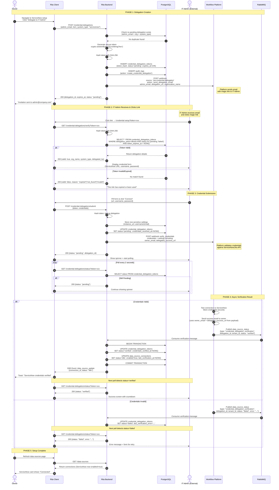
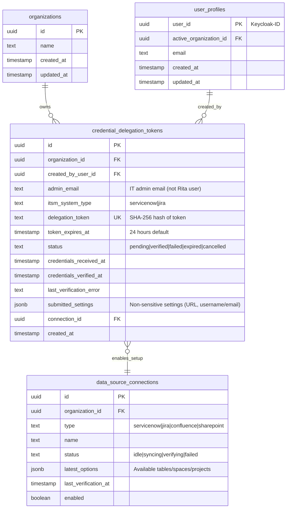

# Technical Design Document: RITA Credential Delegation

**Status:** v1.2
**Date:** January 19, 2026
**Feature:** Delegated ITSM Credential Setup for ServiceNow and Jira

-----

## 1. Executive Summary

This document outlines the architecture for RITA's Credential Delegation system. It enables RITA Autopilot owners to securely delegate ITSM credential setup to external IT administrators without requiring them to create RITA user accounts.

**Key Architectural Decisions:**

* **Zero Credential Storage:** Rita NEVER stores ITSM credentials - they pass through in memory only and are immediately sent to external service
* **Magic Link Pattern:** 64-character hex token (256-bit entropy) with 24-hour expiration, stored as SHA-256 hash
* **Retry Support:** Failed verifications can be retried (status reverts to 'failed', allows resubmission)
* **Real-Time Feedback:** Polling for IT admin, SSE events for RITA owner
* **Unified Queue:** Uses `data_source_status` RabbitMQ queue with message type discrimination
* **Platform-Sent Emails:** Success email sent directly by platform during verification (no webhook round-trip)

**Related Documentation:**
- [Autopilot Ticket Clustering](../feat-autopilot-ticket-cluster/technical-design-autopilot-tickets.md) - Uses credentials configured via this system
- [QA Test Cases](qa-test-cases.md) - Testing guide with payload examples

-----

## 2. Delegation Flow

**Use Case:** RITA Autopilot Owner needs to connect ServiceNow or Jira for ticket ingestion, but does not have ITSM administrator credentials.

**Solution:** Secure, ephemeral "magic link" system that allows an external IT Admin to input sensitive credentials without creating a RITA user account.

### 2.1 Security Model

* **Zero Credential Storage:** Rita NEVER stores ITSM credentials - they pass through in memory only and are immediately sent to external service
* **Token Hashing:** Tokens stored as SHA-256 hash (not plaintext) - lookup by hash
* **Magic Link Pattern:** 64-character hex token (256-bit entropy) with 24-hour expiration
* **Retry Support:** Failed verifications allow retry (status='pending' or 'failed' can submit again)
* **Real-Time Feedback:** IT admin polls for status, RITA owner receives SSE events
* **Audit Trail:** All delegation and verification actions logged for SOC2 compliance

### 2.2 Supported Systems

* **ServiceNow** - Username/password authentication
* **Jira** - API token + email authentication

### 2.3 Sequence Diagram



### 2.4 Key Features

**Token Security:**
- Generated using `crypto.randomBytes(32).toString('hex')` (64-char hex = 256 bits)
- Stored as SHA-256 hash (not plaintext)
- 24-hour expiration (`TOKEN_EXPIRY_DAYS = 1`)
- Rate limiting: 10 delegations per org per day
- Retry support: 'pending' or 'failed' status allows resubmission

**Zero Credential Storage:**
- Credentials never persisted to Rita database
- Passed in memory only from frontend → API → webhook → external service
- External service stores credentials using composite key: `(tenant_id, connection_id, connection_type)`

**Real-Time Updates:**
- IT Admin sees verification result via polling (2-second interval)
- RITA Owner receives toast notification when setup completes via SSE
- Both parties get immediate feedback on success/failure

**Audit Compliance (SOC2):**
- Who created delegation (RITA Owner user_id)
- Who submitted credentials (IT Admin email)
- When credentials verified (timestamp)
- All logged to `audit_logs` table

**Error Handling:**
- Invalid/expired token → User-friendly error message
- Credentials fail verification → Allow retry (status changes to 'failed')
- Webhook failure → Logged, credentials saved for retry
- Race conditions → Token hashing prevents duplicate lookups

-----

## 3. Data Architecture

### 3.1 Entity Relationship Diagram



-----

## 4. Interface Contracts

### 4.1 Webhook Payloads

#### Credential Delegation Email Webhook

**Webhook:** Workflow Platform
**Action:** `send_delegation_email`
**Purpose:** Send magic link email to IT Admin for delegated credential setup

```json
{
  "source": "rita-credential-delegation",
  "action": "send_delegation_email",
  "tenant_id": "org-uuid-123",
  "user_id": "creator-uuid-456",
  "user_email": "owner@company.com",
  "admin_email": "itadmin@company.com",
  "delegation_url": "https://rita.app/credential-setup?token=abc123...",
  "organization_name": "Acme Corp",
  "itsm_system_type": "servicenow",
  "delegation_token_id": "token-uuid-789",
  "expires_at": "2026-01-20T10:00:00Z",
  "timestamp": "2026-01-19T10:00:00Z"
}
```

---

#### Credential Verification Webhook

**Webhook:** Workflow Platform (via `DataSourceWebhookService.sendVerifyEvent`)
**Action:** `verify_credentials`
**Purpose:** Validate ITSM credentials and store securely in external service

**Delegation vs Regular Verification:**
- Delegations include `settings.delegation_id` and `is_delegation_setup: true`
- Same webhook endpoint, differentiated by these fields

```json
{
  "source": "rita-chat",
  "action": "verify_credentials",
  "tenant_id": "org-uuid-123",
  "user_id": "creator-uuid-456",
  "user_email": "owner@company.com",
  "connection_id": "delegation-uuid-789",
  "connection_type": "servicenow",
  "credentials": {
    "instance_url": "https://company.service-now.com",
    "username": "admin@company.com",
    "password": "secretpassword"
  },
  "settings": {
    "delegation_id": "delegation-uuid-789",
    "admin_email": "itadmin@company.com",
    "organization_name": "Acme Corp",
    "owner_email": "owner@company.com",
    "delegated_success_url": "https://rita.app/settings/connections/itsm/conn-123"
  },
  "is_delegation_setup": true,
  "timestamp": "2026-01-19T10:00:00Z"
}
```

**Jira Credentials:**
```json
{
  "credentials": {
    "instance_url": "https://company.atlassian.net",
    "email": "user@company.com",
    "api_token": "ATATT3xFfGF0..."
  }
}
```

**Platform Responsibility on Success:**
- Verify credentials against ITSM API
- Store credentials securely
- Send success email to `settings.owner_email` with link to `settings.delegated_success_url`
- Publish verification result to RabbitMQ

---

### 4.2 RabbitMQ Payloads

**Queue:** `data_source_status` (unified queue)
**Message Type:** `credential_delegation_verification`

**Success Message:**
```json
{
  "type": "credential_delegation_verification",
  "delegation_id": "delegation-uuid-789",
  "tenant_id": "org-uuid-123",
  "status": "verified",
  "error": null,
  "timestamp": "2026-01-19T10:00:01Z"
}
```

**Failure Message:**
```json
{
  "type": "credential_delegation_verification",
  "delegation_id": "delegation-uuid-789",
  "tenant_id": "org-uuid-123",
  "status": "failed",
  "error": "Invalid credentials: authentication failed",
  "timestamp": "2026-01-19T10:00:01Z"
}
```

**Consumer:** `DataSourceStatusConsumer` handles both regular data source messages and delegation verification messages, discriminated by `type` field.

---

### 4.3 API Endpoints

**Authentication & Authorization:**
- Public endpoints use token-based auth (delegation token IS the auth)
- Authenticated endpoints require Keycloak JWT token + session cookie

#### Credential Delegation Endpoints

* **`POST /api/credential-delegations`** (Authenticated)
    * Payload: `{ "admin_email": string, "itsm_system_type": "servicenow" | "jira" }`
    * Authorization: Requires authenticated user
    * Action: Generate 64-char token, hash with SHA-256, INSERT credential_delegation_tokens, send email via webhook
    * Rate limit: 10 delegations per org per day
    * Returns: `{ delegation_id, delegation_url, expires_at, status: "pending" }`
    * Errors: 400 (invalid input), 409 (duplicate pending), 429 (rate limit)

* **`GET /api/credential-delegations/verify`** (Public)
    * Query: `?token=xxx`
    * Authorization: None (public endpoint)
    * Action: Hash token, validate exists, not expired, status in ('pending', 'failed')
    * Returns: `{ valid: true, org_name, system_type, delegated_by, expires_at }` or `{ valid: false, reason: "expired" | "not_found" | "invalid" }`

* **`GET /api/credential-delegations/status`** (Public)
    * Query: `?token=xxx`
    * Authorization: None (token is auth)
    * Purpose: Poll verification status for IT Admin real-time feedback
    * Returns: `{ delegation_id, status, itsm_system_type, organization_name, submitted_at, verified_at, error }`
    * Status values:
        - `pending`: Waiting for credentials OR verifying (check `submitted_at`)
        - `verified`: Credentials verified successfully
        - `failed`: Verification failed (can retry)

* **`POST /api/credential-delegations/submit`** (Public)
    * Payload: `{ "token": string, "credentials": { instance_url, username, password } | { instance_url, email, api_token } }`
    * Authorization: None (public endpoint)
    * Action: Store non-sensitive settings, send webhook for verification
    * Returns: `{ success: true, message, delegation_id, status: "pending" }`
    * Allows retry: 'pending' or 'failed' status can resubmit
    * Errors: 400 (invalid token/credentials), 410 (expired), 409 (already verified/cancelled)

* **`GET /api/credential-delegations`** (Authenticated)
    * Query: `?status=pending|verified|failed&system_type=servicenow|jira&limit=50&offset=0`
    * Authorization: Requires authenticated user
    * Returns: `[{ id, admin_email, system_type, status, created_at, expires_at, verified_at }]`

* **`DELETE /api/credential-delegations/:id`** (Authenticated)
    * Authorization: Requires authenticated user
    * Action: Set status='cancelled' for pending delegations
    * Returns: `{ success: true }`

-----

## 5. Implementation Details

### 5.1 Backend Consumer Logic

**Consumer:** `DataSourceStatusConsumer.ts`
**Queue:** `data_source_status`
**Message Discrimination:** `type` field determines processing path

**Delegation Verification Flow:**
1. Extract `delegation_id` and `tenant_id` from message
2. Query `credential_delegation_tokens` by delegation_id
3. Get `submitted_settings` for connection configuration
4. On success:
   - Update `credential_delegation_tokens` status to 'verified'
   - Update `data_source_connections` with settings, status='idle', enabled=true
   - Link connection_id to delegation token
5. On failure:
   - Update `credential_delegation_tokens` status to 'failed'
   - Store error in `last_verification_error`

### 5.2 Token Hashing

```typescript
import crypto from 'crypto';

function hashToken(token: string): string {
  return crypto.createHash('sha256').update(token).digest('hex');
}

// On creation: store hash
const token = crypto.randomBytes(32).toString('hex');
const tokenHash = hashToken(token);
// Store tokenHash in DB, return token to user via email

// On lookup: hash incoming token
const tokenHash = hashToken(incomingToken);
// Query DB by hash
```

### 5.3 Frontend Implementation

**Public Page:** `CredentialSetupPage.tsx`
- Token verification on load
- Dynamic form based on ITSM type
- Polling with `useDelegationStatus` hook (2-second interval)
- Success screen with auto-close countdown

**Owner Component:** `DelegationInviteBox.tsx`
- Only visible when connection not configured OR in edit mode
- Modal with email input and validation
- Uses `useCreateDelegation` mutation

-----

## 6. Database Migration

### 6.1 credential_delegation_tokens Table

```sql
CREATE TABLE credential_delegation_tokens (
    id UUID PRIMARY KEY DEFAULT gen_random_uuid(),
    organization_id UUID NOT NULL REFERENCES organizations(id) ON DELETE CASCADE,
    created_by_user_id UUID NOT NULL REFERENCES user_profiles(user_id) ON DELETE CASCADE,

    admin_email TEXT NOT NULL,
    itsm_system_type TEXT NOT NULL CHECK (itsm_system_type IN ('servicenow', 'jira')),

    delegation_token TEXT NOT NULL UNIQUE,  -- SHA-256 hash
    token_expires_at TIMESTAMP WITH TIME ZONE NOT NULL,

    status TEXT NOT NULL DEFAULT 'pending'
        CHECK (status IN ('pending', 'verified', 'failed', 'expired', 'cancelled')),

    credentials_received_at TIMESTAMP WITH TIME ZONE,
    credentials_verified_at TIMESTAMP WITH TIME ZONE,
    last_verification_error TEXT,
    submitted_settings JSONB,  -- Non-sensitive: instance_url, username/email

    connection_id UUID REFERENCES data_source_connections(id) ON DELETE SET NULL,

    created_at TIMESTAMP WITH TIME ZONE DEFAULT NOW()
);

-- Indexes
CREATE INDEX idx_cred_delegation_token ON credential_delegation_tokens(delegation_token);
CREATE INDEX idx_cred_delegation_org_id ON credential_delegation_tokens(organization_id);
CREATE INDEX idx_cred_delegation_status ON credential_delegation_tokens(status);

-- Unique constraint: prevent duplicate pending tokens
CREATE UNIQUE INDEX idx_cred_delegation_unique
    ON credential_delegation_tokens(admin_email, organization_id, itsm_system_type)
    WHERE status = 'pending';

-- Row-Level Security
ALTER TABLE credential_delegation_tokens ENABLE ROW LEVEL SECURITY;

CREATE POLICY "users_access_own_organization_delegations" ON credential_delegation_tokens
    FOR ALL
    USING (organization_id = current_setting('app.current_organization_id', true)::uuid);
```

### 6.2 Migration File

**File:** `149_credential_delegation_updates.sql` - Adds 'failed' status and `submitted_settings` column

-----

## 7. Status State Machine

```
                    ┌─────────┐
                    │ pending │ (initial)
                    └────┬────┘
                         │
          ┌──────────────┼──────────────┐
          │              │              │
          ▼              ▼              ▼
    ┌──────────┐   ┌──────────┐   ┌───────────┐
    │ expired  │   │ cancelled│   │  failed   │◀─┐
    └──────────┘   └──────────┘   └─────┬─────┘  │
                                        │        │
                                        │ retry  │
                                        └────────┘
                                        │
                                        ▼
                                  ┌──────────┐
                                  │ verified │ (final)
                                  └──────────┘
```

**Transitions:**
- `pending` → `verified`: Credentials verified successfully
- `pending` → `failed`: Credentials invalid (can retry)
- `pending` → `expired`: Token expired (24h)
- `pending` → `cancelled`: Owner cancelled delegation
- `failed` → `pending`: IT admin retries with new credentials
- `failed` → `verified`: Retry successful
