# Agent Creation Workflow — Integration Spec

> Integration contract between RITA (API server + client) and the External Platform for the `create_agent` workflow.

---

## 📖 How to read this document

| If you are… | Read these sections |
|-------------|---------------------|
| A **RITA developer** implementing the workflow mode | Section 1, Section 2.3, Section 4 (RITA Responsibilities), Sections 6–13 |
| A **Platform team engineer** building the external workflow | Section 1, Section 2.1, Sections 2.4–2.10, Section 3 (Platform Responsibilities), Section 5 (Correlation IDs), Section 6, Section 9 |
| A **future maintainer** debugging or reviving this feature | Section 1 (Overview), Section 2 (all scenarios), Section 5 (Glossary), Section 14 (Files) |

---

## 1. Overview

When a user creates an agent from the builder, RITA sends a webhook to the external platform. The platform delegates to an **agent-builder agent** (e.g. `https://llm-service-web-staging.resolve.io/new_ui/agents/<id>`) which uses the prompt to **create the agent directly** in the LLM Service. Progress updates and the final result (with the created agent's ID) are published to a RabbitMQ queue. RITA consumes the messages, delivers them to the user via SSE, and the client displays progress, then edit/test buttons on completion.

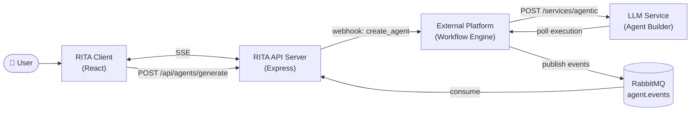

> **Note on strategy modes:** RITA implements both a **direct mode** (calls LLM Service agentic API directly, polls client-side from the API server) and a **workflow mode** (what this doc describes — delegates to the external platform). Toggle via the `AGENT_CREATION_MODE` env var. See Section 2.2 for comparison.

---

## 2. Architecture & Flow Diagrams

### 2.1 System Context

See the Mermaid diagram in Section 1. The 5 actors involved:

| Actor | Owner | Role |
|-------|-------|------|
| User | — | Clicks "Create agent" in the builder UI |
| RITA Client | RITA team | React app; manages state + SSE consumption |
| RITA API Server | RITA team | Express server; sends webhooks + consumes RabbitMQ + emits SSE |
| External Platform | Platform team | Receives webhooks; invokes LLM Service; publishes RabbitMQ events |
| LLM Service | Platform team | Hosts the agent-builder agent + creates the new agent metadata |
| RabbitMQ | Shared infra | Broker for `agent.events` queue |

### 2.2 Strategy Mode Comparison

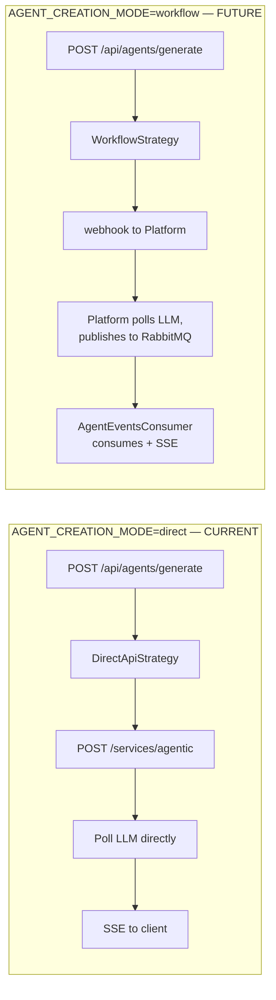

Both strategies are async from the client's perspective (always return a `creation_id` and wait for SSE). The rest of this document describes the **workflow mode** contract.

### 2.3 Component Architecture (RITA files)

> **Audience: RITA developers.** This maps the concrete source files to the architecture.

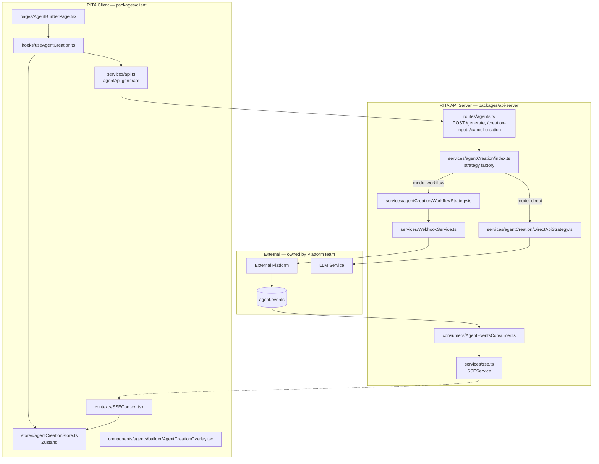

### 2.4 Happy Path — Single-Turn Success

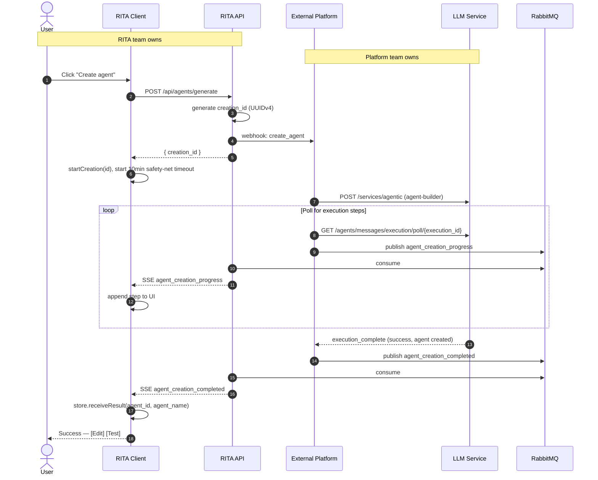

### 2.5 Multi-turn — Agent Requests Input

Happens when the agent-builder agent needs clarification from the user.

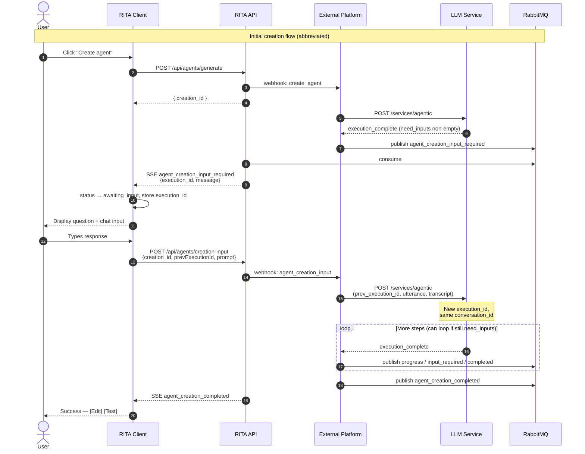

### 2.6 Explicit Cancel

Only triggered by the user clicking **Cancel**, not by navigation away.

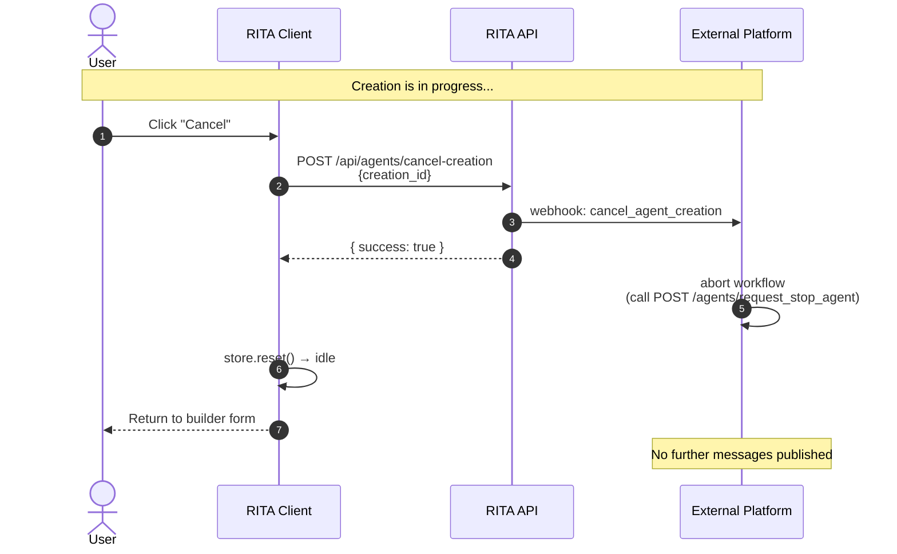

### 2.7 Failure Scenario

Three distinct failure modes — all converge on a single `agent_creation_failed` SSE event so the client only needs one handler.

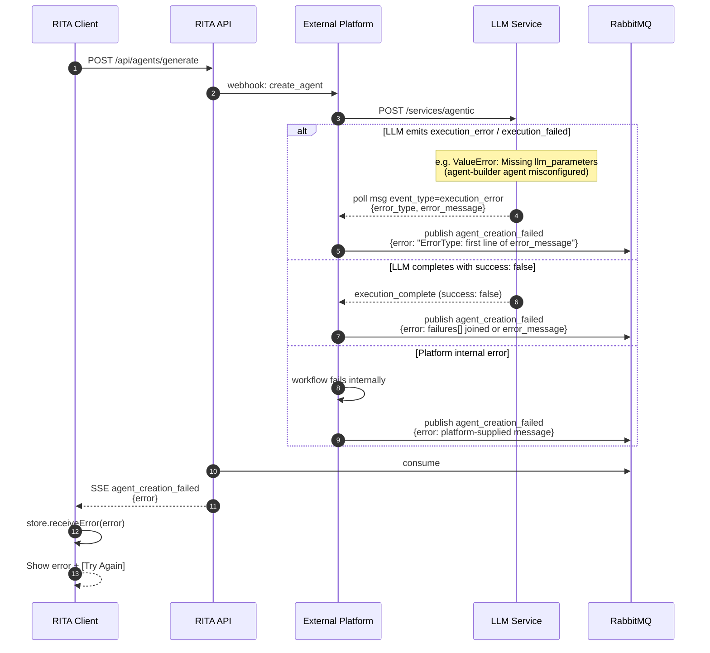

> **Important:** the first branch (`execution_error` / `execution_failed`) is a runtime error inside the LLM service's agent execution — distinct from `execution_complete` with `success: false` (which means the agent ran cleanly but decided it couldn't fulfill the request). RITA's [DirectApiStrategy.ts](../../../packages/api-server/src/services/agentCreation/DirectApiStrategy.ts) handles both as terminal events; the Platform team's workflow must do the same. If you ignore `execution_error` and only watch for `execution_complete`, the user will see a 5-minute silent timeout instead of a clear error.

### 2.8 Timeout Scenario

Two independent deadlines, intentionally decoupled. The **server is authoritative**: it gives up after its own poll budget and emits `agent_creation_failed`. The **client timeout is a pure safety net** for crash / SSE-disconnect scenarios where no terminal event ever arrives.

| Deadline | Where | Value | When it fires |
|---|---|---|---|
| Server poll budget (direct mode) | `MAX_POLL_ATTEMPTS × POLL_INTERVAL_MS` in [DirectApiStrategy.ts](../../../packages/api-server/src/services/agentCreation/DirectApiStrategy.ts) | 100 × 3s = **300s (5 min)** | Loop exhausted → emits `agent_creation_failed` SSE with diagnostic message |
| Client safety net | `CREATION_TIMEOUT_MS` in [useAgentCreation.ts](../../../packages/client/src/hooks/useAgentCreation.ts) | **600s (10 min)** | Only if no SSE terminal event arrived (server crash / dropped connection) |

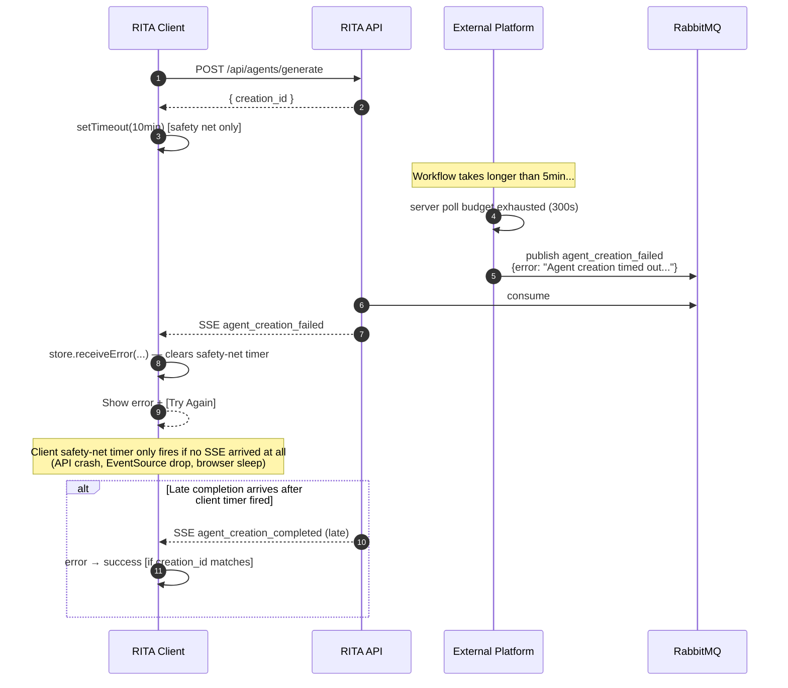

> **Why decoupled?** Earlier the client and server were both 90s and synchronized to the same instant — a late SSE could lose the race against the local timer. Now the server always wins; the client only acts when something has gone genuinely wrong outside the normal flow.

### 2.9 Webhook Retry Logic

`WebhookService` automatically retries on 5xx / 408 / 429 / network errors.

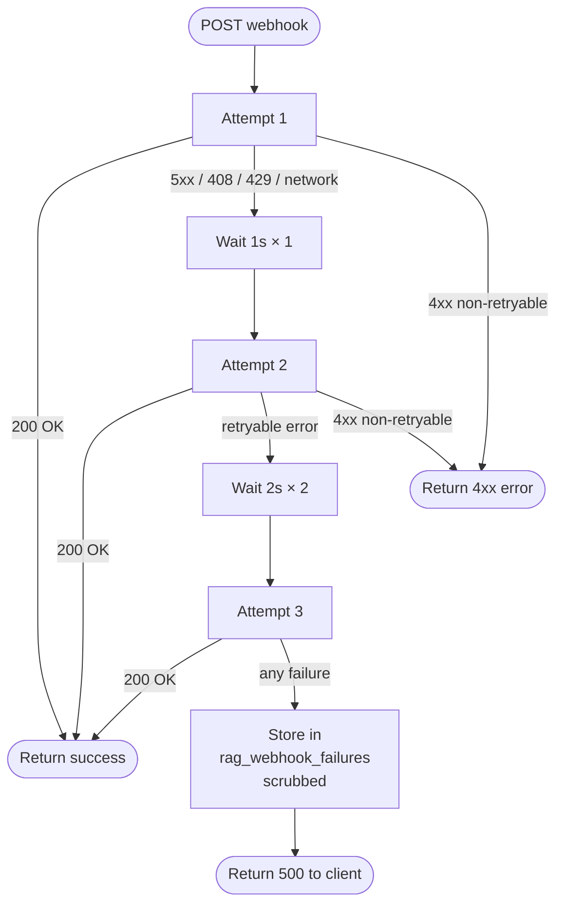

### 2.10 RabbitMQ Message Routing

Platform's decision tree for publishing messages based on what the LLM returns. The Platform must watch for **both** `execution_complete` (normal terminal) **and** `execution_error` / `execution_failed` (runtime error terminal) — see Section 2.7.

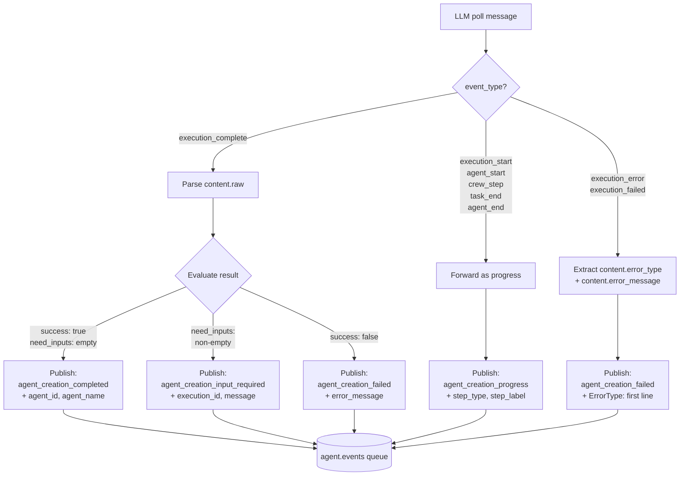

> **Truncate Python tracebacks before publishing.** LLM `error_message` often contains a multi-line traceback. Take the first line for the user-facing payload and keep the full trace in your platform logs (`error_type` + first line is what RITA's UI surfaces).

---

## 3. Platform Responsibilities

> **Audience: Platform team.** This section is a self-contained checklist of everything your workflow engine must do.

### 3.1 Accept webhooks from RITA

Your service must expose an endpoint (configured in RITA via the `AUTOMATION_WEBHOOK_URL` env var) that accepts three `action` values:

| Action | When sent | What you must do |
|--------|-----------|------------------|
| `create_agent` | User clicks Create in RITA | Start a new workflow; invoke agent-builder agent |
| `agent_creation_input` | User responds to a prior `input_required` | Resume the existing workflow using `prev_execution_id` |
| `cancel_agent_creation` | User clicks Cancel | Abort the workflow, call LLM `POST /agents/request_stop_agent` |

Request shapes are detailed in Section 6, Section 7, Section 8. Authentication via `AUTOMATION_AUTH` header.

### 3.2 Invoke the agent-builder agent

When `create_agent` arrives:

```jsonc
POST /services/agentic
{
  "query": {
    "agent_metadata_parameters": {
      "agent_name": "<agent-builder-name>",
      "parameters": {
        "utterance": "<webhook.prompt>",
        "user_id": "<webhook.user_id>",
        "user_email": "<webhook.user_email>",
        "icon_id": "<webhook.icon_id>",
        "icon_color_id": "<webhook.icon_color_id>",
        "conversation_starters": "<webhook.conversation_starters>",  // array, pass as-is
        "guardrails": "<webhook.guardrails>",                        // array, pass as-is
        "agent_type": "user"                                         // hardcoded — see note below
      }
    }
  },
  "tenant": "<webhook.tenant_id>"
}
```

**Webhook → LLM field mapping:**

| RITA Webhook Field | LLM API Field | Notes |
|---|---|---|
| `tenant_id` | `tenant` | Top-level, outside `query` |
| `prompt` | `parameters.utterance` | Primary input to agent-builder |
| `user_id` | `parameters.user_id` | |
| `user_email` | `parameters.user_email` | |
| `icon_id` | `parameters.icon_id` | |
| `icon_color_id` | `parameters.icon_color_id` | |
| `conversation_starters` | `parameters.conversation_starters` | Array, pass as-is |
| `guardrails` | `parameters.guardrails` | Array, pass as-is |
| _(hardcoded)_ | `parameters.agent_type` | Always `"user"`. **Pending LLM API support.** |
| `creation_id` | _(not sent to LLM)_ | Platform stores + echoes on RabbitMQ |

> **Note:** `agent_type` is not yet accepted by the LLM Service agentic API. Include it in the payload now so it is available when the LLM API adds support.

Save the returned `execution_id` and `conversation_id`.

### 3.3 Poll LLM for execution messages

```
GET /agents/messages/execution/poll/{execution_id}?limit=100
```

Poll every 2–3s. Forward each new message (tracked by `id`) to RabbitMQ as `agent_creation_progress`.

### 3.4 Publish to RabbitMQ `agent.events`

**Queue config** (must match RITA's consumer):

| Property | Value |
|----------|-------|
| Queue name | `agent.events` |
| Durable | yes |
| Message format | JSON |
| Max message size | 1 MB |

You publish **4 message types**, discriminated by `type`:

1. `agent_creation_progress` — for every execution step
2. `agent_creation_input_required` — when `execution_complete.content.raw.need_inputs` is non-empty
3. `agent_creation_completed` — when `success: true` AND `need_inputs: []`
4. `agent_creation_failed` — when `success: false` or workflow error

See Section 9 for exact shapes.

### 3.5 Correlation contract

Every RabbitMQ message **MUST** echo back the `creation_id` from the original webhook. RITA uses this to route SSE events to the correct user and to reject stale messages.

For multi-turn: `creation_id` stays the same across all turns, but `execution_id` is new on each resume.

### 3.6 Multi-turn resume

When RITA sends `agent_creation_input`:

```jsonc
POST /services/agentic
{
  "query": {
    "agent_metadata_parameters": {
      "agent_name": "<agent-builder-name>",
      "prev_execution_id": "<from the webhook>",
      "parameters": {
        "utterance": "<user's response>",
        "transcript": "<accumulated conversation JSON>",
        "user_id": "<webhook.user_id>",
        "user_email": "<webhook.user_email>",
        "icon_id": "<webhook.icon_id>",
        "icon_color_id": "<webhook.icon_color_id>",
        "conversation_starters": "<webhook.conversation_starters>",
        "guardrails": "<webhook.guardrails>",
        "agent_type": "user"
      }
    }
  },
  "tenant": "<webhook.tenant_id>"
}
```

Same field mapping from Section 3.2 applies. All metadata parameters should be re-sent on resume.

This returns a **new `execution_id`** but the **same `conversation_id`**. Resume polling on the new `execution_id`.

### 3.7 How to test your implementation

Use curl (or Postman) to simulate RITA sending a `create_agent` webhook:

```bash
curl -X POST "$AUTOMATION_WEBHOOK_URL" \
  -H "Authorization: $AUTOMATION_AUTH" \
  -H "Content-Type: application/json" \
  -d '{
    "source": "rita-chat",
    "action": "create_agent",
    "tenant_id": "test-tenant",
    "user_id": "test-user",
    "user_email": "dev@example.com",
    "creation_id": "550e8400-e29b-41d4-a716-446655440000",
    "prompt": "Create an AI agent that greets users in multiple languages",
    "icon_id": "bot",
    "icon_color_id": "slate",
    "conversation_starters": [],
    "guardrails": [],
    "agent_type": "user",
    "timestamp": "2026-04-10T12:00:00.000Z"
  }'
```

Use a RabbitMQ client (e.g. `amqplib` CLI, Management UI) to publish test messages to `agent.events` and verify they reach the frontend via SSE. Make sure `creation_id` echoes the webhook.

### 3.8 Constraints

| Constraint | Value | Reason |
|------------|-------|--------|
| Max message size | 1 MB | RabbitMQ default |
| Expected completion time | < 5 minutes | Server poll budget is 300s; the user sees a timeout error if no terminal event arrives in that window. Client safety net is 600s. |
| Message ordering | Not required | RITA tolerates out-of-order progress messages |
| Retry on publish failure | Your responsibility | RITA has no retry — if a message is dropped, the creation appears stuck |
| Terminal event coverage | Both `execution_complete` AND `execution_error`/`execution_failed` | If you only handle `execution_complete`, runtime errors silently exhaust the poll budget instead of surfacing the cause |

---

## 4. RITA Responsibilities

> **Audience: RITA developer.** This is what the RITA side must implement/maintain.

### 4.1 HTTP endpoints

| Endpoint | Purpose |
|----------|---------|
| `POST /api/agents/generate` | Start a new creation; returns `creation_id` |
| `POST /api/agents/creation-input` | User's reply to an input request |
| `POST /api/agents/cancel-creation` | Explicit user cancel |

Implementation in `packages/api-server/src/routes/agents.ts`. Details in Section 12.

### 4.2 Webhook sending

Via `WebhookService` (`packages/api-server/src/services/WebhookService.ts`). Auto-retries 3 attempts with exponential backoff. Failed webhooks land in `rag_webhook_failures` table with sensitive fields scrubbed.

### 4.3 RabbitMQ consumption

`AgentEventsConsumer` (`packages/api-server/src/consumers/AgentEventsConsumer.ts`) binds to `agent.events` queue. Registered in `RabbitMQService.startConsumer()`. Dispatches the 4 message types to SSE.

### 4.4 SSE event emission

Via `SSEService` (`packages/api-server/src/services/sse.ts`). 4 new event types added to the `SSEEvent` union. Routed by `userId` (from webhook → message → SSE).

### 4.5 Client state machine

Via Zustand store (`packages/client/src/stores/agentCreationStore.ts`). State transitions documented in Section 11. SSE handlers in `SSEContext.tsx`.

### 4.6 Strategy pattern

The current direct mode (`DirectApiStrategy`) calls the LLM service directly. The workflow mode (`WorkflowStrategy`) is the one described here. Toggle via `AGENT_CREATION_MODE=direct|workflow` env var. See `packages/api-server/src/services/agentCreation/index.ts`.

---

## 5. Glossary & Correlation IDs

| ID | Scope | Generated by | Purpose |
|----|-------|--------------|---------|
| `creation_id` | One full creation flow (may span multi-turn) | **RITA** (UUIDv4 on `POST /generate`) | Correlates webhooks ↔ RabbitMQ ↔ SSE; filters stale messages client-side |
| `execution_id` | One LLM agentic execution | **LLM Service** on `POST /services/agentic` | Platform polls execution by this ID; sent to client on `input_required` |
| `prev_execution_id` | Only on resume | — (copied from previous `execution_id`) | Platform passes to LLM to resume the correct execution |
| `conversation_id` | All executions in the same conversation | **LLM Service** on first call | Stays the same across multi-turn; not used by RITA |
| `agent_id` | The created agent | **LLM Service** on agent creation | Returned in `agent_creation_completed`; used by client to navigate to Edit/Test |

**ID flow per turn:**

1. RITA generates `creation_id` → sent in webhook
2. Platform calls LLM → gets `execution_id`
3. Platform publishes RabbitMQ messages with `creation_id` + (optionally) `execution_id`
4. If agent asks for input, client stores `execution_id` → sends back as `prev_execution_id`
5. Platform resumes with `prev_execution_id` → gets a **new** `execution_id` (same `conversation_id`)

---

## 6. Webhook: `create_agent`

RITA sends this when the user clicks "Create agent" in the agent builder.

### Request

```
POST <AUTOMATION_WEBHOOK_URL>
Authorization: <AUTOMATION_AUTH>
Content-Type: application/json
```

### Payload

```jsonc
{
  "source": "rita-chat",
  "action": "create_agent",
  "tenant_id": "uuid",              // organization ID (maps from organization_id)
  "user_id": "uuid",
  "user_email": "user@example.com",
  "creation_id": "uuid",            // correlation ID -- MUST be returned in all RabbitMQ responses
  "prompt": "Create an AI agent with the following specification:\n\nName: IT Help Desk Agent\n...",
  "icon_id": "headphones",
  "icon_color_id": "blue",
  "conversation_starters": ["How can I help you today?", "Report an IT issue"],  // optional, array of starter prompts
  "guardrails": ["Do not discuss HR policies", "Do not share internal salary data"],  // optional, array of restricted topics
  "agent_type": "user",                  // agent type — always "user" for builder-created agents
  "timestamp": "2026-04-09T12:00:00.000Z"
}
```

### Field Notes

| Field | Required | Notes |
|-------|----------|-------|
| `source` | yes | Always `"rita-chat"` |
| `action` | yes | Always `"create_agent"` |
| `tenant_id` | yes | Maps from `organization_id` in RITA's DB |
| `user_id` | yes | User who triggered the creation |
| `user_email` | yes | For audit/logging and user identification |
| `creation_id` | yes | **Correlation ID** (UUIDv4). Must be echoed back in all RabbitMQ responses |
| `prompt` | yes | Combined form data as natural language instruction (see Section 6.1) |
| `icon_id` | yes | Icon identifier (e.g., `"bot"`, `"headphones"`) |
| `icon_color_id` | yes | Color identifier (e.g., `"slate"`, `"blue"`) |
| `conversation_starters` | no | Array of starter prompts. Also included in `prompt`. Platform stores separately |
| `guardrails` | no | Array of topics/requests the agent should refuse. Also included in `prompt` |
| `agent_type` | yes | Always `"user"` for builder-created agents. Platform forwards as `parameters.agent_type`. **Pending LLM API support.** |
| `timestamp` | yes | ISO 8601 |

> **All agent configuration fields** (name, description, instructions, icon, conversation starters, guardrails, agent type) are included in the `prompt` field. The agent-builder agent parses the prompt to create the agent. Additionally, `conversation_starters`, `guardrails`, and `agent_type` are sent as separate fields so the platform can forward them to the LLM API independently (API support for `agent_type` pending).

### 6.1 Prompt Field Format

The `prompt` field compiles all form data into a single natural language string. This is the primary input the AI workflow uses.

```
Create an AI agent with the following specification:

Name: {name}

Instructions:
{instructions}

Description:
{description}

Conversation Starters:
- {conversationStarters[0]}
- {conversationStarters[1]}
...

Guardrails (topics/requests the agent should NOT handle):
- {guardrails[0]}
- {guardrails[1]}
...
```

The backend compiles this string from the validated request body. The client sends structured JSON; the backend builds the prompt.

---

## 7. Webhook: `cancel_agent_creation`

RITA sends this when the user explicitly clicks "Cancel" during agent creation.

### Payload

```jsonc
{
  "source": "rita-chat",
  "action": "cancel_agent_creation",
  "tenant_id": "uuid",
  "user_id": "uuid",
  "user_email": "user@example.com",
  "creation_id": "uuid",            // correlation ID of the creation to cancel
  "timestamp": "2026-04-09T12:00:30.000Z"
}
```

### Field Notes

| Field | Required | Notes |
|-------|----------|-------|
| `source` | yes | Always `"rita-chat"` |
| `action` | yes | Always `"cancel_agent_creation"` |
| `tenant_id` | yes | Same as original creation request |
| `user_id` | yes | Same as original creation request |
| `user_email` | yes | For audit |
| `creation_id` | yes | Correlation ID of the creation to abort |
| `timestamp` | yes | ISO 8601 |

> **Only triggered by explicit cancel action**, not by navigation. If the user navigates away, the creation continues on the platform side.

---

## 8. Webhook: `agent_creation_input`

RITA sends this when the user responds to an input request from the agent (after receiving `agent_creation_input_required`).

### Payload

```jsonc
{
  "source": "rita-chat",
  "action": "agent_creation_input",
  "tenant_id": "uuid",
  "user_id": "uuid",
  "user_email": "user@example.com",
  "creation_id": "uuid",            // same creation_id — correlates the entire creation flow
  "prev_execution_id": "5e7e7877-...",  // execution_id from the input_required message — platform uses this to resume
  "prompt": "It should handle only IT support tickets. HR requests should be escalated to the HR team.",
  "timestamp": "2026-04-09T12:00:35.000Z"
}
```

### Field Notes

| Field | Required | Notes |
|-------|----------|-------|
| `source` | yes | Always `"rita-chat"` |
| `action` | yes | Always `"agent_creation_input"` |
| `tenant_id` | yes | Same as original creation request |
| `user_id` | yes | Same as original creation request |
| `user_email` | yes | For audit |
| `creation_id` | yes | Same correlation ID — correlates the entire creation flow |
| `prev_execution_id` | yes | The `execution_id` received in the `agent_creation_input_required` message. Platform passes this to `POST /services/agentic` to resume |
| `prompt` | yes | User's response to the agent's question |
| `timestamp` | yes | ISO 8601 |

After receiving this, the platform resumes the agent execution by calling:

```jsonc
POST /services/agentic
{
  "query": {
    "agent_metadata_parameters": {
      "agent_name": "<agent-builder-name>",
      "prev_execution_id": "<previous execution_id>",
      "parameters": {
        "utterance": "<user's response>",
        "transcript": "<accumulated conversation so far>",
        "user_id": "<webhook.user_id>",
        "user_email": "<webhook.user_email>",
        "icon_id": "<webhook.icon_id>",
        "icon_color_id": "<webhook.icon_color_id>",
        "conversation_starters": "<webhook.conversation_starters>",
        "guardrails": "<webhook.guardrails>",
        "agent_type": "user"
      }
    }
  },
  "tenant": "<webhook.tenant_id>"
}
```

See Section 3.2 for the full field mapping table. All metadata parameters should be re-sent on resume.

This returns a **new** `execution_id` but the **same** `conversation_id`. The platform then resumes polling and forwarding progress events. The `creation_id` remains the same throughout the entire conversation loop.

---

## 9. RabbitMQ Response Messages

After the AI workflow starts, the external platform publishes progress and result messages to RabbitMQ.

### Queue

| Property | Value |
|----------|-------|
| **Queue name** | `agent.events` |
| **Env var** | `AGENT_EVENTS_QUEUE` |
| **Durable** | yes |

> `agent.events` is a domain-scoped queue for agent lifecycle events (following the `cluster.events` pattern). Messages are discriminated by the `type` field.

### 9.1 Progress Message (Execution Steps)

Published for each execution step during the AI workflow. Maps to the step types visible in the LLM Service execution UI.

```jsonc
{
  "type": "agent_creation_progress",
  "tenant_id": "uuid",
  "user_id": "uuid",
  "creation_id": "uuid",            // MUST match webhook creation_id
  "step_type": "crew_step",         // execution step type (see table below)
  "step_label": "Agent Builder",    // agent or system name
  "step_detail": "Step Thought: Analyzing instructions to determine agent configuration...",
  "step_index": 3,                  // optional: current step number (1-based)
  "total_steps": 6                  // optional: total step count (if known)
}
```

**`execution_complete` step example** (last step, includes final response):

```jsonc
{
  "type": "agent_creation_progress",
  "tenant_id": "uuid",
  "user_id": "uuid",
  "creation_id": "uuid",
  "step_type": "execution_complete",
  "step_label": "system",
  "step_detail": "execution_complete",
  "final_response": {                // only present on execution_complete
    "success": true,
    "need_inputs": [],
    "terminate": false,
    "error_message": ""
  },
  "step_index": 6,
  "total_steps": 6
}
```

**Execution Step Types:**

These map to the `event_type` values from the LLM Service execution messages (polled via `GET /agents/messages/execution/poll/{execution_id}`).

| `step_type` | Description | Terminal? | Example `step_label` | Example `step_detail` |
|-------------|-------------|-----------|----------------------|-----------------------|
| `execution_start` | Workflow execution begins | no | `"system"` | `"execution_start"` |
| `agent_start` | An agent begins processing | no | `"Agent Builder"` | `"agent_start"` |
| `crew_step` | Intermediate thought/action step | no | `"Agent Builder"` | `"Step Thought: Analyzing instructions..."` |
| `task_end` | A task completes | no | `"task"` | `"task_end"` |
| `agent_end` | An agent finishes processing | no | `"Agent Builder"` | `"agent_end"` |
| `execution_complete` | Workflow execution finishes cleanly | **yes** | `"system"` | `"execution_complete"` |
| `execution_error` | Runtime error inside agent execution | **yes** | `"system"` | `"execution_error"` |
| `execution_failed` | Alternate runtime-failure terminal | **yes** | `"system"` | `"execution_failed"` |

> **Three terminal event types — handle all three.** Stop polling and emit the appropriate `agent.events` message as soon as ANY terminal arrives:
>
> - `execution_complete` → parse `content.raw` and route per Section 2.10 (success / input_required / failed).
> - `execution_error` / `execution_failed` → publish `agent_creation_failed` with `${content.error_type}: ${first line of content.error_message}`. Keep the full traceback in your server logs only.

### 9.2 Input Required Message

Published when the agent needs additional information from the user to continue.

```jsonc
{
  "type": "agent_creation_input_required",
  "tenant_id": "uuid",
  "user_id": "uuid",
  "creation_id": "uuid",            // MUST match webhook creation_id
  "execution_id": "5e7e7877-...",   // current execution ID — MUST be passed back as prev_execution_id
  "message": "I need more details about the agent's role. Should it handle only IT support tickets, or also HR-related requests?",
  "need_inputs": ["role_scope"]     // input field identifiers the agent is requesting
}
```

The client should display the agent's `message` and show a chat input for the user to respond. The `execution_id` must be stored and sent back in the `agent_creation_input` webhook as `prev_execution_id` so the platform can resume the correct execution without maintaining state.

### 9.3 Success Message

Published once when the agent-builder agent has **created the agent** in the LLM Service.

```jsonc
{
  "type": "agent_creation_completed",
  "tenant_id": "uuid",
  "user_id": "uuid",
  "creation_id": "uuid",            // MUST match webhook creation_id
  "status": "success",
  "agent_id": "6efccc35-a41f-4c24-8b87-d4593754bc5f",   // ID of the created agent in LLM Service
  "agent_name": "IT Help Desk Agent"                      // for display in success toast
}
```

### 9.4 Failure Message

Published once when the AI workflow fails. Covers all three failure modes from Section 2.7 (LLM `execution_error`/`execution_failed`, `execution_complete` with `success: false`, and Platform internal error).

```jsonc
{
  "type": "agent_creation_failed",
  "tenant_id": "uuid",
  "user_id": "uuid",
  "creation_id": "uuid",            // MUST match webhook creation_id
  "status": "failed",
  "error_message": "ValueError: [bd57…] Missing llm_parameters",  // ErrorType + first line; full traceback stays in platform logs
  "error_source": "execution_error" // optional: "execution_error" | "execution_complete_failed" | "platform" — for diagnostics
}
```

### Field Notes

| Field | Required | Notes |
|-------|----------|-------|
| `type` | yes | `"agent_creation_progress"`, `"agent_creation_input_required"`, `"agent_creation_completed"`, or `"agent_creation_failed"` |
| `tenant_id` | yes | Echo from webhook |
| `user_id` | yes | Echo from webhook — used to route SSE to correct user |
| `creation_id` | yes | **Echo from webhook** — critical for correlating request ↔ response |
| `step_type` | on progress | `execution_start`, `agent_start`, `crew_step`, `task_end`, `agent_end`, `execution_complete`, `execution_error`, `execution_failed` |
| `step_label` | on progress | Agent or system name for this step |
| `step_detail` | on progress | Human-readable step detail/thought |
| `step_index` | optional | Current step number (1-based) |
| `total_steps` | optional | Total steps (if known) |
| `final_response` | on `execution_complete` | Final JSON from agent: `{ success, need_inputs, terminate, error_message }` |
| `execution_id` | on input_required | Current execution ID — client must pass back as `prev_execution_id` |
| `message` | on input_required | Agent's question to the user |
| `need_inputs` | on input_required | Array of input field identifiers the agent needs |
| `status` | on completion | `"success"` or `"failed"` |
| `agent_id` | on success | ID of the created agent in LLM Service |
| `agent_name` | on success | Name of the created agent (for display) |
| `error_message` | on failure | Human-readable error description |

---

## 10. SSE Events

The `AgentEventsConsumer` consumes RabbitMQ messages and sends SSE events to the client.

### 10.1 `agent_creation_progress`

```jsonc
{
  "type": "agent_creation_progress",
  "data": {
    "creation_id": "uuid",
    "step_type": "crew_step",
    "step_label": "Agent Builder",
    "step_detail": "Step Thought: Analyzing instructions to determine agent configuration...",
    "step_index": 3,
    "total_steps": 6,
    "timestamp": "2026-04-09T12:00:05.000Z"
  }
}
```

**`execution_complete` variant** (last step, rendered in the steps list alongside others):

```jsonc
{
  "type": "agent_creation_progress",
  "data": {
    "creation_id": "uuid",
    "step_type": "execution_complete",
    "step_label": "system",
    "step_detail": "execution_complete",
    "final_response": {
      "success": true,
      "need_inputs": [],
      "terminate": false,
      "error_message": ""
    },
    "step_index": 6,
    "total_steps": 6,
    "timestamp": "2026-04-09T12:00:14.000Z"
  }
}
```

### 10.2 `agent_creation_input_required`

```jsonc
{
  "type": "agent_creation_input_required",
  "data": {
    "creation_id": "uuid",
    "execution_id": "5e7e7877-...",
    "message": "I need more details about the agent's role. Should it handle only IT support tickets, or also HR-related requests?",
    "need_inputs": ["role_scope"],
    "timestamp": "2026-04-09T12:00:08.000Z"
  }
}
```

### 10.3 `agent_creation_completed`

```jsonc
{
  "type": "agent_creation_completed",
  "data": {
    "creation_id": "uuid",
    "agent_id": "6efccc35-a41f-4c24-8b87-d4593754bc5f",
    "agent_name": "IT Help Desk Agent",
    "timestamp": "2026-04-09T12:00:15.000Z"
  }
}
```

### 10.4 `agent_creation_failed`

```jsonc
{
  "type": "agent_creation_failed",
  "data": {
    "creation_id": "uuid",
    "error": "Unable to generate agent configuration: insufficient context provided",
    "timestamp": "2026-04-09T12:00:10.000Z"
  }
}
```

---

## 11. Client State Machine

### 11.1 Zustand Store (`agentCreationStore`)

Follows the `knowledgeGenerationStore` pattern.

```
State:
  creationId: string | null
  executionId: string | null          // current execution_id, passed back as prev_execution_id on input
  status: "idle" | "creating" | "awaiting_input" | "success" | "error"
  executionSteps: ExecutionStep[]     // accumulated list of execution steps
  inputMessage: string | null         // agent's question when awaiting_input
  agentId: string | null              // ID of created agent on success
  agentName: string | null            // name for display on success
  error: string | null

  // ExecutionStep shape:
  // { stepType, stepLabel, stepDetail, stepIndex?, totalSteps?, timestamp }

Actions:
  startCreation(creationId)           // idle -> creating
  receiveProgress(step)               // append to executionSteps
  receiveInputRequired(message, executionId)  // creating -> awaiting_input, stores executionId
  resumeCreation()                    // awaiting_input -> creating (after user sends input)
  receiveResult(agentId, agentName)   // creating -> success
  receiveError(error)                 // creating -> error
  timeout()                           // creating -> error (safety net, 600s — server SSE normally lands first)
  reset()                             // any -> idle
```

### 11.2 State Transitions

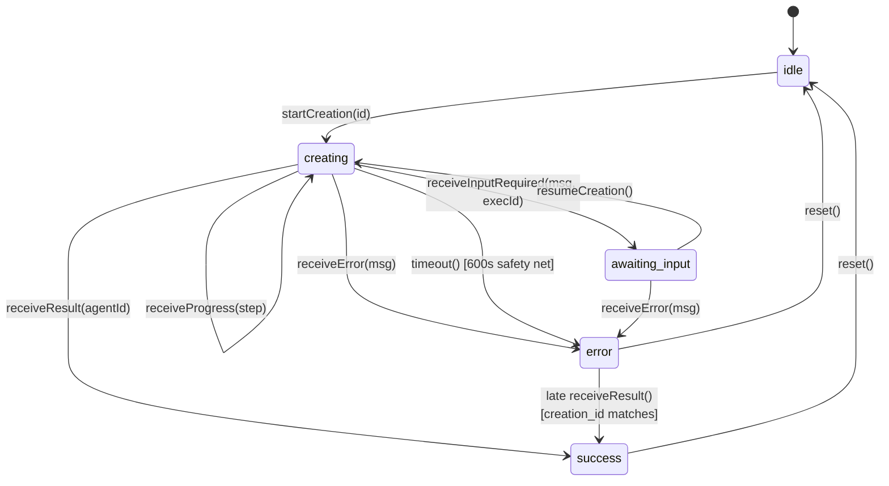

### 11.3 UI Behavior by State

| State | UI | Toast |
|-------|-----|-------|
| `idle` | Normal agent builder form | — |
| `creating` (no progress) | Inline view with spinner + "Creating your agent..." | — |
| `creating` (with steps) | Execution steps list rendered like LLM Service UI (showing step type + label + detail). New steps append in real-time. | — |
| `awaiting_input` | Execution steps list + agent's question displayed as a message + **chat input** for user to type response | — |
| `success` | Overlay transitions to success. Show **"Edit Agent"** and **"Test Agent"** buttons | `ritaToast.success({ title: "Agent created successfully" })` |
| `error` | Overlay transitions to error with retry button | `ritaToast.error({ title: "Agent creation failed", description: error })` |
| `error` (timeout) | Same as error | `ritaToast.error({ title: "Agent creation timed out", description: "Please try again." })` |

### 11.4 Success Flow

On `success`, the agent has already been **created in the LLM Service** by the agent-builder agent. The response includes the `agent_id` of the created agent.

1. Shows success state with agent name
2. Shows **"Edit Agent"** button → navigates to `/agents/{agent_id}` (existing builder page in edit mode)
3. Shows **"Test Agent"** button → navigates to `/agents/{agent_id}/test`
4. Client invalidates the agents list query cache so the new agent appears in the table

### 11.5 Cancel vs Navigate Away

**Cancel button click:**
1. Client calls `POST /api/agents/cancel-creation` with `creation_id`
2. Backend sends `cancel_agent_creation` webhook to platform
3. Platform aborts the workflow
4. Client resets store to `idle`

**Navigate away (no cancel):**
1. Agent creation **continues on the platform side**
2. Client resets store on unmount
3. Agent will appear in the agents list when the user returns

### 11.6 Timeout

Two independent deadlines (see Section 2.8 for the full picture):

- **Server poll budget (authoritative): 300s.** When the server's poll loop in [DirectApiStrategy.ts](../../../packages/api-server/src/services/agentCreation/DirectApiStrategy.ts) (direct mode) or the Platform's workflow (workflow mode) runs out, it emits an `agent_creation_failed` SSE with a diagnostic message. This is the timeout users normally see.
- **Client safety net: 600s.** A local `setTimeout` in [useAgentCreation.ts](../../../packages/client/src/hooks/useAgentCreation.ts) calls `store.timeout()` only if no terminal SSE event arrived (server crash, EventSource drop, browser sleep). It's deliberately well above the server budget so the server's own SSE always wins in normal flows.
- The agent creation continues on the server/platform side regardless of the client safety net firing — late-arriving success events are accepted (`error → success` if `creation_id` matches).

---

## 12. Backend Endpoints

### 12.1 `POST /api/agents/generate`

Triggers agent creation workflow.

**Request Body:**

```jsonc
{
  "name": "IT Help Desk Agent",           // required
  "description": "...",                   // optional
  "instructions": "...",                  // optional but required for UI to enable Create button
  "iconId": "headphones",                 // optional, default: "bot"
  "iconColorId": "blue",                  // optional, default: "slate"
  "conversationStarters": ["How can I help you today?"],  // optional
  "guardrails": ["Do not discuss HR policies"]  // optional
}
```

The backend compiles all form fields into the `prompt` string before sending to the platform (or LLM Service in direct mode). `conversationStarters` and `guardrails` are also sent as separate arrays so the platform can store them independently (API support pending).

**Response:**

```jsonc
{
  "mode": "async",
  "creationId": "550e8400-e29b-41d4-a716-446655440000"
}
```

### 12.2 `POST /api/agents/creation-input`

Sends user's response when the agent requests additional input.

**Request Body:**

```jsonc
{
  "creationId": "550e8400-e29b-41d4-a716-446655440000",
  "prevExecutionId": "5e7e7877-...",
  "prompt": "It should handle only IT support tickets. HR requests should be escalated."
}
```

**Response:**

```jsonc
{
  "success": true
}
```

### 12.3 `POST /api/agents/cancel-creation`

Cancels an in-progress agent creation. Only called on explicit cancel button click (not on navigation away).

**Request Body:**

```jsonc
{
  "creationId": "550e8400-e29b-41d4-a716-446655440000"
}
```

**Response:**

```jsonc
{
  "success": true
}
```

---

## 13. Error Recovery & Edge Cases

| Scenario | Handling |
|----------|----------|
| Webhook POST fails (network/5xx) | `WebhookService` retry logic (3 attempts, exponential backoff). All fail → return 500 to client. Store in `rag_webhook_failures`. See Section 2.9. |
| Platform returns error via RabbitMQ | `agent_creation_failed` SSE event. Client shows error + retry button. See Section 2.7. |
| SSE connection drops during creation | Client reconnects automatically (existing `useSSE` hook). Late event accepted if `creation_id` matches and store is still in `creating` state. |
| Timeout fires but result arrives late | Accept late success — transition `error` → `success` if `creation_id` matches. Better UX than ignoring a valid result. See Section 2.8. |
| User clicks Cancel | Cancel webhook sent. Platform aborts workflow. Store resets to idle. See Section 2.6. |
| User navigates away (no cancel) | Agent creation continues on platform. Store resets on unmount. Agent appears in agents list when user returns. |
| Duplicate `creation_id` messages | Idempotent: progress overwrites previous; completed/failed are terminal. |
| Unknown `type` on queue | Consumer logs error and nacks without requeue. |

---

## 14. Implementation Files

| File | Role | Status |
|------|------|--------|
| `packages/api-server/src/routes/agents.ts` | HTTP endpoints (generate/creation-input/cancel-creation) | ✅ DONE |
| `packages/api-server/src/schemas/agent.ts` | Zod schemas for request bodies | ✅ DONE |
| `packages/api-server/src/services/agentCreation/index.ts` | Strategy factory (`AGENT_CREATION_MODE` switch) | ✅ DONE |
| `packages/api-server/src/services/agentCreation/types.ts` | Strategy interface + param/result types | ✅ DONE |
| `packages/api-server/src/services/agentCreation/DirectApiStrategy.ts` | Direct LLM Service polling (current mode) | ✅ DONE |
| `packages/api-server/src/services/agentCreation/WorkflowStrategy.ts` | Webhook-based mode (described in this doc) | ⚠️ SKELETON — complete when platform workflow is ready |
| `packages/api-server/src/services/agentCreation/buildPrompt.ts` | Compiles form data into agent-builder prompt | ✅ DONE |
| `packages/api-server/src/services/WebhookService.ts` | Sends webhooks with retry | ✅ DONE (reused) |
| `packages/api-server/src/types/webhook.ts` | Webhook payload types | ✅ DONE |
| `packages/api-server/src/consumers/AgentEventsConsumer.ts` | RabbitMQ consumer for `agent.events` | ✅ DONE |
| `packages/api-server/src/types/agent-events.ts` | TypeScript types for RabbitMQ messages | ✅ DONE |
| `packages/api-server/src/services/rabbitmq.ts` | Registers `AgentEventsConsumer` | ✅ DONE |
| `packages/api-server/src/services/sse.ts` | 4 new SSE event types added to union | ✅ DONE |
| `packages/client/src/stores/agentCreationStore.ts` | Zustand state machine | ✅ DONE |
| `packages/client/src/hooks/useAgentCreation.ts` | Orchestration hook (mutation + store + timeout) | ✅ DONE |
| `packages/client/src/contexts/SSEContext.tsx` | Handlers for 4 new SSE events | ✅ DONE |
| `packages/client/src/services/EventSourceSSEClient.ts` | Client-side SSE event type union | ✅ DONE |
| `packages/client/src/hooks/api/useAgents.ts` | `useGenerateAgent`, `useAgentCreationInput`, `useCancelAgentCreation` hooks | ✅ DONE |
| `packages/client/src/services/api.ts` | `agentApi.generate/sendCreationInput/cancelCreation` methods | ✅ DONE |
| `packages/client/src/components/agents/builder/AgentCreationOverlay.tsx` | Inline progress/success/error UI | ✅ DONE |
| `packages/client/src/pages/AgentBuilderPage.tsx` | Create Agent button wiring + overlay rendering | ✅ DONE |

### What's left for workflow mode activation

1. Platform team implements the webhook handler + RabbitMQ publishing per Section 3.
2. Set `AGENT_CREATION_MODE=workflow` in RITA's `.env`.
3. Set `AUTOMATION_WEBHOOK_URL` to the platform's endpoint.
4. Restart RITA API server. No code changes required.
