# Agent Developer Workflow — Integration Spec

> Integration contract between RITA (API server + client) and the External Platform / LLM Service for the **agent developer** workflow — both creating new agents and updating existing ones. RITA owns all deterministic metadata (name, description, icons, starters, guardrails, admin_type, tenant, audit); the `AgentRitaDeveloper` meta-agent runs in **UPDATE mode only** and is responsible exclusively for turning the user's instructions prose into structured sub-tasks.

---

## 📖 How to read this document

| If you are… | Read these sections |
|-------------|---------------------|
| A **RITA developer** | Section 1, Section 2.3, Section 4 (RITA Responsibilities), Sections 6–14 |
| A **Platform team engineer** building the external workflows | Section 1, Section 2.1, Sections 2.4–2.10, Section 3 (Platform Responsibilities), Section 5 (Correlation IDs), Section 6 (WF1), Sections 7–9 (WF2), Section 10 (RabbitMQ) |
| A **future maintainer** debugging this feature | Section 1 (Overview), Section 2 (all scenarios), Section 5 (Glossary), Section 15 (Files) |

---

## 1. Overview

### Two Platform workflows, orchestrated by RITA

Every agent create/update in `workflow` mode is driven by **two separate Platform workflows** that RITA fires in sequence. RITA owns the orchestration; the Platform owns each half end-to-end.

1. **WF1 — `upsert_agent_metadata` (synchronous, cheap).**
   RITA POSTs a webhook to Platform WF1 with the deterministic metadata (`name`, `description`, `ui_configs.{icon, icon_color}`, `conversation_starters`, `guardrails`, `admin_type`, `tenant`, `sys_created_by`/`sys_updated_by`, plus optional `target_agent_eid`). The Platform workflow calls `POST /agents/metadata` (if no `target_agent_eid`) or `PUT /agents/metadata/eid/{eid}` (if present) on the LLM Service and **returns the agent `eid` in the HTTP response**. No LLM reasoning, no queue — just a write. RITA blocks on this response because the `eid` is required to fire WF2.

2. **WF2 — `run_agent_developer` (asynchronous, expensive).**
   RITA POSTs a second webhook to Platform WF2 with `target_agent_eid` (from WF1's response) plus the compiled prompt (instructions + optional change request), `tenant`, and `user_email`. WF2 invokes `AgentRitaDeveloper` via `POST /services/agentic`, polls the execution, and publishes progress/terminal events on RabbitMQ `agent.events`. The meta-agent's **only** job is to call `ai_create_new_agent_task` / `ai_update_agent_task` for sub-tasks scoped to `target_agent_eid`; it is explicitly instructed to NOT patch `agent_metadata`.

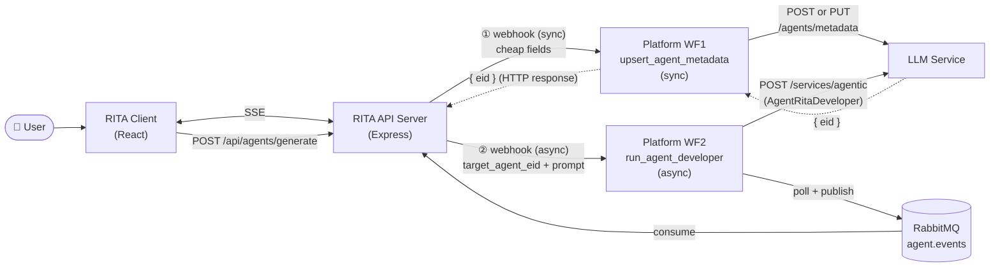

### Why two workflows

The previous design let AgentRitaDeveloper decide the agent's `name`, `tenant`, icons, etc. That produced a rolling list of bugs — name normalization ("Support Triage" → "support_triage"), tenant-in-PUT 500s, missing icons, dropped guardrails — because an LLM is non-deterministic and those fields don't need reasoning. Pulling metadata out of the LLM's scope removes the surface area entirely. The meta-agent now has one narrow, LLM-appropriate job: prose → structured sub-tasks.

Splitting the Platform side into **two workflows** (rather than one workflow that does both writes) matches the two distinct concerns:

- WF1 is a **fast, deterministic write** — no LLM, no polling, no queue. A sync HTTP call keeps RITA's orchestration simple: fire, get `eid`, proceed.
- WF2 is a **long-running LLM execution** — polling, multi-turn, failure modes, progress streaming. This is where the async queue-based contract pays off.

Keeping them separate lets the Platform team iterate on each workflow independently (e.g. swap out the metadata writer without touching the meta-agent runner) and gives RITA a clean rollback point: if WF1 succeeds but WF2 fails, RITA knows exactly which `eid` to `DELETE` on CREATE.

> **Strategy modes.** RITA implements a **direct mode** (API server calls LLM Service directly for both phases and polls itself; default for dev/testing) and a **workflow mode** (both phases delegated to Platform WF1 + WF2 as described above). Toggle via `AGENT_CREATION_MODE=direct|workflow`. See Section 2.2. Only `workflow` mode is reshaped by this doc — `direct` mode is unchanged and continues to hit `/agents/metadata` and `/services/agentic` directly.
>
> **Cheap-only UPDATE bypass.** When the user edits only cheap fields (name, description, icons, starters, guardrails, admin_type) and leaves instructions untouched, the client uses `PUT /api/agents/:eid` which stays as a direct RITA→LLM PUT in **both** modes — it never touches WF1 or WF2. WF1 is reserved for flows that will continue into WF2.

---

## 2. Architecture & Flow Diagrams

### 2.1 System Context

See the Mermaid diagram in Section 1. The actors involved:

| Actor | Owner | Role |
|-------|-------|------|
| User | — | Clicks "Create agent" / "Update agent" in the builder UI |
| RITA Client | RITA team | React app; manages state + SSE consumption |
| RITA API Server | RITA team | Express server; orchestrates WF1 + WF2 webhooks; consumes RabbitMQ; emits SSE |
| External Platform — WF1 | Platform team | `upsert_agent_metadata` — synchronous; writes cheap fields to LLM Service; returns `eid` |
| External Platform — WF2 | Platform team | `run_agent_developer` — asynchronous; invokes AgentRitaDeveloper; polls execution; publishes RabbitMQ events |
| LLM Service | Platform team | Hosts `/agents/metadata` (called by WF1) and `/services/agentic` + AgentRitaDeveloper (called by WF2) |
| RabbitMQ | Shared infra | Broker for `agent.events` queue (WF2 output) |

### 2.2 Strategy Mode Comparison

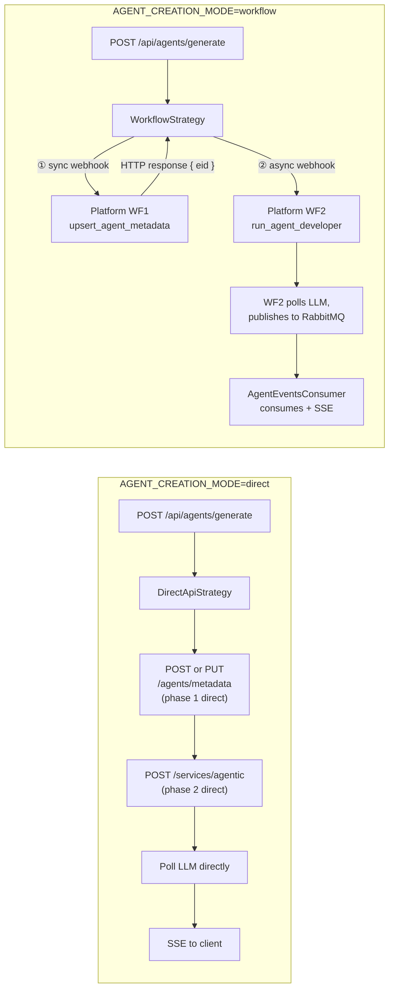

Both strategies are async from the client's perspective (return a `creation_id` immediately; terminal events arrive via SSE). The rest of this document describes the **workflow mode** contract. `direct` mode keeps the legacy single-process shape and is out of scope here except as a fallback.

### 2.3 Component Architecture (RITA files)

> **Audience: RITA developers.** This maps the concrete source files to the architecture.

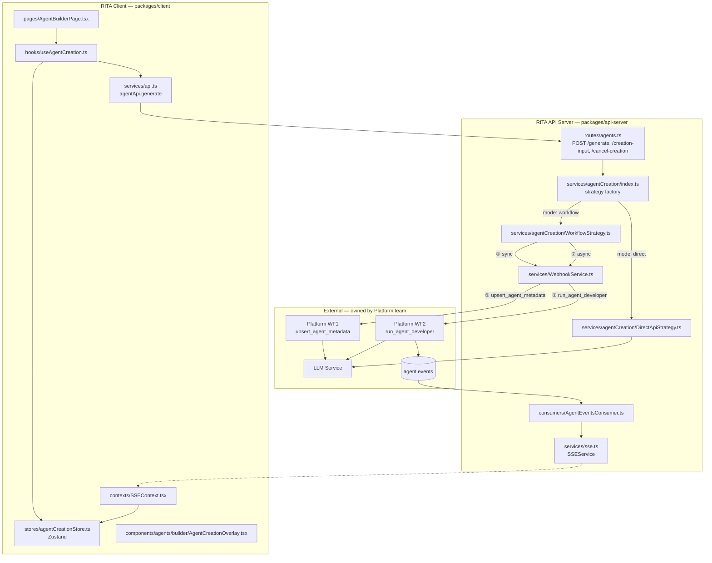

### 2.4 Happy Path — CREATE, Single-Turn Success

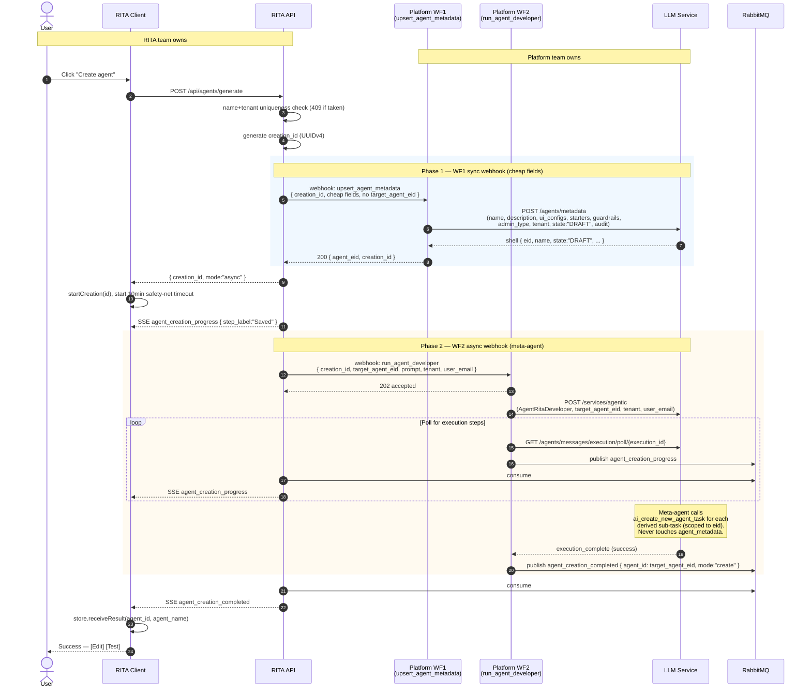

> **Rollback on failure:** if WF2 fails (meta-agent error or timeout) on a CREATE flow, RITA calls `DELETE /agents/metadata/eid/{target_agent_eid}` to clean up the orphan shell that WF1 just created. User never sees a half-created draft. Logic lives in `WorkflowStrategy.rollbackShellIfNeeded` (and mirrored in `DirectApiStrategy` for direct mode). UPDATE flows never roll back — the row is the user's pre-existing agent.

### 2.5 Multi-turn — Agent Requests Input

Happens when AgentRitaDeveloper needs clarification from the user. Input-required / resume all happens against **WF2** — WF1 does not re-fire on multi-turn.

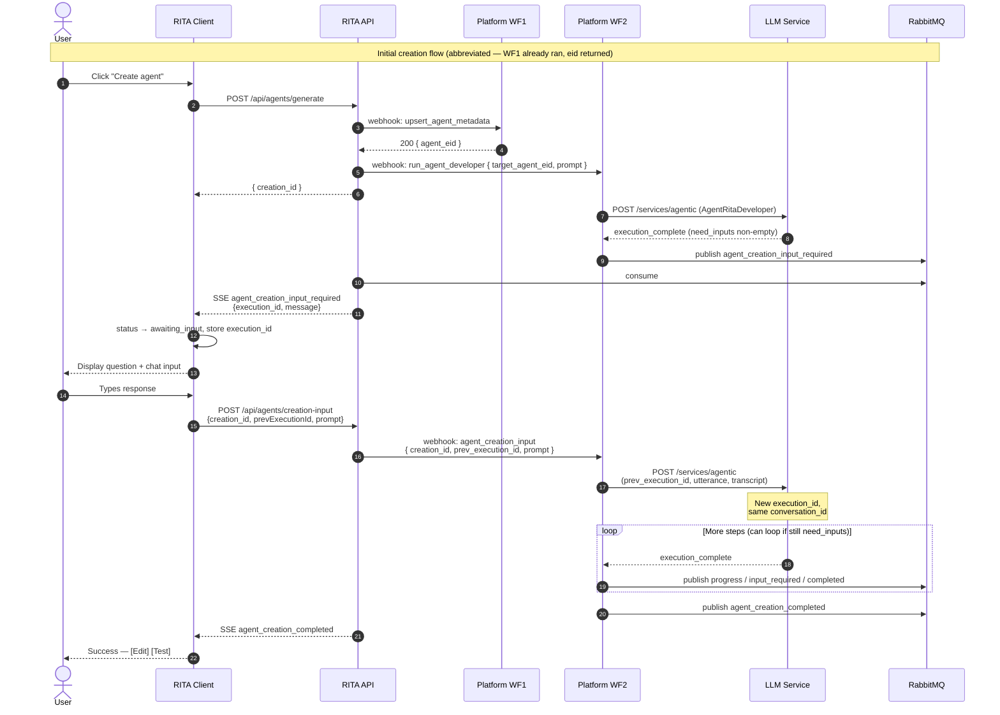

### 2.6 Explicit Cancel

Only triggered by the user clicking **Cancel**, not by navigation away. Cancel targets **WF2** (the long-running workflow); WF1 is sync and always completes before cancel is possible.

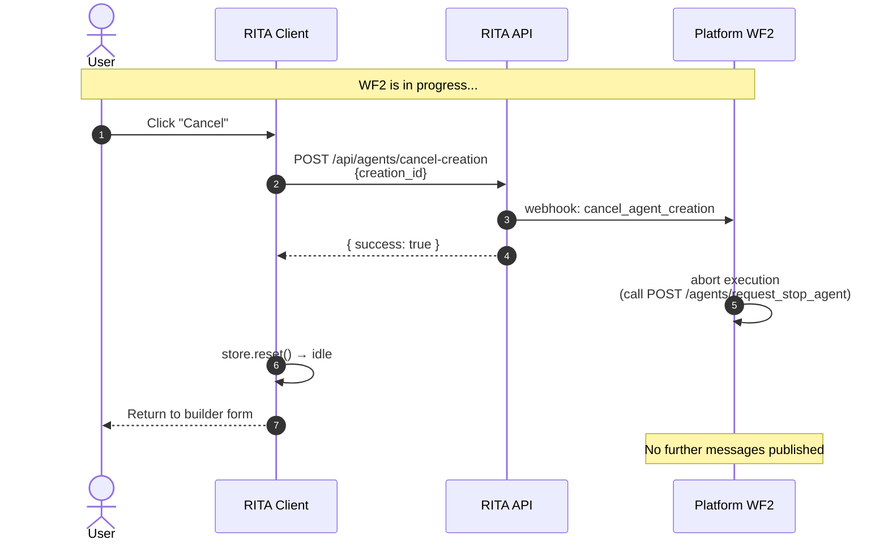

> **Orphan shell on cancel:** if the user cancels a CREATE flow after WF1 succeeded but before WF2 completed, RITA deletes the shell via `DELETE /agents/metadata/eid/{target_agent_eid}` once WF2 acknowledges cancellation. Same cleanup path as WF2 failure.

### 2.7 Failure Scenario

Failures can land at **two different points** — in WF1 (sync, surfaces as an HTTP error to RITA) or in WF2 (async, surfaces via RabbitMQ). RITA converges both onto a single `agent_creation_failed` SSE event so the client only needs one handler.

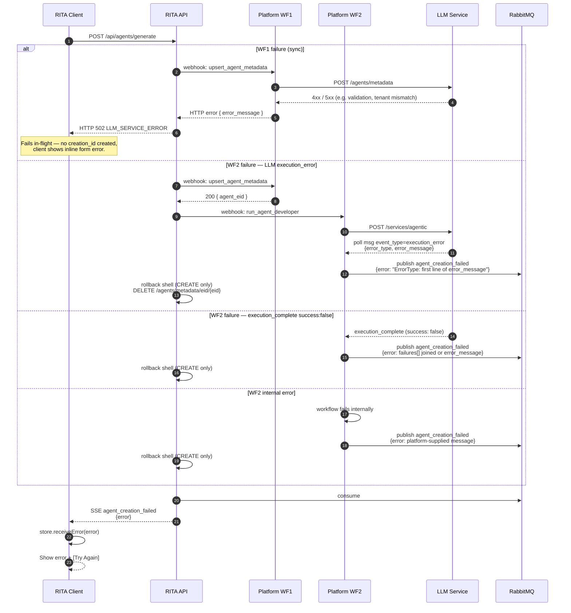

> **WF1 vs WF2 failure surface.** WF1 is synchronous — RITA blocks on the HTTP response, so WF1 errors bubble up as a non-202 response to `POST /api/agents/generate` and the client sees a form-level error immediately (no `creation_id` ever issued). WF2 errors arrive asynchronously via `agent.events` and flow through the SSE path.
>
> **LLM execution_error vs execution_complete(success:false).** The first is a runtime error inside the LLM service's agent execution — distinct from `execution_complete` with `success: false` (which means the agent ran cleanly but decided it couldn't fulfill the request). RITA's [DirectApiStrategy.ts](../../../packages/api-server/src/services/agentCreation/DirectApiStrategy.ts) handles both as terminal events; WF2 must do the same. If WF2 ignores `execution_error` and only watches for `execution_complete`, the user will see a 5-minute silent timeout instead of a clear error.

### 2.8 Timeout Scenario

Two independent deadlines, intentionally decoupled. The **server is authoritative**: it gives up after its own poll budget and emits `agent_creation_failed`. The **client timeout is a pure safety net** for crash / SSE-disconnect scenarios where no terminal event ever arrives.

| Deadline | Where | Value | When it fires |
|---|---|---|---|
| Server poll budget (direct mode) | `MAX_POLL_ATTEMPTS × POLL_INTERVAL_MS` in [DirectApiStrategy.ts](../../../packages/api-server/src/services/agentCreation/DirectApiStrategy.ts) | 100 × 3s = **300s (5 min)** | Loop exhausted → emits `agent_creation_failed` SSE with diagnostic message |
| Client safety net | `CREATION_TIMEOUT_MS` in [useAgentCreation.ts](../../../packages/client/src/hooks/useAgentCreation.ts) | **600s (10 min)** | Only if no SSE terminal event arrived (server crash / dropped connection) |

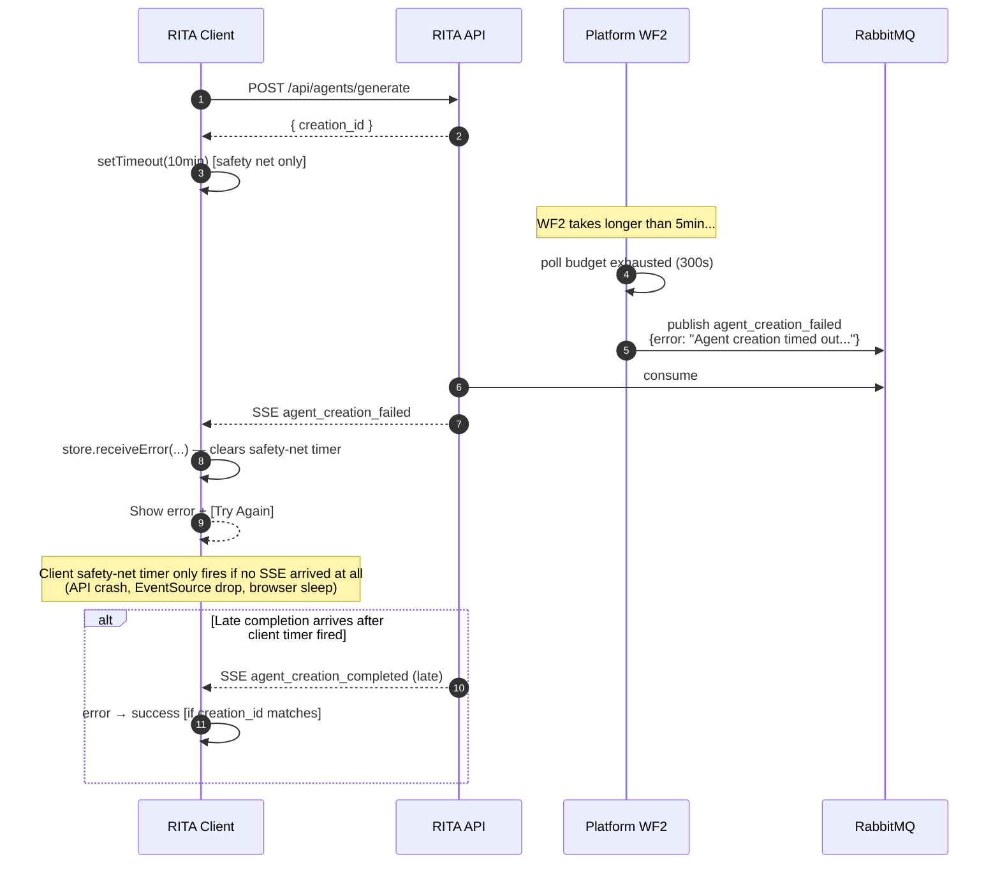

> **WF1 has no timeout story** — it's a bounded synchronous call (LLM metadata write ~200–500ms). RITA's HTTP client gives it a 10s budget; if it exceeds that, `POST /api/agents/generate` returns `502 LLM_SERVICE_ERROR` and no `creation_id` is issued.

> **Why decoupled?** Earlier the client and server were both 90s and synchronized to the same instant — a late SSE could lose the race against the local timer. Now the server always wins; the client only acts when something has gone genuinely wrong outside the normal flow.

### 2.9 Webhook Retry Logic

`WebhookService` automatically retries on 5xx / 408 / 429 / network errors.

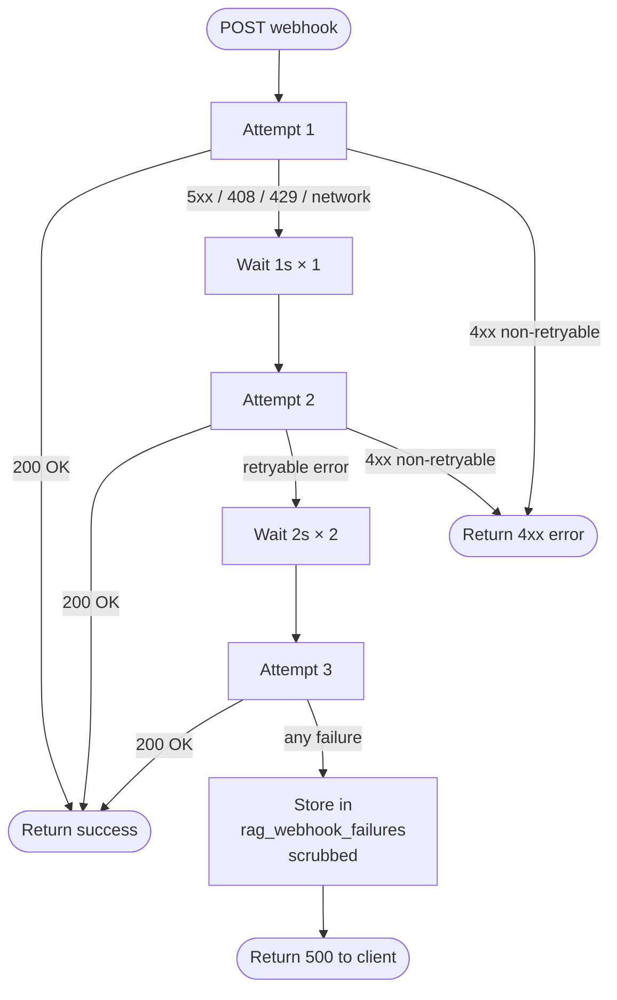

### 2.10 RabbitMQ Message Routing

WF2's decision tree for publishing messages based on what the LLM returns. WF2 must watch for **both** `execution_complete` (normal terminal) **and** `execution_error` / `execution_failed` (runtime error terminal) — see Section 2.7. (WF1 never publishes to RabbitMQ — it responds synchronously over HTTP.)

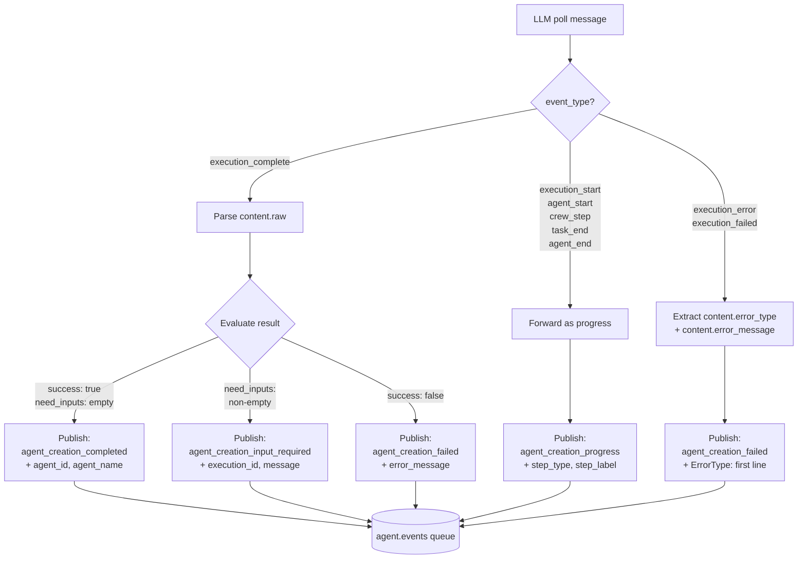

> **Truncate Python tracebacks before publishing.** LLM `error_message` often contains a multi-line traceback. Take the first line for the user-facing payload and keep the full trace in your platform logs (`error_type` + first line is what RITA's UI surfaces).

### 2.11 Update flow — happy path

Triggered when the user clicks **Update agent** on the edit page for an existing agent. Two sub-flows depending on what changed:

- **Cheap-only change** → RITA hits `PUT /api/agents/:eid` which goes **direct to LLM** (no Platform workflows involved, regardless of mode).
- **Instructions / sub-tasks change (expensive)** → RITA fires WF1 (PUT variant, `target_agent_eid` present) then WF2 (`run_agent_developer` with the same `target_agent_eid`). Same two-workflow shape as CREATE, the difference is WF1's LLM call is a `PUT` not a `POST`.

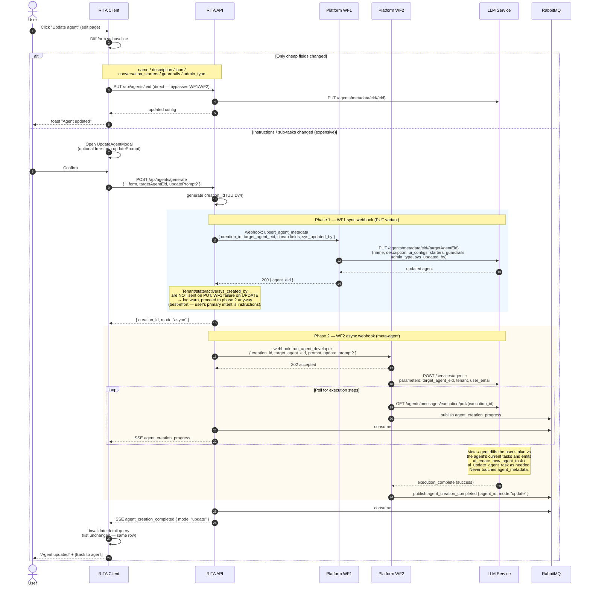

Key points:

- **WF1 is always fired** on expensive UPDATE — even if the user only edited instructions, RITA re-applies the full cheap field set through WF1. This is idempotent (same values → no-op) and guarantees the meta-agent sees a correct snapshot.
- **WF1 failure on UPDATE is non-fatal.** RITA logs the failure and proceeds to WF2 (the user's primary intent is the instruction change). On CREATE, WF1 failure is fatal — no `eid` to target.
- **User's existing agent is NOT rolled back** on WF2 failure. `shellAlreadyCreated=false` in UPDATE mode — only fresh shells (CREATE) are eligible for deletion on failure.
- **Success SSE carries `mode: "update"`.** Client renders "Agent updated" copy with a single "Back to agent" CTA; the agents-list cache is **not** invalidated (same row).
- **Failure + timeout handling** (2.7, 2.8) apply unchanged.

---

## 3. Platform Responsibilities

> **Audience: Platform team.** This section is a self-contained checklist for the two workflows your engine must expose.

### 3.1 Expose two webhook endpoints

RITA configures two URLs via env vars:

| Env var | Workflow | Contract |
|---------|----------|----------|
| `AGENT_METADATA_WORKFLOW_URL` | WF1 `upsert_agent_metadata` | **Synchronous** — RITA blocks on the HTTP response. Must return `{ agent_eid, creation_id }` within a ~10s budget. |
| `AGENT_DEVELOPER_WORKFLOW_URL` | WF2 `run_agent_developer` | **Asynchronous** — respond 202 immediately; stream progress/terminals via RabbitMQ `agent.events`. |

Both share the `AUTOMATION_AUTH` header for authentication.

Actions dispatched to each workflow:

| Workflow | Action values |
|----------|---------------|
| WF1 | `upsert_agent_metadata` (CREATE if no `target_agent_eid`, UPDATE if present) |
| WF2 | `run_agent_developer` (initial turn), `agent_creation_input` (resume), `cancel_agent_creation` (abort) |

Request shapes are detailed in Section 6 (WF1) and Section 7 (WF2, including resume + cancel).

### 3.2 WF1 — Implement `upsert_agent_metadata` (synchronous)

When a webhook arrives on `AGENT_METADATA_WORKFLOW_URL`, WF1 calls the LLM Service `/agents/metadata` endpoint and returns the resulting `eid` to RITA in the HTTP response.

**On CREATE (no `target_agent_eid`):**

```jsonc
POST /agents/metadata
{
  "name": "<webhook.name>",
  "description": "<webhook.description>",
  "tenant": "<webhook.tenant_id>",
  "state": "DRAFT",
  "active": true,
  "admin_type": "<webhook.admin_type>",
  "ui_configs": {
    "icon": "<webhook.icon_id>",
    "icon_color": "<webhook.icon_color_id>"
  },
  "conversation_starters": "<webhook.conversation_starters>",
  "guardrails": "<webhook.guardrails>",
  "sys_created_by": "<webhook.user_email>",
  "sys_updated_by": "<webhook.user_email>"
}
```

**On UPDATE (`target_agent_eid` present):**

```jsonc
PUT /agents/metadata/eid/{target_agent_eid}
{
  "name": "<webhook.name>",
  "description": "<webhook.description>",
  "admin_type": "<webhook.admin_type>",
  "ui_configs": { "icon": "...", "icon_color": "..." },
  "conversation_starters": "<...>",
  "guardrails": "<...>",
  "sys_updated_by": "<webhook.user_email>"
  // NOTE: do NOT send tenant / state / active / sys_created_by on PUT
}
```

**Response to RITA:**

```jsonc
{
  "creation_id": "<echo from webhook>",
  "agent_eid": "<eid returned by LLM Service>"
}
```

**Error handling.** LLM Service 4xx/5xx responses propagate to RITA as non-2xx with a JSON body `{ error_message, error_source: "llm_service" | "workflow" }`. RITA surfaces this as a form-level error on CREATE (fatal — no `creation_id` issued) and logs-then-proceeds on UPDATE (non-fatal — phase 2 still runs).

**Do NOT publish to RabbitMQ from WF1** — it's a pure sync call. Success + failure both travel over the HTTP response.

### 3.3 WF2 — Implement `run_agent_developer` (asynchronous)

When a webhook arrives on `AGENT_DEVELOPER_WORKFLOW_URL` with action `run_agent_developer`, WF2 invokes AgentRitaDeveloper:

```jsonc
POST /services/agentic
{
  "query": {
    "agent_metadata_parameters": {
      "agent_name": "AgentRitaDeveloper",
      "parameters": {
        "utterance": "<webhook.prompt>",
        "target_agent_eid": "<webhook.target_agent_eid>",  // always present
        "user_email": "<webhook.user_email>"               // used for sub-task audit only
      }
    }
  },
  "tenant": "<webhook.tenant_id>"
}
```

**Minimal-payload rationale.** AgentRitaDeveloper runs in UPDATE mode **only** — it never creates agents itself. WF1 has already written the agent row (shell on CREATE, updated row on UPDATE) with every deterministic metadata field. The meta-agent's job is exclusively to emit `ai_create_new_agent_task` / `ai_update_agent_task` calls against `target_agent_eid`.

**Webhook → LLM field mapping:**

| RITA Webhook Field | LLM API Field | Notes |
|---|---|---|
| `tenant_id` | `tenant` | **Top-level** (sibling of `query`). Nesting inside `parameters` triggers "Missing tenant parameter" errors. Meta-agent reads it as `{%tenant}` for tool-call scoping. |
| `prompt` | `parameters.utterance` | The compiled prompt (Section 7.1). Contains mode marker, instructions, optional change request, runtime-parameter contract. Does NOT contain name/description/icons/starters/guardrails — those are WF1's responsibility. |
| `target_agent_eid` | `parameters.target_agent_eid` | **Always present.** WF1 returned it — for CREATE, it's the shell just written; for UPDATE, it's the user's agent EID. Meta-agent runs in UPDATE mode against this row. |
| `user_email` | `parameters.user_email` | Used by the meta-agent for `sys_created_by` on any sub-tasks it writes. Agent-row audit is already set by WF1. |
| `creation_id` | _(not sent to LLM)_ | WF2 stores + echoes on RabbitMQ. |

**Fields deliberately NOT sent to the LLM** (WF1 owns them via `/agents/metadata`):

`name`, `description`, `ui_configs.{icon, icon_color}`, `conversation_starters`, `guardrails`, `admin_type`, `state`, `active`, `sys_created_by`, `sys_updated_by`.

> The meta-agent's prompt (see Section 7.1) includes an explicit **DO NOT patch agent_metadata** directive as a belt-and-suspenders guard; out-of-scope patches from the LLM are a bug.

Save the returned `execution_id` and `conversation_id`.

### 3.4 WF2 — Poll LLM for execution messages

```
GET /agents/messages/execution/poll/{execution_id}?limit=100
```

Poll every 2–3s. Forward each new message (tracked by `id`) to RabbitMQ as `agent_creation_progress`.

### 3.5 WF2 — Publish to RabbitMQ `agent.events`

**Queue config** (must match RITA's consumer):

| Property | Value |
|----------|-------|
| Queue name | `agent.events` |
| Durable | yes |
| Message format | JSON |
| Max message size | 1 MB |

WF2 publishes **4 message types**, discriminated by `type`:

1. `agent_creation_progress` — for every execution step
2. `agent_creation_input_required` — when `execution_complete.content.raw.need_inputs` is non-empty
3. `agent_creation_completed` — when `success: true` AND `need_inputs: []`
4. `agent_creation_failed` — when `success: false` or workflow error

See Section 10 for exact shapes.

### 3.6 Correlation contract

Every RabbitMQ message **MUST** echo back the `creation_id` from the original WF2 webhook. RITA uses this to route SSE events to the correct user and to reject stale messages.

For multi-turn: `creation_id` stays the same across all turns, but `execution_id` is new on each resume.

WF1's HTTP response must also echo `creation_id` so RITA can correlate it to the in-flight `POST /api/agents/generate` request.

### 3.7 WF2 — Multi-turn resume

When RITA sends `agent_creation_input` to the WF2 endpoint:

```jsonc
POST /services/agentic
{
  "query": {
    "agent_metadata_parameters": {
      "agent_name": "AgentRitaDeveloper",
      "prev_execution_id": "<from the webhook>",
      "parameters": {
        "utterance": "<user's response>",
        "transcript": "<accumulated conversation JSON>",
        "user_email": "<webhook.user_email>",
        "target_agent_eid": "<preserve from original call>"
      }
    }
  },
  "tenant": "<webhook.tenant_id>"
}
```

Preserve `target_agent_eid` across turns — WF2 tracks it per `creation_id`. Same field mapping from Section 3.3 applies.

This returns a **new `execution_id`** but the **same `conversation_id`**. Resume polling on the new `execution_id`.

### 3.8 How to test your implementations

WF1 (synchronous):

```bash
curl -X POST "$AGENT_METADATA_WORKFLOW_URL" \
  -H "Authorization: $AUTOMATION_AUTH" \
  -H "Content-Type: application/json" \
  -d '{
    "source": "rita-chat",
    "action": "upsert_agent_metadata",
    "tenant_id": "test-tenant",
    "user_id": "test-user",
    "user_email": "dev@example.com",
    "creation_id": "550e8400-e29b-41d4-a716-446655440000",
    "name": "IT Help Desk",
    "description": "Handles IT tickets",
    "icon_id": "headphones",
    "icon_color_id": "blue",
    "conversation_starters": [],
    "guardrails": [],
    "admin_type": "user",
    "timestamp": "2026-04-10T12:00:00.000Z"
  }'
# Expected response: 200 { "creation_id": "...", "agent_eid": "<uuid>" }
```

WF2 (asynchronous — initial turn):

```bash
curl -X POST "$AGENT_DEVELOPER_WORKFLOW_URL" \
  -H "Authorization: $AUTOMATION_AUTH" \
  -H "Content-Type: application/json" \
  -d '{
    "source": "rita-chat",
    "action": "run_agent_developer",
    "tenant_id": "test-tenant",
    "user_id": "test-user",
    "user_email": "dev@example.com",
    "creation_id": "550e8400-e29b-41d4-a716-446655440000",
    "target_agent_eid": "<eid returned by WF1>",
    "shell_already_created": true,
    "prompt": "Mode: UPDATE shell (target_agent_eid=...). Instructions: …",
    "timestamp": "2026-04-10T12:00:05.000Z"
  }'
# Expected response: 202 accepted — terminals arrive on RabbitMQ.
```

Use a RabbitMQ client (e.g. `amqplib` CLI, Management UI) to publish test messages to `agent.events` and verify they reach the frontend via SSE. Make sure `creation_id` echoes the webhook.

### 3.9 Constraints

| Constraint | Value | Scope | Reason |
|------------|-------|-------|--------|
| WF1 HTTP budget | ~10s | WF1 | RITA gives up and returns `502 LLM_SERVICE_ERROR` if WF1 doesn't respond within budget |
| WF2 expected completion | < 5 min | WF2 | RITA's poll budget is 300s; user sees timeout if no terminal event arrives. Client safety net is 600s. |
| Max RabbitMQ message size | 1 MB | WF2 | RabbitMQ default |
| Message ordering | Not required | WF2 | RITA tolerates out-of-order progress messages |
| Retry on publish failure | Your responsibility | WF2 | RITA has no queue retry — a dropped message makes the creation appear stuck |
| Terminal event coverage | Both `execution_complete` AND `execution_error`/`execution_failed` | WF2 | If you only handle `execution_complete`, runtime errors silently exhaust the poll budget instead of surfacing the cause |

---

## 4. RITA Responsibilities

> **Audience: RITA developer.** This is what the RITA side must implement/maintain.

### 4.1 HTTP endpoints

| Endpoint | Purpose |
|----------|---------|
| `POST /api/agents/generate` | Start a new creation; returns `creation_id` |
| `POST /api/agents/creation-input` | User's reply to an input request |
| `POST /api/agents/cancel-creation` | Explicit user cancel |

Implementation in `packages/api-server/src/routes/agents.ts`. Details in Section 13.

### 4.2 Webhook sending

Via `WebhookService` (`packages/api-server/src/services/WebhookService.ts`). Two call sites in `WorkflowStrategy`:

- **WF1 call** is synchronous — `WebhookService.send({ url: AGENT_METADATA_WORKFLOW_URL, ... })` awaits the response and extracts `agent_eid` from the JSON body. Retries 3× on 5xx/408/429/network errors (see Section 2.9). All failures bubble up as `502 LLM_SERVICE_ERROR` on CREATE (fatal) or a warning log on UPDATE (non-fatal).
- **WF2 call** is fire-and-forget — send the webhook, then trust RabbitMQ to deliver terminal events. Same retry policy on the initial POST; after 202 accepted, RITA relies on `agent.events`.

Failed webhooks land in `rag_webhook_failures` table with sensitive fields scrubbed.

### 4.3 RabbitMQ consumption

`AgentEventsConsumer` (`packages/api-server/src/consumers/AgentEventsConsumer.ts`) binds to `agent.events` queue. Registered in `RabbitMQService.startConsumer()`. Dispatches the 4 message types to SSE. Only WF2 publishes here; WF1 is out-of-band.

### 4.4 SSE event emission

Via `SSEService` (`packages/api-server/src/services/sse.ts`). 4 new event types added to the `SSEEvent` union. Routed by `userId` (from webhook → message → SSE).

### 4.5 Client state machine

Via Zustand store (`packages/client/src/stores/agentCreationStore.ts`). State transitions documented in Section 12. SSE handlers in `SSEContext.tsx`.

### 4.6 Strategy pattern

`DirectApiStrategy` keeps the legacy single-process shape (RITA→LLM direct for both phases). `WorkflowStrategy` orchestrates WF1 (sync) then WF2 (async) via two webhook sends. Toggle via `AGENT_CREATION_MODE=direct|workflow`. Both strategies present the same public interface to `routes/agents.ts`. See `packages/api-server/src/services/agentCreation/index.ts`.

### 4.7 Environment configuration

| Var | Used by | Default | Notes |
|---|---|---|---|
| `AGENT_CREATION_MODE` | Strategy factory | `direct` | `direct` or `workflow` |
| `AGENT_METADATA_WORKFLOW_URL` | WorkflowStrategy (WF1) | — | Required when mode is `workflow` |
| `AGENT_DEVELOPER_WORKFLOW_URL` | WorkflowStrategy (WF2) | — | Required when mode is `workflow` |
| `AUTOMATION_AUTH` | WebhookService | — | Shared bearer for both WF1 and WF2 |

---

## 5. Glossary & Correlation IDs

| ID | Scope | Generated by | Purpose |
|----|-------|--------------|---------|
| `creation_id` | One full creation flow (may span multi-turn) | **RITA** (UUIDv4 on `POST /generate`) | Correlates webhooks ↔ RabbitMQ ↔ SSE; filters stale messages client-side. Echoed by WF1's HTTP response and every WF2 RabbitMQ message. |
| `agent_eid` / `target_agent_eid` | The agent row | **LLM Service** (new UUID on CREATE) / **RITA** (forwarded on UPDATE) | Returned by WF1 in the HTTP response. Required input to WF2. |
| `execution_id` | One LLM agentic execution | **LLM Service** on `POST /services/agentic` | WF2 polls execution by this ID; sent to client on `input_required` |
| `prev_execution_id` | Only on resume | — (copied from previous `execution_id`) | WF2 passes to LLM to resume the correct execution |
| `conversation_id` | All executions in the same conversation | **LLM Service** on first call | Stays the same across multi-turn; not used by RITA |
| `agent_id` | The created/updated agent | Equal to `target_agent_eid` | Returned in `agent_creation_completed`; used by client to navigate to Edit/Test |

**ID flow per turn:**

1. RITA generates `creation_id` → sent in WF1 webhook
2. WF1 calls LLM → gets `agent_eid` (on CREATE) or echoes `target_agent_eid` (on UPDATE); returns it to RITA in the HTTP response
3. RITA forwards `target_agent_eid` + `creation_id` to WF2
4. WF2 calls LLM `/services/agentic` → gets `execution_id`
5. WF2 publishes RabbitMQ messages with `creation_id` + (optionally) `execution_id`
6. If agent asks for input, client stores `execution_id` → sends back as `prev_execution_id`
7. WF2 resumes with `prev_execution_id` → gets a **new** `execution_id` (same `conversation_id`)

---

## 6. WF1 Webhook: `upsert_agent_metadata` (synchronous)

RITA sends this **first**, before any LLM execution starts. WF1's job is to write the cheap fields and return the agent `eid`. RITA blocks on the HTTP response — no `creation_id` is issued to the client until WF1 succeeds (CREATE) or returns an acceptable failure signal (UPDATE).

### Request

```
POST <AGENT_METADATA_WORKFLOW_URL>
Authorization: <AUTOMATION_AUTH>
Content-Type: application/json
```

### Payload

```jsonc
{
  "source": "rita-chat",
  "action": "upsert_agent_metadata",
  "tenant_id": "uuid",              // organization ID (maps from organization_id)
  "user_id": "uuid",
  "user_email": "user@example.com",
  "creation_id": "uuid",            // correlation ID — MUST be echoed in the response body
  "target_agent_eid": "3fa85f64-...",  // OMIT for CREATE; present ⇒ UPDATE (PUT semantics)
  "name": "IT Help Desk Agent",
  "description": "Handles IT support tickets",
  "icon_id": "headphones",
  "icon_color_id": "blue",
  "admin_type": "user",
  "conversation_starters": ["How can I help you today?"],
  "guardrails": ["Do not discuss HR policies"],
  "timestamp": "2026-04-09T12:00:00.000Z"
}
```

### Field Notes

| Field | Required | Notes |
|-------|----------|-------|
| `source` | yes | Always `"rita-chat"` |
| `action` | yes | Always `"upsert_agent_metadata"` |
| `tenant_id` | yes | Maps from `organization_id`. WF1 forwards as the `tenant` column on CREATE; must match existing row on UPDATE. |
| `user_id` | yes | User who triggered the flow |
| `user_email` | yes | Used for `sys_created_by` (CREATE) / `sys_updated_by` (UPDATE) |
| `creation_id` | yes | **Correlation ID** (UUIDv4). Must be echoed back in the HTTP response body. |
| `target_agent_eid` | no | **Discriminator.** Omitted ⇒ CREATE (POST). Present ⇒ UPDATE (PUT) against this eid. |
| `name` | yes | Agent name, used verbatim |
| `description` | yes | Agent description, used verbatim |
| `icon_id` | yes | Maps to `ui_configs.icon` on the LLM row |
| `icon_color_id` | yes | Maps to `ui_configs.icon_color` on the LLM row |
| `admin_type` | yes | `"user"` or `"system"` |
| `conversation_starters` | yes | JSON array of strings (may be empty) |
| `guardrails` | yes | JSON array of strings (may be empty) |
| `timestamp` | yes | ISO 8601 |

### Response

**Success (200):**

```jsonc
{
  "creation_id": "uuid",            // echo from request
  "agent_eid": "3fa85f64-..."       // newly-minted (CREATE) or echoed (UPDATE)
}
```

**Failure (4xx / 5xx):**

```jsonc
{
  "creation_id": "uuid",
  "error_message": "Name already taken in tenant",
  "error_source": "llm_service"     // "llm_service" | "workflow"
}
```

RITA treats `4xx/5xx` on CREATE as fatal (returns `502 LLM_SERVICE_ERROR` to the client). On UPDATE, RITA logs a warning and proceeds to WF2 anyway — the user's primary intent is the instruction change, and the cheap fields were idempotent.

> **WF1 does NOT publish to RabbitMQ.** All WF1 signaling is over HTTP. The `agent.events` queue is exclusively for WF2 (meta-agent progress/terminal events).

---

## 7. WF2 Webhook: `run_agent_developer` (asynchronous)

RITA sends this **after** WF1 returns with an `agent_eid`. By the time this webhook fires, the agent row exists in the LLM Service — `target_agent_eid` is always set and points to the row WF1 just wrote (a fresh shell for CREATE, the user's existing agent for UPDATE).

### Request

```
POST <AGENT_DEVELOPER_WORKFLOW_URL>
Authorization: <AUTOMATION_AUTH>
Content-Type: application/json
```

### Payload

```jsonc
{
  "source": "rita-chat",
  "action": "run_agent_developer",
  "tenant_id": "uuid",
  "user_id": "uuid",
  "user_email": "user@example.com",
  "creation_id": "uuid",            // MUST echo in all RabbitMQ messages
  "target_agent_eid": "3fa85f64-...",  // ALWAYS present — from WF1's response
  "shell_already_created": true,    // true = fresh shell (CREATE); false = existing agent (UPDATE)
  "prompt": "Mode: UPDATE shell (target_agent_eid=…).\nShell was just created by WF1…\n\nInstructions:\n…",
  "update_prompt": "tighten guardrails; rewrite description",  // optional — free-form change request
  "timestamp": "2026-04-09T12:00:01.000Z"
}
```

### Field Notes

| Field | Required | Notes |
|-------|----------|-------|
| `source` | yes | Always `"rita-chat"` |
| `action` | yes | Always `"run_agent_developer"` |
| `tenant_id` | yes | WF2 forwards as top-level `tenant` (Section 3.3). |
| `user_id` | yes | User who triggered the flow |
| `user_email` | yes | WF2 forwards as `parameters.user_email` — used by meta-agent for sub-task audit |
| `creation_id` | yes | **Correlation ID** (UUIDv4). Must be echoed back in all RabbitMQ responses |
| `target_agent_eid` | **yes** | Always present. WF1 returned it. WF2 forwards as `parameters.target_agent_eid`. |
| `shell_already_created` | yes | Discriminator. `true` → CREATE flow (on WF2 failure, RITA will `DELETE` the shell). `false` → user's pre-existing agent; **never** delete on failure. |
| `prompt` | yes | Pre-compiled meta-agent prompt (see Section 7.1). Contains only mode marker, instructions, and optional change request — no metadata fields. |
| `update_prompt` | no | Free-form change request the user typed. RITA already embedded this inside `prompt`; this field is carried separately so WF2 can log/audit it. |
| `timestamp` | yes | ISO 8601 |

> **Fields NOT in this payload** (WF1 already persisted them):
> `name`, `description`, `icon_id`, `icon_color_id`, `conversation_starters`, `guardrails`, `admin_type`, `state`, `active`, `sys_created_by`, `sys_updated_by`.
>
> WF2 has no business touching these. Fetch them via `GET /agents/metadata/eid/{eid}` if needed for logging.

### Response

WF2 must respond `202 Accepted` immediately. Terminal events arrive via RabbitMQ (Section 10). A non-202 response causes RITA to emit `agent_creation_failed` SSE and (on CREATE) roll back the shell.

### 7.1 Prompt Field Format

The `prompt` field is a compiled instruction to AgentRitaDeveloper. It carries **only the expensive content** (instructions prose + optional user change request) plus mode marker and runtime-parameter contract. Cheap metadata (name, description, icons, starters, guardrails) is deliberately omitted — it's already persisted on the agent row by WF1.

**Shell-first CREATE (WF1 just wrote the shell):**

```
Mode: UPDATE shell (target_agent_eid=<eid>).
Shell was just created by WF1 with all metadata fields (name, description, conversation_starters, guardrails, icons, admin_type, tenant, audit) already persisted. DO NOT patch agent_metadata. Your ONLY job: generate sub-tasks from the Instructions below and call ai_create_new_agent_task for each, scoped to target_agent_eid.

Instructions:
{instructions}

User change request:             # only when updatePrompt is provided
{updatePrompt}

IMPORTANT — Runtime Parameter Requirements:
Each sub-task definition MUST reference these runtime parameters so user messages are processed at runtime:
- {%utterance} — the user's current message (REQUIRED in every task — without this, the agent cannot read user input)
- {%transcript} — conversation history as a JSON array of {role, content} objects
- {%additional_information} — any additional context provided at execution time
Each task MUST process {%utterance} as the primary user input and respond to it directly.
```

**User-initiated UPDATE (existing agent; WF1 already re-applied cheap fields via PUT):**

Same structure, but the opening two lines become:

```
Mode: UPDATE existing agent (target_agent_eid=<eid>).
WF1 has already applied any metadata changes (name, description, conversation_starters, guardrails, icons, admin_type). DO NOT patch agent_metadata. Your ONLY job: update sub-tasks to reflect the Instructions and/or User change request below, using ai_create_new_agent_task / ai_update_agent_task as appropriate, scoped to target_agent_eid.
```

The compiler lives in [`packages/api-server/src/services/agentCreation/buildPrompt.ts`](../../../packages/api-server/src/services/agentCreation/buildPrompt.ts). It throws if `target_agent_eid` is absent (contract violation).

---

## 8. WF2 Webhook: `cancel_agent_creation`

RITA sends this to the **WF2 endpoint** when the user explicitly clicks "Cancel" during agent creation. WF1 is already complete by this point (sync) — only WF2 needs to be aborted.

### Payload

```jsonc
{
  "source": "rita-chat",
  "action": "cancel_agent_creation",
  "tenant_id": "uuid",
  "user_id": "uuid",
  "user_email": "user@example.com",
  "creation_id": "uuid",            // correlation ID of the creation to cancel
  "target_agent_eid": "3fa85f64-...",  // so WF2 can issue POST /agents/request_stop_agent
  "timestamp": "2026-04-09T12:00:30.000Z"
}
```

### Field Notes

| Field | Required | Notes |
|-------|----------|-------|
| `source` | yes | Always `"rita-chat"` |
| `action` | yes | Always `"cancel_agent_creation"` |
| `tenant_id` | yes | Same as original creation request |
| `user_id` | yes | Same as original creation request |
| `user_email` | yes | For audit |
| `creation_id` | yes | Correlation ID of the creation to abort |
| `target_agent_eid` | yes | Needed to target the `POST /agents/request_stop_agent` call |
| `timestamp` | yes | ISO 8601 |

> **Only triggered by explicit cancel action**, not by navigation. If the user navigates away, the creation continues on the Platform side. After cancel, RITA deletes fresh shells (`shell_already_created=true`) once WF2 acknowledges.

---

## 9. WF2 Webhook: `agent_creation_input`

RITA sends this to the **WF2 endpoint** when the user responds to an input request from the agent (after receiving `agent_creation_input_required`). WF1 is not re-invoked on multi-turn.

### Payload

```jsonc
{
  "source": "rita-chat",
  "action": "agent_creation_input",
  "tenant_id": "uuid",
  "user_id": "uuid",
  "user_email": "user@example.com",
  "creation_id": "uuid",            // same creation_id — correlates the entire creation flow
  "target_agent_eid": "3fa85f64-...",  // preserved from WF1 / original run_agent_developer call
  "prev_execution_id": "5e7e7877-...",  // execution_id from the input_required message — WF2 uses this to resume
  "prompt": "It should handle only IT support tickets. HR requests should be escalated to the HR team.",
  "timestamp": "2026-04-09T12:00:35.000Z"
}
```

### Field Notes

| Field | Required | Notes |
|-------|----------|-------|
| `source` | yes | Always `"rita-chat"` |
| `action` | yes | Always `"agent_creation_input"` |
| `tenant_id` | yes | Same as original creation request |
| `user_id` | yes | Same as original creation request |
| `user_email` | yes | For audit |
| `creation_id` | yes | Same correlation ID — correlates the entire creation flow |
| `target_agent_eid` | yes | Preserved across turns (WF2 forwards to LLM) |
| `prev_execution_id` | yes | The `execution_id` received in the `agent_creation_input_required` message. WF2 passes this to `POST /services/agentic` to resume |
| `prompt` | yes | User's response to the agent's question |
| `timestamp` | yes | ISO 8601 |

After receiving this, WF2 resumes the agent execution by calling:

```jsonc
POST /services/agentic
{
  "query": {
    "agent_metadata_parameters": {
      "agent_name": "AgentRitaDeveloper",
      "prev_execution_id": "<previous execution_id>",
      "parameters": {
        "utterance": "<user's response>",
        "transcript": "<accumulated conversation so far>",
        "user_email": "<webhook.user_email>",
        "target_agent_eid": "<webhook.target_agent_eid>"
      }
    }
  },
  "tenant": "<webhook.tenant_id>"
}
```

See Section 3.3 for the full field mapping table.

This returns a **new** `execution_id` but the **same** `conversation_id`. WF2 resumes polling and forwarding progress events. The `creation_id` remains the same throughout the entire conversation loop.

---

## 10. RabbitMQ Response Messages

After the AI workflow starts, the external platform publishes progress and result messages to RabbitMQ.

### Queue

| Property | Value |
|----------|-------|
| **Queue name** | `agent.events` |
| **Env var** | `AGENT_EVENTS_QUEUE` |
| **Durable** | yes |

> `agent.events` is a domain-scoped queue for agent lifecycle events (following the `cluster.events` pattern). Messages are discriminated by the `type` field.

### 10.1 Progress Message (Execution Steps)

Published for each execution step during the AI workflow. Maps to the step types visible in the LLM Service execution UI.

```jsonc
{
  "type": "agent_creation_progress",
  "tenant_id": "uuid",
  "user_id": "uuid",
  "creation_id": "uuid",            // MUST match webhook creation_id
  "step_type": "crew_step",         // execution step type (see table below)
  "step_label": "Agent Builder",    // agent or system name
  "step_detail": "Step Thought: Analyzing instructions to determine agent configuration...",
  "step_index": 3,                  // optional: current step number (1-based)
  "total_steps": 6                  // optional: total step count (if known)
}
```

**`execution_complete` step example** (last step, includes final response):

```jsonc
{
  "type": "agent_creation_progress",
  "tenant_id": "uuid",
  "user_id": "uuid",
  "creation_id": "uuid",
  "step_type": "execution_complete",
  "step_label": "system",
  "step_detail": "execution_complete",
  "final_response": {                // only present on execution_complete
    "success": true,
    "need_inputs": [],
    "terminate": false,
    "error_message": ""
  },
  "step_index": 6,
  "total_steps": 6
}
```

**Execution Step Types:**

These map to the `event_type` values from the LLM Service execution messages (polled via `GET /agents/messages/execution/poll/{execution_id}`).

| `step_type` | Description | Terminal? | Example `step_label` | Example `step_detail` |
|-------------|-------------|-----------|----------------------|-----------------------|
| `execution_start` | Workflow execution begins | no | `"system"` | `"execution_start"` |
| `agent_start` | An agent begins processing | no | `"Agent Builder"` | `"agent_start"` |
| `crew_step` | Intermediate thought/action step | no | `"Agent Builder"` | `"Step Thought: Analyzing instructions..."` |
| `task_end` | A task completes | no | `"task"` | `"task_end"` |
| `agent_end` | An agent finishes processing | no | `"Agent Builder"` | `"agent_end"` |
| `execution_complete` | Workflow execution finishes cleanly | **yes** | `"system"` | `"execution_complete"` |
| `execution_error` | Runtime error inside agent execution | **yes** | `"system"` | `"execution_error"` |
| `execution_failed` | Alternate runtime-failure terminal | **yes** | `"system"` | `"execution_failed"` |

> **Three terminal event types — handle all three.** Stop polling and emit the appropriate `agent.events` message as soon as ANY terminal arrives:
>
> - `execution_complete` → parse `content.raw` and route per Section 2.10 (success / input_required / failed).
> - `execution_error` / `execution_failed` → publish `agent_creation_failed` with `${content.error_type}: ${first line of content.error_message}`. Keep the full traceback in your server logs only.

### 10.2 Input Required Message

Published when the agent needs additional information from the user to continue.

```jsonc
{
  "type": "agent_creation_input_required",
  "tenant_id": "uuid",
  "user_id": "uuid",
  "creation_id": "uuid",            // MUST match webhook creation_id
  "execution_id": "5e7e7877-...",   // current execution ID — MUST be passed back as prev_execution_id
  "message": "I need more details about the agent's role. Should it handle only IT support tickets, or also HR-related requests?",
  "need_inputs": ["role_scope"]     // input field identifiers the agent is requesting
}
```

The client should display the agent's `message` and show a chat input for the user to respond. The `execution_id` must be stored and sent back in the `agent_creation_input` webhook as `prev_execution_id` so the platform can resume the correct execution without maintaining state.

### 10.3 Success Message

Published once when AgentRitaDeveloper has **created or updated the agent** in the LLM Service.

```jsonc
{
  "type": "agent_creation_completed",
  "tenant_id": "uuid",
  "user_id": "uuid",
  "creation_id": "uuid",            // MUST match webhook creation_id
  "status": "success",
  "agent_id": "6efccc35-a41f-4c24-8b87-d4593754bc5f",   // In update mode this equals the input target_agent_eid
  "agent_name": "IT Help Desk Agent",                     // for display in success toast
  "mode": "create"                                         // "create" | "update" — discriminates create vs update flows
}
```

> **`mode` is optional for backwards compat.** Existing workflow-mode publishers that don't set it are treated as `"create"` by the RITA consumer. New publishers should always set it explicitly.

### 10.4 Failure Message

Published once when the AI workflow fails. Covers all three failure modes from Section 2.7 (LLM `execution_error`/`execution_failed`, `execution_complete` with `success: false`, and Platform internal error).

```jsonc
{
  "type": "agent_creation_failed",
  "tenant_id": "uuid",
  "user_id": "uuid",
  "creation_id": "uuid",            // MUST match webhook creation_id
  "status": "failed",
  "error_message": "ValueError: [bd57…] Missing llm_parameters",  // ErrorType + first line; full traceback stays in platform logs
  "error_source": "execution_error" // optional: "execution_error" | "execution_complete_failed" | "platform" — for diagnostics
}
```

### Field Notes

| Field | Required | Notes |
|-------|----------|-------|
| `type` | yes | `"agent_creation_progress"`, `"agent_creation_input_required"`, `"agent_creation_completed"`, or `"agent_creation_failed"` |
| `tenant_id` | yes | Echo from webhook |
| `user_id` | yes | Echo from webhook — used to route SSE to correct user |
| `creation_id` | yes | **Echo from webhook** — critical for correlating request ↔ response |
| `step_type` | on progress | `execution_start`, `agent_start`, `crew_step`, `task_end`, `agent_end`, `execution_complete`, `execution_error`, `execution_failed` |
| `step_label` | on progress | Agent or system name for this step |
| `step_detail` | on progress | Human-readable step detail/thought |
| `step_index` | optional | Current step number (1-based) |
| `total_steps` | optional | Total steps (if known) |
| `final_response` | on `execution_complete` | Final JSON from agent: `{ success, need_inputs, terminate, error_message }` |
| `execution_id` | on input_required | Current execution ID — client must pass back as `prev_execution_id` |
| `message` | on input_required | Agent's question to the user |
| `need_inputs` | on input_required | Array of input field identifiers the agent needs |
| `status` | on completion | `"success"` or `"failed"` |
| `agent_id` | on success | ID of the created or updated agent in LLM Service. In update mode this equals the request's `target_agent_eid`. |
| `agent_name` | on success | Name of the created or updated agent (for display) |
| `mode` | on success | `"create"` or `"update"`. Optional; absent treated as `"create"`. Drives client copy + CTA branching. |
| `error_message` | on failure | Human-readable error description |

---

## 11. SSE Events

The `AgentEventsConsumer` consumes RabbitMQ messages and sends SSE events to the client.

### 11.1 `agent_creation_progress`

```jsonc
{
  "type": "agent_creation_progress",
  "data": {
    "creation_id": "uuid",
    "step_type": "crew_step",
    "step_label": "Agent Builder",
    "step_detail": "Step Thought: Analyzing instructions to determine agent configuration...",
    "step_index": 3,
    "total_steps": 6,
    "timestamp": "2026-04-09T12:00:05.000Z"
  }
}
```

**`execution_complete` variant** (last step, rendered in the steps list alongside others):

```jsonc
{
  "type": "agent_creation_progress",
  "data": {
    "creation_id": "uuid",
    "step_type": "execution_complete",
    "step_label": "system",
    "step_detail": "execution_complete",
    "final_response": {
      "success": true,
      "need_inputs": [],
      "terminate": false,
      "error_message": ""
    },
    "step_index": 6,
    "total_steps": 6,
    "timestamp": "2026-04-09T12:00:14.000Z"
  }
}
```

### 11.2 `agent_creation_input_required`

```jsonc
{
  "type": "agent_creation_input_required",
  "data": {
    "creation_id": "uuid",
    "execution_id": "5e7e7877-...",
    "message": "I need more details about the agent's role. Should it handle only IT support tickets, or also HR-related requests?",
    "need_inputs": ["role_scope"],
    "timestamp": "2026-04-09T12:00:08.000Z"
  }
}
```

### 11.3 `agent_creation_completed`

```jsonc
{
  "type": "agent_creation_completed",
  "data": {
    "creation_id": "uuid",
    "agent_id": "6efccc35-a41f-4c24-8b87-d4593754bc5f",
    "agent_name": "IT Help Desk Agent",
    "mode": "create",                 // "create" | "update" — absent defaults to "create"
    "timestamp": "2026-04-09T12:00:15.000Z"
  }
}
```

Client behavior:
- `mode: "create"` → invalidate agents-list cache (new row to surface); success CTA shows `[Edit] [Test]`.
- `mode: "update"` → invalidate detail cache only (same row, list unchanged); success CTA shows a single `[Back to agent]` that clears the overlay in place.

### 11.4 `agent_creation_failed`

```jsonc
{
  "type": "agent_creation_failed",
  "data": {
    "creation_id": "uuid",
    "error": "Unable to generate agent configuration: insufficient context provided",
    "timestamp": "2026-04-09T12:00:10.000Z"
  }
}
```

---

## 12. Client State Machine

### 12.1 Zustand Store (`agentCreationStore`)

Follows the `knowledgeGenerationStore` pattern.

```
State:
  creationId: string | null
  executionId: string | null          // current execution_id, passed back as prev_execution_id on input
  status: "idle" | "creating" | "awaiting_input" | "success" | "error"
  mode: "create" | "update"           // drives overlay copy + success CTA (see Section 12.3)
  executionSteps: ExecutionStep[]     // accumulated list of execution steps
  inputMessage: string | null         // agent's question when awaiting_input
  agentId: string | null              // ID of created or updated agent on success
  agentName: string | null            // name for display on success
  error: string | null

  // ExecutionStep shape:
  // { stepType, stepLabel, stepDetail, stepIndex?, totalSteps?, timestamp }

Actions:
  startCreation(creationId, mode?)    // idle -> creating. mode defaults to "create"
  receiveProgress(step)               // append to executionSteps
  receiveInputRequired(message, executionId)  // creating -> awaiting_input, stores executionId
  resumeCreation()                    // awaiting_input -> creating (after user sends input)
  receiveResult({agentId, agentName, mode?})  // creating -> success; mode from server overrides local
  receiveError(error)                 // creating -> error
  timeout()                           // creating -> error (safety net, 600s — server SSE normally lands first)
  reset()                             // any -> idle (mode resets to "create")
```

### 12.2 State Transitions

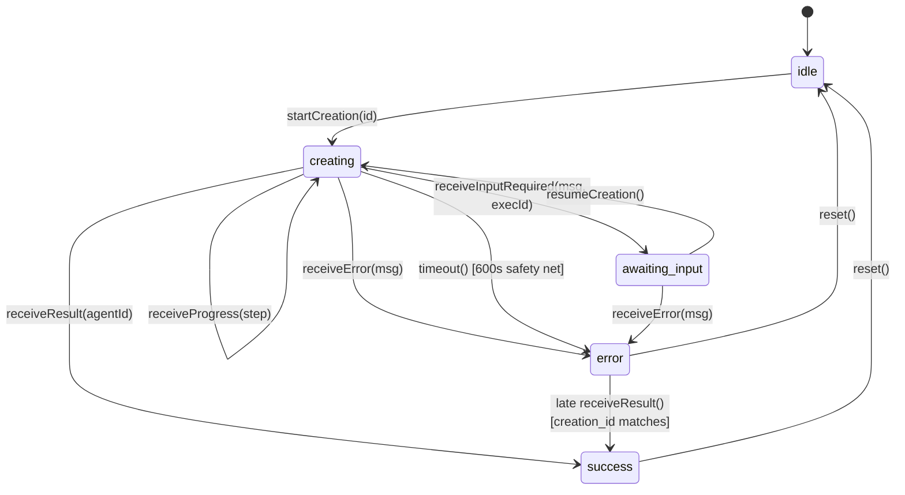

### 12.3 UI Behavior by State

| State | UI | Toast |
|-------|-----|-------|
| `idle` | Normal agent builder form | — |
| `creating` (no progress) | Inline view with spinner + "Creating your agent..." | — |
| `creating` (with steps) | Execution steps list rendered like LLM Service UI (showing step type + label + detail). New steps append in real-time. | — |
| `awaiting_input` | Execution steps list + agent's question displayed as a message + **chat input** for user to type response | — |
| `success` | Overlay transitions to success. Show **"Edit Agent"** and **"Test Agent"** buttons | `ritaToast.success({ title: "Agent created successfully" })` |
| `error` | Overlay transitions to error with retry button | `ritaToast.error({ title: "Agent creation failed", description: error })` |
| `error` (timeout) | Same as error | `ritaToast.error({ title: "Agent creation timed out", description: "Please try again." })` |

### 12.4 Success Flow

On `success`, AgentRitaDeveloper has already written to the LLM Service. The response includes the `agent_id` of the created or updated agent plus a `mode` field.

**Create mode** (`mode: "create"`, or absent for backwards compat):
1. Shows success state with agent name
2. Shows **"Edit Agent"** button → navigates to `/agents/{agent_id}` (existing builder page in edit mode)
3. Shows **"Test Agent"** button → navigates to `/agents/{agent_id}/test`
4. Client invalidates the agents list query cache so the new agent appears in the table

**Update mode** (`mode: "update"`):
1. Shows success state with agent name ("Agent updated")
2. Shows a single **"Back to agent"** button → clears the overlay in place (the user is already on `/agents/{agent_id}`)
3. Client invalidates **only the detail query** for `agent_id` — the agents list is unchanged (no new row)

### 12.5 Cancel vs Navigate Away

**Cancel button click:**
1. Client calls `POST /api/agents/cancel-creation` with `creation_id`
2. Backend sends `cancel_agent_creation` webhook to platform
3. Platform aborts the workflow
4. Client resets store to `idle`

**Navigate away (no cancel):**
1. Agent creation **continues on the platform side**
2. Client resets store on unmount
3. Agent will appear in the agents list when the user returns

### 12.6 Timeout

Two independent deadlines (see Section 2.8 for the full picture):

- **Server poll budget (authoritative): 300s.** When the server's poll loop in [DirectApiStrategy.ts](../../../packages/api-server/src/services/agentCreation/DirectApiStrategy.ts) (direct mode) or the Platform's workflow (workflow mode) runs out, it emits an `agent_creation_failed` SSE with a diagnostic message. This is the timeout users normally see.
- **Client safety net: 600s.** A local `setTimeout` in [useAgentCreation.ts](../../../packages/client/src/hooks/useAgentCreation.ts) calls `store.timeout()` only if no terminal SSE event arrived (server crash, EventSource drop, browser sleep). It's deliberately well above the server budget so the server's own SSE always wins in normal flows.
- The agent creation continues on the server/platform side regardless of the client safety net firing — late-arriving success events are accepted (`error → success` if `creation_id` matches).

---

## 13. Backend Endpoints

### 13.1 `POST /api/agents/generate`

Triggers the two-phase agent developer flow. Same endpoint for create and update — the flow is discriminated by whether `targetAgentEid` is present in the request body.

**Request Body:**

```jsonc
{
  "name": "IT Help Desk Agent",           // required
  "description": "...",                   // optional
  "instructions": "...",                  // optional but required for UI to enable Create button
  "iconId": "headphones",                 // optional, default: "bot"
  "iconColorId": "blue",                  // optional, default: "slate"
  "adminType": "user",                    // optional, default: "user"
  "conversationStarters": ["How can I help you today?"],  // optional
  "guardrails": ["Do not discuss HR policies"],  // optional
  "targetAgentEid": "3fa85f64-5717-4562-b3fc-2c963f66afa6",  // optional — absent ⇒ CREATE, present ⇒ UPDATE
  "updatePrompt": "tighten guardrails; rewrite description"  // optional — free-form change request
}
```

**Server-side flow:**

1. **Name uniqueness check** (CREATE only — absent `targetAgentEid`). Queries `filterAgents` for `name__exact=<name>&tenant__exact=<orgId>`; returns `409 NAME_TAKEN` on collision.
2. **Phase 1 — direct metadata write:**
   - CREATE: `POST /agents/metadata` with `{ name, description, ui_configs, conversation_starters, guardrails, admin_type, tenant, state: "DRAFT", active: true, sys_created_by, sys_updated_by }`. The returned `eid` becomes `targetEid`.
   - UPDATE: `PUT /agents/metadata/eid/{targetAgentEid}` with the same cheap-field set **minus** `tenant` / `state` / `active` / `sys_created_by` (best-effort — a PUT failure logs a warning but does not abort phase 2).
3. **Phase 2 — strategy dispatch.** Invokes the configured `AgentCreationStrategy` (`DirectApiStrategy` or `WorkflowStrategy`) with `targetAgentEid` always set. The strategy compiles the prompt via `buildAgentPrompt()` and invokes AgentRitaDeveloper in UPDATE mode.
4. Returns `202 { mode: "async", creationId }`. Completion / failure / input-required arrives via SSE.

**Response:**

```jsonc
{
  "mode": "async",
  "creationId": "550e8400-e29b-41d4-a716-446655440000"
}
```

**Error responses:**

| Status | Code | When |
|---|---|---|
| `409` | `NAME_TAKEN` | CREATE with a name already used in the caller's tenant |
| `502` | `LLM_SERVICE_ERROR` | Phase 1 POST fails (CREATE only — PUT failures in UPDATE are non-fatal) |
| `500` | `INTERNAL_ERROR` | Unexpected error in the route or strategy |

### 13.2 `POST /api/agents/creation-input`

Sends user's response when the agent requests additional input.

**Request Body:**

```jsonc
{
  "creationId": "550e8400-e29b-41d4-a716-446655440000",
  "prevExecutionId": "5e7e7877-...",
  "prompt": "It should handle only IT support tickets. HR requests should be escalated."
}
```

**Response:**

```jsonc
{
  "success": true
}
```

### 13.3 `POST /api/agents/cancel-creation`

Cancels an in-progress agent creation. Only called on explicit cancel button click (not on navigation away).

**Request Body:**

```jsonc
{
  "creationId": "550e8400-e29b-41d4-a716-446655440000"
}
```

**Response:**

```jsonc
{
  "success": true
}
```

---

## 14. Error Recovery & Edge Cases

| Scenario | Handling |
|----------|----------|
| Webhook POST fails (network/5xx) | `WebhookService` retry logic (3 attempts, exponential backoff). All fail → return 500 to client. Store in `rag_webhook_failures`. See Section 2.9. |
| Platform returns error via RabbitMQ | `agent_creation_failed` SSE event. Client shows error + retry button. See Section 2.7. |
| SSE connection drops during creation | Client reconnects automatically (existing `useSSE` hook). Late event accepted if `creation_id` matches and store is still in `creating` state. |
| Timeout fires but result arrives late | Accept late success — transition `error` → `success` if `creation_id` matches. Better UX than ignoring a valid result. See Section 2.8. |
| User clicks Cancel | Cancel webhook sent. Platform aborts workflow. Store resets to idle. See Section 2.6. |
| User navigates away (no cancel) | Agent creation continues on platform. Store resets on unmount. Agent appears in agents list when user returns. |
| Duplicate `creation_id` messages | Idempotent: progress overwrites previous; completed/failed are terminal. |
| Unknown `type` on queue | Consumer logs error and nacks without requeue. |

---

## 15. Implementation Files

| File | Role | Status |
|------|------|--------|
| `packages/api-server/src/routes/agents.ts` | HTTP endpoints. Uniqueness check lives here; phase-1 LLM write is delegated to the strategy (direct mode calls LLM inline; workflow mode calls WF1). | 🔄 NEEDS UPDATE — extract phase 1 from route into strategy |
| `packages/api-server/src/schemas/agent.ts` | Zod schemas for request bodies | ✅ DONE |
| `packages/api-server/src/services/agentCreation/index.ts` | Strategy factory (`AGENT_CREATION_MODE` switch). Both strategies expose the same `execute(params)` interface; phase 1 + phase 2 are internal. | 🔄 NEEDS UPDATE — expand interface to own phase 1 |
| `packages/api-server/src/services/agentCreation/types.ts` | Strategy interface + param/result types. Shape expands to include cheap fields + optional `targetAgentEid`; strategies return the final `agent_eid` after phase 1 completes. | 🔄 NEEDS UPDATE |
| `packages/api-server/src/services/agentCreation/DirectApiStrategy.ts` | Unchanged semantics — RITA→LLM direct for both phases. Now also owns the POST/PUT on `/agents/metadata` (previously done by the route). Rollback on phase 2 failure when `shellAlreadyCreated=true`. | 🔄 NEEDS UPDATE — absorb phase 1 from route |
| `packages/api-server/src/services/agentCreation/WorkflowStrategy.ts` | Two-webhook orchestration: sync WF1 (`upsert_agent_metadata`) → extract `agent_eid` → async WF2 (`run_agent_developer`). Rollback via `DELETE /agents/metadata/eid/{eid}` on WF2 failure when `shellAlreadyCreated=true` (uses direct LLM call or a dedicated WF1 DELETE variant — TBD). | 🆕 REWRITE — WF1 + WF2 orchestration replaces old skeleton |
| `packages/api-server/src/services/agentCreation/buildPrompt.ts` | Compiles the expensive-only meta-agent prompt (instructions + optional `updatePrompt` + mode marker + runtime-parameter contract). Throws if `targetAgentEid` absent. | ✅ DONE |
| `packages/api-server/src/services/AgenticService.ts` | `executeAgent()` — sends `tenant` top-level, forwards `userEmail` as `parameters.user_email`. Still used by direct mode. | ✅ DONE |
| `packages/api-server/scripts/bootstrap-agent-rita-developer.ts` | Idempotent migration that sets up the meta-agent (`markdown_text`, sub-tasks, tool inventory). | ✅ DONE |
| `packages/api-server/src/services/WebhookService.ts` | Sends webhooks with retry. Now called for both WF1 (sync — returns response body) and WF2 (async — fire-and-forget after 202). | 🔄 NEEDS UPDATE — add sync-response variant if not already present |
| `packages/api-server/src/types/webhook.ts` | Webhook payload types. Needs new discriminated union for WF1 (`upsert_agent_metadata`) and WF2 (`run_agent_developer` / `cancel_agent_creation` / `agent_creation_input`). | 🔄 NEEDS UPDATE |
| `packages/api-server/src/consumers/AgentEventsConsumer.ts` | RabbitMQ consumer for `agent.events` (WF2 output) | ✅ DONE |
| `packages/api-server/src/types/agent-events.ts` | TypeScript types for RabbitMQ messages | ✅ DONE |
| `packages/api-server/src/services/rabbitmq.ts` | Registers `AgentEventsConsumer` | ✅ DONE |
| `packages/api-server/src/services/sse.ts` | 4 new SSE event types added to union | ✅ DONE |
| `packages/client/src/stores/agentCreationStore.ts` | Zustand state machine | ✅ DONE |
| `packages/client/src/hooks/useAgentCreation.ts` | Orchestration hook (mutation + store + timeout) | ✅ DONE |
| `packages/client/src/contexts/SSEContext.tsx` | Handlers for 4 new SSE events | ✅ DONE |
| `packages/client/src/services/EventSourceSSEClient.ts` | Client-side SSE event type union | ✅ DONE |
| `packages/client/src/hooks/api/useAgents.ts` | `useGenerateAgent`, `useAgentCreationInput`, `useCancelAgentCreation` hooks | ✅ DONE |
| `packages/client/src/services/api.ts` | `agentApi.generate/sendCreationInput/cancelCreation` methods | ✅ DONE |
| `packages/client/src/components/agents/builder/AgentCreationOverlay.tsx` | Inline progress/success/error UI. Branches success copy + CTA on `mode`. | ✅ DONE |
| `packages/client/src/components/agents/builder/UpdateAgentModal.tsx` | Confirmation + optional free-form change-request textarea for the expensive UPDATE path | ✅ DONE |
| `packages/client/src/lib/agentConfigDiff.ts` | Pure helpers: `diffAgentConfig()` (cheap vs expensive field classification) + `validateSkillReferences()` (blocks skill-removal without instructions edit) | ✅ DONE |
| `packages/client/src/pages/AgentBuilderPage.tsx` | Create Agent button wiring + Update Agent button (edit mode) + overlay rendering. Routes cheap-only changes to `PUT /api/agents/:eid`; expensive changes open `UpdateAgentModal` and submit through `/generate` with `targetAgentEid`. | ✅ DONE |

### What's left for workflow mode activation

1. **Platform team** implements WF1 (`upsert_agent_metadata`, sync) per Section 6 and WF2 (`run_agent_developer`, async) per Section 7.
2. **RITA team** reshapes `WorkflowStrategy` to orchestrate WF1 → WF2 (see the 🔄 rows above); extracts phase 1 out of `routes/agents.ts` into the strategy so both strategies own the full two-phase flow internally.
3. Set `AGENT_CREATION_MODE=workflow` in RITA's `.env`.
4. Set `AGENT_METADATA_WORKFLOW_URL` and `AGENT_DEVELOPER_WORKFLOW_URL` to the Platform's endpoints.
5. Restart RITA API server.

> **Open question — rollback transport.** On CREATE WF2 failure, RITA needs to delete the orphan shell. Two options: (a) direct `DELETE /agents/metadata/eid/{eid}` from RITA (bypasses WF1); (b) a `delete_agent_metadata` action on WF1 so all metadata writes flow through the Platform. Leaning (a) for simplicity since it's already supported in direct mode. To be confirmed with Platform team.

---

## 16. LLM Service Agent Metadata API

After an agent is created or updated (via the AgentRitaDeveloper workflow or direct LLM Service call), its metadata — including `guardrails`, `conversation_starters`, and `tenant` — is persisted in the LLM Service. RITA fetches this metadata when loading an agent for editing or display.

### 16.1 Response Schema

```
GET /agents/metadata/eid/{eid}
```

Returns an array with one agent metadata object:

```jsonc
[
  {
    "reference_id": "string",
    "tenant": "org-uuid",
    "id": 1,
    "eid": "3fa85f64-5717-4562-b3fc-2c963f66afa6",
    "name": "IT Help Desk Agent",
    "description": "Handles IT support tickets",
    "default_parameters": {},
    "configs": {
      "ui": { "icon": "headphones", "icon_color": "blue" }
    },
    "active": true,
    "markdown_text": "Be helpful and friendly. Only handle IT issues.",
    "tags": {},
    "parameters": {},
    "state": "string",               // maps to active (draft/published)
    "conversation_starters": [        // persisted starter prompts
      "How can I help you today?",
      "Report an IT issue"
    ],
    "guardrails": [                   // persisted restricted topics
      "Do not discuss HR policies",
      "Do not share internal salary data"
    ],
    "sys_date_created": "2026-04-14T18:10:57.516Z",
    "sys_date_updated": "2026-04-14T18:10:57.516Z",
    "sys_created_by": "user-uuid",
    "sys_updated_by": "user-uuid",
    "prompt_name": "string",
    "llm_parameters": {}
  }
]
```

### 16.2 Field Mapping: API → Frontend

RITA maps the LLM Service response to the frontend `AgentConfig` shape via `apiDataToAgentConfig()` in `packages/api-server/src/services/agentCreation/mappers.ts`.

| LLM Service API (snake_case) | Frontend (camelCase) | Default | Notes |
|------------------------------|----------------------|---------|-------|
| `eid` | `id` | `""` | Falls back to `id` if `eid` is null |
| `name` | `name` | `""` | |
| `description` | `description` | `""` | |
| `markdown_text` | `instructions` | `""` | Agent system prompt |
| `state` | `state` | `"DRAFT"` | Values: `"DRAFT" \| "PUBLISHED" \| "RETIRED" \| "TESTING"`. Matches the LLM Service column byte-for-byte — no translation. Unknown or null values fall back to `"DRAFT"`. The legacy `active` flag is ignored (always `true` on new agents). |
| `admin_type` | `adminType` | `"user"` | `"user"` for builder-created; `"system"` for platform-owned meta-agents |
| `ui_configs.icon` | `iconId` | `"bot"` | Falls back to legacy `configs.ui.icon`, then ancient `configs.iconId` |
| `ui_configs.icon_color` | `iconColorId` | `"slate"` | Falls back to legacy `configs.ui.icon_color`, then ancient `configs.iconColorId` |
| `conversation_starters` | `conversationStarters` | `[]` | Array of starter prompts |
| `guardrails` | `guardrails` | `[]` | Array of restricted topics |
| `sys_date_created` | `createdAt` | `undefined` | ISO 8601 |
| `sys_date_updated` | `updatedAt` | `undefined` | ISO 8601 |
| `tenant` | _(not exposed to frontend)_ | — | Organization identifier, used for API context |

Fields not currently mapped to frontend: `reference_id`, `active`, `default_parameters`, `tags`, `parameters`, `prompt_name`, `llm_parameters` (set server-side; see bootstrap script).

**Icon storage migration note:** Icons moved from `configs.ui.{icon, icon_color}` to the dedicated top-level `ui_configs` JSON column. The write path emits `ui_configs` only (no dual-write); the read path prefers `ui_configs` and falls back to `configs.ui` for pre-migration rows. Old rows are backfilled opportunistically on the next write.

### 16.3 Round-Trip Data Flow

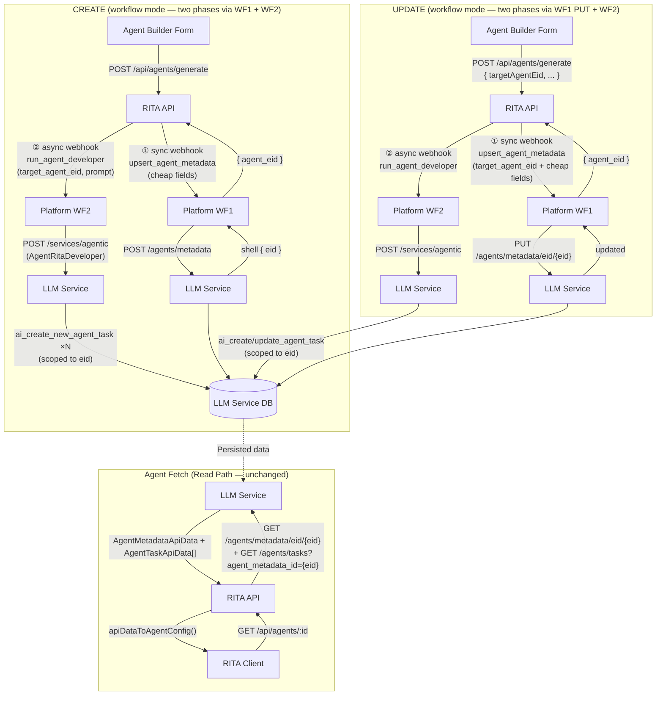

> **Key insight:** in both CREATE and UPDATE, the deterministic metadata fields flow through **WF1** (which writes them directly to `/agents/metadata`) — the meta-agent never sees or touches them. The meta-agent's writes are scoped to `/agents/tasks` (sub-tasks) only. This makes the read path symmetric: metadata comes from WF1's writes, tasks come from WF2's meta-agent writes, both land in the same row and are composed by `apiDataToAgentConfig()` on fetch.

> **Rollback on CREATE failure:** if WF2 fails, RITA emits `DELETE /agents/metadata/eid/{shell.eid}` so orphan shells don't appear in the user's agent list. Never fires for UPDATE — the user's existing agent is theirs. See Section 15's open question on whether rollback goes direct or through a WF1 delete variant.

> **Cheap-only UPDATE bypass:** when the user edits only cheap fields (no instruction change), the client hits `PUT /api/agents/:eid` which goes direct to the LLM Service — neither WF1 nor WF2 is involved. Same behavior in both `direct` and `workflow` modes.

### 16.4 Key Files

| File | Role |
|------|------|
| `packages/api-server/src/services/AgenticService.ts` | `AgentMetadataApiData` + `AgentTaskApiData` interfaces; `getAgent()`, `updateAgent()`, `listTasks()`, `getToolByName()`, `createTool()` methods |
| `packages/api-server/src/services/agentCreation/mappers.ts` | `apiDataToAgentConfig()` — maps API response to frontend shape. When tasks are provided, composes `instructions` as `markdown_text` + one per-task block (stable `## Task: <name>` headers) and populates `tools`/`skills` with deduped task tools so the edit form reflects the agent's full behavior. |
| `packages/api-server/src/routes/agents.ts` | Agent detail endpoint — calls `getAgent()` + `listTasks()` + mapper |

### 16.5 Meta-agent task round-trip

When AgentRitaDeveloper runs (it always runs in UPDATE mode), it reads the current task list before writing so it can decide what to create/update/delete.

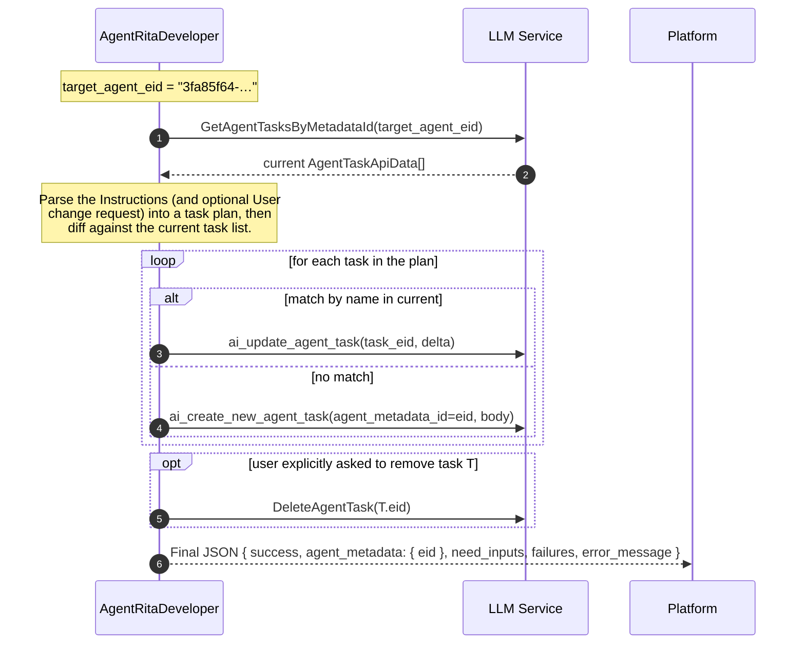

Rules the meta-agent follows (captured in its `markdown_text` — see the constant in `scripts/bootstrap-agent-rita-developer.ts`):

- **No metadata writes.** The meta-agent must NOT call `UpdateAgentMetadata` / `CreateAgentMetadata`. Every metadata field is RITA's responsibility — an `agent_metadata` patch from the meta-agent is a bug. The prompt (Section 7.1) states this explicitly.
- **Tasks not mentioned stay.** The meta-agent never auto-deletes tasks the user didn't explicitly call out.
- **Composed-instructions format.** The meta-agent parses the `## Task: <name>` blocks that RITA's mapper emits when loading an agent for editing (see Section 16.2's `apiDataToAgentConfig` reference). Blocks matching an existing task name are `UpdateAgentTask` candidates; unknown names are new `CreateAgentTask` candidates.
- **Runtime parameter contract.** Every sub-task it creates must reference `{%utterance}`, `{%transcript}`, `{%additional_information}` per the prompt's runtime-parameter block.
