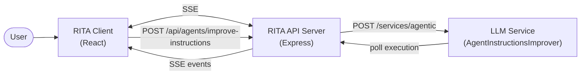
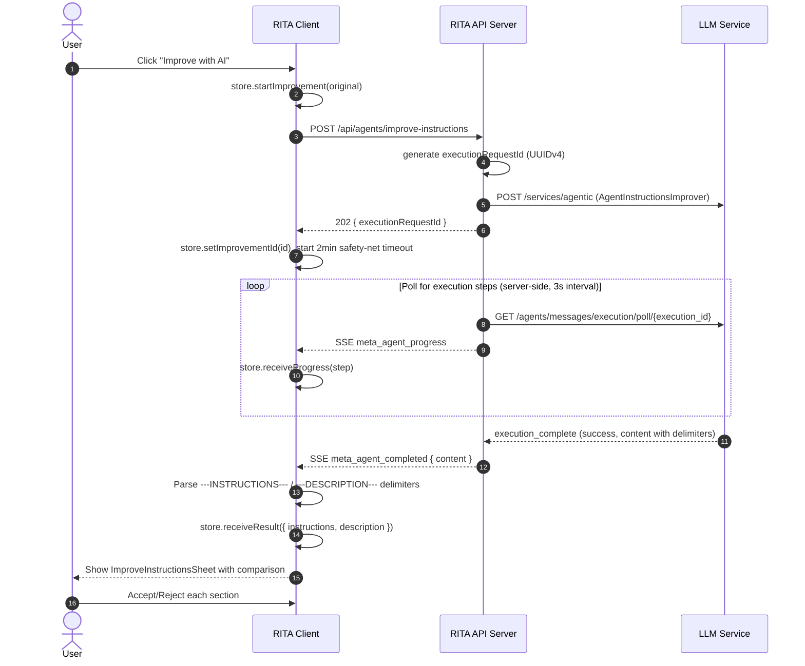
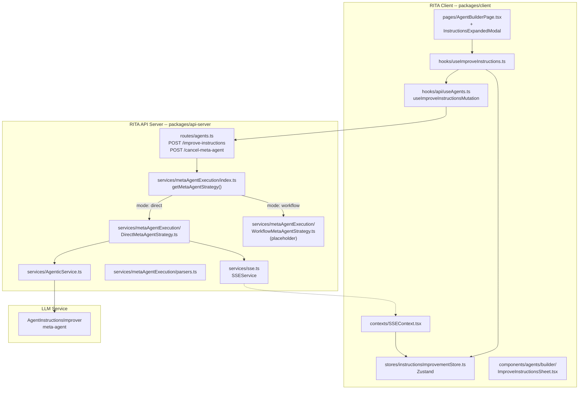
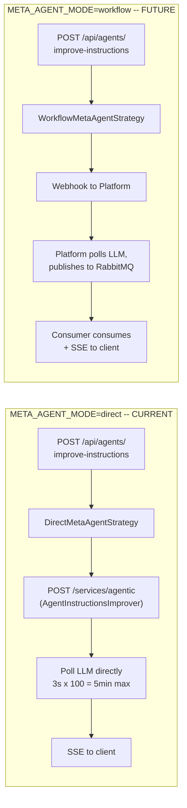
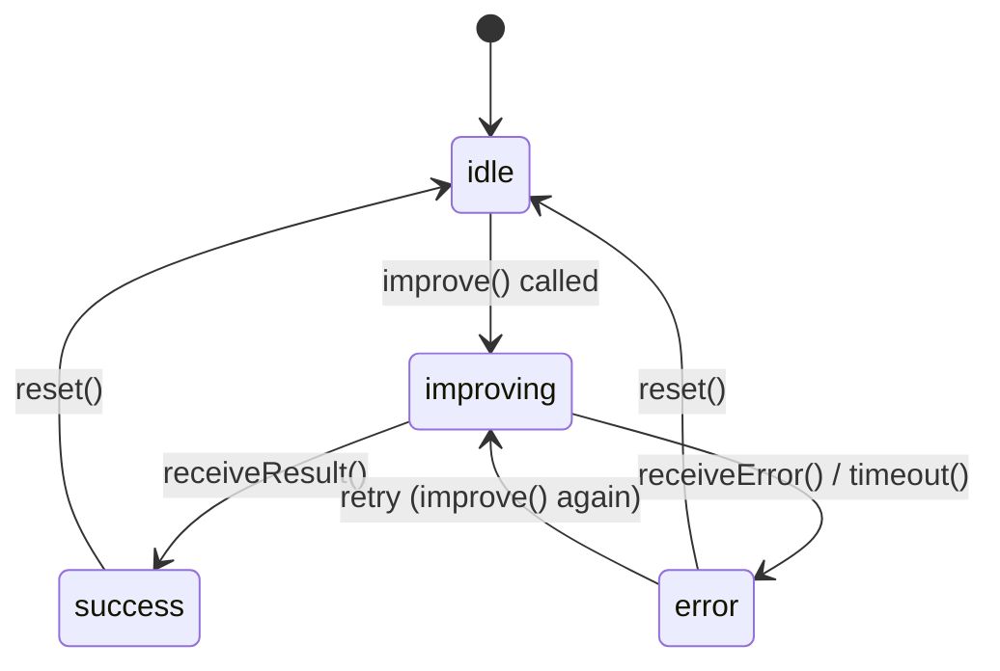
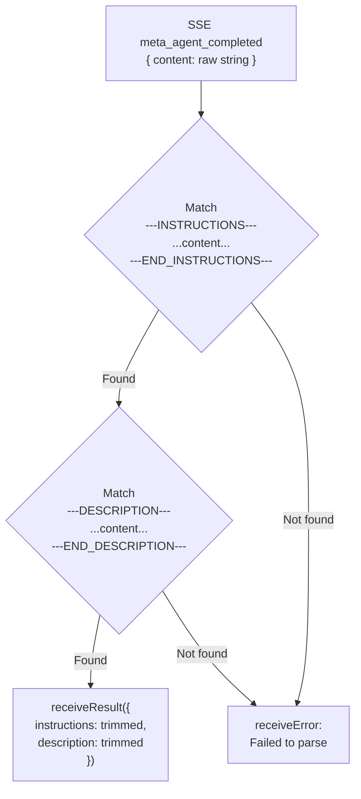

# Improve Instructions — Integration Spec

> Integration contract for the "Improve with AI" feature: user triggers instruction improvement from the agent builder, RITA invokes the **AgentInstructionsImprover** meta-agent, and returns improved instructions + description via SSE.

---

## How to read this document

| If you are... | Read these sections |
|---------------|---------------------|
| A **RITA developer** implementing or maintaining this feature | All sections |
| A **Platform team engineer** building the workflow mode | Sections 1, 2.1, 2.3, 4 (API Contract), 5 (SSE Events) |
| A **future maintainer** debugging | Section 1 (Overview), Section 2 (Architecture), Section 7 (Files) |

---

## 1. Overview

When a user clicks **"Improve with AI"** in the agent builder, RITA sends the current instructions and agent configuration to the `AgentInstructionsImprover` meta-agent. The meta-agent returns structured, improved instructions and a polished description. The client displays a side sheet with tabbed comparison (Original | Improved) and per-section accept/reject controls.



> **Strategy modes:** RITA implements both a **direct mode** (API server calls LLM Service directly, polls internally) and a **workflow mode** (delegates to external platform via webhook + RabbitMQ). Toggle via `META_AGENT_MODE` env var. Direct is default and currently active; workflow is a placeholder. See Section 2.3.

> **Prompt definition:** See [agent-prompt-catalog.md](agent-prompt-catalog.md#1-agentinstructionsimprover) for the full AgentInstructionsImprover prompt, input/output format, and examples.

> **Shared infrastructure:** The meta-agent execution strategy, SSE event types, and factory pattern are shared with other meta-agents (e.g. ConversationStarterGenerator). See [agent-creation-workflow-integration.md](agent-creation-workflow-integration.md) for the broader agent creation architecture.

---

## 2. Architecture & Flow Diagrams

### 2.1 Direct Mode — Happy Path



### 2.2 Component Architecture (RITA files)



### 2.3 Mode Comparison



Both modes are async from the client's perspective: always return `executionRequestId` immediately, results arrive via SSE.

### 2.4 Client State Machine



| State | Trigger | Store action |
|-------|---------|--------------|
| `idle` | Initial / after reset | `reset()` |
| `improving` | User clicks "Improve with AI" | `startImprovement(original, description)` |
| `success` | SSE `meta_agent_completed` parsed OK | `receiveResult({ instructions, description })` |
| `error` | SSE `meta_agent_failed`, parse failure, or 2min timeout | `receiveError(message)` or `timeout()` |

### 2.5 Response Content Parsing



Parsing happens in two places:

| Location | File | Purpose |
|----------|------|---------|
| Client (SSEContext) | `packages/client/src/contexts/SSEContext.tsx` | Inline regex on `meta_agent_completed` event — updates Zustand store |
| Server (parsers) | `packages/api-server/src/services/metaAgentExecution/parsers.ts` | `parseInstructionsImproverContent()` — reusable utility, used by tests and future server-side parsing |

Both use the same regex: `/---INSTRUCTIONS---\s*([\s\S]*?)\s*---END_INSTRUCTIONS---/`

---

## 3. Timeouts

| Deadline | Where | Value | Fires when |
|----------|-------|-------|------------|
| Server poll budget | `DirectMetaAgentStrategy.ts` — `MAX_POLL_ATTEMPTS(100) x POLL_INTERVAL_MS(3000)` | **5 min** | Poll loop exhausted; emits `meta_agent_failed` SSE |
| Client safety net | `useImproveInstructions.ts` — `IMPROVEMENT_TIMEOUT_MS` | **2 min** | No terminal SSE event arrived (server crash / SSE drop) |

The client timeout is shorter than the server budget because instruction improvement is a single-turn meta-agent call — it should complete faster than agent creation. If the server timeout fires first (normal), the client receives `meta_agent_failed` and clears its own timer.

---

## 4. API Contract

### POST /api/agents/improve-instructions

**Auth:** Requires authenticated user (Keycloak).

**Request:**

```json
{
  "instructions": "You are a sales assistant. Help the sales team...",
  "agentConfig": {
    "name": "Sales Prep Agent",
    "description": "Helps sales reps prepare for meetings",
    "agentType": "knowledge",
    "guardrails": ["Do not share pricing tiers..."],
    "conversationStarters": ["What do we know about Acme Corp?"],
    "workflows": ["CRM Lookup"],
    "knowledgeSources": ["CRM Database", "Product Catalog"],
    "capabilities": { "webSearch": true, "imageGeneration": false },
    "responsibilities": "Help reps find prospect info...",
    "completionCriteria": "Rep confirms enough context"
  }
}
```

**Validation:** `ImproveInstructionsBodySchema` (Zod) in `packages/api-server/src/schemas/agent.ts`. All `agentConfig` fields are optional with defaults except `instructions` which is required and must be non-empty.

**Response:** `202 Accepted`

```json
{
  "executionRequestId": "uuid-v4"
}
```

**Error responses:**

| Code | Condition |
|------|-----------|
| `400` | Zod validation failure (missing/invalid `instructions`) |
| `502` | LLM Service unavailable (`LLM_SERVICE_ERROR`) |
| `500` | Internal error (`INTERNAL_ERROR`) |

### POST /api/agents/cancel-meta-agent

Cancels an in-progress meta-agent execution.

**Request:**

```json
{
  "executionRequestId": "uuid-v4"
}
```

**Response:** `200 { success: true }`

---

## 5. SSE Events

All events are correlated by `execution_request_id` matching the `executionRequestId` returned from the POST.

### meta_agent_progress

Sent during polling when progress steps are detected (execution_start, agent_start, task_end).

```json
{
  "type": "meta_agent_progress",
  "data": {
    "execution_request_id": "uuid",
    "agent_name": "AgentInstructionsImprover",
    "step_label": "Processing",
    "step_detail": "Expert AI prompt engineer is working...",
    "timestamp": "2026-04-14T12:00:00.000Z"
  }
}
```

### meta_agent_completed

Terminal success event. The `content` field contains the raw delimited string — client parses it.

```json
{
  "type": "meta_agent_completed",
  "data": {
    "execution_request_id": "uuid",
    "agent_name": "AgentInstructionsImprover",
    "content": "---INSTRUCTIONS---\n## Role\n...\n---END_INSTRUCTIONS---\n\n---DESCRIPTION---\n...\n---END_DESCRIPTION---",
    "success": true,
    "timestamp": "2026-04-14T12:00:05.000Z"
  }
}
```

### meta_agent_failed

Terminal error event.

```json
{
  "type": "meta_agent_failed",
  "data": {
    "execution_request_id": "uuid",
    "agent_name": "AgentInstructionsImprover",
    "error": "ExecutionError: Missing llm_parameters",
    "timestamp": "2026-04-14T12:00:05.000Z"
  }
}
```

---

## 6. Client Implementation

### Zustand Store: `useInstructionsImprovementStore`

| Field | Type | Description |
|-------|------|-------------|
| `improvementId` | `string \| null` | `executionRequestId` for SSE correlation |
| `status` | `idle \| improving \| success \| error` | Current state |
| `progressSteps` | `ExecutionStep[]` | Accumulated progress events |
| `originalInstructions` | `string \| null` | Snapshot of instructions before improvement |
| `originalDescription` | `string \| null` | Snapshot of description before improvement |
| `improvedInstructions` | `string \| null` | Parsed result from delimiters |
| `improvedDescription` | `string \| null` | Parsed result from delimiters |
| `error` | `string \| null` | Error message on failure |

### Hook: `useImproveInstructions`

Orchestrates the mutation + store + timeout. Returns `{ improve, status, isImproving, reset }`.

- Calls `useImproveInstructionsMutation` (TanStack Query) to POST
- Sets `improvementId` from response
- Starts 2-min safety-net timeout
- Clears timeout on terminal state transitions

### Sheet: `ImproveInstructionsSheet`

Side sheet with three visual states:

| Status | UI |
|--------|----|
| `improving` | Spinner + `ReasoningSteps` component showing progress |
| `error` | Destructive alert + "Try Again" button |
| `success` | Comparison view with per-section accept/reject |

The success state shows:
- **Description section** (if changed): original (strikethrough) vs improved, with Accept/Reject buttons
- **Instructions section**: tabbed view (Original \| Improved) rendered as markdown, with Accept/Reject buttons
- **Footer**: "Accept All" / "Discard All" bulk actions, then "Done" when all decisions are made

Each section uses a local `DecisionState` (`pending | accepted | rejected`) to track user choices. Accepting calls back to the parent (`onAcceptInstructions` / `onAcceptDescription`) which patches the builder form.

### Entry Points

The "Improve with AI" button appears in two locations:
1. **AgentBuilderPage** — in the instructions section header
2. **InstructionsExpandedModal** — in the modal footer

Both trigger `improveInstructions.improve(data)` and open the `ImproveInstructionsSheet`.

---

## 7. Key Files

### Backend (`packages/api-server/`)

| File | Responsibility |
|------|----------------|
| `src/routes/agents.ts` | `POST /improve-instructions`, `POST /cancel-meta-agent` route handlers |
| `src/schemas/agent.ts` | `ImproveInstructionsBodySchema`, `AgentConfigForImprovementSchema`, `CancelMetaAgentBodySchema` |
| `src/services/metaAgentExecution/index.ts` | Strategy factory — `getMetaAgentStrategy()` reads `META_AGENT_MODE` |
| `src/services/metaAgentExecution/types.ts` | `MetaAgentStrategy` interface, `MetaAgentExecuteParams`, `MetaAgentExecuteResult` |
| `src/services/metaAgentExecution/DirectMetaAgentStrategy.ts` | Direct mode: invoke LLM, poll, emit SSE events |
| `src/services/metaAgentExecution/WorkflowMetaAgentStrategy.ts` | Workflow mode placeholder (throws "not yet implemented") |
| `src/services/metaAgentExecution/parsers.ts` | `parseInstructionsImproverContent()` — delimiter parsing |
| `src/services/AgenticService.ts` | `executeAgent()` / `pollExecution()` / `stopExecution()` — LLM Service HTTP calls |
| `src/services/sse.ts` | `MetaAgentProgressEvent`, `MetaAgentCompletedEvent`, `MetaAgentFailedEvent` type definitions |

### Frontend (`packages/client/`)

| File | Responsibility |
|------|----------------|
| `src/stores/instructionsImprovementStore.ts` | Zustand store — state machine for improvement flow |
| `src/hooks/useImproveInstructions.ts` | Orchestration hook — mutation, store, timeout |
| `src/hooks/api/useAgents.ts` | `useImproveInstructionsMutation` — TanStack Query mutation |
| `src/components/agents/builder/ImproveInstructionsSheet.tsx` | Sheet UI — progress, error, comparison with accept/reject |
| `src/pages/AgentBuilderPage.tsx` | "Improve with AI" button + sheet integration |
| `src/components/agents/builder/InstructionsExpandedModal.tsx` | Secondary "Improve with AI" button in expanded modal |
| `src/contexts/SSEContext.tsx` | SSE event handler — routes `meta_agent_*` events to store |
| `src/services/EventSourceSSEClient.ts` | SSE client types |
| `src/stores/instructionsImprovementStore.test.ts` | Unit tests for the store |
