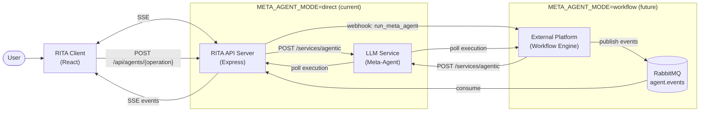
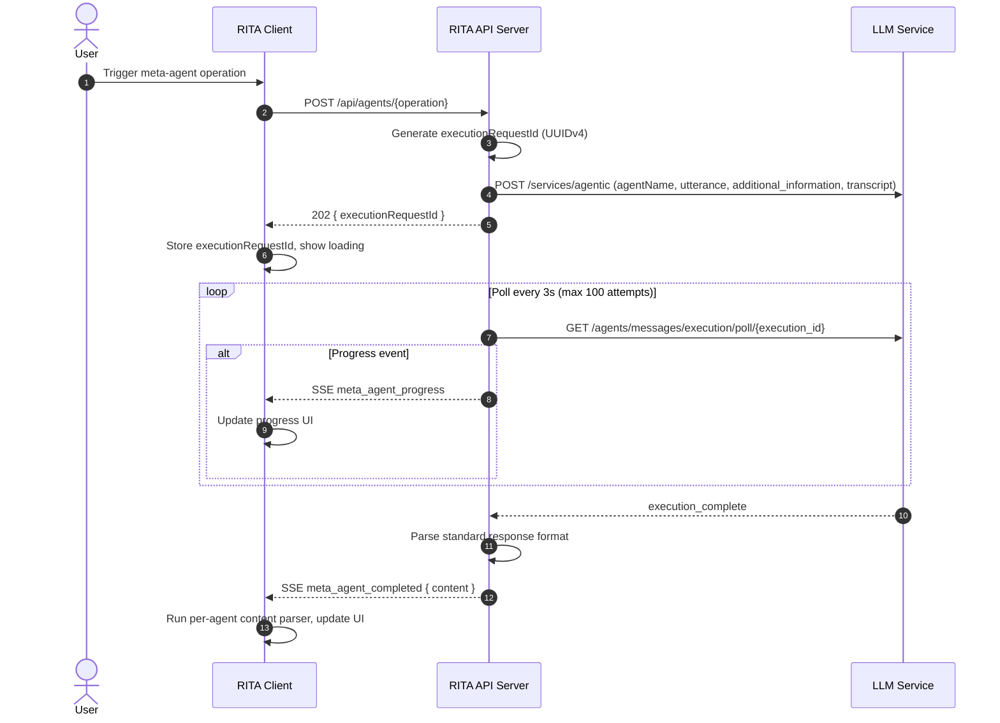
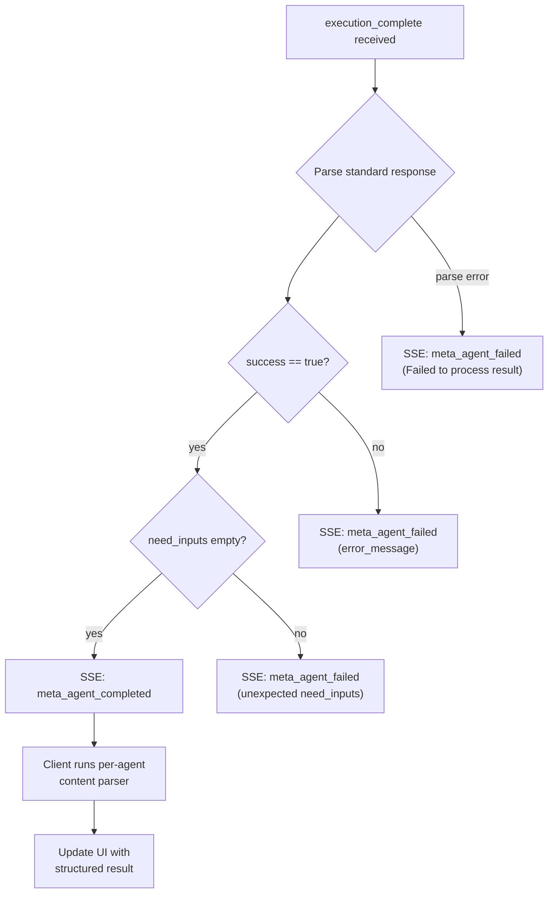
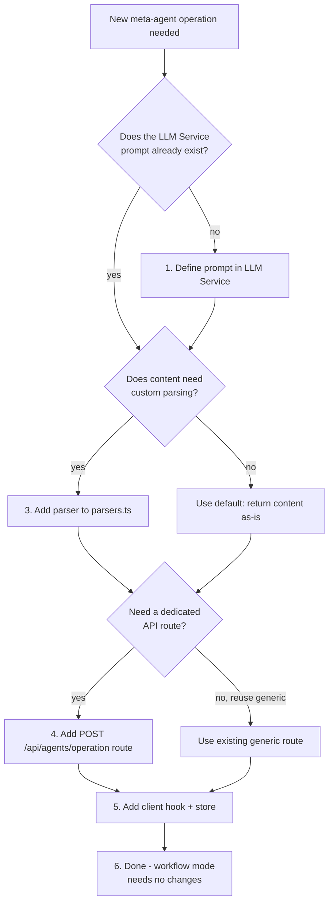

# Meta-Agent Workflow Pattern

> Reusable pattern for running ANY meta-agent through the platform. New meta-agent operations (ConversationStarterGenerator, AgentGuardrailGenerator, etc.) can be added without writing new workflow code.

---

## 1. Overview

Meta-agents are agents that generate or update other agents' configurations. Instead of custom code for each operation, every meta-agent follows a **generic 3-parameter contract** and returns a **standard response format**. The platform executes them uniformly; only the content parser differs per agent.

See [Agent Prompt Catalog](agent-prompt-catalog.md) for the full catalog of prompt definitions.

### Generic 3-Parameter Contract

Every meta-agent receives these execution-time parameters (substituted via `{%param}` syntax in the LLM Service prompt):

| Parameter | Type | Description |
|-----------|------|-------------|
| `utterance` | `string` | The user's task description or raw input |
| `additional_information` | `string` (JSON) | Agent configuration and context |
| `transcript` | `string` (JSON) | Conversation history as `[{ role, content }]`. Empty `[]` when not applicable |

### Standard Response Format

All meta-agents return:

```json
{
  "role": "assistant",
  "content": "<agent-specific payload — format varies per agent>",
  "need_inputs": [],
  "success": true,
  "terminate": false,
  "error_message": null
}
```

| Field | Type | Description |
|-------|------|-------------|
| `role` | `string` | Always `"assistant"` |
| `content` | `string` | Agent output payload. Format varies per meta-agent (parsed by per-agent content parser) |
| `need_inputs` | `array` | Empty on success. Non-empty = agent needs user input: `[{ name, description }]` |
| `success` | `boolean` | `true` if the agent completed its task |
| `terminate` | `boolean` | `false` in normal operation |
| `error_message` | `string \| null` | `null` on success, error description on failure |

---

## 2. Architecture

### Generic Flow



### Direct Mode vs Workflow Mode

| Aspect | Direct (current) | Workflow (future) |
|--------|-------------------|-------------------|
| **Toggle** | `META_AGENT_MODE=direct` | `META_AGENT_MODE=workflow` |
| **Who calls LLM Service** | RITA API Server | External Platform |
| **Progress delivery** | API server polls LLM, emits SSE directly | Platform publishes to RabbitMQ, consumer emits SSE |
| **Implementation** | `DirectMetaAgentStrategy` | `WorkflowMetaAgentStrategy` (placeholder) |
| **Pro** | Simpler, fewer moving parts | Decoupled, platform-managed retry/orchestration |
| **Con** | API server holds polling state | Requires platform webhook endpoint |

Both modes are async from the client's perspective: the API returns an `executionRequestId` immediately and results arrive via SSE.

### Generic Happy-Path Sequence (Direct Mode)



### Response Format Routing



---

## 3. Generic Webhook Contract (Workflow Mode)

When `META_AGENT_MODE=workflow`, the API server sends a webhook to the external platform instead of calling the LLM Service directly.

### Execute

```json
{
  "source": "rita-chat",
  "action": "run_meta_agent",
  "payload": {
    "tenant_id": "<organization UUID>",
    "user_id": "<user UUID>",
    "user_email": "<user email>",
    "execution_request_id": "<UUIDv4 correlation ID>",
    "agent_name": "AgentInstructionsImprover",
    "parameters": {
      "utterance": "<user input>",
      "additional_information": "<JSON string>",
      "transcript": "[]"
    },
    "timestamp": "2025-01-15T10:30:00.000Z"
  }
}
```

### Cancel

```json
{
  "source": "rita-chat",
  "action": "meta_agent_cancel",
  "payload": {
    "tenant_id": "<organization UUID>",
    "user_id": "<user UUID>",
    "user_email": "<user email>",
    "execution_request_id": "<UUIDv4 correlation ID>",
    "timestamp": "2025-01-15T10:30:05.000Z"
  }
}
```

The `execution_request_id` is the correlation ID that ties the webhook request to the RabbitMQ events and SSE events.

---

## 4. Generic RabbitMQ Messages

Queue: `agent.events` (shared with agent creation events).

All messages include `execution_request_id` as the correlation ID.

### meta_agent_progress

```json
{
  "type": "meta_agent_progress",
  "execution_request_id": "<UUIDv4>",
  "agent_name": "AgentInstructionsImprover",
  "step_label": "Processing",
  "step_detail": "Expert AI prompt engineer is working...",
  "timestamp": "2025-01-15T10:30:01.000Z"
}
```

### meta_agent_completed

```json
{
  "type": "meta_agent_completed",
  "execution_request_id": "<UUIDv4>",
  "agent_name": "AgentInstructionsImprover",
  "content": "---INSTRUCTIONS---\n...\n---END_INSTRUCTIONS---\n\n---DESCRIPTION---\n...\n---END_DESCRIPTION---",
  "success": true,
  "timestamp": "2025-01-15T10:30:08.000Z"
}
```

### meta_agent_failed

```json
{
  "type": "meta_agent_failed",
  "execution_request_id": "<UUIDv4>",
  "agent_name": "AgentInstructionsImprover",
  "error": "Meta-agent execution timed out.",
  "timestamp": "2025-01-15T10:30:10.000Z"
}
```

---

## 5. Generic SSE Events

The API server (via `SSEService.sendToUser`) forwards RabbitMQ messages (or direct-mode results) to the client as SSE events. All three event types are defined in `packages/api-server/src/services/sse.ts`.

### meta_agent_progress

```typescript
{
  type: "meta_agent_progress",
  data: {
    execution_request_id: string,
    agent_name: string,
    step_label: string,    // "Starting" | "Processing"
    step_detail: string,   // Human-readable progress text
    timestamp: string      // ISO 8601
  }
}
```

### meta_agent_completed

```typescript
{
  type: "meta_agent_completed",
  data: {
    execution_request_id: string,
    agent_name: string,
    content: string,       // Raw content — needs per-agent parsing
    success: boolean,
    timestamp: string
  }
}
```

### meta_agent_failed

```typescript
{
  type: "meta_agent_failed",
  data: {
    execution_request_id: string,
    agent_name: string,
    error: string,         // User-facing error message
    timestamp: string
  }
}
```

The client's `SSEContext` dispatches these events to the appropriate Zustand store based on `execution_request_id` matching.

---

## 6. Per-Agent Content Parser Registry

The `content` field in `meta_agent_completed` is a raw string whose format varies per meta-agent. Parsers extract structured data from it.

**Code location:** `packages/api-server/src/services/metaAgentExecution/parsers.ts`

| Agent Name | Content Format | Parser Function | Output Type |
|-----------|---------------|-----------------|-------------|
| `AgentInstructionsImprover` | Delimited `---INSTRUCTIONS---` / `---DESCRIPTION---` blocks | `parseInstructionsImproverContent()` | `{ instructions: string, description: string }` |
| `ConversationStarterGenerator` | Comma-separated string | `parseConversationStarterContent()` | `string[]` |
| *(default)* | — | Return `content` as-is | `string` |

### Parsing Rules

**AgentInstructionsImprover:**
```
---INSTRUCTIONS---
<improved instructions markdown>
---END_INSTRUCTIONS---

---DESCRIPTION---
<improved description>
---END_DESCRIPTION---
```
Extract text between delimiter pairs. Throws if delimiters are missing.

**ConversationStarterGenerator:**
```
Starter 1, Starter 2, Starter 3, Starter 4
```
Split by `", "` (comma + space), trim, filter empty.

**Default (new agents without a custom parser):**
Return the `content` string directly. The client is responsible for display.

---

## 7. Strategy Pattern

The strategy pattern decouples how meta-agents are executed from the rest of the system.

### Interface

```typescript
// packages/api-server/src/services/metaAgentExecution/types.ts

interface MetaAgentStrategy {
  execute(params: MetaAgentExecuteParams): Promise<MetaAgentExecuteResult>;
  cancel(params: MetaAgentCancelParams): Promise<{ success: boolean }>;
}

interface MetaAgentExecuteParams {
  agentName: string;           // Meta-agent name in LLM Service
  utterance: string;           // Maps to {%utterance}
  additionalInformation?: string; // Maps to {%additional_information}
  transcript?: string;         // Maps to {%transcript}
  userId: string;
  userEmail: string;
  organizationId: string;
}

interface MetaAgentExecuteResult {
  executionRequestId: string;  // Correlation ID for SSE events
}
```

### Implementations

| Strategy | Class | Mode | Status |
|----------|-------|------|--------|
| Direct | `DirectMetaAgentStrategy` | `META_AGENT_MODE=direct` | Active (default) |
| Workflow | `WorkflowMetaAgentStrategy` | `META_AGENT_MODE=workflow` | Placeholder |

### Factory

```typescript
// packages/api-server/src/services/metaAgentExecution/index.ts

function getMetaAgentStrategy(): MetaAgentStrategy {
  const mode = process.env.META_AGENT_MODE || "direct";
  if (mode === "workflow") {
    return new WorkflowMetaAgentStrategy(new WebhookService());
  }
  return new DirectMetaAgentStrategy(new AgenticService(), getSSEService());
}
```

The factory is a singleton — the strategy instance is created once and reused. Use `resetMetaAgentStrategy()` in tests.

---

## 8. How to Add a New Meta-Agent Operation

### Decision Tree



### Step-by-Step Checklist

#### 1. Define prompt in LLM Service

Create the meta-agent prompt following the standard template in the LLM Service. Ensure it uses the `{%utterance}`, `{%additional_information}`, and `{%transcript}` parameters and returns the standard response format.

#### 2. Add entry to agent-prompt-catalog.md

Document the new meta-agent in [agent-prompt-catalog.md](agent-prompt-catalog.md) using the entry template. Include purpose, input format, output format, full prompt definition, and example output.

#### 3. Add content parser to parsers.ts (if needed)

If the `content` field uses a custom format, add a parser function to `packages/api-server/src/services/metaAgentExecution/parsers.ts`:

```typescript
export function parseMyNewAgentContent(content: string): MyStructuredOutput {
  // Parse the agent-specific content format
}
```

Export it from `index.ts` if consumed by route handlers.

#### 4. Add RITA API route

Add a `POST /api/agents/{operation}` route in `packages/api-server/src/routes/agents.ts`:

```typescript
router.post("/{operation}", async (req, res) => {
  const authReq = req as AuthenticatedRequest;
  const body = MyOperationBodySchema.parse(req.body);
  const strategy = getMetaAgentStrategy();

  const result = await strategy.execute({
    agentName: "MyNewMetaAgent",
    utterance: body.someField,
    additionalInformation: JSON.stringify(body.config),
    transcript: "[]",
    userId: authReq.user.id,
    userEmail: authReq.user.email,
    organizationId: authReq.user.activeOrganizationId,
  });

  res.status(202).json({ executionRequestId: result.executionRequestId });
});
```

The route always returns `202` with the `executionRequestId`. Results arrive via SSE.

#### 5. Add client hook + store (or reuse generic)

On the client side, either:
- **Reuse** the existing `useImproveInstructions` pattern with a new Zustand store
- **Create** a generic `useMetaAgentOperation` hook if the pattern is identical

The client hook should:
1. Call the API route and store the `executionRequestId`
2. Listen for SSE events matching that `executionRequestId`
3. Run the per-agent content parser on `meta_agent_completed`
4. Update the UI store with structured results

Wire the SSE event handler in `packages/client/src/contexts/SSEContext.tsx` to dispatch to the new store.

#### 6. Workflow mode: no new webhook actions needed

The generic webhook contract (`action: "run_meta_agent"`) passes `agent_name` as a field. The platform routes to the correct LLM Service prompt by `agent_name`. No new webhook actions, RabbitMQ message types, or SSE event types are needed.

---

## 9. Concrete Examples

### AgentInstructionsImprover Walkthrough

**Trigger:** User clicks "Improve with AI" in the agent builder.

1. **Client** calls `POST /api/agents/improve-instructions` with `{ instructions, agentConfig }`
2. **API route** maps `instructions` to `utterance`, serializes `agentConfig` to `additionalInformation`
3. **Strategy** (`DirectMetaAgentStrategy`) calls LLM Service with `agentName: "AgentInstructionsImprover"`
4. **API** returns `202 { executionRequestId }` immediately
5. **Background polling** sends `meta_agent_progress` SSE events as LLM processes
6. **On completion**, `meta_agent_completed` SSE event contains delimited content
7. **Client** receives SSE event in `SSEContext`, matches `executionRequestId`, calls `parseInstructionsImproverContent(content)` to extract `{ instructions, description }`
8. **Zustand store** (`instructionsImprovementStore`) updates with parsed result
9. **UI** shows improved instructions in a diff/review sheet

**Key files:**
- Route: `packages/api-server/src/routes/agents.ts` (`POST /improve-instructions`)
- Strategy: `packages/api-server/src/services/metaAgentExecution/DirectMetaAgentStrategy.ts`
- Parser: `packages/api-server/src/services/metaAgentExecution/parsers.ts` (`parseInstructionsImproverContent`)
- Client hook: `packages/client/src/hooks/useImproveInstructions.ts`
- Client store: `packages/client/src/stores/instructionsImprovementStore.ts`
- SSE handler: `packages/client/src/contexts/SSEContext.tsx`

### ConversationStarterGenerator Walkthrough

**Trigger:** User clicks "Generate starters" in the agent builder.

1. **Client** calls the API endpoint with agent config as `additional_information`
2. **API route** maps a fixed utterance `"Generate conversation starters for this agent."` and serializes agent config
3. **Strategy** calls LLM Service with `agentName: "ConversationStarterGenerator"`
4. **API** returns `202 { executionRequestId }`
5. **On completion**, `meta_agent_completed` SSE event contains comma-separated string
6. **Client** calls `parseConversationStarterContent(content)` to get `string[]`
7. **UI** populates the conversation starters field with the generated list

**Key files:**
- Parser: `packages/api-server/src/services/metaAgentExecution/parsers.ts` (`parseConversationStarterContent`)
- Prompt definition: [Agent Prompt Catalog](agent-prompt-catalog.md) section 2

---

## References

- [Agent Prompt Catalog](agent-prompt-catalog.md) -- prompt definitions and standard response format
- [Agent Creation Workflow Integration](agent-creation-workflow-integration.md) -- related pattern for agent creation (uses separate strategy + events)
