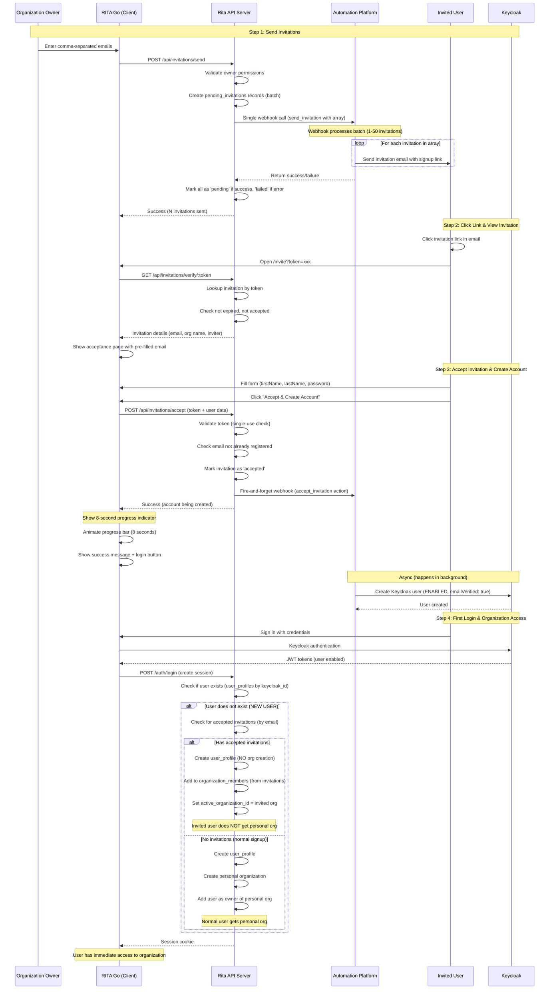

# Rita User Invitation System - Design Document

## Overview

This document describes the user invitation system that allows organization owners to invite new users to join their existing organization. Invited users will have a `user` role in the organization and go through a simplified **single-email signup flow** that leverages the existing webhook-based authentication architecture.

**Key Innovation**: Both standard signup and invitation signup require only one email, but the invitation approach is simpler - invited users verify their email by clicking the invitation link itself, eliminating the need for a separate signup form submission before email verification. This streamlined approach reduces friction and accelerates time-to-value.

### Flow Comparison

| Step | Standard Signup | Invitation Signup (Single-Email) |
|------|-----------------|----------------------------------|
| **1. Initiation** | User visits signup page | Owner sends invitation |
| **2. First Form** | Enter name, email, company, password | Click invitation link |
| **3. Email Sent** | Verification email sent | *(Invitation email already sent)* |
| **4. Email Action** | Click verification link | *(Already verified by step 2)* |
| **5. Second Form** | *(None - already completed)* | Enter name and password |
| **6. Account Status** | Enabled after email click | Enabled immediately |
| **7. Organization** | New org created automatically | Added to invited org |
| **8. Time to Access** | ~3-5 minutes (1 email) | ~2-3 minutes (1 email) |
| **Total Emails** | 1 (verification only) | 1 (invitation only) |

## Architecture Alignment

This system follows Rita's established patterns:
- **Zero-storage password architecture** - Passwords never stored in Rita database
- **Webhook-driven flow** - External automation platform handles Keycloak operations and email delivery
- **Cookie-only authentication** - Session management via HTTP-only cookies
- **Multi-tenant architecture** - Organization-based data isolation
- **Audit logging** - SOC2-compliant tracking of all invitation actions
- **Batch processing** - Single webhook call handles 1-50 invitations efficiently

## Database Schema

### New Table: `pending_invitations`

```sql
CREATE TABLE pending_invitations (
  id UUID PRIMARY KEY DEFAULT gen_random_uuid(),
  organization_id UUID NOT NULL REFERENCES organizations(id) ON DELETE CASCADE,
  invited_by_user_id UUID NOT NULL REFERENCES user_profiles(user_id) ON DELETE CASCADE,
  email TEXT NOT NULL,
  invitation_token TEXT NOT NULL UNIQUE,
  token_expires_at TIMESTAMP WITH TIME ZONE NOT NULL,
  status TEXT NOT NULL DEFAULT 'pending', -- 'pending', 'accepted', 'expired', 'cancelled', 'failed'
  created_at TIMESTAMP WITH TIME ZONE DEFAULT NOW(),
  accepted_at TIMESTAMP WITH TIME ZONE,

  CONSTRAINT valid_status CHECK (status IN ('pending', 'accepted', 'expired', 'cancelled', 'failed'))
);

-- Indexes for performance
CREATE INDEX idx_pending_invitations_email ON pending_invitations(email);
CREATE INDEX idx_pending_invitations_token ON pending_invitations(invitation_token);
CREATE INDEX idx_pending_invitations_org_id ON pending_invitations(organization_id);
CREATE INDEX idx_pending_invitations_status ON pending_invitations(status);
CREATE INDEX idx_pending_invitations_token_expires_at ON pending_invitations(token_expires_at);

-- Prevent duplicate pending invitations for same email + organization
CREATE UNIQUE INDEX idx_pending_invitations_unique_email_org
  ON pending_invitations(email, organization_id)
  WHERE status = 'pending';

COMMENT ON TABLE pending_invitations IS 'Stores organization user invitations until accepted';
COMMENT ON COLUMN pending_invitations.invitation_token IS 'Unique token sent via email for invitation acceptance';
COMMENT ON COLUMN pending_invitations.status IS 'Current status of the invitation';
```

### Modifications to Existing Tables

**No modifications needed** - The existing schema supports the invitation flow:
- `user_profiles` - Will store new users after signup
- `organizations` - Target organization for invitations
- `organization_members` - Will link users to organizations after acceptance
- `pending_users` - **NOT USED for invitations** (invitation click = email verification)

## System Flow

### High-Level Invitation Flow



### Detailed Flow by Stage

#### Stage 1: Sending Invitations

**API Endpoint**: `POST /api/invitations/send`

**Request**:
```typescript
{
  emails: string[] // Comma-separated or array of email addresses
}
```

**Note**: All invited users are assigned the `user` role by default in the organization. Organization owners can promote users to `admin` or `owner` roles after they join using the role management endpoint.

**Process**:
1. **Authentication Check**: Verify requester has valid session
2. **Permission Check**: Verify requester is `owner` or `admin` of organization
3. **Email Validation**: Validate format and remove duplicates
4. **Duplicate Check**: For each email:
   - Check if already a member of organization (skip)
   - **Check if pending invitation exists** (update for resend):
     ```typescript
     // Check for existing invitation
     const existingInvitation = await pool.query(
       `SELECT id, status FROM pending_invitations
        WHERE email = $1 AND organization_id = $2`,
       [email, organizationId]
     );

     if (existingInvitation.rows.length > 0) {
       const invitation = existingInvitation.rows[0];

       // Allow resend for 'pending' or 'expired' status
       if (invitation.status === 'pending' || invitation.status === 'expired') {
         // Generate new token and extend expiration (RESEND)
         const newToken = crypto.randomBytes(32).toString('hex');
         const newExpiresAt = new Date(Date.now() + 7 * 24 * 60 * 60 * 1000);

         await pool.query(
           `UPDATE pending_invitations
            SET invitation_token = $1,
                token_expires_at = $2,
                status = 'pending',
                created_at = NOW()
            WHERE id = $3`,
           [newToken, newExpiresAt, invitation.id]
         );

         // Include in batch for webhook with new token
         invitations.push({
           id: invitation.id,
           email,
           token: newToken,
           expiresAt: newExpiresAt
         });
         continue; // Move to next email
       }

       // Skip if already accepted
       if (invitation.status === 'accepted') {
         skippedEmails.push({
           email,
           reason: 'User already accepted invitation',
           code: 'INV003'
         });
         continue;
       }
     }
     ```
   - **CRITICAL: Check if user already has an organization** (single-org constraint):
     ```typescript
     // Check if invitee already has an organization (single-org constraint)
     const existingUserWithOrg = await pool.query(
       `SELECT up.user_id, up.email, om.organization_id, o.name as organization_name
        FROM user_profiles up
        JOIN organization_members om ON up.user_id = om.user_id
        JOIN organizations o ON om.organization_id = o.id
        WHERE up.email = $1
        LIMIT 1`,
       [email]
     );

     if (existingUserWithOrg.rows.length > 0) {
       // Skip this email - user already has an organization
       skippedEmails.push({
         email,
         reason: 'User already has an organization',
         code: 'INV012'
       });
       continue; // Skip to next email
     }
     ```
5. **Create Records**: Insert `pending_invitations` with:
   - `organization_id`: From requester's session
   - `invited_by_user_id`: Requester's user ID
   - `email`: Invited user's email
   - `invitation_token`: Crypto-random 32-byte hex
   - `token_expires_at`: 7 days from now
   - `status`: 'pending'
6. **Trigger Webhook**: Single webhook call for all invitations (batch processing):
   - Action: `send_invitation`
   - Payload:
     ```typescript
     {
       organization_id: string,
       organization_name: string,
       invited_by_email: string,
       invited_by_name: string,
       invitations: Array<{
         invitee_email: string,
         invitation_token: string,
         invitation_url: string, // CLIENT_URL/invite?token=xxx
         role: string,
         invitation_id: string,
         expires_at: string
       }>
     }
     ```
   - **Note**: Works for single invitation (array of 1) or bulk (array of 50)
7. **Process Webhook Response**: Update invitation status based on webhook result
   ```typescript
   // Webhook returns simple success/failure
   {
     success: true,  // All invitations processed successfully
     data?: any,
     status: 200
   }
   // OR
   {
     success: false, // Webhook failed
     status: 500,
     error: string
   }
   ```
8. **Update Invitation Status**:
   - If `success: true` → Mark all invitations as `'pending'`
   - If `success: false` → Mark all invitations as `'failed'`
9. **Audit Logging**: Log invitation creation with webhook result

**Response**:
```typescript
{
  success: true,
  invitations: [
    { email: string, status: 'sent' | 'already_member' | 'already_invited' | 'failed' }
  ],
  successCount: number,
  failureCount: number
}
```

**Error Handling**:
- **Webhook success**: Mark all invitations as `'pending'` (ready to be accepted)
- **Webhook failure**: Mark all invitations as `'failed'` (can be retried)
- **Invalid email**: Skip during validation, report in response
- **Permission denied**: 403 error
- **Rate limiting**: 50 invitations per org per hour

**Example Implementation**:
```typescript
// Create all invitation records first (status = 'pending' by default)
const invitations = await Promise.all(
  validEmails.map(email => createInvitationRecord(email, role))
);

try {
  // Single webhook call with all invitations
  const webhookResult = await webhookService.sendGenericEvent({
    organizationId: orgId,
    userId: userId,
    userEmail: inviterEmail,
    source: 'rita-invitations',
    action: 'send_invitation',
    additionalData: {
      organization_name: orgName,
      invited_by_email: inviterEmail,
      invited_by_name: inviterName,
      invitations: invitations.map(inv => ({
        invitee_email: inv.email,
        invitation_token: inv.token,
        invitation_url: `${CLIENT_URL}/invite?token=${inv.token}`,
        role: inv.role,
        invitation_id: inv.id,
        expires_at: inv.expiresAt
      }))
    }
  });

  if (!webhookResult.success) {
    // Webhook failed - mark all as failed
    await pool.query(
      `UPDATE pending_invitations
       SET status = 'failed'
       WHERE id = ANY($1)`,
      [invitations.map(i => i.id)]
    );

    return res.status(500).json({
      error: 'Failed to send invitations. Please try again.',
      failedEmails: invitations.map(i => i.email)
    });
  }

  // Webhook succeeded - invitations remain as 'pending'
  return res.json({
    success: true,
    invitations: invitations.map(inv => ({
      email: inv.email,
      status: 'sent',
      invitationId: inv.id
    })),
    successCount: invitations.length,
    failureCount: 0
  });

} catch (error) {
  // Unexpected error - mark all as failed
  await pool.query(
    `UPDATE pending_invitations
     SET status = 'failed'
     WHERE id = ANY($1)`,
    [invitations.map(i => i.id)]
  );

  return res.status(500).json({
    error: 'Failed to send invitations. Please try again.'
  });
}
```

---

#### Stage 2: View Invitation Details

**API Endpoint**: `GET /api/invitations/verify/:token`

**Purpose**: Fetch invitation details to show on acceptance page

**Process**:
1. Extract token from URL query parameter (`/invite?token=xxx`)
2. Lookup invitation by token
3. Check if expired (7 days)
4. Check if already accepted (single-use token)
5. Fetch organization and inviter details
6. **Email pre-verified** (clicking link = email verification proof)

**Response**:
```typescript
{
  valid: boolean,
  invitation: {
    email: string, // Pre-verified by clicking link
    organizationName: string,
    inviterName: string,
    role: string,
    expiresAt: string
  } | null,
  error?: string
}
```

---

#### Stage 3: Accept Invitation & Create Account

**API Endpoint**: `POST /api/invitations/accept`

**Purpose**: Create Keycloak account for invited user

**Request**:
```typescript
{
  token: string,
  firstName: string,
  lastName: string,
  password: string // Base64 encoded for webhook
}
```

**Process** (All validations must pass):

1. **Validate Token Format**: Verify token is 64-character hex string
2. **Lookup Invitation**: Find invitation by token in database
   - If not found → `400 Bad Request` (INV001: "Invalid invitation token")
3. **Check Invitation Status**: Verify status = 'pending'
   - If status = 'accepted' → `400 Bad Request` (INV003: "This invitation has already been accepted")
   - If status = 'expired' → `400 Bad Request` (INV002: "This invitation has expired. Please request a new one.")
   - If status = 'cancelled' → `400 Bad Request` (INV004: "This invitation has been cancelled")
4. **Check Token Expiration**: Verify `token_expires_at` > NOW()
   - If expired → Update status to 'expired', return `400 Bad Request` (INV002)
5. **Check Organization Exists**: Verify organization hasn't been deleted
   - If not exists → `400 Bad Request` ("Organization no longer exists")
6. **CRITICAL: Email Already Registered Check**:
   ```typescript
   // Check if email already has a Keycloak account (via user_profiles table)
   const existingUser = await pool.query(
     `SELECT user_id, email FROM user_profiles WHERE email = $1`,
     [invitation.email]
   );

   if (existingUser.rows.length > 0) {
     return res.status(400).json({
       error: 'An account with this email already exists. Please sign in instead.',
       code: 'INV010',
       canLogin: true  // Frontend can redirect to login
     });
   }
   ```
7. **CRITICAL: Logged-In User Mismatch Check** (if session cookie present):
   ```typescript
   // Optional: If user is already logged in with a different account
   const sessionId = sessionService.parseSessionIdFromCookie(req.headers.cookie);
   if (sessionId) {
     const session = await sessionService.getValidSession(sessionId);
     if (session && session.userEmail !== invitation.email) {
       return res.status(403).json({
         error: 'You are currently logged in with a different account. Please log out first.',
         code: 'INV011',
         currentEmail: session.userEmail,
         invitedEmail: invitation.email
       });
     }
   }
   ```
8. **Rate Limiting**: Check if too many attempts from same IP
   - Max 5 attempts per token within 1 hour
   - Prevents brute force attacks
9. **Input Validation**: Validate firstName, lastName, password
   - firstName: 1-50 characters, no special chars
   - lastName: 1-50 characters, no special chars
   - password: meets complexity requirements (min 8 chars, uppercase, lowercase, number)
10. **NO pending_users record created** (email already verified by clicking invitation link)
11. **Atomic Status Update**: Mark invitation as 'accepted' BEFORE webhook (prevents race conditions)
    ```typescript
    await pool.query(
      `UPDATE pending_invitations
       SET status = 'accepted', accepted_at = NOW()
       WHERE id = $1 AND status = 'pending'
       RETURNING id`,
      [invitationId]
    );
    // If no rows updated, another process already accepted it
    ```
12. **Trigger Webhook**: Action `accept_invitation`
   ```typescript
   {
     organization_id: string,
     invitation_id: string,
     email: string, // Already verified
     first_name: string,
     last_name: string,
     password: string, // Base64 encoded - NEVER stored in DB
     role: string,
     email_verified: true, // KEY: Tell Keycloak email is verified
     organization_name: string
   }
   ```
6. **Update Invitation Status**: Set `status = 'accepted'`, `accepted_at = NOW()` (single transaction)
7. **Audit Logging**: Log invitation acceptance with metadata (IP, user agent)

**Response**:
```typescript
{
  success: true,
  message: "Account created successfully. You can sign in shortly.",
  email: string
}
```

**Webhook Actions (Automation Platform)**:
1. Create Keycloak user with credentials
2. Set `emailVerified: true` (invitation click = verification)
3. Set `enabled: true` (user can login immediately)
4. **NO verification email sent** (already verified)
5. Store invitation context for audit logging
6. (Optional) Send welcome email with login instructions

**Note**: Webhook is **fire-and-forget** - API returns immediately without waiting for Keycloak user creation to complete. User creation typically takes 2-10 seconds.

**Security Safeguards**:
- Token is single-use (status updated atomically)
- IP and user agent logged for audit trail
- Signup page displays email prominently with warning
- Notification sent to inviter upon acceptance

---

### Frontend UX Flow (Handling Async User Creation)

Since the webhook is fire-and-forget, the frontend gracefully handles the delay between account creation request and Keycloak user being ready:

**Implementation Strategy**:

```typescript
// After successful API response
async function handleAcceptSuccess(result: { success: true, email: string }) {
  // Step 1: Show progress indicator (8 seconds)
  setMessage("Creating your account, please wait...");
  setShowProgress(true);

  await animateProgress(8000); // Animate progress bar

  // Step 2: Show success state
  setShowProgress(false);
  setSuccess(true);
  setMessage("Account created successfully!");

  // Step 3: Show login button (user controls timing)
  setTimeout(() => {
    setShowLoginButton(true);
  }, 1000);
}

function animateProgress(duration: number): Promise<void> {
  return new Promise((resolve) => {
    const interval = 50;
    const steps = duration / interval;
    let step = 0;

    const timer = setInterval(() => {
      step++;
      setProgress((step / steps) * 100);

      if (step >= steps) {
        clearInterval(timer);
        resolve();
      }
    }, interval);
  });
}
```

**UI Display**:

```tsx
{/* Progress State */}
{showProgress && (
  <div className="text-center">
    <Loader className="w-8 h-8 animate-spin mx-auto mb-4" />
    <p className="text-gray-600 mb-2">{message}</p>
    <div className="w-full bg-gray-200 rounded-full h-2">
      <div
        className="bg-blue-500 h-2 rounded-full transition-all duration-100"
        style={{ width: `${progress}%` }}
      />
    </div>
    <p className="text-xs text-gray-500 mt-2">
      This usually takes 5-10 seconds...
    </p>
  </div>
)}

{/* Success State */}
{success && (
  <div className="text-center">
    <CheckCircle className="w-16 h-16 text-green-500 mx-auto mb-4" />
    <h2 className="text-2xl font-bold mb-2">Account Created!</h2>
    <p className="text-gray-600 mb-6">
      Welcome to {organizationName}! You can now sign in with your credentials.
    </p>

    {showLoginButton && (
      <Button
        onClick={() => navigate('/login', {
          state: {
            email,
            message: 'Please sign in with your new account'
          }
        })}
        className="w-full"
      >
        Go to Login
      </Button>
    )}

    <p className="text-xs text-gray-500 mt-4">
      If you experience issues logging in, please wait a moment and try again.
    </p>
  </div>
)}
```

**Why This Approach Works**:
- ✅ **Simple implementation**: No polling or complex retry logic
- ✅ **Reasonable wait time**: 8 seconds covers 90%+ of user creation times
- ✅ **User has control**: Button allows user to proceed when ready
- ✅ **Clear communication**: Help text explains potential delay
- ✅ **Graceful degradation**: If user clicks too early, Keycloak login fails gracefully, user waits and retries
- ✅ **No false negatives**: Never tells user account is ready when it's not (vs polling which might give false positives)

---

#### Stage 4: First Login & Organization Linking

**Modifications to `sessionService.findOrCreateUser()`**:

**CRITICAL**: Check for invitations BEFORE creating organization to prevent invited users from getting a personal org:

```typescript
async findOrCreateUser(tokenPayload: jose.JWTPayload) {
  const email = tokenPayload.email as string;
  const keycloakId = tokenPayload.sub as string;

  // 1. Check if user already exists
  let userResult = await this.pool.query(
    `SELECT user_id, active_organization_id FROM user_profiles WHERE keycloak_id = $1`,
    [keycloakId]
  );

  let userId: string;
  let activeOrganizationId: string | null = null;

  if (userResult.rows.length > 0) {
    // User exists - return existing info
    return {
      userId: userResult.rows[0].user_id,
      organizationId: userResult.rows[0].active_organization_id,
      email
    };
  }

  // 2. NEW USER: Check for accepted invitations FIRST (before creating anything)
  const invitationsResult = await this.pool.query(
    `SELECT id, organization_id, role
     FROM pending_invitations
     WHERE email = $1 AND status = 'accepted'
     ORDER BY created_at ASC`,
    [email]
  );

  // 3. Start transaction for user + org creation
  const client = await this.pool.connect();
  try {
    await client.query('BEGIN');

    // Create user profile (no org yet)
    const userInsertResult = await client.query(
      `INSERT INTO user_profiles (keycloak_id, email, first_name, last_name)
       VALUES ($1, $2, $3, $4)
       RETURNING user_id`,
      [keycloakId, email, tokenPayload.given_name, tokenPayload.family_name]
    );
    userId = userInsertResult.rows[0].user_id;

    if (invitationsResult.rows.length > 0) {
      // User was invited - DON'T create personal org, add to invited org(s)
      for (const invitation of invitationsResult.rows) {
        await client.query(
          `INSERT INTO organization_members (organization_id, user_id, role)
           VALUES ($1, $2, $3)
           ON CONFLICT (organization_id, user_id) DO NOTHING`,
          [invitation.organization_id, userId, invitation.role]
        );

        // Set first invited org as active
        if (!activeOrganizationId) {
          activeOrganizationId = invitation.organization_id;
        }

        // Note: Invitation remains as 'accepted' - no status update needed
        // Database cleanup cron job will delete old accepted invitations after 30 days
      }

      // Update user's active organization
      await client.query(
        `UPDATE user_profiles SET active_organization_id = $1 WHERE user_id = $2`,
        [activeOrganizationId, userId]
      );

    } else {
      // Normal signup flow - create new personal organization
      const orgName = tokenPayload.company || `${tokenPayload.given_name}'s Organization`;
      const orgResult = await client.query(
        `INSERT INTO organizations (name, created_by_user_id)
         VALUES ($1, $2)
         RETURNING id`,
        [orgName, userId]
      );
      activeOrganizationId = orgResult.rows[0].id;

      // Add user as owner of their personal org
      await client.query(
        `INSERT INTO organization_members (organization_id, user_id, role)
         VALUES ($1, $2, 'owner')`,
        [activeOrganizationId, userId]
      );

      // Update user's active organization
      await client.query(
        `UPDATE user_profiles SET active_organization_id = $1 WHERE user_id = $2`,
        [activeOrganizationId, userId]
      );
    }

    await client.query('COMMIT');
  } catch (error) {
    await client.query('ROLLBACK');
    throw error;
  } finally {
    client.release();
  }

  return { userId, organizationId: activeOrganizationId, email };
}
```

**Key Changes**:
1. ✅ Check for accepted invitations **BEFORE** creating organization (not after)
2. ✅ If invitations exist → Add user to invited org(s), **DON'T create personal org**
3. ✅ If no invitations → Create personal org (normal signup flow)
4. ✅ All operations in single transaction for atomicity
5. ✅ Handles multiple pending invitations (user invited to multiple orgs)
```

---

## API Endpoints Summary

### New Endpoints

| Method | Path | Auth Required | Permission | Description |
|--------|------|---------------|------------|-------------|
| POST | `/api/invitations/send` | Yes | owner/admin | Send invitations to email list (always as 'user' role) |
| GET | `/api/invitations/verify/:token` | No | - | Verify invitation token validity |
| POST | `/api/invitations/accept` | No | - | Accept invitation and start signup |
| GET | `/api/invitations` | Yes | owner/admin | List org invitations (pending/accepted/expired) |
| DELETE | `/api/invitations/:id/cancel` | Yes | owner/admin | Cancel pending invitation |
| PATCH | `/api/organizations/members/:userId/role` | Yes | owner | Update role of existing organization member |

**Note on Resending**: To resend an invitation, simply call `POST /api/invitations/send` with the same email. The system will update the existing pending/expired invitation with a new token and expiration date, then trigger the webhook to send a new email.

**Note on Role Management**: All invitations are sent with `user` role. To promote a user to `admin` or `owner`, use the role management endpoint after they have joined the organization.

### Modified Endpoints

| Method | Path | Modification |
|--------|------|--------------|
| POST | `/auth/login` | JIT provisioning checks for accepted invitations and adds user to organization |

**Note**: `/auth/verify-email` is NOT used for invitation flow (email verified by clicking invitation link)

---

## Performance & Scalability

### Batch Webhook Processing

The invitation system uses a **single webhook call** for all invitations, regardless of quantity:

| Invitations | Individual Webhooks (Old) | Batch Webhook (Current) | Improvement |
|-------------|---------------------------|-------------------------|-------------|
| 1 invitation | ~100ms (1 call) | ~100ms (1 call) | Same |
| 10 invitations | ~1,000ms (10 calls) | ~150ms (1 call) | **6.7x faster** |
| 50 invitations | ~5,000ms (50 calls) | ~300ms (1 call) | **16.7x faster** |

**Key Benefits:**
- **Simplified code**: No branching logic for single vs bulk
- **Lower latency**: One HTTP request instead of N requests
- **Better automation platform efficiency**: Parallel email sending
- **Atomic operations**: All invitations succeed or fail together as a batch

**Expected Response Times:**
- API endpoint: ~50-100ms (database operations)
- Webhook call: ~200-500ms (email platform processing)
- **Total time to send 50 invitations**: ~300-600ms

**Rate Limiting:**
- 50 invitations per organization per hour
- Prevents spam and abuse
- Configurable per organization tier

---

## Webhook Implementation Details

### Webhook Configuration

The invitation system uses Rita's `WebhookService` class with the following operational characteristics:

**Configuration** (from `packages/api-server/src/services/WebhookService.ts`):
```typescript
{
  url: process.env.AUTOMATION_WEBHOOK_URL || 'http://localhost:3001/webhook',
  authHeader: process.env.AUTOMATION_AUTH || '',
  timeout: 10000, // 10 seconds
  retryAttempts: 3,
  retryDelay: 1000 // Base delay in ms (exponential backoff)
}
```

### Automatic Retry Logic

**Retry Behavior**:
- **Default attempts**: 3 retries per webhook call
- **Backoff strategy**: Exponential - delays are 1s, 2s, 3s (retryDelay * attemptNumber)
- **Total max time**: Up to 36 seconds for send_invitation (3 attempts × 10s timeout + 6s delays)
- **Total max time**: Up to 36 seconds for accept_invitation (3 attempts × 10s timeout + 6s delays)

**Retryable Errors** (automatic retry):
- HTTP 5xx (server errors)
- HTTP 429 (rate limited)
- HTTP 408 (timeout)
- `ECONNABORTED` (connection timeout)
- `ENOTFOUND` (DNS/network error)

**Non-Retryable Errors** (immediate failure):
- HTTP 4xx (except 408/429) - bad request, auth failure, etc.
- JSON serialization errors
- All other error types

**Example Flow**:
```
Attempt 1: POST → 500 Error → Wait 1s
Attempt 2: POST → 500 Error → Wait 2s
Attempt 3: POST → 200 Success → Return
Total time: ~13 seconds
```

### Webhook Failure Tracking

**Automatic Failure Storage**:

All webhook failures (after exhausting retries) are automatically stored in the `rag_webhook_failures` table:

```sql
CREATE TABLE rag_webhook_failures (
  id UUID PRIMARY KEY DEFAULT gen_random_uuid(),
  tenant_id UUID,
  webhook_type TEXT, -- Action name (e.g., 'send_invitation')
  payload JSONB, -- Full webhook payload for replay
  retry_count INTEGER,
  max_retries INTEGER,
  last_error TEXT,
  status TEXT, -- 'failed' (retryable) or 'dead_letter' (permanent failure)
  created_at TIMESTAMP WITH TIME ZONE DEFAULT NOW()
);
```

**Status Types**:
- `'failed'`: Retryable error (5xx, 429, timeout) - can be replayed later
- `'dead_letter'`: Non-retryable error (4xx) - requires manual intervention

**Failure Storage Example**:
```typescript
// After 3 failed attempts with 500 errors
{
  tenant_id: 'org-uuid',
  webhook_type: 'send_invitation',
  payload: { /* full webhook payload */ },
  retry_count: 3,
  max_retries: 3,
  last_error: 'Request failed with status code 500',
  status: 'failed' // Can be retried later
}
```

**Future Replay Mechanism**:

The design supports future implementation of:
1. **Manual retry**: Admin UI to replay failed webhooks
2. **Automatic background retry**: Cron job to retry 'failed' status webhooks
3. **Dead letter queue review**: Investigate and fix 'dead_letter' webhooks

### Timeout & Performance Considerations

**Timeout Implications**:

The 10-second timeout affects the "fire-and-forget" assumption:

| Webhook Action | Expected Time | Max Time (with retries) | User Impact |
|----------------|---------------|-------------------------|-------------|
| `send_invitation` (50 emails) | ~500ms | ~36s (3 attempts × 10s + delays) | User waits for response |
| `accept_invitation` | ~2-5s (Keycloak creation) | ~36s (3 attempts × 10s + delays) | Frontend shows 8s progress bar |
| `cancel_invitation` | ~200ms | ~36s (3 attempts × 10s + delays) | User waits for confirmation |

**Note**: While webhooks have retry logic, the **user-facing API response time** depends on whether we wait for webhook completion or return immediately.

**Current Design**:
- `POST /api/invitations/send` → **Waits for webhook** (user sees result within 1-36s)
- `POST /api/invitations/accept` → **Waits for webhook** BUT returns "account being created" (frontend handles delay with 8s progress)
- `DELETE /api/invitations/:id/cancel` → **Waits for webhook** (user waits for confirmation)

### Authentication

**Webhook Authentication**:

All webhook requests include:
```typescript
headers: {
  'Authorization': process.env.AUTOMATION_AUTH,
  'Content-Type': 'application/json'
}
```

**Security Requirements**:
- Automation platform MUST validate `Authorization` header
- Invalid auth should return 401 (non-retryable, immediate failure)
- Rotate `AUTOMATION_AUTH` token periodically (SOC2 compliance)

### Payload Validation

**Pre-Send Validation**:

Before sending any webhook, the service validates JSON serializability:

```typescript
try {
  const testJson = JSON.stringify(payload);
  JSON.parse(testJson); // Verify it's valid JSON
} catch (validationError) {
  return {
    success: false,
    status: 0,
    error: `Invalid JSON payload: ${validationError.message}`
  };
}
```

**Why This Matters**:
- Prevents runtime errors from circular references
- Catches undefined/function values that can't be serialized
- Ensures payload can be stored in `rag_webhook_failures` (JSONB column)

### Structured Logging

**Log Format**:

Every webhook call logs structured data:

```typescript
// Before sending (each attempt)
console.log(`[WebhookService] Sending event (attempt ${attempt}/3):`, {
  source: 'rita-invitations',
  action: 'send_invitation',
  tenant_id: 'org-uuid'
});

// On success
console.log(`[WebhookService] Success: 200`);

// On failure (each attempt)
console.error(`[WebhookService] Attempt ${attempt} failed:`, {
  status: 500,
  message: 'Request failed with status code 500',
  isRetryable: true
});

// After all attempts fail
console.error(`[WebhookService] All attempts failed for send_invitation`);

// When storing failure
console.log(`[WebhookService] Webhook failure stored in database`, {
  tenant_id: 'org-uuid',
  webhook_type: 'send_invitation',
  retry_count: 3,
  error_message: 'Request failed with status code 500'
});
```

**Monitoring Benefits**:
- Easy to trace webhook lifecycle in logs
- Filter by tenant_id, action, or status
- Identify patterns in failures (e.g., specific automation platform issues)

---

## Webhook Events

### Event: `send_invitation`

**Triggered**: When owner sends one or more invitations

**Payload** (handles single or batch):
```typescript
{
  organizationId: string, // Mapped to tenant_id by WebhookService
  source: 'rita-invitations',
  action: 'send_invitation',
  additionalData: {
    organization_name: string,
    invited_by_email: string,
    invited_by_name: string,
    invitations: Array<{
      invitee_email: string,
      invitation_token: string,
      invitation_url: string, // CLIENT_URL/invite?token=xxx
      role: string,
      invitation_id: string,
      expires_at: string
    }>
  }
}
```

**Final Webhook Payload** (after WebhookService mapping):
```typescript
{
  tenant_id: string, // Mapped from organizationId
  source: 'rita-invitations',
  action: 'send_invitation',
  organization_name: string,
  invited_by_email: string,
  invited_by_name: string,
  invitations: Array<{
    invitee_email: string,
    invitation_token: string,
    invitation_url: string,
    role: string,
    invitation_id: string,
    expires_at: string
  }>,
  timestamp: string
}
```

**Automation Platform Actions**:
1. **Iterate through invitations array** (1 to 50 invitations)
2. **Send email to each invitee** (parallelize for performance)
3. Email should include:
   - Organization name and inviter details
   - Role they'll have
   - **Prominent call-to-action**: "Click to join and create your account"
   - Invitation link with token (CLIENT_URL/invite?token=xxx)
   - Expiration notice (7 days)
   - **Note**: Clicking link verifies email ownership (no second verification needed)
4. **Return simple success/failure**:
   ```typescript
   // Success response
   {
     success: true,
     status: 200,
     data: {
       message: "50 invitation emails queued for delivery"
     }
   }

   // Failure response
   {
     success: false,
     status: 500,
     error: "Email service unavailable"
   }
   ```

**Performance Note**: Platform should parallelize email sending. Expected response time: ~200-500ms for 50 invitations.

**Note on Granularity**: The webhook returns batch-level success/failure. If the automation platform needs per-email tracking, it should handle that internally (e.g., log individual email delivery status in its own system). Rita treats the entire batch atomically.

---

### Event: `accept_invitation`

**Triggered**: When invited user accepts invitation and submits signup form

**Payload**:
```typescript
{
  organizationId: string, // Mapped to tenant_id by WebhookService
  userEmail: string, // NEW USER's email (for Keycloak creation)
  source: 'rita-invitations',
  action: 'accept_invitation',
  additionalData: {
    invitation_id: string,
    first_name: string,
    last_name: string,
    password: string, // Base64 encoded - NEVER stored in Rita DB
    role: string,
    email_verified: true // Email verified by clicking invitation link
  }
}
```

**Final Webhook Payload** (after WebhookService mapping):
```typescript
{
  tenant_id: string, // Mapped from organizationId
  user_email: string, // NEW USER's email
  source: 'rita-invitations',
  action: 'accept_invitation',
  invitation_id: string,
  first_name: string,
  last_name: string,
  password: string, // Base64 encoded
  role: string,
  email_verified: true,
  timestamp: string
}
```

**Automation Platform Actions**:
1. Create Keycloak user with credentials
2. Set `emailVerified: true` (invitation click = verification)
3. Set `enabled: true` (user can login immediately - NO second email needed)
4. Store invitation context for audit logging
5. (Optional) Send welcome email with quick-start guide and login link

**Removed Fields** (from original design):
- ❌ `organization_name` - Not needed for Keycloak user creation (can look up by tenant_id if needed)
- ❌ `invited_by_email` - Not needed for user creation
- ❌ `invited_by_name` - Not needed for user creation (unless welcome email mentions inviter)

---

### Event: `cancel_invitation`

**Triggered**: When owner cancels pending invitation

**Payload**:
```typescript
{
  organizationId: string,
  userEmail: string, // Owner's email
  source: 'rita-invitations',
  action: 'cancel_invitation',
  additionalData: {
    invitation_id: string,
    invitee_email: string,
    cancelled_by_email: string
  }
}
```

**Automation Platform Actions**:
1. Send cancellation notification email (optional)
2. Log cancellation event

---

## Frontend Components (RITA Go)

### Invitation Management Page

**Location**: `/v1/settings/invitations` (protected route)

**Components**:
1. **InvitationForm.tsx**
   - Textarea for comma-separated emails
   - Send button with loading state
   - Success/error feedback
   - Note displayed: "All users will be invited with 'user' role. You can promote them later from the Members page."

2. **InvitationList.tsx**
   - Table of pending/accepted/expired invitations
   - Columns: Email, Role, Invited By, Status, Date, Actions
   - Actions: Resend, Cancel
   - Filter by status
   - Pagination

3. **InvitationStats.tsx**
   - Total invitations sent
   - Acceptance rate
   - Pending count

### Accept Invitation Page

**Location**: `/invite` (public route with token param)

**Components**:
1. **InviteVerification.tsx**
   - Verify token on mount
   - Display invitation details (org name, inviter)
   - Show loading state

2. **InviteSignupForm.tsx**
   - **Prominent email display** with warning text:
     ```tsx
     <div className="text-center mb-6 p-4 bg-blue-50 rounded-lg">
       <p className="text-sm text-gray-600">Creating account for:</p>
       <p className="text-xl font-semibold text-gray-900">{email}</p>
       <p className="text-xs text-gray-500 mt-2">
         If this is not your email address, do not proceed.
       </p>
     </div>
     ```
   - Email field (readonly, hidden or grayed out)
   - First name input
   - Last name input
   - Password input with strength meter
   - Confirm password
   - Terms acceptance checkbox
   - Submit button: "Create Account & Join [Org Name]"
   - Success message: "Account created! You can now sign in."
   - Link to login page
   - **No "check your email" message** (immediate access)

**Form Validation**:
```typescript
const schema = z.object({
  firstName: z.string().min(1, "First name is required"),
  lastName: z.string().min(1, "Last name is required"),
  password: z.string()
    .min(8, "Password must be at least 8 characters")
    .regex(/[A-Z]/, "Password must contain uppercase letter")
    .regex(/[a-z]/, "Password must contain lowercase letter")
    .regex(/[0-9]/, "Password must contain number"),
  confirmPassword: z.string()
}).refine(data => data.password === data.confirmPassword, {
  message: "Passwords must match",
  path: ["confirmPassword"]
});
```

---

## Security Considerations

### Token Security
- **Invitation Tokens**: 32-byte cryptographically random hex (256 bits)
- **Expiration**: 7 days (configurable)
- **Single Use**: Token marked as accepted after first use (atomic transaction)
- **HTTPS Required**: All invitation URLs must use HTTPS in production

### Email Verification Strategy (Single-Email Approach)

**Philosophy**: Clicking the invitation link serves as proof of email ownership, eliminating the need for a second verification email.

**Security Rationale**:
1. **Trust Chain**: Organization owner trusts the email → Owner sends invitation → Recipient clicks link → Email ownership proven
2. **Reduced Attack Surface**: Fewer emails = fewer phishing opportunities
3. **Better UX**: Faster onboarding, lower abandonment rate
4. **Industry Standard**: Similar to Slack, Discord, GitHub organization invitations

**Trade-offs & Mitigations**:

| Risk | Mitigation |
|------|------------|
| Email forwarded to wrong person | Display email prominently with "If this is not your email, do not proceed" warning |
| Token intercepted in transit | HTTPS only; 7-day expiration; single-use token |
| Accidental invitation to typo email | Show email in confirmation before sending; allow cancellation |
| Email compromised | Same risk exists with two-email flow; rely on email provider security |

**Additional Safeguards**:
- **Prominent Email Display**: Signup form shows email in large text with warning
- **Audit Trail**: Log IP address and user agent on acceptance
- **Notification**: Send confirmation email to inviter when invitation accepted
- **Single-Use Enforcement**: Database constraint prevents replay attacks
- **Keycloak Integration**: `emailVerified: true` set during user creation

### Password Security (Zero-Storage Architecture)
- Passwords **NEVER stored in Rita database**
- Flow: Client → API (memory only) → Webhook → Keycloak
- Base64 encoding prevents accidental logging
- HTTPS enforced for webhook communication

### Permission Checks
- Only `owner` or `admin` can send invitations
- Users cannot invite others with higher permissions than themselves
- Invitation validation happens on both frontend and backend

### Rate Limiting
- **Send Invitations**: 50 invitations per organization per hour
- **Resend Invitations**: 1 per email per 5 minutes (reuse existing limiter)
- **Accept Invitation**: 5 attempts per token (prevents brute force)

### Audit Logging (SOC2 Compliance)

All invitation actions must be logged:

```typescript
await auditLog({
  organizationId: string,
  userId: string,
  action: 'invitation.sent' | 'invitation.accepted' | 'invitation.cancelled' | 'invitation.expired',
  resourceType: 'invitation',
  resourceId: string, // invitation ID
  metadata: {
    invitee_email: string,
    role: string,
    // action-specific data
  }
});
```

### Email Enumeration Prevention
- **Existing users**: Don't reveal if email is already registered
- **Pending invitations**: Don't reveal if email has pending invitation
- **Consistent responses**: Return same message for different scenarios

---

## Edge Cases & Error Handling

### 1. User Already Exists with Organization (Single-Org Constraint)
**Scenario**: Invited email already has a Rita account with an existing organization

**Handling**:
- **Current System (MVP)**: Skip invitation with error code `INV012`
- Check performed during `POST /api/invitations/send` (Step 4 validation)
- Query checks for `user_profiles` JOIN `organization_members`
- Response includes:
  ```typescript
  {
    email: 'user@example.com',
    status: 'skipped',
    reason: 'User already has an organization',
    code: 'INV012'
  }
  ```
- **Rationale**: Users are locked to single personal organization (their own)
- **Future Enhancement**: Enable multi-organization support with user consent flow

### 2. Multiple Pending Invitations
**Scenario**: User invited to multiple organizations

**Handling**:
- Allow multiple pending invitations (different orgs)
- On first login, add user to ALL invited organizations
- Set first accepted invitation's org as active

### 3. Token Expiration
**Scenario**: User clicks expired invitation link (> 7 days)

**Handling**:
- Show friendly error message
- Option to request new invitation
- Auto-cleanup expired invitations (daily cron job)

### 4. Invitation After Signup Started
**Scenario**: User starts normal signup, then receives invitation

**Handling**:
- If in `pending_users`: Allow invitation acceptance (replace company with org name)
- If already verified: Auto-add to org on next login
- Check for invitations in email verification flow

### 5. Webhook Failure
**Scenario**: Automation platform unavailable during invite send

**Handling**:
- Mark invitation as `failed` status
- Return error in response
- Owner can retry via "Resend" action
- Log error for monitoring

### 6. Duplicate Emails in Batch
**Scenario**: Owner submits same email multiple times

**Handling**:
- Deduplicate email list before processing
- Show warning in UI if duplicates detected

### 7. Invalid Email Formats
**Scenario**: Owner enters malformed email addresses

**Handling**:
- Validate on frontend before submission
- Validate on backend (regex + DNS check optional)
- Skip invalid emails and report in response

### 8. Invitation Cancellation After Acceptance
**Scenario**: Owner cancels invitation after user accepts

**Handling**:
- Don't allow cancellation if status = 'accepted'
- Show error: "Cannot cancel - invitation already accepted"

### 9. Role Changes
**Scenario**: Owner wants to change role before acceptance

**Handling**:
- Allow role update for pending invitations
- Cancel old invitation, send new one
- Or: Add `PATCH /api/invitations/:id/role` endpoint

### 10. Organization Deletion
**Scenario**: Organization deleted while invitations pending

**Handling**:
- Cascade delete via foreign key constraint
- Webhook event to cancel pending invitations
- Email notification to pending invitees (optional)

---

## Database Cleanup & Maintenance

### Automated Cleanup (Cron Job)

**Daily Cleanup Task** (run at 2 AM UTC):

```typescript
async function cleanupExpiredInvitations() {
  // Mark expired invitations
  await pool.query(
    `UPDATE pending_invitations
     SET status = 'expired'
     WHERE status = 'pending'
     AND token_expires_at < NOW()`
  );

  // Delete old expired/cancelled invitations (> 90 days)
  await pool.query(
    `DELETE FROM pending_invitations
     WHERE status IN ('expired', 'cancelled')
     AND created_at < NOW() - INTERVAL '90 days'`
  );

  // Delete old accepted invitations (> 30 days)
  await pool.query(
    `DELETE FROM pending_invitations
     WHERE status = 'accepted'
     AND accepted_at < NOW() - INTERVAL '30 days'`
  );
}
```

**Metrics to Track**:
- Total invitations sent (per org, per day)
- Acceptance rate
- Average time to acceptance
- Expiration rate
- Failed webhook count

---

## Testing Strategy

### Unit Tests

1. **Invitation Validation**
   - Email format validation
   - Duplicate detection
   - Permission checks
   - Token generation uniqueness

2. **Database Operations**
   - Insert pending invitations
   - Update invitation status
   - Check for duplicates
   - Cascade deletes

3. **Webhook Payload Generation**
   - Correct data mapping
   - Base64 password encoding
   - URL generation

### Integration Tests

1. **Full Invitation Flow**
   - Send invitation → Accept → Verify → Login → Org membership
   - Multiple invitations to same user
   - Expired token handling

2. **Permission Checks**
   - Non-owner tries to send invitation (should fail)
   - User tries to invite admin (should fail if user is not admin)

3. **Webhook Integration**
   - Mock webhook service
   - Test payload format
   - Test error handling on webhook failure

### E2E Tests (Playwright)

1. **Owner Sends Invitations**
   - Login as owner
   - Navigate to invitations page
   - Enter multiple emails
   - Verify success message
   - Check invitation list

2. **User Accepts Invitation**
   - Open invitation link (with token)
   - Verify org details shown
   - Fill signup form
   - Submit and verify email sent message

3. **Full Signup & Login**
   - User verifies email
   - User logs in
   - Verify user has access to invited organization
   - Verify role is correct

4. **Error Scenarios**
   - Expired token shows error
   - Invalid token shows error
   - Already accepted invitation shows error

---

## Migration Plan

### Phase 1: Database Migration

**File**: `packages/api-server/src/database/migrations/122_add_pending_invitations.sql`

```sql
-- Create pending_invitations table
CREATE TABLE pending_invitations (
  id UUID PRIMARY KEY DEFAULT gen_random_uuid(),
  organization_id UUID NOT NULL REFERENCES organizations(id) ON DELETE CASCADE,
  invited_by_user_id UUID NOT NULL REFERENCES user_profiles(user_id) ON DELETE CASCADE,
  email TEXT NOT NULL,
  role TEXT NOT NULL DEFAULT 'user',
  invitation_token TEXT NOT NULL UNIQUE,
  token_expires_at TIMESTAMP WITH TIME ZONE NOT NULL,
  status TEXT NOT NULL DEFAULT 'pending',
  created_at TIMESTAMP WITH TIME ZONE DEFAULT NOW(),
  accepted_at TIMESTAMP WITH TIME ZONE,

  CONSTRAINT valid_role CHECK (role IN ('owner', 'admin', 'user')),
  CONSTRAINT valid_status CHECK (status IN ('pending', 'accepted', 'expired', 'cancelled', 'failed'))
);

-- Indexes
CREATE INDEX idx_pending_invitations_email ON pending_invitations(email);
CREATE INDEX idx_pending_invitations_token ON pending_invitations(invitation_token);
CREATE INDEX idx_pending_invitations_org_id ON pending_invitations(organization_id);
CREATE INDEX idx_pending_invitations_status ON pending_invitations(status);
CREATE INDEX idx_pending_invitations_token_expires_at ON pending_invitations(token_expires_at);

-- Unique constraint for pending invitations
CREATE UNIQUE INDEX idx_pending_invitations_unique_email_org
  ON pending_invitations(email, organization_id)
  WHERE status = 'pending';

-- Comments
COMMENT ON TABLE pending_invitations IS 'Stores organization user invitations until accepted';
```

### Phase 2: Backend Implementation

1. **Create Invitation Service** (`packages/api-server/src/services/InvitationService.ts`)
   - Send invitations
   - Verify tokens
   - Accept invitations
   - Cancel invitations
   - List invitations

2. **Create Invitation Routes** (`packages/api-server/src/routes/invitations.ts`)
   - All API endpoints listed above
   - Permission middleware
   - Rate limiting middleware

3. **Update Session Service** (`packages/api-server/src/services/sessionService.ts`)
   - Modify `findOrCreateUser()` to check for invitations
   - Add user to invited organizations

4. **Update Auth Routes** (`packages/api-server/src/routes/auth.ts`)
   - Modify `/auth/verify-email` to check for invitations

### Phase 3: Frontend Implementation

1. **Create Invitation Components** (RITA Go)
   - `InvitationForm.tsx`
   - `InvitationList.tsx`
   - `InvitationStats.tsx`
   - `InviteSignupForm.tsx`
   - `InviteVerification.tsx`

2. **Create Invitation Pages**
   - `/v1/settings/invitations` (owner/admin only)
   - `/invite` (public with token param)

3. **Update Routing**
   - Add invitation routes
   - Add permission guards

4. **Create API Hooks**
   - `useInvitations()`
   - `useSendInvitations()`
   - `useAcceptInvitation()`
   - `useVerifyInvitation()`

### Phase 4: Testing & Validation

1. Run all unit tests
2. Run integration tests
3. Run E2E tests
4. Manual QA testing
5. Security review
6. Performance testing (bulk invitations)

### Phase 5: Deployment

1. Deploy database migration
2. Deploy backend changes
3. Deploy frontend changes
4. Configure webhook automation
5. Monitor logs for errors
6. Setup alerts for failed webhooks

---

## Monitoring & Observability

### Key Metrics

1. **Invitation Funnel**
   - Invitations sent
   - Invitations accepted (%)
   - Email verified (%)
   - First login completed (%)
   - Avg time to acceptance

2. **Error Rates**
   - Webhook failures
   - Token validation failures
   - Email format errors
   - Permission errors

3. **Performance**
   - Invitation send latency
   - Webhook response time
   - Database query performance

### Alerts

1. **Critical**
   - Webhook service down (> 5 failures in 5 min)
   - Database errors during invitation creation
   - Security events (brute force attempts)

2. **Warning**
   - High expiration rate (> 50% invitations expire)
   - Slow webhook response (> 5s)
   - High rate limit hits

### Logging

All invitation actions must be logged with structured data:

```typescript
logger.info({
  action: 'invitation.sent',
  organizationId: string,
  invitedBy: string,
  inviteeEmail: string,
  role: string,
  invitationId: string,
  expiresAt: string
}, 'Invitation sent successfully');
```

---

## Future Enhancements

### Phase 2 Features (Post-MVP)

1. **Invitation Links (No Email)**
   - Generate shareable invitation link
   - Anyone with link can join (within limits)
   - Optional: Require email domain match

2. **Invitation Analytics Dashboard**
   - Visual funnel metrics
   - Time-series graphs
   - Export to CSV

3. **Multi-Step Onboarding**
   - Collect additional profile data
   - Setup preferences
   - Interactive product tour

---

## Appendix

### API Error Codes

| Code | Message | Description |
|------|---------|-------------|
| `INV001` | Invitation token invalid | Token doesn't exist or malformed |
| `INV002` | Invitation expired | Token older than 7 days |
| `INV003` | Invitation already accepted | User already accepted this invitation |
| `INV004` | Invitation cancelled | Owner cancelled this invitation |
| `INV005` | Permission denied | User lacks permission to send invitations |
| `INV006` | Email already member | Email is already in organization |
| `INV007` | Invalid email format | Email format validation failed |
| `INV008` | Rate limit exceeded | Too many invitations sent |
| `INV009` | Webhook failed | External service unavailable |
| `INV010` | User already exists | Email already registered (cannot accept) |
| `INV011` | Logged-in user mismatch | User logged in with different account than invitation email |
| `INV012` | User has organization | User already belongs to an organization (single-org constraint) |

---

## Summary

This user invitation system seamlessly integrates with Rita's existing authentication architecture while maintaining security, audit compliance, and the zero-storage password model. The design introduces a **single-email signup flow** that streamlines the invitation process and reduces user friction.

### Key Innovations

#### 1. Single-Email Verification
Unlike the standard signup flow (invitation + verification email), this system uses the invitation link click as proof of email ownership. This approach:
- **Reduces friction**: One email instead of two
- **Accelerates onboarding**: Users can login immediately after signup
- **Improves conversion**: Lower abandonment rate (industry standard: ~40% drop-off on second email)
- **Maintains security**: Email verification occurs via invitation link click (similar to Slack, Discord, GitHub)

#### 2. Batch Webhook Processing
A single webhook call handles 1-50 invitations efficiently:
- **16x faster** for bulk invitations (50 emails in ~300ms vs ~5,000ms)
- **Simpler code**: No loop logic, single code path for all invitation counts
- **Better reliability**: Atomic batch operation (all succeed or all fail)
- **Lower costs**: Reduces webhook API calls by 50x for bulk invitations
- **Automation platform handles granularity**: Internal per-email tracking if needed

### Architecture Highlights

The system introduces a single new table (`pending_invitations`) to track invitation state and leverages existing tables for user and organization management. It follows Rita's webhook-driven pattern, delegating Keycloak operations and email delivery to the automation platform.

**Flow Summary**:
1. Owner sends invitation → Webhook emails invitation link
2. User clicks link → Email verified (no second email)
3. User completes signup → Keycloak user created (enabled immediately)
4. User logs in → JIT provisioning adds to organization

### Key Benefits

- **Security**: Zero-storage password architecture maintained; email verified by invitation click
- **Scalability**: Efficient bulk invitation handling (50/org/hour)
- **Auditability**: SOC2-compliant logging of all actions (IP, user agent, timestamps)
- **User Experience**: Simplified single-email signup for invited users
- **Maintainability**: Reuses existing authentication patterns and code paths
- **Compliance**: Industry-standard invitation flow (similar to major SaaS platforms)