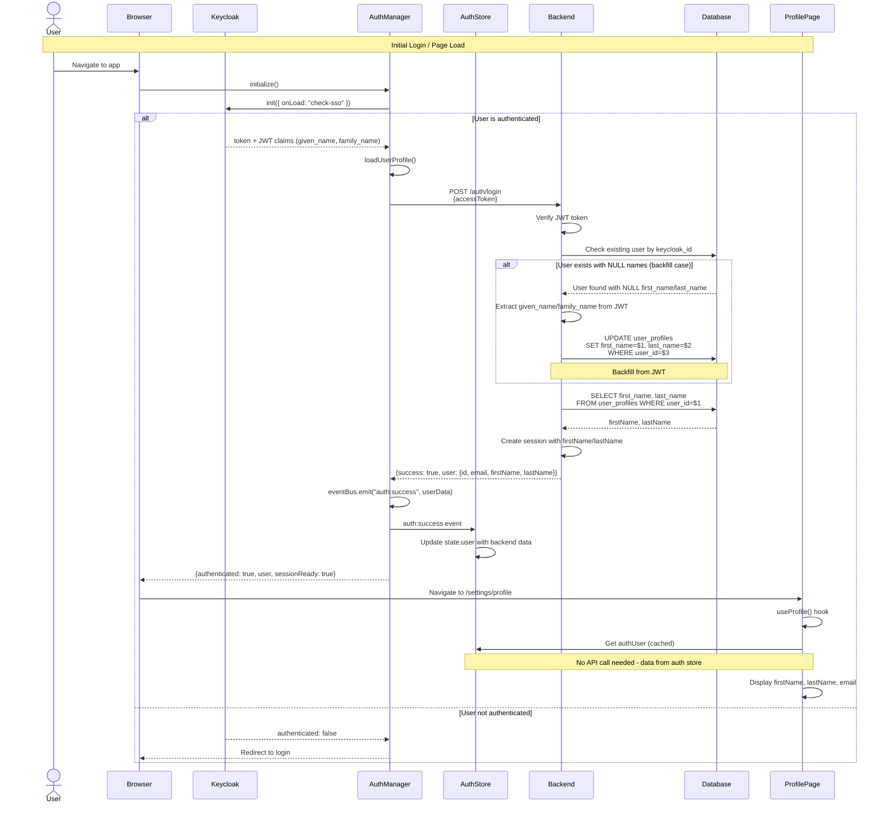
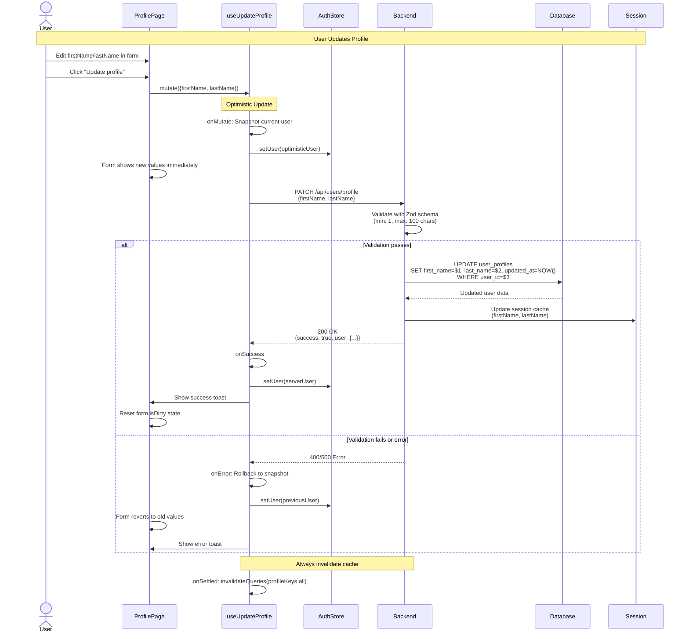
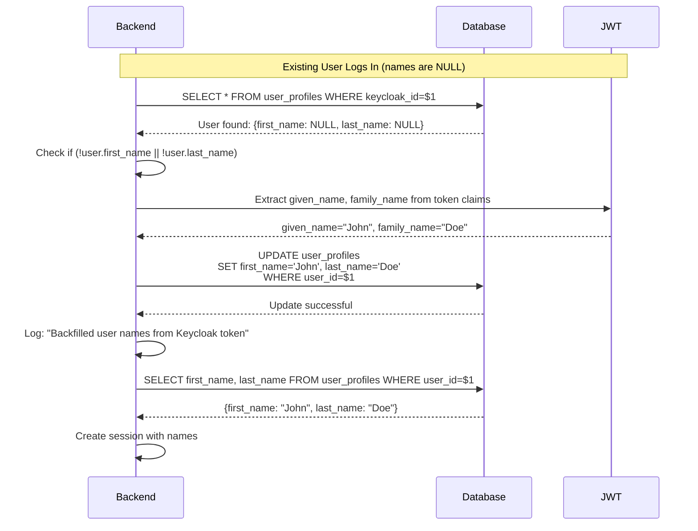

# Profile Update Flow Documentation

## Overview

This document describes the complete user profile management flow in Rita, including authentication, data fetching, and profile updates with firstName and lastName fields.

## Architecture

The profile system uses a **database-first approach** where:
- **Keycloak JWT** is the initial source for user names (`given_name`, `family_name`)
- **PostgreSQL database** stores persistent, editable profile data
- **Session cache** provides fast access without repeated database queries
- **Auth store** maintains client-side authentication state
- **TanStack Query** manages server state with automatic caching and invalidation

## Complete Authentication & Profile Flow



## Profile Update Flow



## Backfill Logic Flow



## Data Flow Summary

### On Login/Page Load
1. **Keycloak** authenticates user, returns JWT with `given_name` and `family_name`
2. **AuthManager** calls backend `/auth/login` with access token
3. **Backend** verifies token, finds/creates user, checks for NULL names
4. **Backfill** (if needed): Updates database with JWT names
5. **Session** created with firstName/lastName from database
6. **Auth Store** updated via `auth:success` event
7. **ProfilePage** uses `useProfile()` hook which reads from auth store (cached)

### On Profile Update
1. **User** edits form and clicks "Update profile"
2. **Optimistic Update**: UI updates immediately
3. **API Call**: PATCH `/api/users/profile` with new names
4. **Validation**: Zod schema validates input (1-100 chars)
5. **Database**: Updates `first_name`, `last_name`, `updated_at`
6. **Session**: Cache updated with new names
7. **Success**: Auth store updated, toast shown, form reset
8. **Error**: Rollback to previous values, error toast shown

## Database Schema

```sql
-- user_profiles table (relevant columns)
CREATE TABLE user_profiles (
  user_id UUID PRIMARY KEY DEFAULT gen_random_uuid(),
  email TEXT NOT NULL UNIQUE,
  keycloak_id TEXT NOT NULL UNIQUE,
  first_name TEXT,  -- From JWT initially, user-editable
  last_name TEXT,   -- From JWT initially, user-editable
  updated_at TIMESTAMP WITH TIME ZONE DEFAULT NOW(),
  created_at TIMESTAMP WITH TIME ZONE DEFAULT NOW()
);

-- Index for name searches
CREATE INDEX idx_user_profiles_names ON user_profiles(last_name, first_name);

-- Auto-update trigger for updated_at
CREATE TRIGGER update_user_profiles_updated_at
  BEFORE UPDATE ON user_profiles
  FOR EACH ROW
  EXECUTE FUNCTION update_updated_at_column();
```

## API Endpoints

### Authentication

#### POST /auth/login
Creates backend session and returns user data from database.

**Request:**
```json
{
  "accessToken": "eyJhbGciOiJSUzI1NiIs..."
}
```

**Response:**
```json
{
  "success": true,
  "user": {
    "id": "uuid",
    "email": "user@example.com",
    "firstName": "John",
    "lastName": "Doe",
    "organizationId": "uuid"
  },
  "session": {
    "id": "session-id",
    "expiresAt": "2024-01-01T00:00:00Z"
  }
}
```

**Logic:**
1. Verify JWT token
2. Find user by `keycloak_id` or create new user
3. Extract `given_name`, `family_name` from JWT
4. **Backfill** if `first_name` or `last_name` is NULL
5. Query database for latest names
6. Create session with firstName/lastName
7. Return user data

#### GET /auth/session
Returns current session data.

**Response:**
```json
{
  "authenticated": true,
  "user": {
    "id": "uuid",
    "email": "user@example.com",
    "firstName": "John",
    "lastName": "Doe",
    "organizationId": "uuid"
  },
  "session": {
    "id": "session-id",
    "expiresAt": "2024-01-01T00:00:00Z",
    "lastAccessedAt": "2024-01-01T00:00:00Z"
  }
}
```

### Profile Management

#### PATCH /api/users/profile
Updates user profile (firstName, lastName).

**Authentication:** Requires session cookie

**Request:**
```json
{
  "firstName": "John",
  "lastName": "Doe"
}
```

**Validation:**
- `firstName`: Optional, 1-100 characters, trimmed
- `lastName`: Optional, 1-100 characters, trimmed
- At least one field required

**Response (Success):**
```json
{
  "success": true,
  "user": {
    "id": "uuid",
    "email": "user@example.com",
    "firstName": "John",
    "lastName": "Doe"
  }
}
```

**Response (Error):**
```json
{
  "error": "Invalid request",
  "details": [
    {
      "path": ["firstName"],
      "message": "First name is too long"
    }
  ]
}
```

**Logic:**
1. Authenticate session
2. Validate request body with Zod
3. Build dynamic UPDATE query (only provided fields)
4. Update database
5. Update session cache
6. Return updated user data

## Frontend Components

### useProfile Hook
Fetches profile data using auth store and organization API.

**Location:** `packages/client/src/hooks/api/useProfile.ts`

**Usage:**
```typescript
const { data: profile, isLoading, error } = useProfile();

// profile.user: { id, email, firstName, lastName }
// profile.organization: { id, name, role, memberCount }
```

**Data Source:**
- User data: From `authStore.user` (populated during login)
- Organization data: From API `/api/organizations/current`

**Query Keys:**
```typescript
export const profileKeys = {
  all: ['profile'] as const,
  detail: () => [...profileKeys.all, 'detail'] as const,
}

// Query key used: ['profile', 'detail']
```

**Caching:**
- `staleTime`: 5 minutes
- `gcTime`: 10 minutes
- Automatically refetches on window focus

### useUpdateProfile Hook
Mutation hook for updating profile with optimistic updates.

**Location:** `packages/client/src/hooks/api/useUpdateProfile.ts`

**Usage:**
```typescript
const { mutate, isPending } = useUpdateProfile();

mutate(
  { firstName: "John", lastName: "Doe" },
  {
    onSuccess: () => console.log("Updated!"),
    onError: (error) => console.error(error)
  }
);
```

**Query Key Integration:**
```typescript
import { profileKeys } from "./useProfile";

// Cancel queries during optimistic update
await queryClient.cancelQueries({ queryKey: profileKeys.all });

// Invalidate cache after mutation
queryClient.invalidateQueries({ queryKey: profileKeys.all });
```

**Features:**
- **Optimistic Updates**: UI updates immediately before API response
- **Automatic Rollback**: Reverts on error
- **Cache Invalidation**: Uses `profileKeys.all` to invalidate all profile queries
- **Toast Notifications**: Success/error messages

### ProfilePage Component
Main profile settings page.

**Location:** `packages/client/src/pages/settings/ProfilePage.tsx`

**Features:**
- React Hook Form with Zod validation
- Real-time validation feedback
- Optimistic updates with loading states
- Role-based permissions (admin can edit organization)
- Disabled state during updates

## Error Handling

### Backend Validation Errors
- **400 Bad Request**: Invalid input (empty string, too long, no fields)
- **401 Unauthorized**: Invalid or expired session
- **404 Not Found**: User not found in database
- **500 Internal Server Error**: Database or server error

### Frontend Error Handling
1. **Network Errors**: Caught by mutation, rollback applied
2. **Validation Errors**: Displayed inline in form
3. **Server Errors**: Toast notification with error message
4. **Optimistic Update Failures**: Automatic rollback to previous state

## Testing

### Backend Tests
Run with: `./test-profile-update.sh <session_cookie>`

**Test Coverage:**
1. Session retrieval with firstName/lastName
2. Full profile update (both fields)
3. Session cache synchronization
4. Partial update (one field only)
5. Validation (empty string rejection)
6. Empty body rejection

### Manual Testing Checklist
- [ ] Login with new user (backfill from JWT)
- [ ] Login with existing user (use database names)
- [ ] Update firstName only
- [ ] Update lastName only
- [ ] Update both fields
- [ ] Try empty string (should fail)
- [ ] Try 101+ character name (should fail)
- [ ] Refresh page after update (data persists)
- [ ] Check database `updated_at` timestamp
- [ ] Verify optimistic update (UI updates before API)
- [ ] Verify rollback on error (disconnect network)

## Key Design Decisions

### 1. Database as Source of Truth
- JWT provides initial data, but database is authoritative
- Users can edit their names independently of Keycloak
- Session cache reduces database queries

### 2. Backfill Strategy
- Automatic self-healing for existing users
- No manual migration needed
- Names populated on next login if NULL
- Logged for monitoring: "Backfilled user names from Keycloak token"

### 3. Optimistic Updates
- UI updates immediately for better UX
- Automatic rollback on error maintains consistency
- TanStack Query handles complexity

### 4. Session Synchronization
- Update both database AND session cache
- Prevents stale data in subsequent requests
- Session expires naturally (no manual invalidation)

### 5. Reuse Existing Infrastructure
- `useProfile()` hook already existed
- No duplicate API calls
- Auth store populated during login, used by profile page

## Migration Notes

### For Existing Users
No migration script needed. The backfill logic handles existing users automatically:
- User logs in with NULL names
- Backend detects NULL and extracts from JWT
- Database updated on-the-fly
- All subsequent requests use database names

### Database Migrations
Run in order:
1. `123_add_user_profile_names.sql` - Add firstName/lastName columns
2. `124_add_user_profile_updated_at.sql` - Add updated_at with trigger

## Security Considerations

### Authentication
- Session-based authentication with HttpOnly cookies
- No JWT storage in frontend localStorage
- Session validated on every profile update request

### Validation
- Server-side validation with Zod (never trust client)
- SQL injection prevention (parameterized queries)
- Input sanitization (trim whitespace)

### Authorization
- Users can only update their own profile
- Session userId extracted from authenticated session
- No userId in request body (prevents privilege escalation)

## Performance Considerations

### Caching Strategy
1. **Auth Store**: Populated once during login
2. **TanStack Query**: 5-minute stale time for profile data
3. **Session Cache**: In-memory Map for fast lookups
4. **Database Index**: Composite index on (last_name, first_name)

### Query Optimization
- Single query to fetch names after user provisioning
- Dynamic UPDATE only modifies provided fields
- Composite index for name-based searches

## Future Enhancements

### Potential Improvements
- [ ] Add profile photo upload
- [ ] Add phone number field
- [ ] Add timezone preference
- [ ] Add language preference
- [ ] Email change workflow (with verification)
- [ ] Profile completeness indicator
- [ ] Audit log for profile changes (SOC2 compliance)

### Organization Name Updates
Organization name can be updated by owners and admins:
1. **Endpoint**: `PATCH /api/organizations/:id`
2. **Permission**: Owner or Admin only (enforced via `requireRole(['owner', 'admin'])`)
3. **Validation**: Zod schema (1-100 characters, trimmed)
4. **Audit Logging**: All updates logged for SOC2 compliance
5. **Cache Invalidation**: Profile cache automatically refreshed
6. **Future Enhancement**: SSE events for real-time updates to all members

## Troubleshooting

### Names not appearing in ProfilePage
**Check:**
1. Browser console for errors
2. Backend logs for "Backfilled user names"
3. Database: `SELECT first_name, last_name FROM user_profiles WHERE email='...'`
4. Auth store: Check `useAuthStore.getState().user`

### Profile update not persisting
**Check:**
1. Session cookie present in request
2. Backend logs for validation errors
3. Database `updated_at` timestamp changed
4. Session cache updated (check session endpoint)

### Backfill not working
**Check:**
1. JWT token has `given_name` and `family_name` claims
2. Backend logs show "Backfilled user names from Keycloak token"
3. User had NULL values before login
4. Database updated after login

## References

### Related Documentation
- [Authentication Flow](./AUTHENTICATION.md)
- [Session Management](./SESSION_MANAGEMENT.md)
- [Database Schema](./DATABASE_SCHEMA.md)
- [API Documentation](./API_DOCUMENTATION.md)

### Code Locations
- Backend: `packages/api-server/src/`
  - Routes: `routes/auth.ts`, `routes/users.ts`
  - Services: `services/sessionService.ts`, `services/sessionStore.ts`
  - Migrations: `database/migrations/123_*.sql`, `124_*.sql`
- Frontend: `packages/client/src/`
  - Hooks: `hooks/api/useProfile.ts`, `hooks/api/useUpdateProfile.ts`
  - Services: `services/auth-manager.ts`, `services/api/profile.ts`
  - Stores: `stores/auth-store.ts`
  - Pages: `pages/settings/ProfilePage.tsx`
  - Types: `types/auth.ts`
