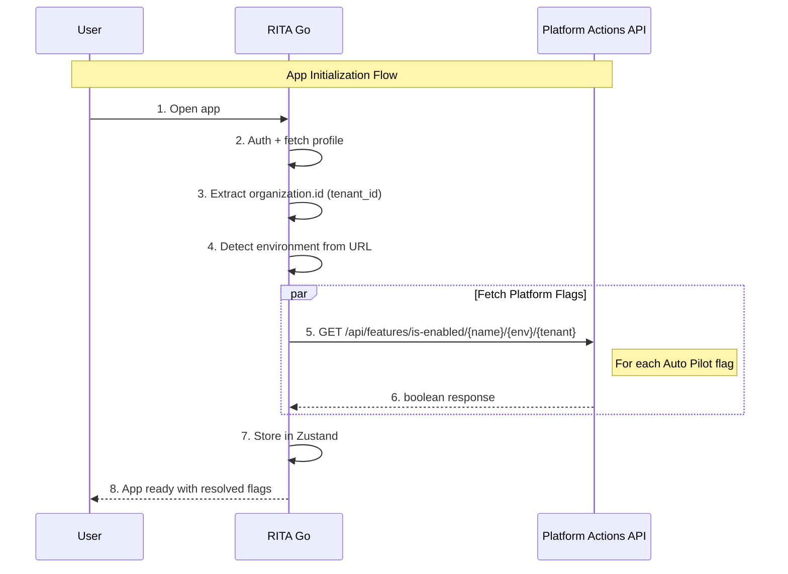

# Platform Feature Flags Integration - Technical Architecture

## Overview

Integration of RITA Go with Platform Actions backend feature flag system to enable per-tenant control of Auto Pilot features.

**Status**: ✅ **IMPLEMENTED**

**Ticket**: RG-491

**Last Updated**: 2025-12-11

---

## Architecture Summary

### Flag System

| Layer | Scope | Storage | Purpose |
|-------|-------|---------|---------|
| **Platform Flags** | Per-org/tenant | Platform Actions BE | Auto Pilot feature control |
| **Local Flags** | Per-browser | localStorage | Other experimental features |

**Platform flags** are managed exclusively via Platform Actions API - no local overrides.

### Sequence Diagram: Feature Flag Initialization



---

## Platform Actions API

**Base URL:** `https://strangler-facade.resolve.io`

**Authentication:** None (unauthenticated)

### Environment Detection

Environment is auto-detected from the app URL:

| Hostname | Environment |
|----------|-------------|
| `rita.resolve.io` | `production` |
| `onboarding.resolve.io` | `staging` |
| `localhost` / other | `development` |

### Flag Name Mapping

Client keys are mapped to platform names:

| Client Key | Platform Name |
|------------|---------------|
| `ENABLE_AUTO_PILOT` | `auto-pilot` |
| `ENABLE_AUTO_PILOT_SUGGESTIONS` | `auto-pilot-suggestions` |
| `ENABLE_AUTO_PILOT_ACTIONS` | `auto-pilot-actions` |

### Endpoints Used

#### Check Feature Enabled
```
GET /api/features/is-enabled/{name}/{environment}/{tenant}
```

| Parameter | Type | Source | Example |
|-----------|------|--------|---------|
| `name` | string | Platform flag name | `auto-pilot` |
| `environment` | string | Auto-detected from URL | `production` |
| `tenant` | string | `organization.id` | `uuid` |

**Response:** `boolean`

#### Update Feature Rule
```
POST /api/features/{name}/rules
```

**Body:**
```json
{
  "environment": "production",
  "tenant": "uuid",
  "isEnabled": true
}
```

---

## Auto Pilot Feature Flags

| Client Key | Platform Name | Description | Default |
|------------|---------------|-------------|---------|
| `ENABLE_AUTO_PILOT` | `auto-pilot` | **Master toggle** for Auto Pilot | `false` |
| `ENABLE_AUTO_PILOT_SUGGESTIONS` | `auto-pilot-suggestions` | AI-powered suggestions | `false` |
| `ENABLE_AUTO_PILOT_ACTIONS` | `auto-pilot-actions` | Automated actions execution | `false` |

### Master Toggle Behavior

`ENABLE_AUTO_PILOT` is the master toggle:
- When **disabled**: `ENABLE_AUTO_PILOT_SUGGESTIONS` and `ENABLE_AUTO_PILOT_ACTIONS` are automatically disabled on the platform
- When **disabled**: Dependent flags appear greyed out in UI
- Cascade happens via parallel API calls

---

## Implementation

### Files Created

| File | Description |
|------|-------------|
| `src/services/platformFlags.ts` | Platform Actions API client with flag name mapping |
| `src/stores/feature-flags-store.ts` | Zustand store for flag state |
| `src/hooks/usePlatformFlags.ts` | Initialization hook |

### Files Modified

| File | Changes |
|------|---------|
| `src/types/featureFlags.ts` | Added Auto Pilot flags, `autopilot` category |
| `src/hooks/useFeatureFlags.ts` | Refactored to use Zustand store |
| `src/App.tsx` | Added `usePlatformFlagsInit()` |
| `src/components/devtools/FeatureFlagsPanel.tsx` | Added platform flags UI in Experimental section |

### Platform Flags Service

**File:** `src/services/platformFlags.ts`

```typescript
const PLATFORM_FLAGS_URL = import.meta.env.VITE_PLATFORM_FLAGS_URL || 'https://strangler-facade.resolve.io'

// Auto-detect environment from URL
function getPlatformEnv(): string {
  const hostname = window.location.hostname
  if (hostname.includes('rita.resolve.io')) return 'production'
  if (hostname.includes('onboarding.resolve.io')) return 'staging'
  return 'development'
}

// Client key to platform name mapping
const CLIENT_TO_PLATFORM_FLAG_MAP: Record<string, string> = {
  'ENABLE_AUTO_PILOT': 'auto-pilot',
  'ENABLE_AUTO_PILOT_SUGGESTIONS': 'auto-pilot-suggestions',
  'ENABLE_AUTO_PILOT_ACTIONS': 'auto-pilot-actions',
}

// Fetch flag value
export async function fetchPlatformFlag(clientKey: string, tenantId: string): Promise<boolean>

// Update flag value
export async function updatePlatformFlag(clientKey: string, tenantId: string, isEnabled: boolean): Promise<boolean>
```

### Usage in Components

```typescript
// Single flag check
import { useFeatureFlag } from '@/hooks/useFeatureFlags'

function MyComponent() {
  const isAutoPilotEnabled = useFeatureFlag('ENABLE_AUTO_PILOT')

  if (!isAutoPilotEnabled) return null
  return <AutoPilotFeature />
}

// Multiple flags
import { useFeatureFlags } from '@/hooks/useFeatureFlags'

function MyComponent() {
  const { flags, getPlatformValue } = useFeatureFlags()

  return (
    <>
      {flags.ENABLE_AUTO_PILOT && <AutoPilot />}
      {flags.ENABLE_AUTO_PILOT_SUGGESTIONS && <Suggestions />}
    </>
  )
}

// Outside React
import { useFeatureFlagsStore } from '@/stores/feature-flags-store'

const isEnabled = useFeatureFlagsStore.getState().getFlag('ENABLE_AUTO_PILOT')
```

---

## DevTools UI

Auto Pilot flags appear in the **Experimental Features** section:

```
┌─ Experimental Features ─────────────────────────────┐
│ These features are in early development...          │
│ ─────────────────────────────────────────────────── │
│ [Local experimental flags with toggles]             │
│ ─────────────────────────────────────────────────── │
│ ☁️ Auto Pilot (Platform-Controlled)                 │
│                                                     │
│ Auto Pilot                               [toggle]   │
│ Master toggle for Auto Pilot                        │
│                                                     │
│ Auto Pilot Suggestions                   [disabled] │
│ AI-powered suggestions              (greyed out)    │
│                                                     │
│ Auto Pilot Actions                       [disabled] │
│ Automated actions execution         (greyed out)    │
└─────────────────────────────────────────────────────┘
```

- Platform toggles call the API directly
- Dependent flags greyed out when master is OFF
- Disabling master cascades to disable dependents

---

## Error Handling

| Scenario | Behavior |
|----------|----------|
| Platform API unreachable | Log warning, use `defaultValue: false` |
| Platform API returns non-200 | Log warning, use `defaultValue: false` |
| Invalid tenant ID | Flags default to `false` |
| Update fails | Show error toast, state unchanged |

---

## Design Decisions

| Decision | Choice | Rationale |
|----------|--------|-----------|
| Bulk fetch | Individual requests | 3 flags acceptable, no bulk endpoint |
| Refresh strategy | Init-only | Flags change infrequently |
| Environment detection | Auto from URL | No env var needed, less config |
| Flag name mapping | Client → Platform | Clean client code, platform naming conventions |
| Master toggle cascade | Auto-disable dependents | UX consistency, prevent orphan states |
| Local overrides for platform flags | None | Platform is source of truth |
