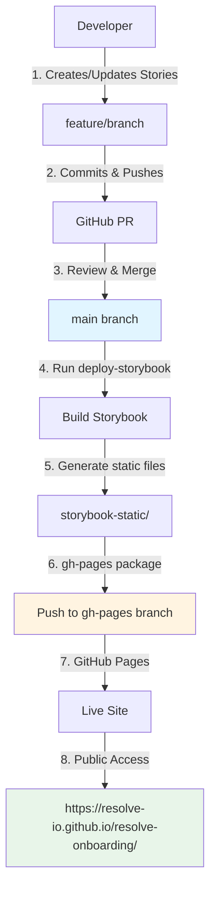

# Storybook Deployment Guide

## Overview

RITA Go Storybook is deployed to GitHub Pages for component documentation and design system reference.

**Live URL:** `https://resolve-io.github.io/resolve-onboarding/`

⚠️ **Note:** URL will only be active after first deployment. Until then, GitHub Pages returns 404.

## Access Control

- **Visibility:** Public (anyone can view)
- **Deploy Access:** Repository contributors with write permissions
- **GitHub Pages Settings:** Repository administrators only

## How to Access

1. **After First Deployment:**
   - Run `npm run deploy-storybook`
   - Wait 1-2 minutes for GitHub Pages to build
   - Visit: `https://resolve-io.github.io/resolve-onboarding/`

2. **Check Deployment Status:**
   - Go to: `https://github.com/resolve-io/resolve-onboarding/deployments`
   - Look for `github-pages` environment
   - Click latest deployment to see status

3. **Find URL in GitHub:**
   - Repository → Settings → Pages
   - "Your site is live at" section shows the URL

## Deployment Methods

### Method 1: Manual Deployment (Current)

```bash
# From project root
npm run deploy-storybook

# Or from packages/client
cd packages/client
npm run deploy-storybook
```

This builds Storybook and pushes to `gh-pages` branch using the `gh-pages` npm package.

### Method 2: GitHub Actions (Future/Alternative)

Automated deployment on merge to `main` branch.

## Deployment Workflow



## Repository Configuration

### GitHub Pages Settings

**Location:** Repository Settings → Pages

- **Source:** Deploy from a branch
- **Branch:** `gh-pages`
- **Folder:** `/ (root)`

### Build Configuration

**Files involved:**
- `packages/client/.storybook/main.ts` - Storybook config with base path settings
- `packages/client/package.json` - Build & deploy scripts
- `storybook-static/.nojekyll` - Auto-created during deploy, disables Jekyll processing
- `.gitignore` - Excludes `storybook-static/` build artifacts

## Build Process

1. **Build Command:** `npm run build-storybook`
   - Compiles TypeScript
   - Bundles React components
   - Generates static HTML/CSS/JS
   - Output: `packages/client/storybook-static/`

2. **Deploy Command:** `gh-pages -d storybook-static --dotfiles`
   - Creates `.nojekyll` file in build output
   - Creates/updates `gh-pages` branch
   - Pushes static files including dotfiles to remote
   - Triggers GitHub Pages rebuild

## Dependencies

```json
{
  "devDependencies": {
    "gh-pages": "6.3.0",
    "storybook": "8.6.15",
    "@storybook/react-vite": "8.6.15"
  }
}
```

## Deployment Checklist

- [ ] Storybook builds successfully locally (`npm run storybook`)
- [ ] All stories render without errors
- [ ] Accessibility checks pass (a11y addon)
- [ ] GitHub Pages enabled on `gh-pages` branch
- [ ] Deploy script includes `--dotfiles` flag
- [ ] Deploy script runs without errors
- [ ] Live URL loads correctly
- [ ] No 404 errors in browser console for assets

## Troubleshooting

### Failed to Fetch Dynamically Imported Module

**Problem:** Assets return 404, mismatched hash in filenames
**Solution:**
- Ensure deploy script includes `--dotfiles` flag
- Deploy script should create `.nojekyll` in build output: `touch storybook-static/.nojekyll`
- Clear browser cache and wait 1-2 minutes after deploy

### Build Fails with Jekyll Error

**Problem:** GitHub Pages tries to process files with Jekyll
**Solution:** Deploy script automatically creates `.nojekyll` file

### 404 on Deployed Site

**Problem:** GitHub Pages not configured correctly
**Solution:** Check Settings → Pages → Source is `gh-pages` branch

### Old Version Showing

**Problem:** Browser cache or CDN delay
**Solution:** Hard refresh (Cmd+Shift+R) or wait 1-2 minutes

## Security Notes

- Repository is **private** but deployed site is **public**
- Do not include sensitive data in stories
- Environment variables not embedded in build
- No backend API keys exposed

## Maintenance

**Update Storybook:**
```bash
cd packages/client
npm update storybook @storybook/react-vite
```

**Rollback Deployment:**
```bash
git checkout gh-pages
git reset --hard <previous-commit-hash>
git push --force
```

## Related Documentation

- [Frontend Stack](./frontend-stack.md)
- [Component Development](../features/component-guidelines.md)
- [Figma Workflow](./figma-workflow.md)
