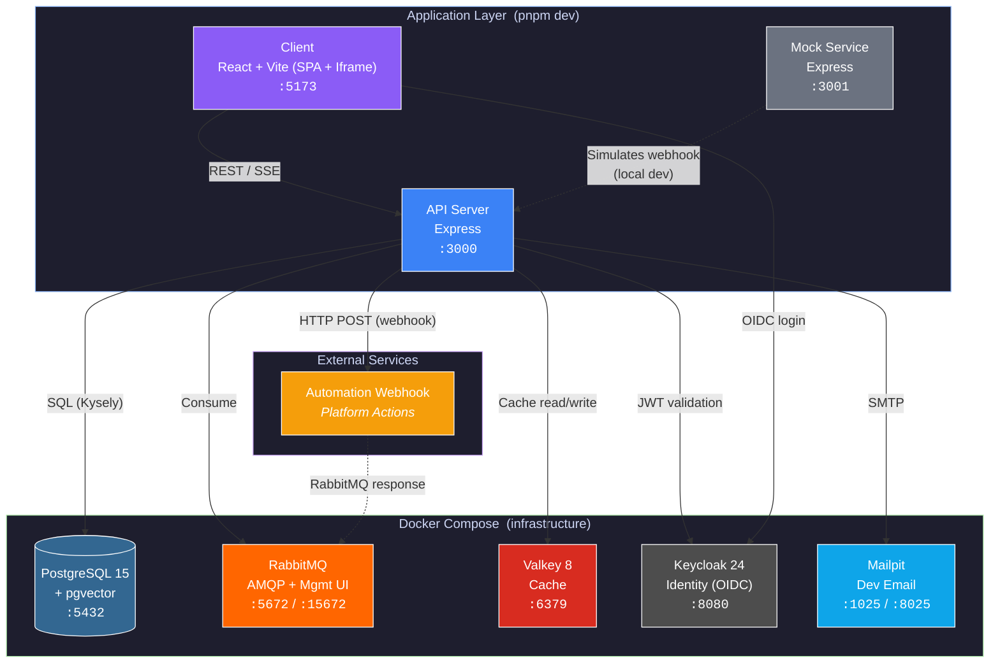
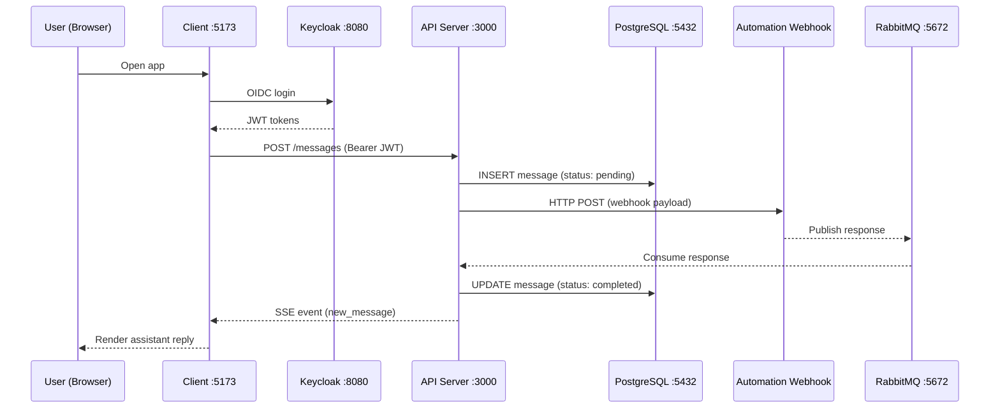

# Rita Infrastructure Overview

System architecture from a DevOps perspective — what runs locally, what runs in production, and how components connect.

## Architecture Diagram



### Chat Data Flow



## Docker Services (Local Development)

All infrastructure runs via `docker compose up -d`. Application code (API server, client) runs natively with `pnpm dev`.

| Service | Image | Ports | Volume | Health Check |
|---------|-------|-------|--------|--------------|
| **PostgreSQL** | `pgvector/pgvector:pg15` | 5432 | `postgres_data` | `pg_isready -U rita -d onboarding` |
| **RabbitMQ** | `rabbitmq:3-management-alpine` | 5672 (AMQP), 15672 (UI) | `rabbitmq_data` | `rabbitmq-diagnostics -q ping` |
| **Valkey** | `valkey/valkey:8-alpine` | 6379 | `valkey_data` | `valkey-cli ping` |
| **Keycloak** | `quay.io/keycloak/keycloak:24.0.4` | 8080 | `keycloak_data` + realm import + themes | HTTP /health |
| **Mailpit** | `axllent/mailpit:latest` | 1025 (SMTP), 8025 (UI) | `mailpit_data` | `wget http://localhost:8025/api/v1/info` |

### Default Credentials (Local Only)

| Service | User | Password |
|---------|------|----------|
| PostgreSQL | rita | rita |
| RabbitMQ | guest | guest |
| Keycloak Admin | admin | admin |
| Mailpit | — | no auth |
| Valkey | — | no auth |

## Application Components

| Component | Runtime | Port | Description |
|-----------|---------|------|-------------|
| **API Server** | Node 20 + Express + Kysely | 3000 | REST API, SSE, RabbitMQ consumers, webhook dispatch |
| **Client** | React 18 + Vite | 5173 | SPA with Keycloak auth, TanStack Query, Zustand |
| **Iframe App** | Vite (dev only, no Dockerfile) | 5174 | Embeddable chat widget, host-delegated auth via Valkey sessions |
| **Mock Service** | Node 20 + Express | 3001 | Simulates external automation webhook for local dev |
| **Keycloak Theme** | Tailwind CSS | — | Custom login/registration theme (built as JAR) |

## Database: PostgreSQL + pgvector

- **Database name**: `onboarding`
- **Extension**: pgvector (vector similarity search)
- **Row-Level Security**: Enabled — `app.current_user_id` and `app.current_organization_id` set per transaction
- **Migration files**: 81 SQL files (`packages/api-server/src/database/migrations/`)
- **ORM**: Kysely (type-safe query builder, not a full ORM)
- **Schema codegen**: kysely-codegen generates `types/database.ts` from live DB

### Tables (27)

| Table | Purpose |
|-------|---------|
| `activity_contexts` | Iframe activity/intent tracking |
| `agents` | AI agent definitions |
| `audit_logs` | SOC2 audit trail for user actions |
| `autopilot_settings` | Per-org autopilot/ITSM config |
| `blob_metadata` | File upload metadata (name, type, size) |
| `blobs` | Content-addressable binary storage (SHA-256 dedup) |
| `cluster_kb_links` | Knowledge base ↔ cluster associations |
| `clusters` | ML model topic clusters |
| `conversations` | Chat sessions (user ↔ org scoped) |
| `credential_delegation_tokens` | Short-lived tokens for ITSM credential delegation |
| `data_source_connections` | External integrations (Confluence, ServiceNow, SharePoint, Web) |
| `ingestion_runs` | Data source sync execution history |
| `itsm_field_mappings` | ITSM field value mappings per connection |
| `message_processing_failures` | Dead-letter queue for failed message processing |
| `messages` | Chat messages with status tracking (pending → sent → completed) |
| `migration_history` | Applied migration tracking |
| `ml_models` | ML model configurations per org |
| `organization_members` | User ↔ org membership with roles |
| `organizations` | Tenant organizations (multi-tenant) |
| `pending_invitations` | Email invitations awaiting acceptance |
| `pending_users` | Pre-signup users awaiting email verification |
| `phantom_citations` | Missing document references for quality tracking |
| `rag_webhook_failures` | Failed webhook payloads for retry (sensitive fields scrubbed) |
| `sync_cancellation_requests` | In-progress sync cancellation signals |
| `tickets` | ITSM tickets synced from external systems |
| `tickets_log` | Ticket sync processing event log |
| `user_profiles` | User accounts with Keycloak ID mapping |

## Valkey (Redis-Compatible Cache)

- **Image**: Valkey 8 (Alpine)
- **Purpose**: Iframe configuration cache, feature flags
- **Key patterns**:
  - `rita:session:{guid}` — iframe session config (tenantId, userGuid, webhook credentials)
  - Used for host-delegated auth in iframe embed mode (user authenticates via shared Keycloak on host, session passed via Valkey)
- **Persistence**: RDB snapshots to volume
- **No auth** in local dev

## RabbitMQ (Message Broker)

- **Image**: RabbitMQ 3 with management plugin
- **Purpose**: Async inter-service communication
- **Key queues**:
  - `chat.responses` — Chat message response routing
  - `workflow.responses` — Platform → Rita workflow response routing
  - `document_processing_status` — Document ingestion status events
  - `data_source_status` — Data source sync status events
- **Management UI**: http://localhost:15672 (guest/guest)
- **Message flow**: RITA → Webhook → Platform → RabbitMQ → WorkflowConsumer → SSE → Client

## Keycloak (Identity & Access Management)

- **Image**: Keycloak 24.0.4
- **Realm**: `rita-chat-realm` (imported from `keycloak/realm-export.json`)
- **Features**: Token exchange, admin fine-grained authorization
- **Custom theme**: Built with Tailwind CSS, deployed as JAR
- **Dev mode**: HTTP enabled, strict HTTPS disabled
- **Client**: `rita-chat-client` (public OIDC client)

## Production Deployment

### Container Images (Built via CI)

| Image | Base | Dockerfile |
|-------|------|------------|
| API Server | `node:20-slim` | `packages/api-server/Dockerfile` |
| Client | `nginx:alpine` | `packages/client/Dockerfile` |
| Mock Service | `node:20-slim` | `packages/mock-service/Dockerfile` |
| Keycloak | `keycloak:24.0.4` | `keycloak/Dockerfile` |

> **Note**: Iframe App is a static Vite build only — not containerized separately. Mailpit runs from its upstream image in docker-compose (no custom Dockerfile).

All application images use multi-stage builds and run as non-root users.

### Kubernetes (AWS)

- **Cluster**: kops-managed on AWS (`resolve-actions-k8s.local`)
- **State store**: S3 (`devops-k8s-state-store`)
- **Container registry**: AWS ECR (`432993365903.dkr.ecr.us-east-1.amazonaws.com`)
- **Deployment**: Helmfile + Helm charts (`helm/ritadev/charts/`)
- **Kubernetes version**: v1.31.2
- **Namespace**: Per-environment (e.g., `rita-dev`)
- **Scaling**: HPA (Horizontal Pod Autoscaler) on API server and frontend

### Helm Charts

| Chart | Resources |
|-------|-----------|
| `api-server` | Deployment, Service, HPA, ConfigMap, Secrets, Migration Job |
| `frontend` | Deployment, Service, Ingress, HPA, Nginx ConfigMap, Route53 cleanup |
| `keycloak` | Deployment, Service, ConfigMap, Secrets |
| `keycloak-postgres` | StatefulSet, Service, PVC, Velero backups |

### Helm Environments

Per-environment value overrides in `helm/ritadev/environments/`:

| Environment | Value files |
|-------------|-------------|
| `dev` | `api-server.yml`, `frontend.yml`, `keycloak.yml`, `keycloak-postgres.yml` |

## CI/CD (GitHub Actions)

| Workflow | Trigger | Purpose |
|----------|---------|---------|
| `test.yml` | PR, push | Type check & unit tests |
| `build-keycloak-theme.yml` | Push | Build Keycloak theme JAR |
| `deploy-dev.yml` | Push to main | Deploy to dev environment |
| `deploy-staging.yml` | Manual/tag | Deploy to staging |
| `deploy-prod.yml` | Manual/tag | Deploy to production |
| `deploy-k8s-dev.yml` | Push to main | Deploy to K8s dev cluster |

## Technology Stack Summary

| Layer | Technology | Version |
|-------|-----------|---------|
| **Package manager** | pnpm | 9.15.0 (enforced) |
| **Runtime** | Node.js | 20 LTS |
| **API framework** | Express | 4.x |
| **Query builder** | Kysely | 0.27.x |
| **Database** | PostgreSQL + pgvector | 15 |
| **Cache** | Valkey | 8 |
| **Message broker** | RabbitMQ | 3.x |
| **Identity** | Keycloak | 24.0.4 |
| **Frontend** | React + Vite | 18 / 5.x |
| **UI library** | shadcn/ui + Radix + Tailwind | — |
| **State (client)** | Zustand | 4.x |
| **State (server)** | TanStack Query | 5.x |
| **Validation** | Zod | 3.x |
| **Linter/formatter** | Biome | 1.x |
| **TypeScript** | strict mode | 5.x |
| **Real-time** | SSE (Server-Sent Events) | — |
| **Email (dev)** | Mailpit | latest |
| **Container orchestration** | Kubernetes (kops) | 1.31.2 |
| **CI/CD** | GitHub Actions | — |
| **Registry** | AWS ECR | — |

## Quick Reference

```bash
# Start all infrastructure
docker compose up -d

# Verify all 5 services healthy
docker compose ps

# Start application (API + Client + Iframe)
pnpm dev

# Stop infrastructure
pnpm docker:stop

# Run DB migrations
pnpm --filter rita-api-server migrate

# Check RabbitMQ
open http://localhost:15672    # guest/guest

# Check Keycloak
open http://localhost:8080     # admin/admin

# Check Mailpit
open http://localhost:8025
```
