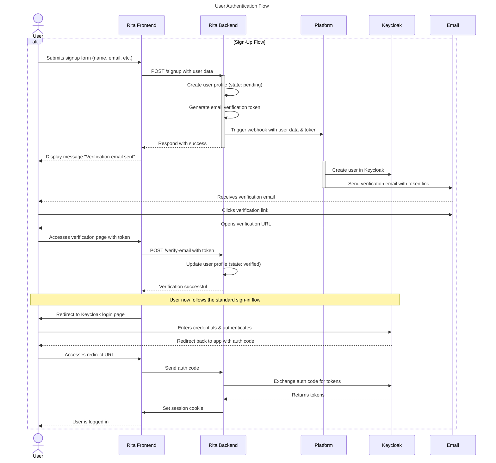

```mermaid
sequenceDiagram
    title User Authentication Flow
    actor User
    participant Rita Frontend
    participant Rita Backend
    participant Platform
    participant Keycloak
    participant Email

    alt Sign-Up Flow
        User->>Rita Frontend: Submits signup form (name, email, etc.)
        Rita Frontend->>Rita Backend: POST /signup with user data
        activate Rita Backend
        Rita Backend->>Rita Backend: Create user profile (state: pending)
        Rita Backend->>Rita Backend: Generate email verification token
        Rita Backend->>Platform: Trigger webhook with user data & token
        Rita Backend-->>Rita Frontend: Respond with success
        deactivate Rita Backend
        
        Rita Frontend-->>User: Display message "Verification email sent"
        
        activate Platform
        Platform->>Keycloak: Create user in Keycloak
        Platform->>Email: Send verification email with token link
        deactivate Platform
        
        Email-->>User: Receives verification email
        User->>Email: Clicks verification link
        Email->>User: Opens verification URL
        User->>Rita Frontend: Accesses verification page with token
        Rita Frontend->>Rita Backend: POST /verify-email with token
        Rita Backend->>Rita Backend: Update user profile (state: verified)
        Rita Backend-->>Rita Frontend: Verification successful
        
        note over User, Keycloak: User now follows the standard sign-in flow
        
        Rita Frontend->>User: Redirect to Keycloak login page
        User->>Keycloak: Enters credentials & authenticates
        Keycloak-->>User: Redirect back to app with auth code
        User->>Rita Frontend: Accesses redirect URL
        Rita Frontend->>Rita Backend: Send auth code
        Rita Backend->>Keycloak: Exchange auth code for tokens
        Keycloak-->>Rita Backend: Returns tokens
        Rita Backend->>Rita Frontend: Set session cookie
        Rita Frontend-->>User: User is logged in
    end
```